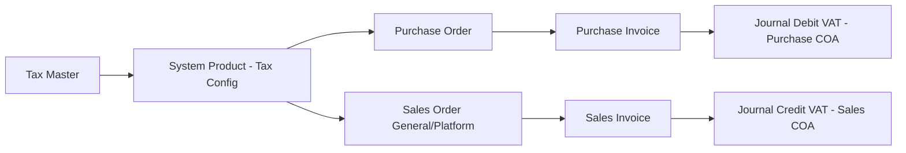
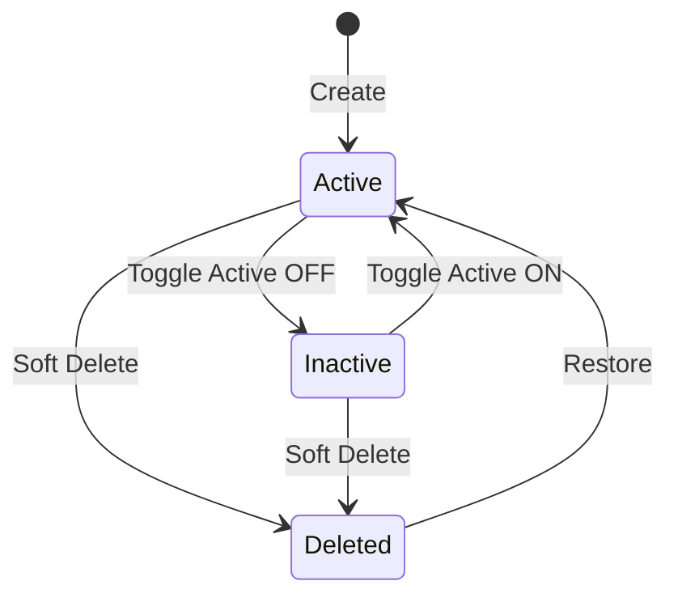
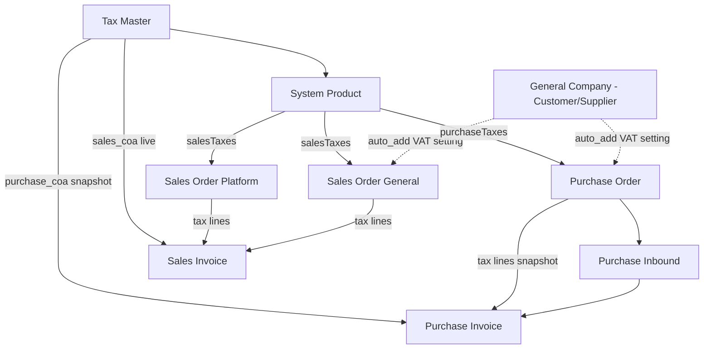

# Tax — Source of Truth

## 1. Ringkasan Eksekutif

Tax adalah master tarif PPN per company, menyimpan Purchase COA (akun VAT Masukan, class Activa) dan Sales COA (akun VAT Keluaran, class Passiva) yang jadi acuan default penjurnalan VAT di seluruh transaksi pembelian dan penjualan. Tax di-bind ke System Product (purchase/sales), lalu tarifnya dipakai otomatis atau manual saat pembuatan baris pajak di Purchase Order dan Sales Order. Tanpa Purchase/Sales COA yang valid di master Tax, PO/SO tidak bisa membentuk baris pajak dan approval PI/SI akan gagal. Audience utama: tim Finance/Accounting dan tim yang mengelola master data pajak perusahaan.



## 2. Prasyarat

| Prasyarat | Sumber | Catatan |
|---|---|---|
| Chart of Account class Activa (calon Purchase COA) | Master Chart of Account | Tidak boleh slot Current Profit/Loss company accounting |
| Chart of Account class Passiva (calon Sales COA) | Master Chart of Account | Tidak boleh slot Current Profit/Loss company accounting |
| System Product | Master System Product | Perlu di-bind ke Tax (purchase/sales pivot) supaya tarif otomatis kepakai di transaksi |
| General Company (Customer/Supplier) VAT Setting | Master General Company | Opsional; mengontrol auto-add tax product ke PO/SO lewat field `auto_add_transaction_supplier` / `_customer` |

## 3. Siklus Status

Tax adalah master data — tidak ada alur approval seperti transaksi. Siklusnya berputar di status Active/Inactive dan soft-delete.



| Status | Kondisi Transisi | Editable? | Tombol yang Muncul |
|---|---|---|---|
| Active | Default saat Create | Ya | Edit, Delete |
| Inactive | User matikan toggle Active | Ya, tapi tidak bisa dipakai di relasi transaksi baru | Edit, Delete |
| Deleted (soft) | Delete diklik, syarat: tidak ada relasi aktif ke System Product | Tidak — form read-only (`can_update = false`) | Restore |

Catatan Delete: Delete ditolak selama Tax masih terikat System Product (purchase/sales pivot). Begitu binding di-detach dari Product, Delete kembali diizinkan — meskipun Tax tersebut sudah pernah dipakai di transaksi (PO, Inbound, Purchase Invoice). Ini karena data VAT yang sudah masuk ke transaksional bersifat capture: transaksi lama tetap jalan dengan data capture-nya sendiri, tidak bergantung ke master yang sudah dihapus.

## 4. Datalist

**URL:** https://staging.olshoperp.com/accounting/tax

### 4.1 Fitur Datalist

| Fitur | Perilaku |
|---|---|
| Global Search | Pencarian umum, mengikuti pola standar datalist menu lain di OlshopERP — `[VERIFY: CODEBASE]` field exact yang ter-cover |
| Button Create | Redirect ke halaman create (`/accounting/tax/create`) |
| Show Deleted Data | Checkbox — dicentang menampilkan kombinasi data belum dihapus + soft-deleted; baris deleted menampilkan info tambahan di kolom Action |
| Column Show/Hide | Standar, mengikuti pola datalist menu lain |
| Export | Basic export — hanya meng-export data yang tampil di datatable depan (bukan Export All/Advanced). `[VERIFY: CODEBASE]` kolom exact dan format file export |
| Advanced Filter | `[VERIFY: CODEBASE]` — belum terkonfirmasi cakupan kolom yang searchable |

### 4.2 Kolom Datatable

| # | Kolom | Sumber Data |
|---|---|---|
| 1 | Code | Field `code` |
| 2 | Name | Field `name` |
| 3 | Description | Field `description` |
| 4 | Tariff | Field `tariff` (%), rata kanan |
| 5 | Purchase COA Code | Code COA dari relasi `purchase_coa_id` |
| 6 | Purchase COA Name | Name COA dari relasi `purchase_coa_id` |
| 7 | Sales COA Code | Code COA dari relasi `sales_coa_id` |
| 8 | Sales COA Name | Name COA dari relasi `sales_coa_id` |
| 9 | Default POS | Yes/No — flag `is_default_tax_pos`. Belum ada relasi fungsional ke menu lain karena menu POS belum selesai dikembangkan |
| 10 | Coefficient | Yes/No — flag `coefficient` |
| 11 | Active | Yes/No |
| 12 | Created By \| Created At | Gabungan atas-bawah, mengikuti pola kolom datatable menu lain |
| 13 | Action | Show/Edit, Delete (lihat Bagian 3 untuk aturan Delete) |

> Catatan UI: header kolom Purchase COA di baris pertama datatable saat ini tertulis typo "Puchase" (lihat GAP-TAX-03).

## 5. Form & Field

### 5.1 Section "Tax" (Create/Edit)

| Field | Wajib? | Default | Sumber Opsi | Catatan |
|---|---|---|---|---|
| Code | Ya | — | — | Unique per company (non-deleted), max 50 karakter |
| Name | Ya | — | — | Max 50 karakter |
| Purchase COA | Ya | — | Select2 COA leaf, filter class Activa, exclude Current Profit/Loss | Akun VAT Masukan (pembelian); dipakai default penjurnalan Purchase Invoice |
| Tariff | Ya | — | — | Numerik, min 1, FE max 100 step 0.1; **disabled** kalau Coefficient ON (otomatis terkunci ke 12) |
| Sales COA | Ya | — | Select2 COA leaf, filter class Passiva, exclude Current Profit/Loss | Akun VAT Keluaran (penjualan); dipakai default penjurnalan Sales Invoice |
| Description | Tidak | — | Freetext | — |
| Default Tax POS | Tidak | Checkbox | — | Kalau belum ada default di company, sistem paksa jadi default pertama otomatis |
| Coefficient 11/12 | Tidak | OFF | Switch | Kalau ON: Tariff otomatis terkunci ke 12, effective rate perhitungan VAT tetap 11 (lihat Bagian 6.1) |
| Active | Tidak | ON | Switch | Kalau Inactive, Tax tidak bisa dipakai di relasi transaksi baru |
| Audit Log | — | — | — | Slideover, menampilkan seluruh log perubahan data (`GET accounting/tax/{id}/audit`) |

**Tombol Save & Next** (Create) — submit ke API create, lalu redirect ke halaman Edit.

### 5.2 Catatan Update

Rule class Activa/Passiva **tidak di-recheck** saat Update (lihat GAP-TAX-02) — hanya divalidasi saat Create. Rule Current Profit/Loss tetap dicek untuk kedua COA di Update. Aturan Default Tax POS (minimal 1 default aktif, tidak bisa langsung uncheck tanpa ganti default lain) tetap berlaku di Update.

## 6. How It Works

### 6.1 Perhitungan Coefficient 11/12

Setting ini mengakomodasi aturan pemerintah: tarif kertas PPN 12%, tapi VAT yang benar-benar dipungut dihitung 11%.

Contoh: harga barang Rp100.000/pcs, tarif 12% include, Coefficient ON:

```
DPP  = 82.582,5825825826    (DPP mengikuti perhitungan basis 12%)
VAT  = 9.909,9099099099     (VAT tetap dihitung basis 11%)
Total = 100.000
```

Sistem tetap meng-capture nilai DPP versi 11% (Rp90.090,09009009010) sebagai data cadangan meski yang ditampilkan dan dipakai adalah DPP versi 12%. `[VERIFY: CODEBASE]` nama field exact yang menyimpan nilai DPP 11% capture ini.

### 6.2 Snapshot (Purchase Invoice) vs Live (Sales Invoice) — dikonfirmasi AS-IS

Kedua sisi transaksi (beli dan jual) tidak simetris dalam cara mengambil COA journal:

| Dokumen | Sumber COA saat Journal |
|---|---|
| Purchase Invoice (approve) | Snapshot `tax_coa_id` yang sudah tersimpan di baris pajak Purchase Order — tidak berubah walau Purchase COA di master Tax diubah setelah PO dibuat |
| Sales Invoice (approve) | Live `tax.sales_coa_id` dibaca langsung dari master Tax saat approve — mengubah Sales COA di master setelah SO dibuat bisa mempengaruhi journal SI yang belum di-approve |

Behavior ini sudah dikonfirmasi sebagai AS-IS yang valid, bukan gap yang perlu diperbaiki. Operator/Finance perlu paham bahwa mengubah Sales COA di master Tax punya efek berbeda dibanding mengubah Purchase COA.

### 6.3 Delete Tax setelah dipakai transaksi

Karena data VAT masuk ke transaksional secara capture (lihat Bagian 3), urutan berikut valid: Tax dipakai di PO/Inbound/PI, lalu di-detach dari System Product, sehingga Tax bisa dihapus; transaksi PO/Inbound/PI yang sudah ada tetap jalan normal karena memakai data capture-nya sendiri, bukan referensi live ke master yang sudah terhapus.

### 6.4 Auto-add tax ke PO/SO

Baris pajak otomatis muncul di PO/SO kalau dua syarat terpenuhi: (1) System Product punya pivot tax aktif untuk tipe purchase/sales, dan (2) General Company (Supplier/Customer) punya setting auto-add VAT bukan `no`. Kombinasi ini menentukan apakah baris pajak auto-populate atau harus ditambahkan manual oleh user.

## 7. Validasi

### 7.1 Create

| # | Field/Rule | Behavior / Pesan Error |
|---|---|---|
| 1 | Code | Required, max 50, unique per company (non-deleted) |
| 2 | Name | Required, max 50 |
| 3 | Tariff | Required, numeric, min 1 |
| 4 | Purchase COA | Required |
| 5 | Sales COA | Required |
| 6 | Coefficient | Required boolean |
| 7 | Purchase COA class | Harus Activa — *"The Purchase COA input must use Activa."* |
| 8 | Sales COA class | Harus Passiva — *"The Sales COA input must use Passiva."* |
| 9 | Current P/L | Purchase/Sales COA tidak boleh slot Current Profit/Loss — *"The Purchase/Sales COA has been set as Default Current Profit/Loss"* |
| 10 | Default POS pertama | Kalau belum ada default di company, sistem paksa `is_default_tax_pos = 1` |

### 7.2 Update

| # | Rule | Behavior |
|---|---|---|
| 1 | Code, Name, Tariff | Rule sama seperti Create |
| 2 | Activa/Passiva class | **Tidak di-recheck** (GAP-TAX-02) |
| 3 | Current P/L | Tetap dicek untuk kedua COA |
| 4 | Matikan default POS terakhir | *"At least one default Tax POS must remain active."* |
| 5 | Uncheck default tanpa ganti | *"Cannot directly disable the default option… set another tax as default."* |
| 6 | Set default baru | Clear `is_default_tax_pos` Tax lain di company yang sama |

### 7.3 Delete

| # | Guard | Pesan |
|---|---|---|
| 1 | Adalah Default POS | *"Cannot delete this data because it is set as the default Tax POS."* |
| 2 | Masih terikat System Product | *"Failed to delete tax data because it is already related to a System Product."* |

### 7.4 Validasi di Menu Konsumen

| Menu | Kapan Tax Dicek | Behavior/Pesan |
|---|---|---|
| System Product | Bind tax | Hanya Tax active yang muncul di select2; Delete Tax diblokir kalau masih bound |
| Purchase Order | Add/auto baris pajak | Wajib Purchase COA di master — *"Configure 'Purchase COA' in master tax form."* Snapshot `tax_coa_id` = Purchase COA saat itu |
| Purchase Inbound | — | Tidak ada validasi tax sendiri; qty/nilai barang saja, pajak tetap di detail PO |
| Purchase Invoice | Approve | Debit ke snapshot Purchase COA dari PO; gagal kalau kosong — *"Please Configure 'Tax COA' for Tax Purchase Order for this Product: {sku}"* |
| Sales Order General | Add/auto baris pajak | Wajib Sales COA di master — *"Configure 'Sales COA' in master tax form."* Snapshot `tax_coa_id` = Sales COA saat itu |
| Sales Order Platform | Sync order | Ambil dari `product.salesTaxes` dan/atau Default VAT (`sales_coa_id`) |
| Sales Invoice | Approve | Credit ke Sales COA **live** dari master (lihat Bagian 6.2); gagal kalau belum dikonfigurasi — *"Please Configure 'Sales COA' for Tax Sales Order"* / *"Tax COA not registered in this company."* |
| General Company | Auto-add setting | `auto_add_transaction_customer` / `_supplier`: `yes` / `no` / `default_by_product` — mengontrol apakah tax Product ikut auto masuk PO/SO |

## 8. Relasi Menu Lain



| Menu | Peran dalam Relasi |
|---|---|
| System Product | Jembatan utama — Tax di-bind lewat pivot purchase/sales, menentukan tax apa yang eligible di transaksi |
| General Company (Customer/Supplier) | Mengontrol kapan tax Product di-auto-add ke PO/SO lewat VAT setting; Tax master sendiri tidak memilih company |
| Purchase Order | Membentuk baris pajak dari Tax yang di-bind ke Product; snapshot Purchase COA ke `tax_coa_id` |
| Purchase Inbound | Tidak punya tabel tax sendiri; selalu mengikuti detail PO |
| Purchase Invoice | Mewarisi tax dari PO; journal Debit VAT pakai snapshot Purchase COA |
| Sales Order General/Platform | Membentuk baris pajak dari Tax yang di-bind ke Product atau Default VAT; snapshot Sales COA ke `tax_coa_id` |
| Sales Invoice | Mewarisi tax dari SO; journal Credit VAT pakai Sales COA live dari master |
| Chart of Account | Purchase COA wajib class Activa, Sales COA wajib class Passiva; COA yang dipakai Tax tidak bisa dihapus |

## 9. Gap Registry

| ID | Deskripsi | Dampak | Status |
|---|---|---|---|
| GAP-TAX-01 | Exclude COA yang sudah jadi Cash/Bank dari select2 Purchase/Sales COA belum diimplementasi (dokumen asal: GAP-TAX-CB-01) | User bisa memilih COA Cash/Bank sebagai Purchase/Sales COA, berpotensi salah konfigurasi journal | Open (TO-BE) |
| GAP-TAX-02 | Rule class Activa/Passiva hanya divalidasi saat Create, tidak di-recheck saat Update | User bisa mengubah Purchase/Sales COA ke COA dengan class salah lewat Update tanpa tertangkap validasi | Open |
| GAP-TAX-03 | Header kolom datatable "Purchase COA" tertulis typo "Puchase" pada baris pertama | Minor, kosmetik UI | Open |
| GAP-TAX-04 | `TaxController::select2()` (list Tax active langsung) tidak ter-route; menu konsumen pakai select2 dari Product/Default VAT sebagai gantinya | Tidak ada endpoint langsung untuk listing Tax active generik; berpotensi menyulitkan integrasi menu baru yang butuh list Tax | Open |
| GAP-TAX-05 | Sinkronisasi `gs_company_vat_settings` dari form General Company banyak yang di-comment (partial/legacy) | VAT setting dari General Company kemungkinan tidak fully sync ke entity ini | Open |
| GAP-TAX-06 | Beberapa loop sync Sales Order Platform berpotensi menulis `purchase_coa_id` ke `tax_coa_id` (harusnya `sales_coa_id`) | Salah COA saat journal VAT platform sync | Open |

## 10. FAQ

**Q: Kalau saya ubah Sales COA di master Tax setelah Sales Order dibuat, apa efeknya?**
A: Bisa mempengaruhi journal Sales Invoice yang belum di-approve, karena SI mengambil Sales COA secara live dari master saat approve — beda dengan Purchase Invoice yang memakai snapshot dari PO.

**Q: Kenapa saya tidak bisa hapus master Tax tertentu?**
A: Kemungkinan besar Tax tersebut masih terikat ke satu atau lebih System Product. Detach dulu dari Product, baru Delete bisa dilakukan.

**Q: Transaksi lama yang sudah pakai Tax yang saya hapus, apakah datanya hilang atau error?**
A: Tidak. Data VAT di transaksi lama sudah capture sendiri, tidak bergantung ke master Tax yang dihapus.

**Q: Kenapa Tariff tidak bisa saya edit?**
A: Kemungkinan toggle Coefficient 11/12 sedang ON — saat aktif, Tariff otomatis terkunci ke 12 dan tidak bisa diedit manual.

**Q: Field "Default Tax POS" dipakai untuk apa sekarang?**
A: Saat ini flag ini disiapkan untuk menu POS yang masih dalam pengembangan — belum ada relasi fungsional ke menu manapun.

## 11. Changelog

| Tanggal | Versi | Perubahan |
|---|---|---|
| 2026-08-05 | 1.0 | Baseline awal dari analisis AS-IS codebase + klarifikasi QA Lead. Konfirmasi Export basic ada (bukan tidak ada — perlu VERIFY codebase untuk scope exact). Konfirmasi SI journal pakai Sales COA live sebagai AS-IS valid, bukan gap. |

## 12. Knowledge Base Hints (untuk operator)

**Istilah teknis → padanan awam:**

| Istilah Teknis | Padanan Awam |
|---|---|
| Purchase COA | Akun pajak masukan (dari pembelian) |
| Sales COA | Akun pajak keluaran (dari penjualan) |
| DPP | Harga barang sebelum pajak |
| Coefficient 11/12 | Mode hitung khusus: tarif kertas 12%, pajak yang benar-benar dipungut 11% |
| Snapshot | Data pajak yang "terkunci" saat transaksi dibuat, tidak berubah walau master diubah belakangan |
| Live | Data pajak yang diambil langsung dari master saat itu juga, bisa berubah kalau master diubah |
| Default Tax POS | Flag persiapan untuk menu kasir (POS), belum aktif dipakai |
| Class Activa/Passiva | Kategori akun: Activa untuk aset, Passiva untuk kewajiban/liabilitas |

**Skenario troubleshooting:**
- Approve PI/SI gagal dengan pesan "Configure Tax COA" — cek master Tax terkait, pastikan Purchase COA/Sales COA sudah terisi dan class-nya benar.
- Tidak bisa Delete master Tax — cek dulu apakah masih ada System Product yang bind ke Tax tersebut.
- Angka VAT terlihat tidak sesuai tarif kertas — cek apakah Coefficient 11/12 aktif di Tax yang dipakai.

**Field yang tidak relevan operator (skip di KB):** `tax_coa_id` (field snapshot internal), pivot table reference (`scm_product_tax_pivots`), nama tabel database lainnya.

## 13. Technical Hints (untuk developer)

**Area codebase yang perlu didokumentasikan Cursor:** controller CRUD + select2 child + audit Tax, model Tax, policy Tax, helper perhitungan `calculateTax`/`calculateDpp`, service posting journal VAT (PI dan SI), pivot Product-Tax, tabel tax line per dokumen (PO, PI, SO General, SI), entity `gs_company_vat_settings` dan `accounting_default_vats`, komponen frontend DataList dan Form Tax, komponen TaxConfig di Product.

**Invariants:**
- Purchase COA harus class Activa dan Sales COA harus class Passiva pada saat Create (tidak di-enforce ulang saat Update — GAP-TAX-02).
- `effective_rate = coefficient ? 11 : tariff` di semua kalkulasi DPP/VAT transaksional.
- Journal Purchase Invoice memakai `tax_coa_id` snapshot dari baris pajak Purchase Order, tidak berubah walau `purchase_coa_id` di master Tax diubah setelah PO dibuat.
- Journal Sales Invoice memakai `tax.sales_coa_id` live dari master Tax saat approve.
- Tax dengan `is_default_tax_pos = true` tidak boleh di-nonaktifkan langsung tanpa menetapkan default Tax POS lain terlebih dahulu.
- COA yang menjadi Purchase/Sales COA di Tax tidak boleh dihapus selama masih direferensikan.

**Failure modes:**
- Create baris pajak PO/SO gagal kalau Purchase/Sales COA di master Tax kosong.
- Approve PI/SI gagal kalau Tax COA (snapshot atau live) tidak terkonfigurasi.
- Delete Tax gagal selama masih ada pivot aktif ke System Product.
- Update Tax dengan COA class yang salah tidak tertangkap validasi (gap, lihat GAP-TAX-02) — berpotensi menimbulkan journal yang salah di transaksi berikutnya.

**Data lifecycle lintas dokumen:**
- `tax_coa_id` di baris pajak PO dibawa apa adanya (snapshot) ke baris pajak Purchase Invoice, tanpa reference ulang ke master.
- `tax.sales_coa_id` di master Tax dibaca ulang (live) saat approve Sales Invoice, meskipun baris pajak SO sudah punya snapshot-nya sendiri.
- Flag `is_default_tax_pos` — single-active constraint per company, mirip pola default flag di menu master lain (Default Shipper, Default Customer).

## 14. Referensi Struktur untuk Cursor

```
Section 1-11 → material utama untuk requirement.md
Section 5, 6, 7, 10 → adaptasi ke knowledge-base.md dengan tone awam (lihat Section 12 KB Hints)
Section 13 Technical Hints → seed untuk technical.md, dilengkapi Cursor dari codebase
Frontmatter YAML di atas → copy ke 3 file utama, sinkronkan version + last_updated
Golden reference tone & struktur: docs/qa-docs/accounting-supplier-invoice/
```
