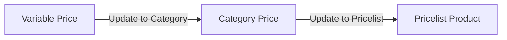

# Variable Price — Source of Truth

**Final E2E requirement (kanonik pra-split detail UI):** [`variable-price-multi-tier-final-requirement.md`](./variable-price-multi-tier-final-requirement.md)  
**Wireframe:** https://claude.ai/artifact/CSgXVMhzsztTJqwpeD7f89  
**Jira:** [ETM-16312](https://erpintegration.atlassian.net/browse/ETM-16312) · [ETM-16313](https://erpintegration.atlassian.net/browse/ETM-16313) · [ETM-16314](https://erpintegration.atlassian.net/browse/ETM-16314)

## 1. Ringkasan

Variable Price = master band margin reusable. Satu master = **satu type**: **by Amount** (default price) atau **by Weight** (weight primary, gram). Multi tier = attach beberapa master di Category Price. Estafet manual: VP → Category → Pricelist (fase trial, tidak auto).

## 2. Aturan inti

| Aturan | Isi |
|--------|-----|
| Type | Satu master satu type; Amount+Weight = dua master |
| Matching | Start–End inklusif; else Unlimited (≥ Start); else kontribusi 0 |
| Percentage | Selalu × **default price** (juga untuk tier by Weight) |
| Amount value | Boleh minus |
| Weight kosong/0 | Semua tier by Weight di-skip |
| Rumus | Margin = Σ kontribusi; Final = default + margin |
| Type field | Boleh ubah jika **belum** dipakai Category; setelah dipakai → disabled + server reject |
| Update | Overwrite snapshot/Pricelist; konfirmasi + log; tidak auto hilir |

## 3. Gap terbuka (final §9)

GAP-VP/CP/PL dari final Bagian 9: default price change behavior, konversi satuan weight, weight &lt; 1 g, category tanpa tier, Inactive/hapus master, mass Update from Master, permission Update, job background Pricelist. Usulan ada di final doc — belum keputusan final kecuali Type lock (diputuskan: lock hanya setelah dipakai).

## 4. Changelog

| Date | Version | Changes |
|------|---------|---------|
| 2026-10-07 | 1.0 | Draft awal ETM-16312/13/14 |
| 2026-10-09 | 1.1 | Align final requirement + wireframe; Type lock = setelah dipakai Category (bukan immutable save pertama); pointer file final |
