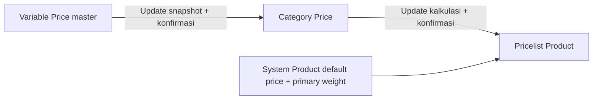
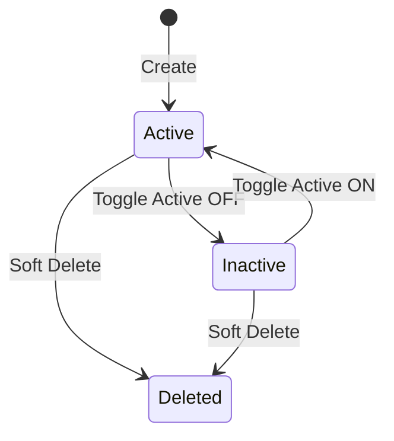
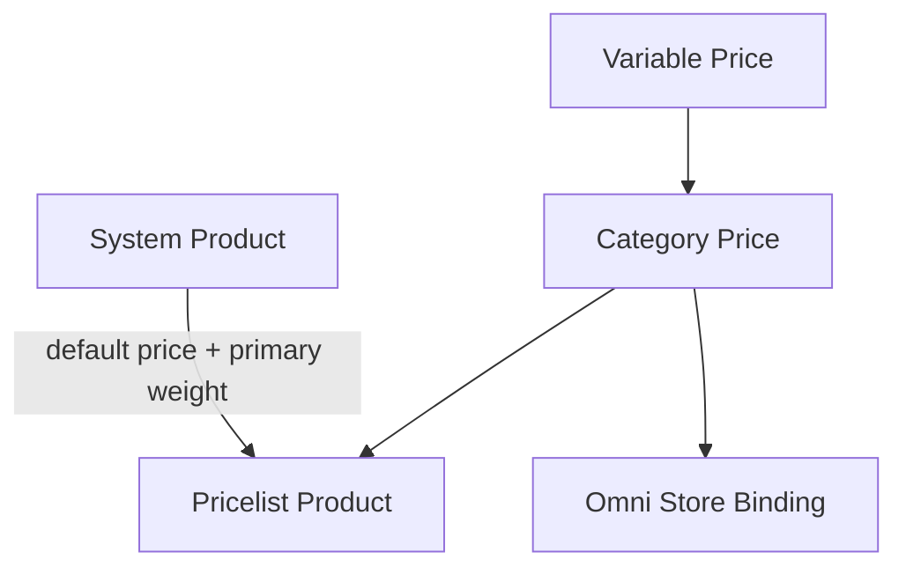

# Variable Price — Source of Truth

## 1. Ringkasan Eksekutif

Variable Price adalah master baru di Business Development untuk menyimpan konfigurasi band margin yang bisa dipakai ulang oleh Category Price. Satu record Variable Price hanya punya **satu type**: **by Amount** (berdasarkan default price SKU) atau **by Weight** (berdasarkan weight primary Product Dimension & Weight, satuan gram). Multi tier di Category Price dicapai dengan **attach beberapa** Variable Price, bukan mencampur type dalam satu master. Perubahan master tidak otomatis mengubah Category Price atau Pricelist Product — user menekan Update secara estafet (fase trial).



**Jira:** ETM-16312 (Improvement) · Relates ETM-16313 · ETM-16314

## 2. Prasyarat

| Prasyarat | Sumber | Catatan |
|---|---|---|
| Akses menu Business Development | Gate role | Sidebar urutan: Variable Price di atas Category Price |
| Category Price (konsumen) | Menu Category Price | Attach multi Variable Price — ETM-16313 |
| Pricelist Product (konsumen hilir) | Menu Pricelist Product | Apply kalkulasi — ETM-16314 |
| Product Dimension & Weight primary | System Product | Dipakai tier by Weight di hilir; bukan field form Variable Price |

## 3. Siklus Status

Master data Active/Inactive (+ soft-delete mengikuti pola master BD sejenis — `[VERIFY: CODEBASE]` setelah implementasi).



| Status | Editable? | Boleh di-attach Category baru? |
|---|---|---|
| Active | Ya | Ya |
| Inactive | Ya | Tidak (prefer) — `[VERIFY]` |
| Deleted | Restore saja | Tidak |

## 4. Datalist

**URL target:** `https://staging.olshoperp.com/businessdevelopment/variable-price` (path final mengikuti implementasi)

| Fitur | Perilaku |
|---|---|
| Create / Edit | Form master + section band |
| Bulk / row action **Update to Category** | Push snapshot ke semua Category yang memakai master ini; konfirmasi wajib |
| Search / filter | Pola datalist BD — `[VERIFY]` kolom exact setelah FE |

### Kolom (usulan)

| # | Kolom | Catatan |
|---|---|---|
| 1 | Code / Name | Identifier master |
| 2 | Type | by Amount / by Weight |
| 3 | Status | Active/Inactive |
| 4 | Used by Category (count) | Opsional — membantu sebelum Update |
| 5 | Action | Edit, Update to Category |

## 5. Form & Field

### Header

| Field | Wajib? | Sumber | Validasi |
|---|---|---|---|
| Code | Ya | User | Unik per company — `[VERIFY]` |
| Name | Ya | User | — |
| Type | Ya | User | `by_amount` \| `by_weight`; **immutable setelah save pertama** (prefer) |
| Status Active | Ya | User | Default Active |
| Description | Tidak | User | Opsional |

### Section bands (pola samakan AS-IS Category Price Margin Price Configuration)

| Field | Wajib? | Catatan |
|---|---|---|
| Start | Ya | by Amount = Rp default price; by Weight = gram |
| End | Ya (baris biasa) | Baris Unlimited: End open / `is_last` |
| Type (band) | Ya | `percentage` \| `amount` |
| Value | Ya | Boleh **minus** (pengurang) |
| is_last / Unlimited | Ya (satu baris last) | Match jika nilai lebih dari sama dengan Start |

## 6. How It Works

### 6.1 Satu master = satu type

User yang butuh tier by Amount dan by Weight harus membuat **dua** Variable Price (atau lebih), lalu attach keduanya di Category Price.

### 6.2 Matching band (samakan AS-IS)

Dari perilaku Category Price / Product observer yang ada hari ini:

1. Cocokkan nilai (price atau weight) ke band biasa: Start sampai End (inklusif).
2. Jika tidak ketemu, cocokkan baris Unlimited: nilai lebih dari sama dengan Start.
3. Jika tetap tidak ketemu: kontribusi tier = 0.

Type band `percentage`: Value = persen dari **default price** SKU (juga untuk tier by Weight — basis tetap default price).  
Type band `amount`: Value = angka absolut (boleh minus).

### 6.3 Update to Category (estafet 1)

- Scope: semua Category Price yang punya link ke master ini.
- Perilaku: **overwrite** snapshot band di Category (termasuk edit lokal di Category).
- Wajib dialog konfirmasi.
- Tulis log di Category: siapa, kapan, dari Variable Price mana.
- **Tidak** mengubah Pricelist Product.

### 6.4 Contoh case (dari requirement user)

Master A (by Amount): 0–10.000 → 2.000; 10.001–20.000 → 3.000 (+ Unlimited).  
Master B (by Weight): 1–1.000 g → 1.500; 1.001–2.000 g → 2.000.  
Master C (by Amount): 15.000–25.000 → 3.500; …

SKU-001: default price 16.000, weight primary 1.500 g → di Pricelist (setelah Update dari Category): margin 3.000 + 2.000 + 3.500 = 8.500; final 24.500. Hover margin menampilkan breakdown tersebut (ETM-16314).

### 6.5 Migrasi data lama

Tidak ada auto-migrate dari `bd_pricelist_category_margin_prices`. Data AS-IS sedikit / belum aktif — boleh dibersihkan saat cutover.

## 7. Validasi

| ID | Kondisi | Behavior |
|---|---|---|
| V-VP-01 | Type kosong | Tolak save |
| V-VP-02 | Campur type dalam satu master | Tidak dimungkinkan (satu field Type header) |
| V-VP-03 | End kurang dari atau sama dengan Start (band biasa) | Tolak / sama AS-IS Category |
| V-VP-04 | Value minus | Diizinkan |
| V-VP-05 | Update to Category tanpa konfirmasi | Tidak jalan |
| V-VP-06 | Master dipakai Category; ubah Type header | Diblok jika immutable — `[VERIFY]` |

Error message exact: `[VERIFY: CODEBASE]` setelah FormRequest diimplementasi.

## 8. Relasi Menu Lain



| Menu | Relasi |
|---|---|
| Category Price | Attach multi Variable Price; snapshot + Update from Master (ETM-16313) |
| Pricelist Product | Hitung SUM tier; hover; weight column (ETM-16314) |
| System Product | Sumber default price & primary weight |
| Omni Store Binding | Memakai Category Price / pricelist category — dampak tidak langsung sampai Update Pricelist |

## 9. Gap Registry

| ID | Deskripsi | Type | Dampak | Status |
|----|-----------|------|--------|--------|
| GAP-VP-01 | Path URL / permission Gate sidebar belum ada di kode | Missing Behavior | Implementasi ETM-16312 | Open |
| GAP-VP-02 | Immutable Type setelah create vs editable jika unused | Unverified | UX edge case | Pending Decision — Yemima (prefer immutable) |
| GAP-VP-03 | Inactive master masih boleh remain attached vs detach | Unverified | Attach rules | Open |
| GAP-VP-04 | Basis percentage pada tier by Weight = default price (bukan weight) | Unverified | Konfirmasi bisnis — diasumsikan default price | Pending Decision — Yemima |
| GAP-VP-05 | Floor final_price kurang dari 0 saat Value minus besar | Unverified | Guard Pricelist | Open |

## 10. FAQ

**Q: Kenapa tidak bisa Amount + Weight dalam satu Variable Price?**  
A: Satu master satu type supaya reusable dan jelas. Multi tier = beberapa master di Category Price.

**Q: Ubah Value di master, Category langsung berubah?**  
A: Tidak. Harus tekan Update to Category (konfirmasi). Pricelist juga tidak ikut sampai Update dari Category.

**Q: Value boleh minus?**  
A: Ya — bisa mengurangi harga jual.

## 11. Changelog

| Date | Version | Changes |
|------|---------|---------|
| 2026-10-07 | 1.0 | Draft dari diskusi Yemima + ETM-16312/16313/16314; 1 type per master; snapshot sync; contoh SKU 16.000 / 1.500g → 24.500 |

## 12. Knowledge Base Hints

| Istilah teknis | Bahasa awam |
|---|---|
| Variable Price | Master aturan margin (harga atau berat) |
| by Amount | Berdasarkan harga default produk |
| by Weight | Berdasarkan berat primary produk (gram) |
| Snapshot | Salinan aturan di Category; tidak otomatis ikut ubah master |
| Unlimited / is_last | Baris “ke atas tanpa batas” |
| Update to Category | Tombol kirim salinan terbaru ke Category yang memakai master ini |

Troubleshooting: Update tidak mengubah harga jual di Pricelist → normal; lanjut Update di Category Price ke Pricelist.

## 13. Technical Hints

| Area | Lokasi / catatan |
|---|---|
| AS-IS margin category | `bd_pricelist_category_margin_prices`; entity `PricelistCategoryMarginPrice`; FE `PricelistCategory/Form.vue` |
| AS-IS match on product price change | `Modules/SupplyChain/Entities/Product.php` (updated dirty `price`) — single band set per category |
| Pricelist fields | `margin_price`, `final_price`; log `old_margin_price` / `new_margin_price` |
| Weight primary | `product_dn_ws.is_primary` / Product DnW |
| New BE (TO-BE) | Module BusinessDevelopment — controller/entities/migrations Variable Price + pivot category — `[VERIFY]` setelah merge |
| New FE (TO-BE) | `src/pages/BusinessDevelopment/VariablePrice/**`; router sidebar di atas `pricelist-category` |
| Cards | ETM-16312, ETM-16313, ETM-16314 |

**Invariants (TO-BE):**

- Satu Variable Price header.type ∈ {by_amount, by_weight}.
- Update master → category hanya via aksi user + konfirmasi.
- Update master tidak menulis `bd` pricelist final/margin.

**Failure modes:** Job/bulk Update to Category gagal di tengah → partial vs rollback — tentukan di implementasi; log per category sukses/gagal.

## 14. Referensi Struktur untuk Proses Split

```
Section 1-11 → material utama untuk requirement.md
Section 5, 6, 7, 10 → adaptasi ke knowledge-base.md dengan tone awam (lihat Section 12)
Section 13 Technical Hints → seed untuk technical.md, sudah pakai path/nama real
Frontmatter YAML di atas → copy ke 3 file utama (+ user-guide.md kalau gate review/final), sinkronkan version + last_updated
Golden reference tone & struktur: docs/qa-docs/accounting-supplier-invoice/
```
