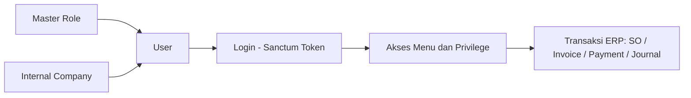
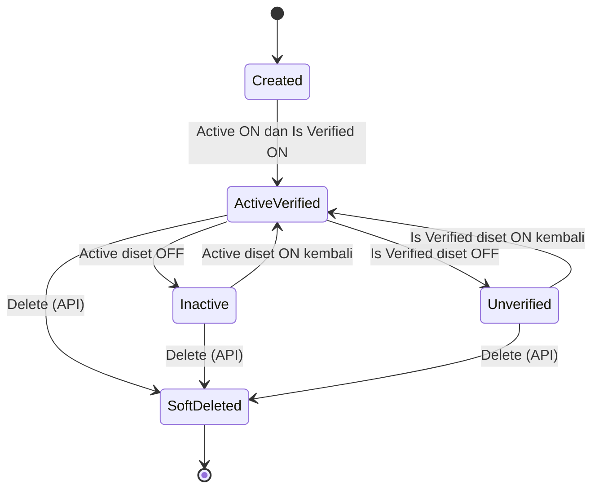
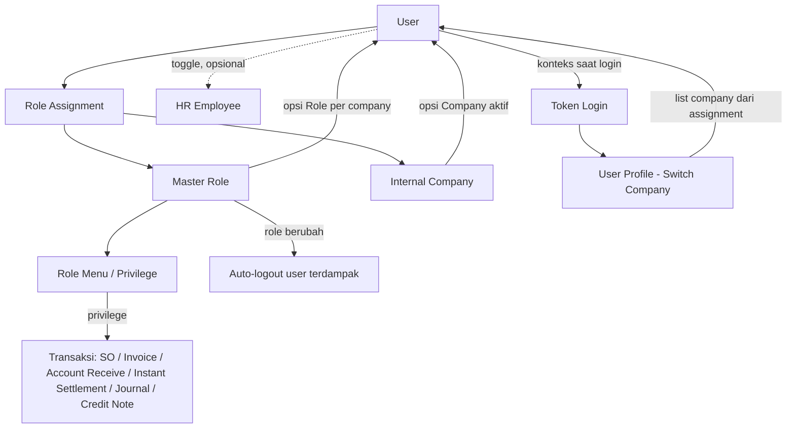

# User (Gate) — Source of Truth

## 1. Ringkasan Eksekutif

User adalah menu master akun login dan akses di modul Gate — bukan dokumen transaksi, sehingga tidak ada Draft/Open/Approve, amount prepared/processed, atau import Excel. Menu ini mengelola identitas dan kredensial login, status akses (Active, Is Verified), assignment Role per Internal Company (satu user bisa punya role berbeda di company berbeda), serta default company yang dipakai saat login. Audience utama: Admin/IT yang mengatur akses staff ke OlshopERP.



---

## 2. Prasyarat

| Prerequisite | Sumber | Catatan |
|---|---|---|
| Internal Company berstatus Active | Menu Internal Company | Minimal 1 company aktif harus tersedia sebelum Role Assignment bisa dibuat; hanya company Active yang muncul sebagai opsi |
| Master Role | Menu Role | Role harus sudah dibuat dan privilege-nya diset sebelum bisa di-assign ke user |
| HR Employee (opsional) | Modul HR | Jika ingin user terhubung ke data karyawan, Employee dibuat lebih dulu dari modul HR; linking dilakukan dari sisi Employee, bukan dari form User |

---

## 3. Siklus Status

User tidak memakai satu status dokumen tunggal seperti transaksi pada umumnya. Aksesnya ditentukan oleh kombinasi kondisi independen: Active, Is Verified, dan soft-delete.



| Status | Kondisi Transisi | Bisa Login? | Editable? | Tombol yang Muncul |
|---|---|---|---|---|
| Created | Selesai create, Save & Next | Belum, kalau belum ada Role Assignment | Ya | Save & Next |
| Active & Verified | Active ON, Is Verified ON, minimal 1 Role Assignment valid | Ya, jika password benar | Ya | Edit, Bulk Activate/Deactivate |
| Inactive | Active di-toggle OFF (manual atau Bulk Deactivate) | Tidak | Ya | Edit, Bulk Activate |
| Unverified | Is Verified di-toggle OFF | Tidak | Ya | Edit |
| Soft-Deleted | Delete lewat API | Tidak, tidak muncul di list normal | Tidak lewat UI | Tidak ada tombol delete di UI untuk operator — lihat GAP-GU-02 |

Catatan AS-IS: mematikan Active atau Is Verified tidak selalu langsung membatalkan token yang sedang berjalan; invalidasi efektif juga bergantung pada polling status secara berkala — lihat GAP-GU-04.

---

## 4. Datalist

| # | Kolom | Visible Default | Sumber Data | Keterangan |
|---|---|---|---|---|
| 1 | ID | false | ID internal user | Ditampilkan hanya via Column Show/Hide |
| 2 | First Name | false | Identitas | — |
| 3 | Last Name | false | Identitas | — |
| 4 | Name | true | Gabungan First Name + Last Name | — |
| 5 | Username | true | Identitas login | — |
| 6 | Email | true | Identitas login | — |
| 7 | Verified At | true | Timestamp verifikasi | — |
| 8 | Assigned Employee | true | Relasi HR Employee | Indikator link HR, lihat Section 8 |
| 9 | Active | true | Status akses | Yes/No |
| 10 | Last Active | true | Timestamp aktivitas terakhir | — |
| 11 | Created By | true | Audit field | Kombinasi tampilan dengan Created At [VERIFY: CODEBASE] apakah 1 kolom gabungan atau 2 kolom terpisah |
| 12 | Created At | requirement mentah: true | Audit field | Requirement mentah mencantumkan sebagai baris terpisah sekaligus tergabung dengan Created By; belum eksplisit dikonfirmasi codebase [VERIFY: CODEBASE] |
| 13 | Data Owner | requirement mentah: true | Company pemilik data user | Belum ditemukan konfirmasi di analisis codebase [VERIFY: CODEBASE] |
| 14 | Action | true | — | Edit tersedia; Delete tidak konsisten antar sumber — lihat GAP-GU-02 |

### Fitur Datalist

- **Column Show/Hide** — menampilkan kolom hidden (ID, First Name, Last Name). Requirement mentah menyebut preferensi tersimpan per user dengan tombol "Reset to Defaults"; belum eksplisit dikonfirmasi dari codebase [VERIFY: CODEBASE].
- **Bulk Activate/Deactivate** — mengirim daftar ID user beserta status baru dalam satu request. Tidak ada company-scope check ketat per ID — lihat GAP-GU-06.
- **Export Basic** — mekanisme generik datatable, kolom export mengikuti kolom visible/default (termasuk Active, Last Active, Created By). Tidak ada export khusus atau template dedicated.
- **Delete** — tidak tersedia sebagai tombol datalist untuk operator biasa (privilege Delete OFF) — lihat GAP-GU-02.

---

## 5. Form & Field

### Section A — User Information

| Field | Wajib | Default | Sumber Opsi | Validasi | Catatan |
|---|---|---|---|---|---|
| First Name | Ya | — | — | Max 50 karakter | — |
| Last Name | Ya | — | — | Max 50 karakter | — |
| Email | Ya | — | — | Format email valid, unique, max 50 | — |
| Username | Ya | — | — | Hanya huruf/angka/strip/underscore, unique, max 50 | — |
| Password | Ya saat create | — | — | Create: required, max 50, **tidak ada minimal 8 karakter** (lihat GAP-GU-03). Update: nullable, minimal 8, max 50, harus dikonfirmasi ulang | Password disimpan dalam bentuk hash, bukan plain text |
| Re-type Password | Ya saat create | — | — | Create: required, minimal 8, harus sama persis dengan Password. Update: field konfirmasi terpisah | — |
| Description | Tidak | — | — | Max 150 karakter | — |
| Profile Image | Tidak | — | — | Client maksimal 2 MB, backend sesuai konfigurasi ukuran gambar | Hanya informatif |
| Toggle Active | — | ON | — | — | OFF = tidak bisa login; tersedia Bulk Activate/Deactivate |
| Toggle Is Verified | — | ON | — | Disimpan sebagai timestamp/kosong | OFF = tidak bisa login tanpa menghapus Role Assignment; reversible |
| Toggle Assign to Employee | — | OFF | — | Selalu read-only/disabled di form User | Indikator saja; assignment sesungguhnya dilakukan dari menu HR Employee |
| Toggle Show for All Company | — | OFF | — | — | ON mengatur visibilitas lintas company (bukan modify permission — lihat GAP-GU-01). Apakah bisa dikembalikan ke OFF setelah dipakai company lain, belum dikonfirmasi [VERIFY: CODEBASE] |
| Toggle Allow Multi-Device Login | — | OFF | — | — | OFF = login device baru menggantikan session device lama; ON = banyak token/device bersamaan |

### Section B — Role Assignment

| Field | Wajib | Default | Sumber Opsi | Validasi | Catatan |
|---|---|---|---|---|---|
| Company | Ya | — | Internal Company berstatus Active | Required | — |
| Role | Ya | — | Master Role | Required, harus Role aktif; rules public/private terhadap opsi Role belum diverifikasi [VERIFY: CODEBASE] | — |
| Toggle Is Default Company | Tidak | OFF | — | — | Jika ON dan Save, row ini menjadi default; default lama otomatis menjadi No (auto-switch dikonfirmasi codebase) |
| Save | — | — | — | Self-assignment diblokir dengan pesan error khusus; target user harus dalam company scope | Upsert untuk company yang sama (tidak duplikat); seluruh token/session user dihapus permanen setelah save, wajib login ulang |

Datatable Role Assignment menampilkan: Company Name, Role Name, Default Company (Yes/No — hanya boleh 1 Yes per user), Created By/Owner, dan Delete (hanya untuk row non-default; row default berlabel "Not Authorized" tanpa tombol delete).

### Section C — Audit Log

Slideover dari side navigation, menampilkan histori perubahan data User. Role Assignment memiliki behavior audit/pivot yang terpisah dan belum seluruhnya terverifikasi end-to-end — apakah tambah/hapus akses company ikut tercatat [VERIFY: CODEBASE].

---

## 6. How It Works

### 6.1 Create dan Assignment Flow

Urutan kerja standar: admin mengisi Section User Information (identitas, password, toggle), lalu Save & Next. Setelah user tersimpan, admin lanjut ke Role Assignment — pilih Company dan Role, lalu Save. Setiap Save di Role Assignment menyimpan satu row company-plus-role ke datatable (bukan bulk multi-company dalam satu submit).

Kalau ini row pertama tanpa toggle Is Default Company diaktifkan, sistem otomatis menjadikannya Default Company. Kalau user sudah punya default company lalu assignment baru di-set sebagai default, default lama otomatis berubah jadi No.

Efek samping penting: setiap kali Role Assignment disimpan, seluruh token/session milik user tersebut dihapus permanen, sehingga user wajib login ulang untuk mendapat konteks company dan role yang baru. Sebaliknya, menghapus row Role Assignment tidak melakukan hal yang sama — lihat GAP-GU-05.

### 6.2 Login Flow

Login hanya memproses user yang statusnya Active, sudah terverifikasi, passwordnya cocok, dan memiliki minimal 1 Role Assignment yang bisa dipakai.

| Active | Verified | Assignment Valid | Hasil |
|---|---|---|---|
| OFF | apa saja | apa saja | Login gagal |
| ON | OFF | Ada | Login gagal |
| ON | ON | Tidak ada | Tidak mendapat konteks login yang valid |
| ON | ON | Ada | Berhasil jika password benar |

Setelah lolos, sistem memilih assignment dengan Default Company (fallback ke assignment pertama kalau belum ada default eksplisit), lalu membuat token sesi berisi company dan role aktif. Kalau Allow Multi-Device Login OFF, session sebelumnya dihapus (device lama otomatis logout). Role pada token menentukan sidebar dan privilege yang bisa dipakai user.

### 6.3 Auto-Logout saat Role Berubah

Perubahan privilege pada Master Role (bukan pada Role Assignment milik user) membuat token seluruh user pemakai role tersebut menjadi tidak berlaku, dan cache sidebar untuk role itu diperbarui. Saat re-login, privilege versi terbaru langsung berlaku, sehingga perubahan permission efektif tanpa menunggu logout manual.

### 6.4 Mencabut Akses vs Menonaktifkan Akun

Dua toggle sama-sama memblokir login tapi tujuannya beda: Active OFF menonaktifkan akun secara umum, sedangkan Is Verified OFF mencabut akses login tanpa menghapus Role Assignment — reversible dan lebih cepat daripada menghapus assignment satu per satu.

---

## 7. Validasi

### 7.1 User Information — Create

| # | Kondisi | Behavior |
|---|---|---|
| 1 | Username duplikat atau format salah | Ditolak |
| 2 | Email duplikat atau format salah | Ditolak |
| 3 | First/Last Name kosong atau lebih dari 50 karakter | Ditolak |
| 4 | Password kosong | Ditolak |
| 5 | Password lebih dari 50 karakter tapi kurang dari 8 karakter | **Diterima** — tidak ada validasi minimal 8 pada field Password itu sendiri (lihat GAP-GU-03) |
| 6 | Re-type Password tidak sama dengan Password, atau kurang dari 8 karakter | Ditolak |
| 7 | Description lebih dari 150 karakter | Ditolak |

### 7.2 User Information — Update

| # | Kondisi | Behavior |
|---|---|---|
| 1 | Username/Email duplikat | Ditolak, kecuali punya ID user itu sendiri |
| 2 | Password diisi dengan kurang dari 8 karakter atau tidak dikonfirmasi | Ditolak |
| 3 | Password dikosongkan | Hash lama dipertahankan |
| 4 | Target update di luar company scope dan bukan user login sendiri | Ditolak |
| 5 | Toggle is_master_user diubah oleh company biasa | Ditolak — hanya company khusus/super company yang boleh, maksimal satu master user per company |

### 7.3 Role Assignment

| # | Kondisi | Behavior |
|---|---|---|
| 1 | Company/Role kosong atau tidak aktif | Ditolak |
| 2 | User mencoba mengubah role assignment miliknya sendiri | Ditolak dengan pesan khusus |
| 3 | Target user di luar company scope | Ditolak |
| 4 | Assignment company yang sama disimpan ulang | Di-upsert, bukan duplikat |
| 5 | Row lebih dari 1 diset sebagai Default Company | Default lama otomatis dimatikan (auto-switch) |
| 6 | Row Default Company dicoba dihapus | Tombol delete tidak tersedia |

### 7.4 Password Reset dan Change Password

| # | Kondisi | Behavior |
|---|---|---|
| 1 | Forgot password — user belum verified | Ditolak |
| 2 | Forgot password — password baru kurang dari 8 karakter | Ditolak |
| 3 | Change password (logged-in) — password lama tidak cocok | Ditolak |
| 4 | Change password — password baru tidak dikonfirmasi sama | Ditolak |
| 5 | — | Ada indikasi pola validasi/hash pada Change Password berbeda dari flow login/create/update — lihat GAP-GU-07 |

### 7.5 Bulk Update

| # | Kondisi | Behavior |
|---|---|---|
| 1 | Request bulk-update dikirim tanpa scope check ketat per ID | **Diterima** — tidak ada validasi shape status atau company-scope check ketat per user ID (lihat GAP-GU-06) |

---

## 8. Relasi Menu Lain



| Menu | Peran dalam Relasi |
|---|---|
| Master Role | Sumber opsi Role di Role Assignment; perubahan privilege Role memicu auto-logout dan invalidasi cache sidebar seluruh user pemakai role tersebut |
| Internal Company | Sumber opsi Company di Role Assignment; hanya company Active yang muncul; daftar company di User Profile (switch company) berasal dari assignment ini |
| HR Employee | Relasi opsional; linking dilakukan dari sisi Employee, bukan dari form User — toggle Assign to Employee di form User selalu read-only |
| User Profile (switch company) | UI untuk berpindah company aktif saat login; daftar company bersumber dari Role Assignment di menu ini |
| Login / Token | Konteks company dan role aktif berasal dari token sesi, bukan hanya dari data User |
| Sales Order, Sales Invoice, Account Receive, Instant Settlement, Journal, Credit Note | Tidak ada relasi dokumen langsung; User berperan sebagai actor/creator/approver lewat privilege Role, bukan child data dari User. Field audit (created_by, approved_by, dan sejenisnya) menunjuk ke user tapi bukan konfigurasi di form User |

---

## 9. Gap Registry

| ID | Deskripsi | Dampak | Status |
|---|---|---|---|
| GAP-GU-01 | Requirement mentah menyatakan toggle Show for All Company (ON) memberi company lain hak View dan Modify data user. Analisis codebase hanya menemukan kontrol visibilitas lintas company, tidak ada bukti modify permission terpisah. **Keputusan: codebase dipakai sebagai source of truth di SOT ini (visibility-only); klaim modify permission di requirement mentah dianggap outdated/tidak terverifikasi.** | Behavior permission salah dokumentasi bisa memicu ekspektasi keamanan yang keliru | Resolved |
| GAP-GU-02 | Requirement mentah menyatakan kolom Action datalist User punya Delete (dengan batasan). Analisis codebase menemukan Delete tersedia di API tapi tidak ada tombol/privilege di UI sama sekali. **Belum diputuskan mana yang jadi AS-IS final** — perlu konfirmasi apakah requirement merujuk rencana to-be atau memang sudah usang. | Ketidakjelasan scope fitur Delete untuk implementasi dan testing | Open |
| GAP-GU-03 | Validasi Password saat create tidak punya aturan minimal 8 karakter pada field Password itu sendiri — hanya field konfirmasi yang punya minimal 8 | Password lemah berpotensi lolos saat create user baru | Open |
| GAP-GU-04 | Toggle Active/Is Verified OFF tidak langsung membatalkan token yang sedang aktif; invalidasi bergantung pada polling status secara berkala | Ada jeda waktu di mana user yang sudah dinonaktifkan masih bisa memakai sesi lama | Open |
| GAP-GU-05 | Menghapus row Role Assignment tidak menghapus token user, padahal menyimpan Role Assignment (create/update) menghapus seluruh token — dua aksi dengan dampak akses yang mirip tapi side effect berbeda | User bisa tetap memakai token untuk company yang aksesnya sudah dicabut, sampai token expired secara natural | Open |
| GAP-GU-06 | Bulk Update Active/Deactivate tidak melakukan company-scope check per user ID maupun validasi shape status yang ketat | Potensi celah otorisasi — user di luar company scope bisa ikut ter-update lewat aksi bulk | Open |
| GAP-GU-07 | Change Password (logged-in) memakai pola validasi/hash yang terindikasi berbeda dari flow login, create, dan update | Berpotensi membuat flow change password gagal atau tidak konsisten | Open |
| GAP-GU-08 | Kondisi yang menyembunyikan Section Role Assignment dan toggle admin pada route Profile belum terlihat pernah diaktifkan secara eksplisit di frontend | Behavior route Profile perlu regression test menyeluruh sebelum dianggap AS-IS final | Open |
| GAP-GU-09 | Belum ada automated end-to-end test khusus untuk menu User di modul Gate | Risiko regresi tidak terdeteksi otomatis pada flow login, assignment, dan validasi | Open |

---

## 10. FAQ

**Q: Kenapa user saya tidak bisa login padahal Active sudah ON?**
A: Cek juga toggle Is Verified — keduanya harus ON. Kalau Is Verified OFF, login tetap gagal walau Active ON.

**Q: Gimana cara mencabut semua akses user tanpa menghapus assignment company-nya?**
A: Toggle Is Verified ke OFF. Assignment company dan role tetap tersimpan, bisa diaktifkan lagi kapan saja.

**Q: Kenapa row yang saya assign sebagai Default Company tidak bisa dihapus?**
A: Row Default Company adalah anchor terakhir yang menjamin user masih terhubung ke sistem. Kalau mau mencabut akses penuh, pakai toggle Is Verified OFF, bukan menghapus row ini.

**Q: User saya tiba-tiba ter-logout sendiri, kenapa?**
A: Dua kemungkinan: Master Role yang dipakai baru saja diupdate (auto-logout semua user terdampak), atau Allow Multi-Device Login OFF dan ada yang login memakai akun yang sama dari device lain.

**Q: Bisa tidak 1 user punya role berbeda di company berbeda?**
A: Bisa — user bisa di-assign ke banyak company sekaligus, masing-masing dengan role yang terpisah.

**Q: Kenapa ada endpoint Delete tapi tidak muncul di menu User?**
A: Saat ini privilege Delete di menu User dimatikan untuk operator biasa. Status final fitur ini masih dikonfirmasi — lihat GAP-GU-02.

**Q: Kalau toggle Show for All Company saya nyalakan, apakah company lain bisa mengubah data user saya?**
A: Berdasarkan codebase saat ini, toggle ini hanya mengatur visibilitas — company lain bisa melihat, belum ada bukti company lain bisa mengubah data user tersebut.

---

## 11. Changelog

| Tanggal | Versi | Perubahan |
|---|---|---|
| 2026-07-30 | 1.0 | Draft awal SOT gate-user. Konsolidasi requirement mentah (Master User, 4 Juli 2026) dengan hasil analisis codebase AS-IS (30 Juli 2026). Beberapa Open Item requirement mentah terselesaikan lewat codebase (minimum password strength, auto-switch default company, status implementasi Assign to Employee). 2 kontradiksi diputuskan/diflagging bersama QA Lead: Show for All Company (Resolved — codebase truth) dan Delete User action (Open — belum diputuskan). |

---

## 12. Knowledge Base Hints

### Istilah teknis untuk KB

| Istilah di dokumen ini | Padanan awam untuk KB |
|---|---|
| Token sesi / Sanctum token | Sesi login |
| Show for All Company / visibility lintas company | Bagikan data user supaya bisa dilihat perusahaan lain |
| Role Assignment / Role Pivot | Daftar akses company dan role user |
| Token dihapus permanen | Otomatis logout paksa, wajib login ulang |
| Soft-delete | Dihapus tapi datanya masih tersimpan di sistem, tersembunyi dari tampilan biasa |
| Format username (alpha_dash) | Hanya boleh huruf, angka, tanda strip, dan underscore |

### Skenario troubleshooting (bahasa awam)

- **User tidak bisa login padahal statusnya aktif** — cek toggle Is Verified, harus menyala juga.
- **User terus-menerus ter-logout sendiri** — kemungkinan role yang dipakai baru saja diubah, atau ada yang login dari device lain.
- **Tidak menemukan tombol hapus user** — memang sengaja tidak disediakan untuk operator biasa.
- **Ganti password gagal terus padahal sudah benar** — kemungkinan ada kendala teknis di validasi password lama, laporkan ke tim IT.

### Field yang tidak relevan untuk operator (skip di KB)

ID internal user, detail teknis token/sesi, nama tabel dan field database, referensi endpoint API.

---

## 13. Technical Hints

### Area codebase yang perlu didokumentasikan

- Controller pengelola User (create, update, bulk update)
- Controller pengelola Role Assignment (pivot company-role)
- Controller autentikasi (login, forgot password, change password)
- Entity User dan Entity Role Pivot
- Policy/otorisasi User
- Custom validation rule untuk pencocokan password lama pada change password
- Komponen frontend: form User, form Role Assignment, datalist User

### Invariants

- Hanya 1 row Role Assignment per user yang boleh berstatus default company.
- User dengan status tidak aktif atau belum terverifikasi tidak boleh menghasilkan token login baru.
- Setiap create/update Role Assignment memicu penghapusan seluruh token user terkait.
- Password yang tersimpan harus dihasilkan lewat satu jalur hashing yang konsisten di semua entrypoint (create, update, login, change password) — saat ini **tidak konsisten**, lihat GAP-GU-07.

### Failure modes

- Change password gagal karena mismatch pola validasi/hash (GAP-GU-07) — expected fix: satukan jalur hashing/validasi di semua entrypoint.
- Bulk update tanpa scope check bisa mengubah status user di luar company scope (GAP-GU-06) — expected fix: tambahkan scope check per ID sebelum update dieksekusi.
- Delete Role Assignment tidak merevoke token (GAP-GU-05) — user lama masih bisa memakai token untuk company yang aksesnya sudah dicabut sampai token itu expired secara natural.

### Data lifecycle lintas dokumen

Flag default company pada pivot Role Assignment berpindah antar row (hanya 1 aktif per user) setiap kali assignment baru disimpan sebagai default. Perubahan privilege pada entitas Role meng-invalidate token seluruh user dengan role tersebut tanpa menyentuh data User secara langsung. Komponen frontend legacy/orphan (halaman Detail dan Help pada modul User, serta route upload image standalone) teridentifikasi tidak terpakai — perlu dikonfirmasi sebelum dihapus atau didokumentasikan sebagai deprecated.

---

## 14. Referensi Struktur untuk Cursor

```
Section 1-11 → material utama untuk requirement.md
Section 5, 6, 7, 10 → adaptasi ke knowledge-base.md dengan tone awam (lihat Section 12 KB Hints)
Section 13 Technical Hints → seed untuk technical.md, dilengkapi Cursor dari codebase
Frontmatter YAML di atas → copy ke 3 file utama, sinkronkan version + last_updated
Golden reference tone & struktur: docs/qa-docs/accounting-supplier-invoice/
```
