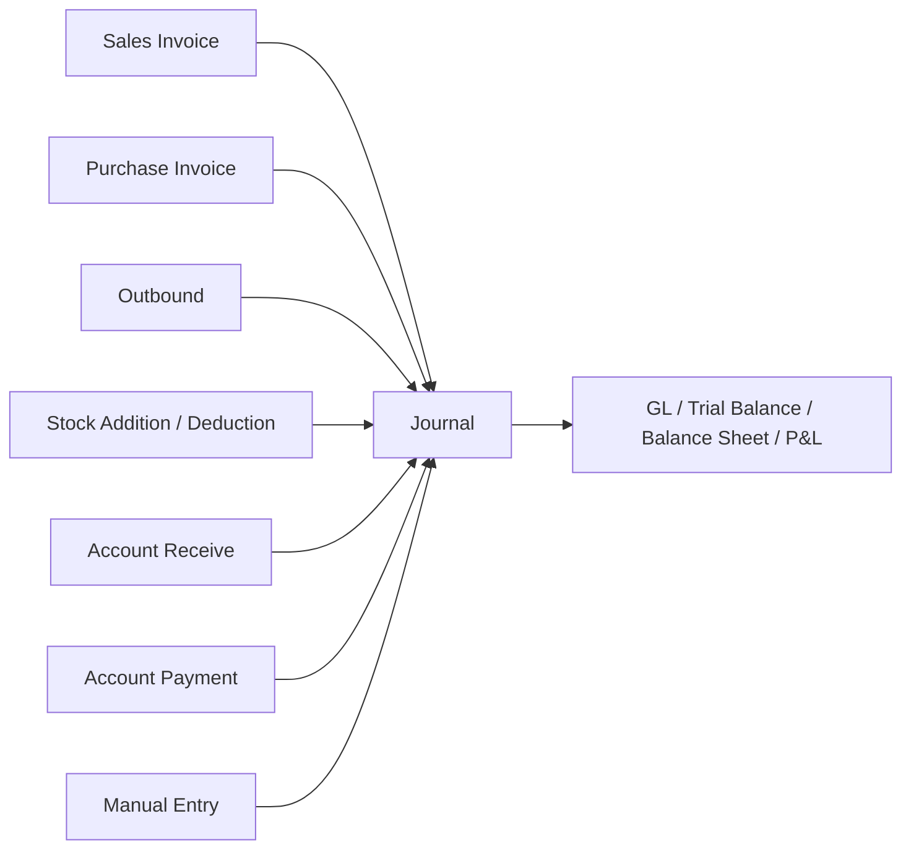
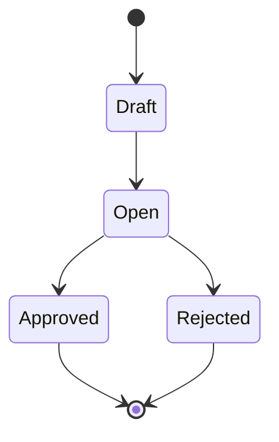
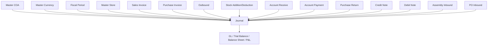

# Journal — Source of Truth

## 1. Ringkasan Eksekutif

Journal mencatat seluruh transaksi jurnal akuntansi — baik yang dibuat manual oleh user maupun yang ter-generate otomatis oleh sistem dari relasi transaksi lain (Sales Invoice, Purchase Invoice, Outbound, Stock Addition/Deduction, AR, AP, dll). Hanya journal berstatus **Approved** yang masuk ke laporan keuangan (GL, Trial Balance, Balance Sheet, P&L). Audience utama: tim Finance/Accounting.



---

## 2. Prasyarat

| Prerequisite | Sumber | Catatan |
| --- | --- | --- |
| Master COA aktif | Master Chart of Account | Hanya COA child (leaf) yang bisa dipakai, parent tidak boleh |
| Master Currency aktif | Master Currency | Minimal ada 1 primary currency |
| Fiscal Period aktif | Master Fiscal Period | Transaction Date journal harus jatuh dalam periode yang aktif, kalau tidak auto-save gagal |
| Master Store (opsional) | Master Store tipe Platform & Others, status Active | Hanya dipakai kalau journal terkait store tertentu |

---

## 3. Siklus Status



| Status | Kondisi Transisi | Editable? | Tombol yang Muncul |
| --- | --- | --- | --- |
| Draft | Transaksi baru dibuat / masih diedit | Ya | Save All, radio Draft/Open |
| Open | User pindah radio ke Open, siap di-approve | Ya (header + detail) | Save All, Approve, radio Draft/Open |
| Approved | User klik Approve | Tidak | — (final) |
| Rejected | User reject dari status Open | Tidak, tidak bisa reverse ke status sebelumnya | — (final) |

> Journal auto-generate by system langsung Approved, skip Draft dan Open sepenuhnya.

---

## 4. Datalist

### Kolom

| Kolom | Sumber Data | Keterangan | Default Visible |
| --- | --- | --- | --- |
| Trx Code / Trx Date | Header journal | Nomor transaksi + tanggal | ✅ |
| Type | Header journal | Salah satu dari 13 tipe journal (lihat Section 6.2) | ✅ |
| Description | Basic Information | Deskripsi header | ✅ |
| Curr | Basic Information | Currency transaksi | ✅ |
| Exchange Rate | Basic Information | Nilai kurs | ✅ |
| Total | Ledger Detail | Total amount journal | ✅ |
| Trx Ref | Sistem (jika auto-generate) | Nomor transaksi langsung yang menerbitkan journal, `-` jika manual | ✅ |
| Trx Status | Header journal | Draft / Open / Approved / Rejected | ✅ |
| Created at / Created by | Sistem | Timestamp & user pembuat | ✅ |

### Fitur Datalist

- **Show Deleted Data** — checkbox, default unchecked. Kalau dicentang, tampilkan data aktif + terhapus; data terhapus hanya tampil text `deleted` di kolom Action.
- **Column Show & Hide** — standar semua datalist, preferensi tersimpan per user.
- **Export Basic** — hanya data di active page, header only tanpa detail.
- **Export Advanced** — ikut filter aktif (kosong filter = export semua data). Sub-opsi: With Details (row per detail, header di-repeat), Without Details (1 row per transaksi), This Page Only (jumlah sesuai page size terakhir yang dipakai user).
- **Import** — lihat Section 6.3.

---

## 5. Form & Field

### 5.1 Basic Information

| Field | Wajib? | Default | Sumber Opsi | Validasi/Catatan |
| --- | --- | --- | --- | --- |
| Transaction Code | Required | Auto-generate | — | Bisa diubah, harus unique |
| Transaction Date | Required | Datetime now | — | Harus masuk Fiscal Period aktif, kalau tidak auto-save gagal |
| Store | Optional | NULL | Master Store tipe Platform & Others, Active | — |
| Transaction Reference | Optional | NULL | Freetext | — |
| Currency | Required | Primary currency | Master Currency Active | — |
| Exchange Rate | Required | `1` untuk primary (disabled) | — | Editable kalau foreign currency, default ikut rate primary |
| Description | Required | `Default System` (auto-generate) / kosong (manual) | Freetext | — |
| Select Files to Upload | Optional | — | — | Attachment eksternal |

Halaman create menampilkan Basic Information + Ledger Detail sekaligus dalam 1 halaman, tanpa perlu save Basic Information dulu, selama required field terpenuhi.

### 5.2 Ledger Detail — Input

| Field | Wajib? | Sumber Opsi | Catatan |
| --- | --- | --- | --- |
| Select Account | Required | Master COA Active, child only | Parent COA tidak bisa dipilih |
| Debit | Conditional Required | — | Wajib kalau Credit kosong |
| Credit | Conditional Required | — | Wajib kalau Debit kosong |
| Description | Optional | Freetext | Deskripsi tambahan per baris COA |

### 5.3 Ledger Detail — Datatable

| Kolom | Keterangan | Posisi |
| --- | --- | --- |
| Account | COA Code + Name | Kiri |
| Foreign | Nilai foreign currency, tampil hanya jika currency bukan primary | Sebelum Debit & Credit |
| Debit | Nilai debit | — |
| Credit | Nilai kredit | — |
| Description | Deskripsi baris | — |
| Action | Edit (modal kecil: Account, Debit/Credit, Description), Delete | Paling kanan |

### 5.4 Summary

```
                              Debit           Credit
Total Amount          USD 10.000       USD 10.000
Equivalent in IDR     IDR 172.000.000  IDR 172.000.000
```

Total Amount = akumulasi per kolom Debit/Credit dalam currency transaksi. Equivalent in IDR = Total Amount dikali Exchange Rate.

### 5.5 Sidebar Kanan (Edit/Show)

| Elemen | Keterangan |
| --- | --- |
| Basic Information / Ledger Detail | Jump ke section |
| Approval | Kapan di-approve, oleh siapa |
| Audit Log | History perubahan |
| Radio Draft/Open | Switch status |
| Save All | Simpan perubahan |
| Approve | Hanya muncul kalau status Open |

---

## 6. How It Works

### 6.1 Auto-Create Behavior

Klik Create langsung membuka Basic Information + Ledger Detail dalam 1 halaman. Tidak ada step simpan Basic Information terpisah — selama required field Basic Information terisi, user bisa langsung isi detail COA.

### 6.2 Auto-Generate Journal by System

Journal yang ter-generate dari relasi transaksi lain (bukan input manual user) punya behavior berikut:

| Field | Nilai |
| --- | --- |
| Description | Auto by system |
| Status | Langsung Approved |
| Trx Date | Sama dengan Trx Date transaksi referensi |
| Created by | User yang approve transaksi referensinya (bukan creator) |
| Created at | Timestamp saat journal ter-insert |
| Approved by | System |
| Approved at | Sama dengan Created at |

**Trx Ref** selalu merujuk ke transaksi langsung yang menerbitkan journal, bukan transaksi paling upstream. Contoh: Stock Opname yang mengurangi stock menerbitkan Stock Deduction, dan Stock Deduction ini yang menerbitkan journal — maka Trx Ref journal = nomor Stock Deduction, bukan nomor Stock Opname.

Relasi transaksi ke tipe journal:

| Transaksi | Tipe Journal |
| --- | --- |
| Sales Invoice | Sales Invoice |
| Outbound (dari order) | Warehouse Stock Outbound |
| Outbound (as expense/internal) | Warehouse Stock Outbound |
| Stock Addition | Stock Adjustment (Addition) |
| Stock Deduction | Stock Adjustment (Deduction) |
| Account Receive (AR) | Payment from Customer |
| Account Payment (AP) | Payment to Supplier |
| Purchase Invoice | Purchase Invoice |
| Purchase Return | Purchase Return |
| Credit Note | Credit Note |
| Debit Note | Debit Note |
| Assembly Inbound | Assembly Inbound |
| Purchase Order Inbound | Warehouse Stock Inbound |

**Update per 10 Juli 2026 — Auto-generated journal dengan value 0**

*Behavior sebelum update:* kalau transaksi sumber generate journal dengan amount 0 (contoh: PO dengan unit price SKU = 0, lalu proses Purchase Inbound atas PO tersebut), journal yang terbit dari Purchase Inbound tetap Approved, header tetap terbit lengkap dengan Trx Ref yang sesuai, tapi detail journal (baris COA Persediaan/Inventory vs Unbilled Goods) tidak digenerate sama sekali — datatable detail kosong. Tujuannya supaya GL Report tidak dipenuhi baris dengan value 0 (dianggap data sampah).

*Behavior setelah update (berlaku sejak 10 Juli 2026):* atas request end user, sistem sekarang tetap menerbitkan detail journal meskipun amount-nya 0. Contoh kasus yang sama — PO dengan unit price 0, Purchase Inbound atas PO tersebut — journal yang terbit sekarang punya detail baris COA Persediaan/Inventory (Debit 0) dan Unbilled Goods (Credit 0), bukan datatable kosong.

**Prinsip yang berlaku:** perubahan ini berlaku generik untuk *semua* tipe transaksi di tabel relasi di atas, bukan hanya Purchase Inbound. Konsepnya sama: begitu sebuah transaksi sumber menerbitkan auto-generate journal, sistem harus tetap menerbitkan header **dan** detail journal sesuai config COA masing-masing tipe transaksi, dengan value 0 tetap ditampilkan apa adanya (tidak di-skip, tidak disembunyikan).

`[VERIFY: CODEBASE]` — apakah journal lama (ter-generate sebelum 10 Juli 2026 dengan behavior header-only) di-backfill detailnya, atau tetap sebagaimana adanya sebagai historical data.

### 6.3 Fitur Import Journal

Template Excel:

| Kolom | Wajib? | Aturan |
| --- | --- | --- |
| Row Number | Required | Integer. Row Number sama = 1 transaksi journal |
| Transaction Date | Required | Format DD-MM-YYYY, time = waktu import dijalankan |
| Description | Optional | Deskripsi header |
| Memo | Required | Deskripsi per baris COA |
| COA Code | Required | Code COA Active, child only |
| Debit | Conditional Required | Wajib jika Credit kosong |
| Credit | Conditional Required | Wajib jika Debit kosong |
| Currency | Required | Code dari Master Currency Active, default template `IDR` |
| Exchange | Required | Numeric, default template `1` |
| Reference | Optional | Freetext |

Grouping: Row Number sama = 1 transaksi journal, bisa memuat ratusan baris COA tanpa batas maksimal, 1 file bisa berisi multiple Row Number sekaligus.

Prinsip validasi: **All-or-Nothing** — 1 error di mana pun dalam file menyebabkan seluruh file ditolak, semua error dikumpulkan sekaligus (lihat Section 7 untuk daftar pesan error).

Post-import: status default **Open** (tidak auto-approve), Transaction Date pakai waktu saat import dijalankan.

### 6.4 Multi-Currency

Currency di-input pakai Code. Kalau foreign currency, GL Report tetap tampil dalam IDR (amount dikali exchange rate). Di halaman show/edit journal, tampil 2 nilai sekaligus: foreign amount dan IDR equivalent.

---

## 7. Validasi

### 7.1 Create/Edit Manual

| No | Kondisi | Behavior | Error Message |
| --- | --- | --- | --- |
| 1 | COA yang dipilih parent | Tidak bisa disimpan | — |
| 2 | Debit dan Credit kosong dalam 1 baris | Tidak bisa disimpan | — |
| 3 | Debit dan Credit terisi keduanya dalam 1 baris | Tidak bisa disimpan | — |
| 4 | Total Debit ≠ Total Credit | Approve diblokir | — |
| 5 | Transaction Date di luar Fiscal Period aktif | Auto-save gagal | — |
| 6 | Transaction Code duplikat | Tidak bisa disimpan | Harus unique |

`[VERIFY: CODEBASE]` — untuk auto-generated journal pasca update 10 Juli 2026, baris detail dengan Debit=0 dan Credit=0 sekaligus tetap tercatat (dianggap "terisi eksplisit dengan 0", bukan "kosong"). Perlu dikonfirmasi apakah validasi #2 di atas ini memang di-bypass khusus untuk journal auto-generate, karena secara definisi kedua kolom sama-sama bernilai 0.

### 7.2 Import

| No | Kategori | Skenario | Error Message |
| --- | --- | --- | --- |
| 1 | Required Field | Kolom wajib kosong | `Row [X]: [Column Name] cannot be empty.` |
| 2 | Row Number | Non-numeric | `Row [X]: Row Number must be a numeric value.` |
| 3 | Transaction Date | Format bukan DD-MM-YYYY | `Row [X]: Invalid date format. Please use DD-MM-YYYY.` |
| 4 | COA Code | Tidak ditemukan/inactive | `Row [X]: COA Code [Code] not found or inactive.` |
| 5 | COA Code | Parent COA | `Row [X]: COA Code [Code] is a parent account. Only child accounts are allowed.` |
| 6 | Debit & Credit | Keduanya kosong | `Row [X]: Either Debit or Credit must be filled.` |
| 7 | Debit & Credit | Keduanya diisi | `Row [X]: Debit and Credit cannot both be filled in the same row.` |
| 8 | Debit/Credit | Non-numeric | `Row [X]: [Column Name] must be a numeric value.` |
| 9 | Currency | Tidak ditemukan/inactive | `Row [X]: Currency Code [Code] not found or inactive.` |
| 10 | Exchange | Non-numeric | `Row [X]: Exchange must be a numeric value.` |
| 11 | Balance | Total Debit ≠ Total Credit per Row Number | `Journal [Row Number]: Total Debit and Credit must be equal.` |

---

## 8. Relasi Menu Lain



| Menu | Peran dalam Relasi |
| --- | --- |
| Master COA | Sumber account, hanya child Active yang bisa dipakai |
| Master Currency | Sumber currency & exchange rate |
| Fiscal Period | Menentukan Transaction Date yang valid |
| Master Store | Opsional, filter/atribusi journal ke store |
| Sales Invoice, Purchase Invoice, Outbound, Stock Addition/Deduction, AR, AP, Purchase Return, Credit Note, Debit Note, Assembly Inbound, PO Inbound | Transaksi sumber yang menerbitkan auto-generate journal |
| GL / Trial Balance / Balance Sheet / P&L | Konsumen data journal Approved |

---

## 9. Gap Registry

| ID | Deskripsi | Dampak | Status |
|---|---|---|---|
| GAP-JRN-01 | Belum ada konfirmasi apakah journal auto-generate lama (header-only, sebelum 10 Juli 2026) di-backfill detailnya atau dibiarkan sebagai historical data | Potensi inkonsistensi data antara journal lama vs baru untuk laporan komparatif | Open |

---

## 10. FAQ

**Q: Kenapa journal saya sekarang muncul detail dengan value 0, padahal sebelumnya kosong?**
A: Sejak 10 Juli 2026, sistem diupdate supaya auto-generate journal tetap menampilkan detail (COA + value) meskipun amount transaksi sumbernya 0. Sebelumnya sistem sengaja menyembunyikan detail supaya GL Report tidak penuh baris kosong.

**Q: Apakah journal auto-generate bisa diedit?**
A: Tidak. Auto-generate journal langsung Approved dan non-editable.

**Q: Kenapa Trx Ref journal saya bukan nomor transaksi paling awal (misal Stock Opname), tapi nomor transaksi turunannya (Stock Deduction)?**
A: Trx Ref selalu merujuk ke transaksi langsung yang menerbitkan journal tersebut, bukan transaksi paling upstream.

**Q: Kenapa Approve tidak bisa diklik walau Debit dan Credit sudah keisi?**
A: Approve hanya bisa jalan kalau Total Debit sama dengan Total Credit di keseluruhan journal, bukan per baris.

**Q: Import saya ditolak semua padahal cuma 1 baris yang salah, kenapa?**
A: Import journal pakai prinsip All-or-Nothing — 1 error di mana pun membuat seluruh file ditolak.

---

## 11. Changelog

| Tanggal | Versi | Perubahan |
| --- | --- | --- |
| Mei 2026 | 1.0 | Initial documentation — 13 tipe journal, fitur import multi-currency, export advanced, auto-generate journal behavior |
| 10 Juli 2026 | 1.1 | Update: auto-generated journal dengan value 0 sekarang tetap menerbitkan detail journal (COA + value 0) sesuai config masing-masing tipe transaksi sumber, tidak lagi header-only |

---

## 12. Knowledge Base Hints

### Istilah Teknis → Padanan Awam

| Istilah Teknis | Padanan Awam |
| --- | --- |
| Trx Ref | Nomor transaksi asal yang jadi sumber journal ini |
| COA (Chart of Account) | Daftar akun akuntansi (kas, persediaan, hutang, dll) |
| Child/Parent COA | Akun detail (child) vs akun kelompok/induk (parent) — cuma akun detail yang bisa dipakai transaksi |
| Fiscal Period | Periode akuntansi yang lagi aktif/dibuka |
| Exchange Rate | Nilai tukar mata uang asing ke primary currency |
| Unbilled Goods | Akun sementara barang sudah diterima tapi belum ada tagihan supplier |
| GL (General Ledger) | Buku besar, rekap semua journal Approved |
| Auto-generate journal | Journal yang muncul sendiri karena ada transaksi lain (bukan diketik manual) |
| All-or-Nothing (import) | Kalau ada 1 saja baris salah, seluruh file import batal semua |

### Skenario Troubleshooting

- **Gejala:** Detail journal kosong padahal transaksi sumber sudah selesai. **Penyebab:** Journal dibuat sebelum update 10 Juli 2026 dengan value 0 (behavior lama). **Solusi:** Ini bukan bug — perilaku lama, cek tanggal journal-nya.
- **Gejala:** Approve ditolak terus. **Penyebab:** Total Debit dan Credit belum sama persis. **Solusi:** Cek summary di bawah datatable, samakan totalnya dulu.
- **Gejala:** File import ditolak semua walau kelihatannya sudah benar. **Penyebab:** Salah satu baris (bisa jadi cuma 1 dari ratusan) ada error format/COA/balance. **Solusi:** Lihat semua pesan error yang muncul sekaligus, perbaiki semua baru upload ulang.
- **Gejala:** Tidak bisa pilih COA tertentu saat isi detail. **Penyebab:** COA itu akun induk (parent), bukan akun detail (child). **Solusi:** Pilih COA yang lebih spesifik/detail.

### Field yang Tidak Relevan Operator

- Field internal timestamp `Approved at` yang otomatis sama dengan `Created at` untuk auto-generate journal — cukup jelaskan konsepnya, tidak perlu detail mekanisme sistem.
- Struktur snapshot exchange rate di balik layar — operator cukup tahu nilai yang tampil di layar (foreign amount + IDR equivalent).

---

## 13. Technical Hints

### Area Codebase yang Perlu Didokumentasikan

- Journal model/service inti (header + detail)
- Journal generation service per tipe transaksi sumber (Sales Invoice, Purchase Invoice, Outbound, Stock Addition/Deduction, AR, AP, Purchase Return, Credit Note, Debit Note, Assembly Inbound, PO Inbound) — khususnya logic yang menentukan detail COA & value per tipe
- Import Journal parser & validator (all-or-nothing transaction wrapper)
- GL Report / Trial Balance / Balance Sheet / P&L query yang consume journal Approved
- Fiscal Period validator yang dipanggil saat create/edit journal

### Invariants

- Σ Debit = Σ Kredit per journal (baik manual maupun auto-generate), termasuk journal dengan value 0
- Journal status Approved bersifat immutable — tidak ada write path untuk edit detail/header setelah Approved
- Auto-generate journal harus selalu Approved di titik insert, tidak pernah transit lewat Draft/Open
- Sejak 10 Juli 2026: setiap auto-generate journal harus punya jumlah baris detail sesuai config COA tipe transaksi sumbernya, terlepas dari apakah value-nya 0 atau tidak — tidak boleh ada kondisi header-only lagi untuk transaksi baru
- Trx Ref journal auto-generate selalu menunjuk ke transaksi langsung penerbit, bukan root transaksi paling upstream

### Failure Modes

- Import: kalau ada error di baris manapun, seluruh batch harus rollback (all-or-nothing), tidak boleh partial insert
- Create/edit manual: Transaction Date di luar Fiscal Period aktif harus block auto-save, bukan silent fail
- Auto-generate: kalau service penerbit journal gagal generate detail (misal config COA untuk tipe transaksi belum ada), perlu ditentukan behavior — apakah header tetap terbit tanpa detail (fallback ke behavior lama) atau seluruh proses transaksi sumber ikut gagal `[VERIFY: CODEBASE]`
- GL Report aggregation harus tetap toleran terhadap baris value 0 (tidak boleh error atau skip diam-diam) pasca update 10 Juli 2026

### Data Lifecycle Lintas Dokumen

- Setiap transaksi sumber (PO Inbound, Sales Invoice, dst) punya flag/state yang trigger journal generation saat approve — flow ini mirip pola `prepared_to_invoice` di modul Purchase Inbound, tapi untuk Journal triggernya adalah event approve dari sisi transaksi sumber, bukan quantity tracking
- Value 0 pada transaksi sumber (contoh: unit price SKU = 0 di PO) mengalir apa adanya ke detail journal sejak 10 Juli 2026 — sebelumnya value 0 ini "diserap"/di-drop di layer journal generation

---

## 14. Referensi Struktur untuk Cursor

```
Section 1-11 → material utama untuk requirement.md
Section 5, 6, 7, 10 → adaptasi ke knowledge-base.md dengan tone awam (lihat Section 12 KB Hints)
Section 13 Technical Hints → seed untuk technical.md, dilengkapi Cursor dari codebase
Frontmatter YAML di atas → copy ke 3 file utama, sinkronkan version + last_updated
Golden reference tone & struktur: docs/qa-docs/accounting-supplier-invoice/
```
