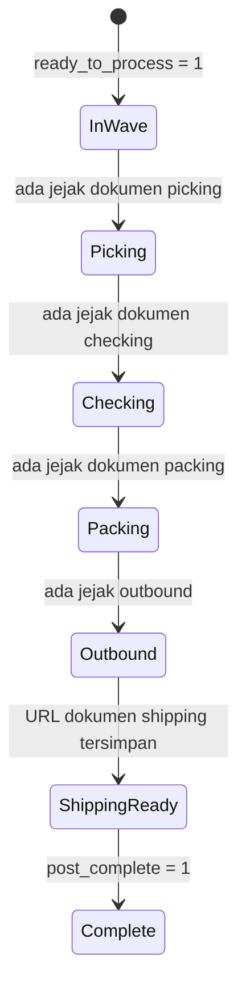
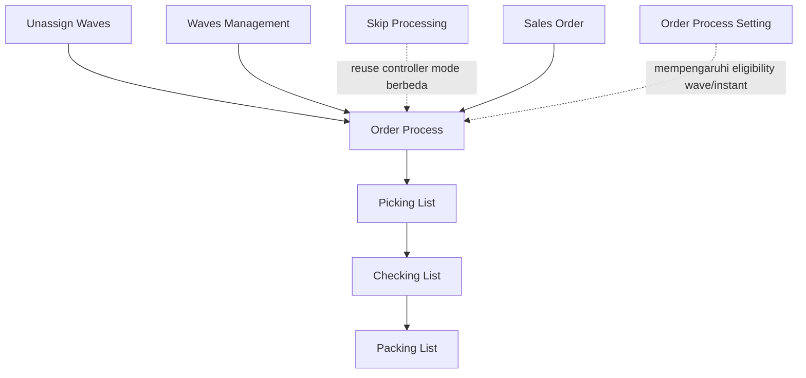

# Order Process — Source of Truth

## 1. Ringkasan Eksekutif

Order Process adalah dashboard monitoring dan aksi bulk untuk Sales Order yang statusnya sudah approved, mencakup order yang sudah maupun belum diproses gudang (processed dan unprocessed order dalam satu list). Operator memakai menu ini untuk generate picking list secara bulk di luar Waves Management, mencetak resi (Print AWB dari platform maupun format internal), memantau proses Get Resi, serta menelusuri log aktivitas bulk. Audience utama: tim Warehouse Operation dan Fulfillment.

Konfirmasi populasi (Yemima): order yang tampil di sini adalah gabungan dari order yang masih ada di Unassign Waves (belum send to default waves) dan order yang sudah masuk Default Waves — satu-satunya syarat minimum adalah order sudah approved. Order yang belum approved tidak akan muncul baik di Order Process maupun di Unassign Waves. Send to default waves bukan syarat untuk tampil di list ini, tapi tetap jadi syarat khusus untuk eligible di-generate lewat Bulk Generate Pick List (lihat Section 2 dan Section 6.1).


---

## 2. Prasyarat

| Prasyarat | Sumber | Catatan |
|---|---|---|
| Sales Order sudah berstatus approved | Sales Order | Satu-satunya syarat minimum untuk tampil di list ini — order boleh masih di Unassign Waves (belum send to default waves) maupun sudah masuk Default Waves |
| Order sudah masuk Default Waves (send to default waves) dan tercatat sebagai anggota sebuah wave | Unassign Waves, Waves Management | Bukan syarat untuk tampil di list, tapi wajib supaya order eligible di-generate lewat Bulk Generate Pick List — lihat Section 6.1 |
| Master Warehouse Structure aktif | Master Warehouse | Dipakai kolom Building dan proses picking |
| Warehouse Binding dan Shipping Service Binding lengkap | Warehouse Binding, Shipping Binding | Dipakai saat proses Get Resi dan penentuan shipper di kolom Shipper Service |
| Order Process Setting sudah dikonfigurasi (jalur wave, instant processing) | Application / General Setting | Menentukan apakah order lewat wave dan apakah order di-exclude dari Bulk Generate Pick List |

---

## 3. Siklus Status

Catatan adaptasi: kartu status di menu ini bukan representasi satu field status tunggal per order (bukan finite state machine yang eksklusif). Satu order bisa match lebih dari satu kartu sekaligus, karena tiap kartu mengecek keberadaan jejak dokumen di tahap tersebut, bukan field status tunggal yang berpindah. Diagram di bawah menggambarkan urutan konseptual pipeline gudang yang jadi dasar kartu filter.



| Kartu | Kondisi match | Overlap dengan kartu lain? | Yang berubah di UI saat kartu aktif |
|---|---|---|---|
| All | Populasi dasar menu (approved, belum post complete) | - (populasi dasar) | List menampilkan seluruh populasi menu, tanpa filter tahap |
| Picking | Sudah ada jejak dokumen di tahap picking | Ya, bisa overlap dengan Checking/Packing/Outbound/Shipping Ready kalau jejak tahap sebelumnya masih ada | List terfilter order yang sudah punya jejak picking |
| Checking | Sudah ada jejak dokumen di tahap checking | Ya | List terfilter order yang sudah punya jejak checking |
| Packing | Sudah ada jejak dokumen di tahap packing | Ya | List terfilter order yang sudah punya jejak packing |
| Outbound | Sudah ada jejak barang keluar gudang (outbound) untuk order tersebut | Ya | List terfilter order yang sudah outbound |
| Shipping Ready | Sudah punya URL dokumen shipping tersimpan | Ya | List terfilter order yang sudah punya dokumen resi |
| Complete | Tidak ada logic pencocokan — lihat GAP-OP-02 | Counter selalu 0, list selalu kosong | Tidak berfungsi, murni placeholder AS-IS |

Klik ulang kartu yang sedang aktif akan membersihkan filter, kembali ke kondisi default tanpa filter tahap.

---

## 4. Datalist

**Kolom visible default:**

| # | Kolom (baris 1 / baris 2) | Sumber data | Keterangan |
|---|---|---|---|
| 1 | TRX. CODE / PLATFORM ORDER | Kode SO dan platform order id | Kode SO (copy, link edit form SO tab baru) di atas; platform order id di bawah |
| 2 | Store Name / BUYER NAME | Nama store dan nama buyer | Dipotong 10 karakter, tooltip full text; buyer name di-mask kalau berasal dari data platform |
| 3 | Shipper Service / Tracking Number | Nama shipping service dan nomor tracking | Tracking punya tombol copy |
| 4 | Availability Product / Processing Status | Ketersediaan stok dan progress tiap tahap proses | Ikon warna (teal Available, oranye Partially Available, merah Unavailable) untuk stok; rangkaian ikon tahap wave sampai ship untuk progress |
| 5 | Process Duration / Total Duration | Durasi tiap tahap proses dan durasi total | Format XDays YHours ZMins; total duration dihitung dari mulai tahap pertama sampai selesai tahap terakhir atau sampai sekarang |
| 6 | Total Weight / Total Qty Dimensions | Berat dan dimensi produk | Weight dalam gram; dimensi diambil dari item volume terbesar |
| 7 | Building | Nama warehouse process | Tanda strip kalau warehouse process belum di-set |
| 8 | Buyer Notes / Buyer Address | Catatan order dan alamat buyer | Excerpt dengan tooltip full text |
| 9 | SO STATUS / PLATFORM ORDER STATUS | Status transaksi SO dan status order di platform | - |
| 10 | Action | Kelengkapan dokumen resi dan status outbound | Tombol Print AWB / Print Internal AWB, teks Not Authorized, atau info akses kedaluwarsa — detail eligibility di Section 6.2 |

Kolom lain (hidden default, bisa di-unhide lewat Columns Show/Hide, atau dipakai khusus untuk Advanced Filter): kode SO mentah, nama buyer platform mentah, nama shipper mentah, tracking mentah, **Picking List Reference** (link ke dokumen PL asal order, maksimal 2 tampil), Total SKU / Total Qty Products, alamat buyer mentah, dan platform order status mentah. Checkbox multi-select ada di kolom paling kiri untuk keperluan bulk action.

**Fitur datalist:**

| Fitur | Perilaku |
|---|---|
| Global Search | Pencarian across seluruh kolom yang termasuk Advanced Filter |
| Advanced Filter | Filter multi kondisi server-side; kolom Action tidak termasuk |
| Columns Show/Hide | Menampilkan atau menyembunyikan kolom hidden default di atas |
| Export | Basic saja — Active Page Only: hanya baris di halaman aktif dan kolom visible saat klik Export, teks yang terlihat di layar. Ikut filter kartu, Advanced Filter, search box, dan sort yang sedang aktif. Maksimal 100 baris per request. Header dua baris dipecah jadi dua kolom Excel. Belum ada fitur Export All |
| Kolom checkbox dan Action | Tidak ikut Export |
| Kolom Availability Product / Processing Status | Tidak ikut Export (masuk skip-list bawaan fitur Export) — known limitation, belum ada requirement eksplisit yang minta kolom ini ikut Excel |
| Bulk selection | Centang baris memunculkan floating bar Generate Pick List |
| Log Data (toolbar) | Ikon log di toolbar membuka slideover Bulk Action Log |

---

## 5. Form & Field

Order Process tidak punya halaman create/edit tersendiri — menu ini murni dashboard monitoring dan aksi bulk. Tidak ada form input entity baru di sini; interaksi yang mendekati "form" adalah slide panel aksi berikut:

| Slide panel / aksi | Input dari user | Catatan |
|---|---|---|
| Bulk Generate Pick List (floating bar) | Pilih baris via checkbox | Tidak ada field tambahan; sisa qty yang tidak tertampung mengikuti konfigurasi default sistem, tidak diinput user di sini |
| Broken Products (pill) | Tidak ada input, murni read-only | Slideover daftar produk defect terkait proses |
| Log Get Resi (pill) | Klik badge Success/Failed untuk filter; tombol Get AWB per baris (retry), atau bulk via floating bar | Retry hanya butuh referensi order, tidak ada field form tambahan |
| Log Data / Bulk Action Log (ikon toolbar) | Tidak ada input, murni read-only histori | - |

Field entity SO (buyer, produk, dan sebagainya) diedit lewat form Sales Order terpisah, diakses lewat link kode transaksi di kolom TRX. CODE.

---

## 6. How It Works

### 6.1 Generate Pick List — Bulk (Order Process) vs Single (Waves Management)

Order Process hanya menyediakan Bulk Generate Pick List, tidak ada tombol per baris. Alurnya:

1. Operator centang satu atau banyak order di datatable.
2. Floating bar muncul, klik Generate Pick List.
3. Sistem mengecek order tersebut tercatat sebagai anggota wave mana saja, lalu memproses per wave.
4. Order dengan flag instant processing menyala otomatis di-exclude dari proses generate.
5. Grouping yang dipakai selalu No Group / manual, berbeda dari rule Max Order/SKU/Weight yang dipakai jalur wave biasa.
6. Kalau seluruh order berhasil, sistem menampilkan pesan sukses. Kalau sebagian gagal, pesan menyebutkan jumlah yang berhasil dari total yang dipilih.

Contoh angka: operator centang 50 order untuk Generate Pick List. 3 di antaranya belum tercatat sebagai anggota wave manapun sehingga di-skip diam-diam (tidak dianggap error eksplisit per order). Hasil akhir: 47 dari 50 picking list berhasil digenerate, sistem menampilkan pesan partial "47 out of 50 picking lists successfully generated" dan tetap mencatat satu baris di Bulk Action Log.

Single-row Generate Pick List (by wave, ikut rule grouping wave) ada di menu Waves Management, bukan di Order Process — lihat Section 8.

### 6.2 Print Resi (AWB) — eligibility dan dua format

Print Resi (dan Get Resi) hanya berlaku untuk order dari platform, bukan order general — key parameter yang dipakai sistem adalah platform order id, bukan kode SO internal. Ini dikonfirmasi sebagai aturan bisnis yang memang disengaja, bukan gap.

Tombol Print Resi (kolom Action) tampil kalau tiga syarat berikut terpenuhi bersamaan lewat flag `can_print`: order adalah tipe platform, status keanggotaan wave-nya sudah processed, dan order tidak cancelled — ditambah syarat keempat di luar `can_print`, yaitu dokumen resi masih tersimpan (flag `has_outbound` bernilai false). Kalau salah satu tidak terpenuhi, kolom menampilkan teks Not Authorized, kecuali kasus khusus resi kedaluwarsa (URL pernah tersimpan tapi dokumennya sudah dihapus dari storage) yang menampilkan info tooltip akses kedaluwarsa.

**Soal syarat "tidak cancelled" di atas — GAP-OP-03 terkonfirmasi:** logic pengecekan ini membandingkan nilai platform order id dengan daftar kode status cancel, bukan membandingkan field status order platform itu sendiri. Ini beda dari aturan "hanya order platform" di paragraf pertama (yang memang benar dan disengaja, memakai platform order id sebagai key reference) — soal cancel check ini murni potensi salah field pengecekan, bukan soal platform-only rule. Kalau benar salah field, order cancelled berisiko tetap lolos syarat `can_print`.

Ada dua format cetak:

| Format | Isi | Aksi |
|---|---|---|
| Platform Resi | Dokumen resi asli dari API platform | Buka dokumen resi tersimpan |
| Internal Resi | Format resi platform yang bagian product list-nya di-trim, lalu ditempel data product list internal: kolom SKU Code (SKU internal/system product), Qty Order, dan Location (warehouse asli/rack terakhir sebelum barang keluar ke 3PL, bukan warehouse virtual) | Endpoint generate cetak internal terpisah |

Requirement bisnis menetapkan pembatasan tambahan: Print Resi tidak boleh diakses kalau order sudah masuk proses outbound ekspedisi, dan tidak boleh diakses untuk order dengan platform status Cancelled yang belum masuk default waves. Soal syarat outbound: dikonfirmasi Yemima bahwa begitu order sudah punya referensi/relasi outbound tercatat, order dianggap eligible masuk kondisi tersebut walau dokumen outbound-nya sendiri belum berstatus Approved — jadi flag `has_outbound` yang AS-IS berbasis keberadaan qty yang sudah diproses ke outbound (bukan status header) memang sudah sesuai maksud bisnis, lihat GAP-OP-07 (Resolved).

**Batas akses resi — terkonfirmasi tidak sesuai requirement historis:**
- Tidak ada aturan expire resi berbeda per platform berbasis hari (requirement historis minta TikTok 7 hari, Shopee sampai Delivered, Lazada tanpa batas). AS-IS hanya ada satu aturan cleanup file lokal yang seragam 7 hari untuk semua platform, dijalankan job harian yang menghapus file resi tersimpan (bukan menghapus catatan waktu simpannya) setelah 7 hari — lihat GAP-OP-04 (dikonfirmasi jadi gap nyata, bukan lagi asumsi).
- Tidak ada label hitung mundur "Expires in {N} days" di UI Order Process — lihat GAP-OP-05 (dikonfirmasi jadi gap nyata).
- Yang benar-benar ada dan berbasis platform adalah gate kapan sistem masih boleh **mengambil** (get) AWB dari platform, bukan gate berapa lama resi bisa **dicetak**: Shopee boleh sebelum status logistik masuk "pickup done", TikTok boleh sebelum "in transit", Lazada boleh sebelum "ready to ship pending". Detail pesan error di Section 7.3.

### 6.3 Get Resi — manual, otomatis, dan bulk

Get Resi (pengambilan nomor resi dari platform) bisa dipicu lewat tiga jalur: otomatis dari job/pipeline platform, manual retry per order di slideover Log Get Resi, atau bulk lewat floating bar di slideover yang sama maupun bulk action di datatable utama.

Aturan periode akses berdasarkan requirement historis, dibandingkan temuan AS-IS terbaru:

1. URL Get Resi yang sudah tersimpan di sistem berlaku maksimal 7 hari sejak tersimpan — **sesuai AS-IS**, lewat job cleanup harian yang seragam untuk semua platform (lihat Section 6.2).
2. Get Resi langsung dari platform hanya bisa dilakukan selama status platform belum melewati titik tertentu, keterbatasan API platform — **sesuai AS-IS**, tapi mekanismenya per platform berbasis status logistik/order (bukan berbasis hari), lihat Section 6.2 dan 7.3.
3. Requirement minta sistem melakukan Get Resi otomatis lebih dulu untuk menyimpan URL resi platform, khusus order yang sebelumnya sudah pernah di-Get Resi dan status belum berubah jadi dikirim. AS-IS memang ada mekanisme auto-download AWB lewat kombinasi job dan observer status, terutama terpicu saat order masuk Default Waves (setting default sistem), ditambah trigger tambahan per platform saat status tertentu berubah (Lazada dan TikTok). Mekanisme ini murni proses backend, tidak selalu persis mengikuti kondisi "sudah pernah di-Get Resi sebelumnya" seperti di requirement — lihat GAP-OP-06 (dikonfirmasi partial match, bukan lagi belum terverifikasi).
4. Requirement minta tombol cetak disertai keterangan hitung mundur "Expires in {N} days" — **dikonfirmasi tidak ada** di UI Order Process, lihat GAP-OP-05.
5. Setelah 7 hari, tombol cetak hilang dan sistem menampilkan tooltip akses kedaluwarsa (bukan teks persis "Resi Expired" seperti di requirement, tapi konsepnya sama: dokumen sudah tidak bisa diakses).

Contoh angka bulk Get AWB: operator bulk retry 150 order gagal dari slideover Log Get Resi, hasilnya 120 sukses dan 30 gagal. Badge di slideover menampilkan "120 Success" dan "30 Failed", dan masing-masing percobaan tercatat sebagai baris log baru (satu order bisa punya banyak baris log kalau di-retry berkali-kali, bukan satu baris per order).

### 6.4 Log Get Resi (monitoring)

Slideover ini berisi histori tiap percobaan Get Resi, bukan status order tunggal. Kolom utama: order (internal dan platform), status percobaan (Success/Failed/Pending), nomor resi kalau sukses, nama shipper, alasan gagal kalau failed, dan tombol Get AWB untuk retry baris yang gagal. Badge Success dan Failed di atas slideover menghitung jumlah percobaan, bukan jumlah unique order.

### 6.5 Log Data / Bulk Action Log

Tombol Log Data di toolbar membuka slideover Bulk Action Log — histori tiap job bulk (bukan per order), mencatat aksi Bulk Generate Pick List dan Bulk Get AWB. Setiap baris menampilkan jenis aksi, tanggal, status (Success/Partially Success/Failed), jumlah order yang dipilih, jumlah berhasil, jumlah gagal, dan user yang menjalankan. Log ini tidak mencatat aksi single-row seperti retry per baris, print resi, atau single generate di Waves Management.

---

## 7. Validasi

### 7.1 Bulk Generate Pick List

| # | Kondisi | Behavior / pesan |
|---|---|---|
| V1 | Tidak ada order terpilih | Hasil "0 out of 0 picking lists successfully generated" |
| V2 | Order belum tercatat sebagai anggota wave manapun | Di-skip diam-diam, ikut berkontribusi ke partial fail |
| V3 | Order berflag instant processing | Di-exclude dari proses generate untuk wave itu |
| V4 | Order tersebar di beberapa wave | Diproses per wave (grouping berdasarkan keanggotaan wave) |
| V5 | Proses create pick transfer gagal di service | Order tidak masuk hitungan sukses, pesan servis "Failed to generate picklist" |
| V6 | Seluruh order sukses | "Picking list has been successfully generated." |
| V7 | Sebagian atau seluruh gagal | "{success_count} out of {selected_count} picking lists successfully generated." |

### 7.2 Print Resi

| # | Kondisi | Behavior |
|---|---|---|
| V8 | Dokumen resi belum ada dan URL belum pernah tersimpan, atau flag `can_print` bernilai false, atau flag `has_outbound` bernilai true | Teks Not Authorized |
| V9 | URL resi pernah tersimpan tapi dokumen sudah dihapus job cleanup (lewat 7 hari) | Info tooltip akses kedaluwarsa platform |
| V10 | Keempat syarat terpenuhi (tipe platform, status wave processed, tidak cancelled — lihat GAP-OP-03, dan belum outbound) | Tombol Print AWB dan Print Internal AWB tampil |

### 7.3 Get AWB (manual dan bulk)

| # | Kondisi | Pesan |
|---|---|---|
| V11 | Order tipe General | Unable to get AWB for general sales order |
| V12 | Order cancelled | Unable to get AWB, {code} is cancelled |
| V13 | Platform Tokopedia | Unable to get AWB, Tokopedia is not supported |
| V14 | Order sudah punya AWB | already has AWB details |
| V15 | Shopee sudah lewat status logistik "pickup done" | AWB can only be obtained before {code} |
| V16 | TikTok sudah lewat status "in transit" | AWB can only be obtained before {code} |
| V17 | Lazada sudah lewat status "ready to ship pending" | AWB can only be obtained before {code} |
| V18 | Store tidak bisa push data ke platform | Unable to get AWB for {store} |
| V19 | Bulk partial | "{n} AWBs successfully retrieved, {m} failed" |

---

## 8. Relasi Menu Lain



| Menu | Peran dalam relasi |
|---|---|
| Unassign Waves | Hulu, memasukkan order approved ke Default Waves |
| Waves Management | Hulu, distribusi wave dan single Generate Pick List by wave |
| Picking / Checking / Packing List | Hilir, dokumen yang dihasilkan atau dilanjutkan setelah generate |
| Skip Processing | Menu saudara, reuse controller yang sama dengan mode berbeda (skip, bukan generate PL) |
| Sales Order | Sumber data order, link edit dari kolom TRX. CODE |
| Order Process Setting (Application/General Setting) | Prasyarat, menentukan apakah order lewat wave dan apakah ikut Bulk Generate Pick List |

---

## 9. Gap Registry

Kosakata status dibakukan: **Resolved** (sudah sesuai ekspektasi bisnis) | **Open** (belum ditangani) | **In Progress** (sedang dikerjakan, wajib ada referensi ticket) | **Won't Fix** | **Deferred**. Severity: **High** (menyentuh correctness/keamanan data), **Medium** (fungsional tapi bukan correctness inti), **Low** (UX/observability).

| ID | Deskripsi | Dampak | Severity | Evidence | Status |
|---|---|---|---|---|---|
| GAP-OP-01 | Requirement mentah menyatakan populasi list mencakup order yang belum send to default waves, sementara analisa codebase awal mendeskripsikan populasi ini sebagai order yang sudah masuk jalur wave. Dikonfirmasi Yemima dan selaras dengan AS-IS: populasi list memang gabungan keduanya | Tidak ada dampak negatif — requirement mentah terkonfirmasi benar | - | Proses approve langsung men-set flag `ready_to_process` bernilai 1 (bukan menunggu order masuk wave); base filter list Order Process memakai `ready_to_process` bernilai 1 dan `post_complete` bernilai 0 — bukan filter status approve secara langsung | Resolved |
| GAP-OP-02 | Kartu Complete tidak fetch data count (hardcoded 0) dan query list-nya tidak punya logic pencocokan — selalu mengembalikan hasil kosong | Operator tidak bisa memakai kartu ini untuk melihat order completed sungguhan; kartu tampil di UI tapi menyesatkan karena kelihatan seperti fitur aktif | Medium | Counter kartu Complete tidak memanggil data count apapun; query list untuk kartu ini tidak punya kondisi pencocokan sama sekali | Open — perlu keputusan product: implement logic Complete, sembunyikan kartu, atau defer |
| GAP-OP-03 | Logic `can_print` untuk syarat "tidak cancelled" membandingkan nilai platform order id dengan daftar kode status cancel (`CANCELLED`, `IN_CANCEL`, `canceled`), bukan membandingkan field status order platform. Ini soal field pengecekan yang salah, terpisah dari aturan "Print Resi hanya untuk order platform" yang memang benar disengaja | Cancel check ini secara praktis nyaris tidak pernah match (ID order dibandingkan dengan kode status, dua jenis data berbeda), sehingga order cancelled berisiko tetap mendapat `can_print` bernilai true — bertentangan dengan requirement bisnis yang eksplisit melarang print resi untuk order cancelled | High | Kode pengecekan membandingkan field id order platform terhadap daftar string kode cancel, bukan field status order platform | Open |
| GAP-OP-04 | Requirement historis (21 Juli 2025) minta batas **lama akses cetak resi** berbeda per platform berbasis hari (TikTok 7 hari, Shopee sampai Delivered, Lazada tanpa batas). AS-IS hanya ada satu aturan cleanup file lokal yang seragam 7 hari untuk semua platform. Catatan penting: ini beda lapisan dengan gate status per platform yang menentukan kapan AWB masih boleh **di-get** dari platform (lihat Section 7.3) — gate itu sudah ada dan berbasis status, tapi bukan pengganti aturan lama akses cetak resi per platform | Operator berekspektasi resi Lazada bisa dicetak tanpa batas waktu, padahal AS-IS tetap kena cleanup 7 hari seperti platform lain. Stakeholder berisiko salah simpul bahwa gate get AWB per platform sudah memenuhi requirement ini, padahal dua hal berbeda | Medium | Job cleanup file resi lokal berjalan harian, seragam 7 hari untuk seluruh platform, terpisah total dari logic gate status get AWB per platform | Open — satu tema "AWB access window" bersama GAP-OP-05 |
| GAP-OP-05 | Label dinamis "Expires in {N} days" yang diminta requirement tidak ditemukan di UI Order Process manapun | Operator tidak dapat estimasi visual sisa waktu akses resi, hanya tahu lewat tooltip setelah resi sudah kedaluwarsa. Ini gap UX/requirement, bukan bug logic — sistem cleanup di baliknya tetap berjalan sesuai aturan 7 hari | Low | Pencarian di komponen frontend Order Process/Processing tidak menemukan teks countdown tersebut; yang ada hanya tooltip setelah file sudah terhapus | Open — satu tema "AWB access window" bersama GAP-OP-04 |
| GAP-OP-06 | Requirement minta sistem auto Get Resi untuk menyimpan URL resi platform sebelum status order berubah jadi dikirim, khusus order yang sebelumnya sudah pernah di-Get Resi. AS-IS ada mekanisme auto-download AWB (job dan observer status), tapi trigger utamanya adalah saat order masuk Default Waves plus beberapa trigger tambahan per platform (Lazada, TikTok) — bukan persis kondisi "sudah pernah di-Get Resi sebelumnya" seperti di requirement | Kalau order tidak match kombinasi trigger AS-IS yang ada, auto-save URL resi bisa tidak terjadi sebelum status berubah jadi dikirim. Acceptance criteria supaya bisa naik status ke Resolved: sistem menyimpan ulang URL resi otomatis untuk order yang sebelumnya sudah pernah di-Get Resi, dipicu sebelum status berubah jadi dikirim, tidak hanya bergantung pada trigger masuk Default Waves | Medium | Job auto-download AWB AS-IS abort kalau timestamp simpan resi sudah terisi, dan trigger tambahan per platform hanya jalan untuk kombinasi platform/status tertentu | Open — dipindah dari "In Progress" karena belum ada referensi ticket pengerjaan |
| GAP-OP-07 | Dikonfirmasi Yemima: begitu order sudah punya referensi/relasi outbound tercatat, order dianggap sudah masuk kondisi outbound walau dokumen outbound-nya sendiri belum berstatus Approved. Flag `has_outbound` yang AS-IS berbasis keberadaan qty yang sudah diproses ke outbound (bukan status header Approved) sudah sesuai maksud bisnis ini | Tidak ada dampak negatif — AS-IS dan ekspektasi bisnis sudah selaras | - | Keputusan bisnis eksplisit dari Yemima, tidak perlu bukti kode tambahan | Resolved |
| GAP-OP-08 | Bulk Generate Pick List meng-skip diam-diam order yang belum tercatat di wave manapun, tanpa menyebutkan order mana saja yang gagal secara per baris — operator hanya melihat angka agregat sukses/gagal di pesan partial dan Bulk Action Log | Operator sulit menelusuri order spesifik mana yang gagal tanpa cross-check manual satu per satu, terutama di batch besar | Low | Pesan partial hanya berupa hitungan "X out of Y", tidak ada daftar ID order yang gagal di response maupun di Bulk Action Log | Open |
| GAP-OP-09 | Endpoint Print Internal AWB mengecek field timestamp kedaluwarsa resi dari lokasi data yang berbeda dengan yang dipakai kolom Action utama (yang langsung membuka dokumen tersimpan) untuk menentukan eligibility | Operator berpotensi mendapat pesan error berbeda antara Print AWB biasa dan Print Internal AWB untuk kondisi resi yang sebenarnya sama | Medium | Field timestamp yang dicek endpoint print internal berada di data header order, sementara data yang dipakai kolom Action utama berada di data informasi tambahan order — dua sumber berbeda untuk konsep yang sama | Open |
| GAP-OP-10 | Perhitungan badge Success/Failed di slideover Log Get Resi berpotensi menghitung seluruh baris log tanpa scope company | Kalau environment berbagi satu database untuk banyak company (multi-tenant), operator company A berisiko melihat angka yang sebenarnya tercampur dengan aktivitas company lain | High (kontingen pada arsitektur) | Query hitung badge Success/Failed tidak terlihat membatasi berdasarkan company secara eksplisit — perlu konfirmasi apakah environment ini benar-benar multi-tenant satu database [VERIFY: CODEBASE] | Open |

---

## 10. FAQ

**Q: Kenapa order saya yang sudah approved tidak muncul di Order Process?**
A: Order approved seharusnya tetap muncul di sini terlepas dari sudah atau belum send to default waves. Kalau tidak muncul, cek dulu apakah order sudah dianggap post complete (otomatis keluar dari populasi menu ini), atau ada masalah data lain di luar status approve.

**Q: Kenapa tombol Print Resi berubah jadi Not Authorized?**
A: Order bukan tipe platform (Print Resi memang khusus order platform), belum ada dokumen resi tersimpan, status keanggotaan wave-nya belum processed, order terdeteksi cancelled, atau order sudah masuk proses outbound.

**Q: Generate Pick List saya cuma sebagian berhasil, kenapa?**
A: Order yang belum tercatat di wave manapun otomatis di-skip tanpa pesan error per baris — sistem cuma kasih angka agregat sukses/gagal. Cek Bulk Action Log untuk jumlah sukses dan gagal dari batch tersebut; untuk tahu order mana persisnya yang gagal, saat ini harus cross-check manual — lihat GAP-OP-08.

**Q: Bedanya Print AWB dan Print Internal AWB apa?**
A: Print AWB membuka dokumen resi asli dari platform. Print Internal AWB adalah format resi yang sama tapi bagian daftar produknya diganti dengan data SKU internal dan lokasi rack asli barang.

**Q: Bedanya Log Data dan Log Get Resi apa?**
A: Log Data mencatat histori job bulk (Generate Pick List dan Get AWB, per batch). Log Get Resi mencatat histori tiap percobaan Get Resi per order, termasuk yang gagal dan bisa di-retry satu per satu.

**Q: Kenapa kartu Complete selalu menunjukkan angka 0?**
A: Kartu ini belum diimplementasikan penuh secara AS-IS, murni placeholder — lihat GAP-OP-02.

**Q: Kenapa hasil Export saya cuma sedikit data, padahal filter saya banyak?**
A: Export di menu ini hanya mengambil data di halaman aktif datatable (maksimal 100 baris), bukan seluruh hasil filter. Naikkan page length atau export per halaman kalau butuh data lebih banyak.

**Q: Resi Lazada saya kok tetap kedaluwarsa padahal katanya Lazada tidak ada batas waktu?**
A: Aturan tanpa batas waktu itu belum berjalan di sistem — saat ini semua platform (termasuk Lazada) tetap kena pembersihan file resi otomatis setelah 7 hari. Lihat GAP-OP-04.

---

## 11. Changelog

| Tanggal | Versi | Perubahan |
|---|---|---|
| 2026-07-19 | 1.0 | Draft awal dari requirement mentah Yemima (fungsi dashboard, filter kartu, export basic) digabung dengan analisa codebase AS-IS dan histori requirement Print Resi/Get Resi periode 2025 sampai April 2026 |
| 2026-07-19 | 1.1 | Update setelah klarifikasi Yemima (GAP-OP-01 resolved ke Section 1/2, GAP-OP-07 resolved) dan update analisa codebase Section 5.7 (GAP-OP-03/04/05/06 dikonfirmasi dengan bukti kode, bukan lagi asumsi) |
| 2026-07-19 | 1.2 | Update setelah review Cursor: Gap Registry ditambah kolom Severity dan Evidence, status distandarkan (In Progress dilepas tanpa referensi ticket), GAP-OP-04/05 dipisah jelas jadi satu tema, tambah GAP-OP-08/09/10 (silent skip bulk generate, inkonsistensi cek expire AWB internal, potensi company scope Log Get Resi), selaraskan KB troubleshooting dengan GAP-OP-01 |

---

## 12. Knowledge Base Hints (untuk operator)

**Istilah teknis ke padanan awam:**

| Istilah teknis | Padanan awam untuk KB |
|---|---|
| `ready_to_process` | Order sudah siap diproses gudang — otomatis aktif begitu order approved |
| `post_complete` | Order sudah dianggap selesai seluruh pipeline |
| Keanggotaan wave | Catatan bahwa sebuah order sudah masuk kelompok wave tertentu |
| `can_print` | Syarat sistem mengizinkan tombol Print Resi tampil |
| `has_outbound` | Penanda barang sudah tercatat keluar gudang |
| Log Get Resi | Catatan tiap percobaan ambil nomor resi |
| Bulk Action Log | Catatan tiap job bulk yang dijalankan operator |
| Instant processing | Order yang jalur prosesnya melewati wave normal |

**Skenario troubleshooting (bahasa awam):**

| Gejala | Penyebab umum | Solusi |
|---|---|---|
| Order tidak muncul di list | Order belum approved (flag siap proses baru aktif setelah approve), atau order sudah dianggap post complete (selesai pipeline) — bukan soal sudah/belum send to default waves | Cek status approve order di Sales Order, dan cek apakah order sudah dianggap post complete |
| Tombol Print Resi hilang | Belum ada resi, order cancelled, atau sudah outbound | Cek status order dan proses Get Resi dulu |
| Sebagian Generate Pick List gagal | Sebagian order belum masuk wave manapun | Cek Bulk Action Log, pastikan order sudah didistribusi ke wave |
| Resi gagal diambil | Masalah koneksi ke platform atau order sudah dalam status tertentu (cancelled, sudah delivered) | Cek Log Get Resi untuk alasan gagal, retry lewat tombol Get AWB |
| Export cuma dapat sedikit data | Export hanya ambil halaman aktif | Perbesar jumlah baris per halaman sebelum export |

**Field yang tidak relevan operator:** referensi kelas routing internal, path file dokumen resi mentah, id internal keanggotaan wave, dan kolom raw duplikat yang hanya dipakai untuk Advanced Filter (kode mentah, buyer name platform mentah, tracking mentah, dan sejenisnya).

---

## 13. Technical Hints (untuk developer)

**Area codebase yang perlu didokumentasikan:**
- Controller dan query count/list per kartu status (index dan filter per status)
- Controller dan service bulk generate picklist by SO (beda jalur dari bulk by wave)
- Model relasi keanggotaan wave (WaveDetailSO) dan flag instant processing
- Service Get Resi (manual, auto job/pipeline, bulk) dan model log percobaan (GetResiLog)
- Model log aktivitas bulk (OrderProcessActionLog)
- Service generate print resi internal (trim dan splice product list platform dengan data internal)
- Komponen frontend untuk kartu status, datatable utama, dan tiga slideover (Broken Products, Log Get Resi, Bulk Action Log)
- Logic eligibility tombol Print Resi (`can_print`, `has_outbound`, path dan timestamp dokumen resi) — termasuk perbaikan field pengecekan status cancel di GAP-OP-03
- Job cleanup harian yang menghapus file resi setelah 7 hari, dan job download AWB yang dipicu config auto-ship serta observer perubahan status per platform
- Gate status per platform (Shopee/TikTok/Lazada) yang menentukan batas kapan AWB masih boleh di-get dari platform
- Penyelarasan sumber data timestamp kedaluwarsa resi antara endpoint Print Internal AWB dan kolom Action utama (GAP-OP-09)
- Verifikasi scope company pada perhitungan badge Success/Failed di Log Get Resi (GAP-OP-10)

**Invariants:**
- Satu job bulk hanya boleh menghasilkan satu baris di Bulk Action Log, bukan satu baris per order.
- Setiap percobaan Get Resi selalu tercatat sebagai baris baru, tidak menimpa baris sebelumnya untuk order yang sama.
- Order berflag instant processing tidak boleh ikut diproses lewat Bulk Generate Pick List di Order Process.
- Tombol Print Resi tidak boleh tampil kalau order sudah berflag `has_outbound` bernilai true, terlepas dari status resi lainnya.

**Failure modes:**
- Kegagalan generate picklist untuk satu order dalam batch bulk tidak boleh menghentikan proses order lain di batch yang sama; hasil akhir dilaporkan sebagai partial success.
- Kegagalan Get AWB untuk satu order dalam bulk retry harus tetap tercatat sebagai log gagal dan tidak menghentikan proses order lain dalam batch yang sama.
- Job download AWB otomatis AS-IS langsung abort kalau timestamp simpan resi sudah terisi (dianggap sudah punya file), jadi tidak retry ulang otomatis kalau file sempat terhapus job cleanup — perlu dipastikan apakah ini behavior yang diinginkan atau perlu mekanisme re-fetch [VERIFY: CODEBASE].

**Data lifecycle lintas dokumen:**
- Status keanggotaan wave sebuah order (dari Waves Management) menentukan apakah order eligible di-generate lewat Bulk Generate Pick List di Order Process.
- URL dan dokumen resi yang tersimpan dari proses Get Resi dipakai lintas kolom Action, kartu Shipping Ready, dan slideover Log Get Resi.
- Perubahan qty yang sudah diproses ke outbound di level detail order memengaruhi flag `has_outbound` yang dipakai gate Print Resi dan kartu Outbound.

---

## 14. Referensi Struktur untuk Cursor

```
Section 1-11 → material utama untuk requirement.md
Section 5, 6, 7, 10 → adaptasi ke knowledge-base.md dengan tone awam (lihat Section 12 KB Hints)
Section 13 Technical Hints → seed untuk technical.md, dilengkapi Cursor dari codebase
Frontmatter YAML di atas → copy ke 3 file utama, sinkronkan version + last_updated
Golden reference tone & struktur: docs/qa-docs/accounting-supplier-invoice/
```
