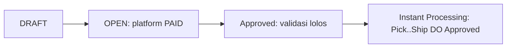
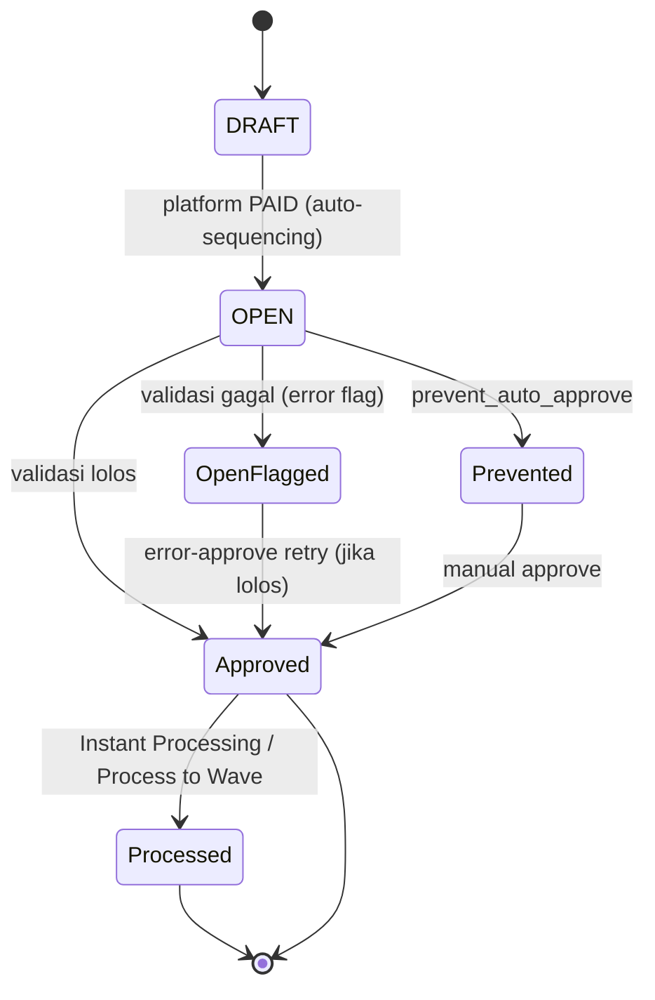
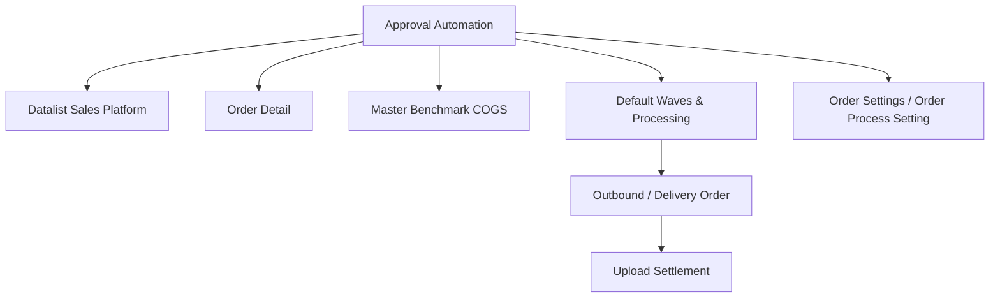

# Sales Platform — Approval Automation — Source of Truth

> Scope: engine yang menggerakkan status order dari DRAFT ke OPEN ke Approved dan otomatisasi proses setelahnya (Instant Processing), termasuk validasi harga (Benchmark COGS) dan proporsi bundle. Field detail order dan kolom terkait ada di SOT order detail. Ingestion/sync ada di SOT sync engine.

## 1. Ringkasan Eksekutif

Volume order platform tinggi (standar harian sekitar 15.000 order), sehingga order tidak di-approve satu per satu. Prinsipnya semua order diterima; ketiadaan stok bukan alasan menolak, melainkan jadi perhatian Ops. Approval automation menangani sequencing status (DRAFT ke OPEN ke Approved) dan, bila diaktifkan, memproses order sampai Delivery Order Approved lewat Instant Processing agar siap Upload Settlement. Validasi harga memastikan order dengan harga di bawah patokan COGS tidak lolos otomatis. Audience: Ops, Finance, dev.



> Catatan AS-IS versus intended: codebase saat ini sedang dikustomisasi sementara untuk kebutuhan end user dan akan diubah. File ini menulis behavior codebase saat ini sebagai AS-IS, dan model intended (interval per menit, anti-overlap ambil sisa order) sebagai arah/gap — lihat GAP-APR-01.

## 2. Prasyarat

| Prerequisite | Sumber | Catatan |
|---|---|---|
| Order status OPEN | Sequencing dari DRAFT (platform PAID) | Kandidat auto-approve |
| Binding produk ke System Product | Master System Product | Wajib agar validasi harga dan COGS jalan |
| Master Benchmark COGS terisi | Menu Benchmark COGS | Sumber snapshot COGS |
| Config toggle | Order Settings dan Order Process Setting | Set Auto Approve, Auto Approve, Process to Wave, Instant Processing |

## 3. Siklus Status (sequencing & outcome validasi)



Auto-approve bukan hanya proses approval, tapi juga auto-sequencing: DRAFT ke OPEN lalu OPEN ke Approved. Jika DRAFT ke OPEN belum eligible (platform belum PAID), order tetap stuck di DRAFT.

## 4. Jalur Command & Kandidat

Approval automation tidak punya datalist sendiri; hasilnya terlihat di datalist Sales Platform. Ada dua jalur command yang jangan dicampur:

| Command | Kandidat | Tujuan |
|---|---|---|
| Auto-approve normal | OPEN, tanpa detail error flag, `prevent_auto_approve = 0` | Approve otomatis |
| Error-approve (retry) | OPEN, dengan detail error flag, `prevent_auto_approve = 0` | Retry approve SO yang sebelumnya gagal validasi |

Keduanya menghargai `prevent_auto_approve = 0`. AS-IS: command auto-approve berjalan lewat cron harian pukul 19:00 WIB; delay dari config diperlakukan sebagai delay per-SO, dan praktis hampir selalu lewat karena cron harian.

## 5. Form & Field (config)

| Field | Lokasi | AS-IS behavior |
|---|---|---|
| Set Auto Approve All Sales Order (menit) | Omni Order Settings | Nilai delay; **AS-IS di-ignore** — semua SO auto-approve harian 19:00. Intended: interval schedule job. `[VERIFY: CODEBASE]` |
| Auto Approve (toggle) | Order Process Setting | **AS-IS tidak dicek** cron; OFF hanya memunculkan banner warning di Sales Platform |
| Process to Wave (toggle) | Order Process Setting | Setelah approve, order lanjut ke wave |
| Instant Processing (toggle) | Order Process Setting | Setelah approve dan masuk default wave, auto-generate dan auto-approve dokumen processing |

## 6. How It Works

### 6a. Auto-approve (AS-IS)

Scheduler harian pukul 19:00 WIB menjalankan command auto-approve, memfilter kandidat SO, lalu dispatch job approve per batch. Approve dijalankan dengan validasi **tanpa cek stok** (stok tidak divalidasi saat auto-approve). Deskripsi approve: "Auto approve by system". Setelah approve, job pengecekan flag berjalan async (termasuk evaluasi stock flag setelah approve).

### 6b. Validasi saat approve

Filter kandidat sebelum job (semua harus terpenuhi): `transaction_date` lebih dari sekarang kurang 20 hari; status OPEN; bukan cancel platform/booking; `transaction_reference_id` NULL (bukan turunan/copy); `prevent_auto_approve = 0`; tidak punya detail error flag.

Validasi di dalam approve (gagal berarti error flag di-set, SO tetap OPEN, masuk pill Failed Process):

| Area | Yang dicek |
|---|---|
| Header | Bukan cancelled platform; bukan Draft/Closed/Void; belum Approved; tidak sedang import/approve lain |
| Detail | Punya detail normal dan/atau random |
| Platform | Status cancel sync; shipping service ada dan ter-bind; berat/dimensi versus kurir |
| Warehouse | Warehouse process store harus ada (jika tidak: `warehouse-error`) |
| Per line | Bind ke system product; product/bundle aktif; primary unit ada; COA lengkap; bundle children lengkap; `each_price` tidak null |

### 6c. Kondisi auto-approve tidak jalan

Order tidak ter-auto-approve bila: `prevent_auto_approve = 1`; ada detail error flag (jalur error-approve terpisah); status bukan OPEN; dibatalkan di platform; `transaction_reference_id` terisi; `transaction_date` di luar window 20 hari; delay belum lewat; sudah ada transfer dari detail SO; validasi approve gagal; job/batch lock; batch dibatalkan.

### 6d. `prevent_auto_approve` — pemicu

| Trigger | Efek |
|---|---|
| Price Before VAT lebih kecil dari Benchmark COGS (snapshot) | `prevent_auto_approve = 1` |
| Random detail = bundle product | Force prevent |
| User ganti product di SO detail | `prevent_auto_approve = 1` |
| SO copy / create turunan | `prevent_auto_approve = 1` |
| Unapprove | Set `prevent_auto_approve = true` |

### 6e. Benchmark COGS (snapshot) dan validasi harga

Validasi HPP membandingkan **Price Before VAT** versus **Benchmark COGS** yang sudah di-capture (bukan lagi Sales Price versus MA30/Last Buy). Jika Price Before VAT lebih kecil dari Benchmark COGS, order tidak bisa auto-approve (perlu manual). Logic ini hanya jalan jika produk sudah bind; jika belum, Benchmark COGS 0/NULL dan validasi di-skip. Untuk bundle/random, nilai diambil dari Parent SKU. Nilai Benchmark COGS di-capture saat order dibuat/binding dan tidak berubah meski master berubah.

### 6f. Proporsi bundle berbasis Price Before VAT

Proporsi harga item dalam bundle memakai basis Price Before VAT (bukan Retail gross). Langkah: ambil Retail Price tiap item, konversi ke Price Before VAT (include: retail dibagi 1 tambah tax rate; exclude/no tax: retail apa adanya), hitung proporsi tiap item terhadap total Price Before VAT, distribusikan Bundle Price sesuai proporsi. Untuk item Coefficient Tax (tax include 12% efektif 11%): Price Before VAT = price dibagi 1,11; DPP = nilai PPN dibagi 12 persen; VAT = selisih Total Price dan Price Before VAT.

Contoh ringkas (Bundle Price 49.999, dua item): setelah konversi Price Before VAT, item A proporsi 81,83 persen dan item B 18,17 persen, sehingga alokasi 40.916 dan 9.083. Detail simulasi lengkap termasuk case Exclude VAT (yang membuat total melebihi Bundle Price) ada di spreadsheet logic mapping. Nilai bundle untuk SO platform di-capture saat order terbentuk/binding.

### 6g. Instant Processing

Jika toggle Instant Processing aktif, order (General dan Platform) yang Approved dan berada di Default Waves otomatis di-generate dan auto-approve dokumen processing end-to-end: Picking, Checking, Packing, Collect (Transfer Collected), sampai Ship/Delivery Order Approved. Tujuannya agar SO langsung memenuhi syarat Upload Settlement (yang butuh status Delivery Order Approved/Shipped). Function Skip Processing tercakup namun di card terpisah.

`[VERIFY: CODEBASE]`: relasi Instant Processing dengan outbound yang detached setelah Packed Approved, dan kapan referensi Outbound Approved terbentuk (dasar bucket Complete di datalist).

## 7. Validasi

| # | Kondisi | Behavior | Message |
|---|---|---|---|
| V1 | Auto-approve dijalankan | Stok tidak divalidasi | — |
| V2 | Validasi approve gagal (shipping/WH/bind/COA/price/bundle) | Error flag di-set, SO tetap OPEN, masuk Failed Process | — |
| V3 | Price Before VAT lebih kecil dari Benchmark COGS | `prevent_auto_approve = 1`, tidak auto-approve, perlu manual | — |
| V4 | Produk belum bind | Validasi COGS di-skip, Benchmark COGS 0/NULL | — |
| V5 | Order turunan/copy (`transaction_reference_id` terisi) | Tidak masuk kandidat auto-approve | — |
| V6 | Toggle Auto Approve OFF | AS-IS cron tetap jalan; hanya banner warning | — |
| V7 | Master Benchmark COGS berubah setelah order terbentuk | Nilai snapshot di detail tidak berubah | — |
| V8 | Instant Processing aktif, order Approved di Default Waves | Auto-generate dan auto-approve sampai Delivery Order Approved | — |

## 8. Relasi Menu Lain



| Menu | Peran dalam relasi |
|---|---|
| Datalist Sales Platform | Menampilkan hasil approve, error flag, bucket |
| Order Detail | Sumber Price Before VAT, Benchmark COGS, bundle |
| Master Benchmark COGS | Sumber snapshot patokan COGS |
| Default Waves & Processing | Konsumen order Approved; digerakkan Instant Processing |
| Outbound / Delivery Order | Hasil akhir Instant Processing; input Upload Settlement |
| Order Settings / Order Process Setting | Config yang menyetir approval dan otomatisasi |

## 9. Gap Registry

| ID | Deskripsi | Dampak | Status |
|---|---|---|---|
| GAP-APR-01 | Config auto-approve tidak sesuai perilaku intended: setting delay (menit) di Omni Order Settings di-ignore dan toggle Auto Approve tidak dicek; codebase AS-IS berjalan cron harian 19:00. Intended: menit sebagai interval schedule, plus sequencing DRAFT ke OPEN ke Approved dan anti-overlap yang hanya memproses order belum kepegang job sebelumnya | Perilaku sistem tidak sesuai ekspektasi config; KB/technical berisiko menyesatkan bila ditulis sesuai label config | Open (codebase sedang dikustomisasi, akan diubah) |

Item lain yang masih `[VERIFY: CODEBASE]`: mekanisme trigger auto-approve final (setelah kustomisasi selesai), relasi Instant Processing versus outbound detached dan pembentukan referensi Outbound Approved, serta apakah manual approve booking dengan `total_amount = 0` menimbulkan jurnal pendapatan 0 (lihat SOT booking).

## 10. FAQ

**Kenapa order tetap masuk walau stok kosong?**
Prinsipnya semua order diterima; stok kosong jadi perhatian Ops, bukan alasan menolak. Auto-approve memang tidak cek stok.

**Order-ku tidak ter-approve otomatis, kenapa?**
Bisa karena harga di bawah patokan COGS, produk diedit manual, order turunan/copy, ada error flag, atau di luar window 20 hari. Cek pill Failed Process bila ada error flag.

**Apa itu Instant Processing?**
Fitur yang otomatis memproses order dari picking sampai Delivery Order Approved tanpa approve manual per tahap, supaya siap Upload Settlement.

**Aku matikan toggle Auto Approve tapi order tetap ke-approve, kenapa?**
Saat ini (AS-IS) cron harian tetap jalan; toggle OFF hanya memunculkan banner warning. Ini tercatat sebagai gap (GAP-APR-01).

## 11. Changelog

| Tanggal | Versi | Perubahan |
|---|---|---|
| 2026-07-15 | 1.0 | Draft awal — approval automation |

## 12. Knowledge Base Hints (untuk operator)

Istilah teknis ke padanan awam:

| Istilah teknis | Padanan awam untuk KB |
|---|---|
| Auto-approve | Order disetujui otomatis oleh sistem |
| Sequencing status | Order pindah tahap status otomatis |
| prevent_auto_approve | Tanda order harus disetujui manual |
| Benchmark COGS | Patokan harga pokok untuk cek kewajaran harga |
| Price Before VAT | Harga sebelum pajak |
| Instant Processing | Proses gudang otomatis sampai siap kirim |
| Error-approve | Coba setujui ulang order yang tadinya gagal |

Skenario troubleshooting:
- Order nyangkut di OPEN: cek error flag (Failed Process) atau apakah harga di bawah patokan COGS.
- Order harus manual approve terus: cek apakah SKU/qty pernah diedit atau order hasil copy.
- Order tidak lanjut proses otomatis: cek toggle Process to Wave dan Instant Processing.

Field yang tidak relevan untuk operator (skip di KB): flag internal `prevent_auto_approve`, detail command/cron, `transaction_reference_id`.

## 13. Technical Hints (untuk developer)

Area codebase (nama umum): scheduler dan command auto-approve, command error-approve, job auto-approve batch, controller/logic approval dan validasi, setter flag `prevent_auto_approve`, logic snapshot Benchmark COGS dan Price Before VAT, kalkulasi proporsi bundle dan coefficient tax, function Instant Processing.

Invariants (kandidat assertion test):
- Auto-approve menjalankan validasi tanpa cek stok.
- `prevent_auto_approve = 1` jika Price Before VAT lebih kecil dari Benchmark COGS (snapshot), random bundle, user ganti product, SO copy, atau unapprove.
- Kandidat auto-approve: OPEN, tanpa error flag, `prevent_auto_approve = 0`, `transaction_reference_id` NULL, dalam window 20 hari.
- Benchmark COGS dan nilai bundle di-capture (statis) setelah binding/order terbentuk.
- Instant Processing meng-generate dan meng-approve dokumen sampai Delivery Order Approved.
- Sequencing: DRAFT ke OPEN butuh platform PAID; stuck di DRAFT bila belum eligible.

Failure modes:
- Validasi approve gagal: error flag di-set, SO tetap OPEN, masuk Failed Process; jalur error-approve untuk retry.
- Job/batch lock atau batch dibatalkan: job no-op, hindari double approve.
- Instant Processing gagal di tengah: pastikan tidak setengah jadi tanpa penanda.
- Drift config versus behavior (GAP-APR-01): jangan tulis KB/technical seolah menit dan toggle sudah efektif sebelum diverifikasi.

Data lifecycle lintas dokumen:
- Status platform PAID memicu sequencing DRAFT ke OPEN (detail di SOT datalist).
- Booking di-exclude dari auto-approve (bukan cancel platform/booking), tapi boleh manual approve (detail di SOT booking).
- Referensi Outbound Approved (hasil proses) memindahkan order ke bucket Complete di datalist.

## 14. Referensi Struktur untuk Cursor

```
Section 1-11 → material utama untuk requirement.md
Section 5, 6, 7, 10 → adaptasi ke knowledge-base.md dengan tone awam (lihat Section 12 KB Hints)
Section 13 Technical Hints → seed untuk technical.md, dilengkapi Cursor dari codebase
Frontmatter YAML di atas → copy ke 3 file utama, sinkronkan version + last_updated
Golden reference tone & struktur: docs/qa-docs/accounting-supplier-invoice/
```
