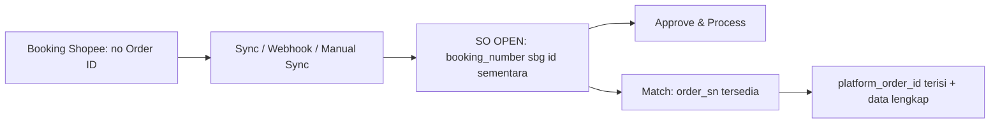
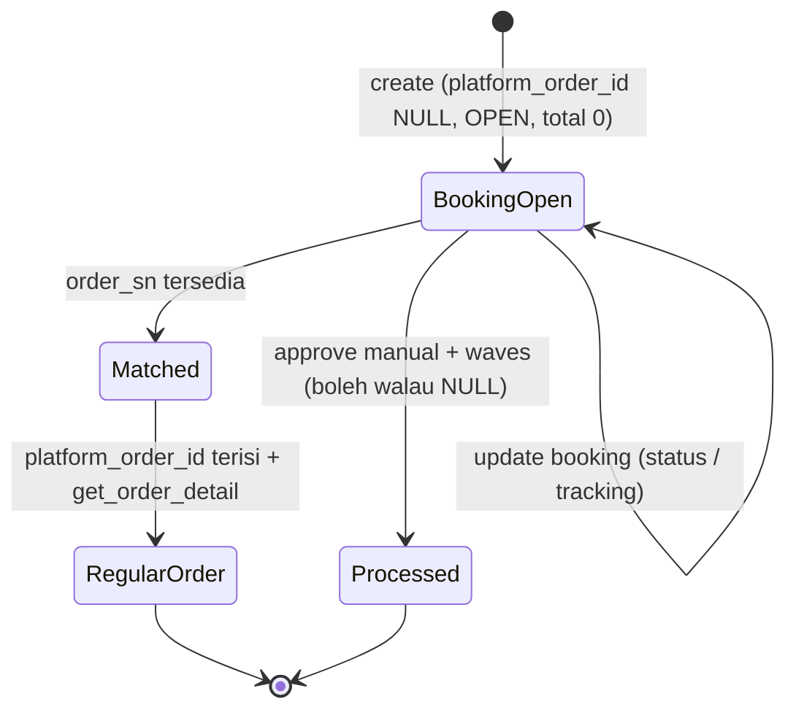
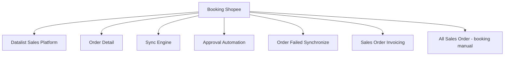

# Sales Platform — Booking Order (Shopee) — Source of Truth

> Scope: mekanisme booking order Shopee — order tanpa Order ID yang tetap bisa diproses lewat Booking Number, plus transisi booking ke order regular. Khusus platform Shopee. Kolom booking di datalist dan detail ada di SOT masing-masing; engine approve ada di SOT approval automation.

## 1. Ringkasan Eksekutif

Booking adalah mekanisme Shopee saat Shopee membeli barang dari seller untuk dikelola Shopee. Order booking belum punya buyer dan belum punya Order ID — hanya Booking Number. Sistem menyimpan booking sebagai Sales Order (internal OPEN, `total_amount` 0) memakai Booking Number sebagai Platform Order ID sementara di backend agar bisa diproses. Ketika ada pembeli dan Order ID tersedia (match), Booking Number digantikan Order ID dan data dilengkapi. Audience: Ops (proses booking) dan dev.



## 2. Prasyarat

| Prerequisite | Sumber | Catatan |
|---|---|---|
| Store Shopee authorized dan active | Master Store | Booking hanya untuk Shopee |
| Akses API booking | Integrasi Shopee | `get_booking_list`, `get_booking_detail` |
| Webhook booking aktif | Integrasi Shopee | Booking Status, Match Status, Tracking/Shipping Document |

## 3. Siklus Status (lifecycle booking)



| State | Kondisi | Efek |
|---|---|---|
| BookingOpen | `platform_order_id` NULL, internal OPEN, `total_amount` 0 | Booking Number jadi id sementara; bisa diproses |
| Matched | `order_sn` tersedia dari Shopee | Trigger isi `platform_order_id` |
| RegularOrder | `platform_order_id` terisi | Data lengkap via `get_order_detail` |

## 4. Kolom & Display Rule

Kolom booking (`booking_number`, `booking_status`, `match_status`, `tracking_number`, `shipper`, `deadline_time`, `pickup_at`, `handover_method`) tampil di datalist (mayoritas hidden) dan di Other Information order detail — sumber data dari API booking detail. Display rule:

| Aspek | Rule |
|---|---|
| Kolom Platform Order ID | `platform_order_id` NULL tampil `-`; else tampil nilainya |
| Kolom Booking Number | Wajib tampil untuk order booking |
| Platform Status | `platform_order_id` NULL ambil dari `booking_status`; else dari `order_status` |
| Sales Order Invoicing | Belum matched dan `platform_order_id` NULL tampilkan Booking Number sebagai nomor order; jika matched tampil Platform Order ID |
| Order Failed Synchronize | Ada penanda Order Booking (badge/kolom Order Type, visible false); `is_booking` |

## 5. Form & Field (booking di order platform)

| Field | Sumber | Catatan |
|---|---|---|
| Booking Number | API booking | Id sementara sebelum match |
| Booking Status | API booking | Update via webhook Booking Status |
| Booking Match Status | API booking | Update via webhook Match Status |
| Booking Tracking No. | API booking | Update via webhook Tracking/Shipping Document |
| Booking Shipper | API booking | Manual SO: dropdown Master Shipping Service |
| Booking Deadline Time | API booking | Date & Time |
| Booking Pickup At | API booking | Date & Time |
| Booking Handover Method | API booking | Freetext |

Untuk order platform semua auto-populated dari API. Input manual field booking dilakukan di menu All Sales Order (accordion Other Information), bukan di sini.

## 6. How It Works

### 6a. Sync booking (get_order_list + get_booking_list)

Scheduler auto sync memanggil `get_order_list` (existing) dan `get_booking_list` (booking). Handling response booking: jika `order_sn` terisi, cek DB — found update/skip, not found insert sebagai order regular (`get_order_detail`). Jika `order_sn` NULL, cek `booking_number` di DB — found UPDATE row tersebut (jangan insert baru), not found INSERT order baru dengan `platform_order_id` NULL, `booking_number` terisi, `total_amount` 0, status internal OPEN. Mapping data aman terhadap field yang tidak ada (null coalescing) untuk hindari error undefined property.

### 6b. Webhook booking

Tiga webhook: Booking Status, Match Status, Tracking/Shipping Document. Saat payload masuk, dedup: cari row dengan `booking_number` sama dengan payload atau `platform_order_id` sama dengan `order_sn` payload. Ditemukan berarti UPDATE; tidak ditemukan berarti INSERT. Transisi: jika webhook membawa status match (`order_sn` tersedia), cari row `booking_number` terkait, isi `platform_order_id` dengan `order_sn`, lalu trigger `get_order_detail` untuk melengkapi harga dan buyer. Update hanya kolom terkait, jangan overwrite kolom lain.

### 6c. Manual sync per order (tombol Sync)

Tombol Sync mendeteksi tipe order agar tidak error API call:
- `platform_order_id` NOT NULL: panggil `get_order_detail` memakai `platform_order_id`.
- `platform_order_id` NULL: jangan panggil `get_order_detail` (cegah error Order SN Not Found); ambil `booking_number`, panggil `get_booking_detail`. Jika sudah match (`order_sn`/match status success): isi `platform_order_id` dengan `order_sn` lalu panggil `get_order_detail`. Jika masih pending: update data booking saja, biarkan `platform_order_id` NULL.

Setelah match, klik Sync berikutnya membaca `platform_order_id` (order_sn) lebih dulu.

### 6d. Booking bisa diproses walau Platform Order ID NULL

Booking order dengan `platform_order_id` NULL tetap bisa di-approve, masuk default waves, dan lanjut processing sampai selesai — tidak ada blocking karena Platform Order ID kosong (ETM-13108). Ini menggantikan behavior lama yang memblokir approve/waves saat NULL.

Resolusi kontradiksi: spec awal menyebut Approve DISABLED/HIDDEN saat `platform_order_id` NULL (cegah jurnal pendapatan 0). Spec final (ETM-13108) membalikkannya menjadi boleh di-proses. Yang menjaga jurnal pendapatan 0 dari sisi otomatis: booking **di-exclude** dari kandidat auto-approve (bukan cancel platform/booking) sehingga tidak ter-approve massal. Booking hanya bisa di-approve **manual**.

`[VERIFY: CODEBASE]`: apakah manual approve booking dengan `total_amount` 0 menimbulkan jurnal pendapatan 0, dan bagaimana ditangani — lihat GAP-BOOK-01.

## 7. Validasi

| # | Kondisi | Behavior | Message |
|---|---|---|---|
| V1 | Satu order muncul di `get_order_list` dan `get_booking_list` bersamaan | Tidak duplikat (dedup by `booking_number`/`platform_order_id`) | — |
| V2 | Sync manual pada booking `platform_order_id` NULL | Panggil `get_booking_detail`, bukan `get_order_detail` | Hindari "Order SN Not Found" |
| V3 | Booking match saat sync | Isi `platform_order_id` dari `order_sn`, lengkapi via `get_order_detail` | — |
| V4 | Booking `platform_order_id` NULL | Approve/waves/processing tetap boleh (manual approve) | — |
| V5 | Platform Status booking NULL id | Ambil dari `booking_status` | — |
| V6 | Insert booking baru | `total_amount` 0, status OPEN, `platform_order_id` NULL | — |

## 8. Relasi Menu Lain



| Menu | Peran dalam relasi |
|---|---|
| Datalist Sales Platform | Kolom booking 4 sampai 11; Platform Status mapping |
| Order Detail | Field booking di Other Information |
| Sync Engine | Sync/webhook booking dengan dedup |
| Approval Automation | Booking exclude dari auto-approve; manual approve boleh |
| Order Failed Synchronize | Penanda Order Booking (`is_booking`) |
| Sales Order Invoicing | Tampil Booking Number saat belum matched |
| All Sales Order | Input manual field booking (accordion Other Information) |

## 9. Gap Registry

| ID | Deskripsi | Dampak | Status |
|---|---|---|---|
| GAP-BOOK-01 | Manual approve booking dengan `total_amount` 0 berpotensi menghasilkan jurnal pendapatan 0; penanganannya belum terkonfirmasi setelah approve booking diizinkan (ETM-13108) | Risiko jurnal pendapatan 0 bila approve dilakukan sebelum match | Open |

Item lain yang masih `[VERIFY: CODEBASE]`: interaksi void dan duplicate — duplicate dari void menghasilkan order platform dengan `platform_order_id` sama namun nomor internal berbeda, sedangkan dedup sync/booking mencocokkan by `platform_order_id`; perlu dipastikan sync menargetkan row non-VOID (aturan update hanya untuk platform order id yang status internalnya bukan VOID).

## 10. FAQ

**Apa itu order booking Shopee?**
Order dari Shopee yang belum punya pembeli dan belum punya Order ID, hanya Booking Number. Shopee yang mengelola barangnya.

**Kenapa Platform Order ID booking tampil strip (`-`)?**
Karena belum match (belum ada Order ID). Booking Number tetap tampil sebagai identitas sementara.

**Booking bisa diproses walau belum ada Order ID?**
Bisa. Booking tetap bisa di-approve manual, masuk waves, dan diproses. Order ID otomatis mengisi saat match.

**Kenapa booking tidak ikut auto-approve?**
Booking sengaja di-exclude dari auto-approve untuk mencegah approve massal order yang nilainya masih 0. Approve booking dilakukan manual.

**Aku klik Sync di booking, apa yang terjadi?**
Jika belum match, sistem cek data booking. Jika ternyata sudah match, sistem otomatis mengubahnya jadi order regular dan melengkapi data harga serta buyer.

## 11. Changelog

| Tanggal | Versi | Perubahan |
|---|---|---|
| 2026-07-15 | 1.0 | Draft awal — booking order Shopee |

## 12. Knowledge Base Hints (untuk operator)

Istilah teknis ke padanan awam:

| Istilah teknis | Padanan awam untuk KB |
|---|---|
| Booking | Order Shopee yang dikelola Shopee, belum ada pembeli |
| Booking Number | Nomor sementara sebelum ada Order ID |
| Match | Booking berubah jadi order asli (sudah ada Order ID) |
| Platform Order ID NULL | Order ID belum ada (masih booking) |
| get_booking_detail | Ambil data booking dari Shopee |

Skenario troubleshooting:
- Booking tidak bisa di-approve otomatis: memang begitu, approve booking manual.
- Order ID booking belum muncul: booking belum match; tekan Sync untuk cek, atau tunggu update webhook.
- Nomor order booking di invoicing pakai Booking Number: normal saat belum matched.

Field yang tidak relevan untuk operator (skip di KB): flag internal `is_booking`, detail dedup, `order_sn` mentah.

## 13. Technical Hints (untuk developer)

Area codebase (nama umum): handler sync booking (`get_booking_list`/`get_booking_detail`), listener webhook booking (status/match/tracking), logic tombol Sync per order, mapper transisi booking ke regular, renderer display Platform Order ID dan Platform Status untuk booking.

Invariants (kandidat assertion test):
- Dedup: cocok by `booking_number` atau `platform_order_id` berarti UPDATE, bukan INSERT (tidak ada duplikasi).
- Insert booking: `platform_order_id` NULL, `booking_number` terisi, `total_amount` 0, status OPEN.
- `platform_order_id` NULL berarti Platform Status dari `booking_status`, display `-`, dan `booking_number` jadi id sementara untuk processing.
- Match berarti isi `platform_order_id` dari `order_sn` lalu `get_order_detail`.
- Booking di-exclude dari kandidat auto-approve.
- Update platform order hanya untuk `platform_order_id` yang status internalnya bukan VOID (sync menargetkan row non-VOID).

Failure modes:
- Race condition sync versus webhook: cek existing sebelum insert (aman).
- Payload booking minim data: null coalescing untuk hindari undefined property.
- Order muncul di order list dan booking list bersamaan: dedup cegah duplikat.
- Sync `get_order_detail` pada booking NULL: dicegah, alihkan ke `get_booking_detail`.

Data lifecycle lintas dokumen:
- Booking Number ke Order ID: transisi otomatis saat match (sync/webhook/manual sync), replace tanpa duplikasi.
- Booking exclude auto-approve; manual approve boleh (SOT approval automation).
- Booking marker `is_booking` muncul di Order Failed Synchronize (SOT datalist).

## 14. Referensi Struktur untuk Cursor

```
Section 1-11 → material utama untuk requirement.md
Section 5, 6, 7, 10 → adaptasi ke knowledge-base.md dengan tone awam (lihat Section 12 KB Hints)
Section 13 Technical Hints → seed untuk technical.md, dilengkapi Cursor dari codebase
Frontmatter YAML di atas → copy ke 3 file utama, sinkronkan version + last_updated
Golden reference tone & struktur: docs/qa-docs/accounting-supplier-invoice/
```
