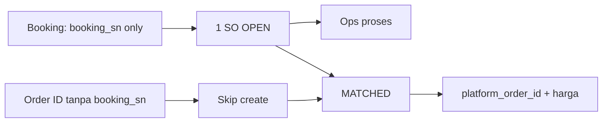
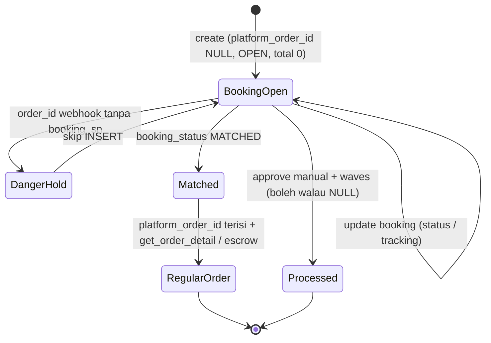
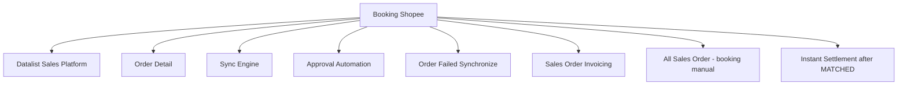

# Sales Platform — Booking Order (Shopee) — Source of Truth

> Scope: mekanisme booking order Shopee — order tanpa Order ID yang tetap bisa diproses lewat Booking Number, plus transisi booking ke order regular. Khusus platform Shopee. Kolom booking di datalist dan detail ada di SOT masing-masing; engine approve ada di SOT approval automation.

## 1. Ringkasan Eksekutif

Booking adalah mekanisme Shopee saat Shopee membeli barang dari seller untuk dikelola Shopee. Order booking belum punya buyer dan belum punya Order ID — hanya Booking Number. Sistem menyimpan booking sebagai Sales Order (internal OPEN, `total_amount` 0) memakai Booking Number sebagai identitas sementara agar bisa diproses ops. Ketika status booking **MATCHED**, Order ID resmi digabung ke **SO yang sama** (bukan SO baru). Audience: Ops (proses booking) dan dev.

**Invariant major:** satu pesanan Shopee = satu SO. Order ID yang datang lewat jalur advance package **tanpa** `booking_sn` **tidak** boleh create SO kedua sebelum MATCHED — pelanggaran = duplikat fatal (pernah di UPFOS).

## 2. Prasyarat

| Prerequisite | Sumber | Catatan |
|---|---|---|
| Store Shopee authorized dan active | Master Store | Booking hanya untuk Shopee |
| Akses API booking | Integrasi Shopee | `get_booking_list`, `get_booking_detail` |
| Webhook booking aktif | Integrasi Shopee | Booking Status, Match Status (`MATCHED`), Tracking/Shipping Document |

## 3. Siklus Status (lifecycle booking)

| State | Kondisi | Efek |
|---|---|---|
| BookingOpen | `platform_order_id` NULL, internal OPEN, `total_amount` 0 | Booking Number jadi id sementara; bisa diproses |
| DangerHold | Order ID datang tanpa link booking | **Tidak** create SO; tunggu MATCHED |
| Matched | `booking_status = MATCHED` + pairing `order_sn` | Trigger isi `platform_order_id` pada SO booking |
| RegularOrder | `platform_order_id` terisi | Data lengkap via `get_order_detail` / escrow |

### 3a. Contoh kasus nyata (produksi)

| Waktu | Event | Efek |
|---|---|---|
| 31 Agu 2026 21:03 | Webhook `booking_sn=260831AASC74GOWV7FM`, `READY_TO_SHIP`, no order id | INSERT 1 SO booking |
| 1–2 Sep 2026 | Update booking (masih no order id) | UPDATE SO yang sama |
| 2 Sep 2026 ~23:55 | Order ID `2609031XP6RKDK` via advance package **tanpa** booking_sn | Skip create |
| 3 Sep 2026 18:11 | Booking `MATCHED` ↔ `2609031XP6RKDK` | Isi `platform_order_id` + harga di SO booking |

## 4. Kolom & Display Rule

Kolom booking (`booking_number`, `booking_status`, `match_status`, `tracking_number`, `shipper`, `deadline_time`, `pickup_at`, `handover_method`) tampil di datalist (mayoritas hidden) dan di Other Information order detail — sumber data dari API booking detail. Display rule:

| Aspek | Rule |
|---|---|
| Kolom Platform Order ID | `platform_order_id` NULL tampil `-`; else tampil nilainya |
| Kolom Booking Number | Wajib tampil untuk order booking |
| Platform Status | `platform_order_id` NULL ambil dari `booking_status`; else dari `order_status` |
| Sales Order Invoicing | Belum matched dan `platform_order_id` NULL tampilkan Booking Number sebagai nomor order; jika matched tampil Platform Order ID |
| Order Failed Synchronize | Ada penanda Order Booking (badge/kolom Order Type, visible false); `is_booking` |

## 5. Form & Field (booking di order platform)

| Field | Sumber | Catatan |
|---|---|---|
| Booking Number | API booking | Id sementara sebelum match |
| Booking Status | API booking | Update via webhook Booking Status — **MATCHED** = titik merge |
| Booking Match Status | API booking | Update via webhook Match Status |
| Booking Tracking No. | API booking | Update via webhook Tracking/Shipping Document |
| Booking Shipper | API booking | Manual SO: dropdown Master Shipping Service |
| Booking Deadline Time | API booking | Date & Time |
| Booking Pickup At | API booking | Date & Time |
| Booking Handover Method | API booking | Freetext |

Untuk order platform semua auto-populated dari API. Input manual field booking dilakukan di menu All Sales Order (accordion Other Information), bukan di sini.

## 6. How It Works

### 6a. Sync booking (get_order_list + get_booking_list)

Scheduler auto sync memanggil `get_order_list` (existing) dan `get_booking_list` (booking). Handling response booking: jika `order_sn` terisi **dan** sudah ada SO booking / dedup hit → UPDATE. Jika `order_sn` NULL, cek `booking_number` di DB — found UPDATE row tersebut (jangan insert baru), not found INSERT order baru dengan `platform_order_id` NULL, `booking_number` terisi, `total_amount` 0, status internal OPEN.

### 6b. Webhook booking & order (dual-path)

- Webhook **booking** (status / match / tracking): dedup by `booking_number` atau `platform_order_id` = `order_sn`. Found → UPDATE; not found → INSERT (booking path only).
- Webhook / sync **order** dengan `advance_package` (sering **tanpa** `booking_sn`): **jangan INSERT** SO baru sebelum pairing MATCHED — return accepted skip (bukan Failed Sync). Implementasi referensi: `OmniShopeeService::storeSalesOrder` gate `advance_package`.
- Saat **MATCHED**: cari row `booking_number`, isi `platform_order_id` dengan `order_sn`, trigger detail/escrow untuk harga & buyer. Update kolom terkait, jangan overwrite kolom lain tanpa alasan.

### 6c. Manual sync per order (tombol Sync)

Tombol Sync mendeteksi tipe order agar tidak error API call:
- `platform_order_id` NOT NULL: panggil `get_order_detail` memakai `platform_order_id`.
- `platform_order_id` NULL: jangan panggil `get_order_detail` (cegah error Order SN Not Found); ambil `booking_number`, panggil `get_booking_detail`. Jika sudah match (`order_sn`/MATCHED): isi `platform_order_id` dengan `order_sn` lalu panggil `get_order_detail`. Jika masih pending: update data booking saja, biarkan `platform_order_id` NULL.

Setelah match, klik Sync berikutnya membaca `platform_order_id` (order_sn) lebih dulu.

### 6d. Booking bisa diproses walau Platform Order ID NULL

Booking order dengan `platform_order_id` NULL tetap bisa di-approve, masuk default waves, dan lanjut processing sampai selesai — tidak ada blocking karena Platform Order ID kosong (ETM-13108).

Yang menjaga jurnal pendapatan 0 dari sisi otomatis: booking **di-exclude** dari kandidat auto-approve. Booking hanya bisa di-approve **manual**. Instant Settlement menunggu `platform_order_id` setelah MATCHED (GAP-BOOK-01 mitigated via IS).

## 7. Validasi

| # | Kondisi | Behavior | Message |
|---|---|---|---|
| V1 | Satu order muncul di jalur booking dan jalur order/advance package | Tidak duplikat (dedup by `booking_number`/`platform_order_id`; skip create order_id orphan) | — |
| V2 | Sync manual pada booking `platform_order_id` NULL | Panggil `get_booking_detail`, bukan `get_order_detail` | Hindari "Order SN Not Found" |
| V3 | Booking MATCHED | Isi `platform_order_id` dari `order_sn`, lengkapi via `get_order_detail`/escrow | — |
| V4 | Booking `platform_order_id` NULL | Approve/waves/processing tetap boleh (manual approve) | — |
| V5 | Platform Status booking NULL id | Ambil dari `booking_status` | — |
| V6 | Insert booking baru | `total_amount` 0, status OPEN, `platform_order_id` NULL | — |
| V7 | Order ID tanpa booking_sn pre-MATCHED | Skip INSERT (success Accepted) | — |

## 8. Relasi Menu Lain

| Menu | Peran dalam relasi |
|---|---|
| Datalist Sales Platform | Kolom booking; Platform Status mapping |
| Order Detail | Field booking di Other Information |
| Sync Engine | Sync/webhook booking + skip advance package orphan |
| Approval Automation | Booking exclude dari auto-approve; manual approve boleh |
| Order Failed Synchronize | Penanda Order Booking (`is_booking`) — skip Accepted **bukan** failed |
| Sales Order Invoicing | Tampil Booking Number saat belum matched |
| All Sales Order | Input manual field booking (accordion Other Information) |
| Instant Settlement | Match `platform_order_id` setelah MATCHED |

## 9. Gap Registry

| ID | Deskripsi | Dampak | Status |
|---|---|---|---|
| GAP-BOOK-01 | Manual approve booking amount 0 — residual SI manual; IS mitigated | Risiko jurnal 0 hanya jalur manual | Accepted residual |
| GAP-BOOK-02 | Dual-path order_id tanpa booking_sn harus skip sampai MATCHED | Duplikat 2 SO 1 order (fatal UPFOS) | **Design guard** (documented 2026-09-04) |

## 10. FAQ

**Apa itu order booking Shopee?**
Order dari Shopee yang belum punya pembeli dan belum punya Order ID, hanya Booking Number. Shopee yang mengelola barangnya.

**Kenapa Platform Order ID booking tampil strip (`-`)?**
Karena belum MATCHED (belum ada Order ID resmi di baris itu). Booking Number tetap tampil sebagai identitas sementara — order **sudah masuk**.

**Booking bisa diproses walau belum ada Order ID?**
Bisa. Booking tetap bisa di-approve manual, masuk waves, dan diproses. Order ID otomatis mengisi saat MATCHED.

**Kenapa Order ID yang datang lebih dulu tidak langsung bikin SO baru?**
Karena payload sering tanpa Booking Number. Create di situ = risiko 2 SO untuk 1 pesanan. Tunggu MATCHED. Contoh: `260831AASC74GOWV7FM` ↔ `2609031XP6RKDK`.

**Kenapa booking tidak ikut auto-approve?**
Booking sengaja di-exclude dari auto-approve untuk mencegah approve massal order yang nilainya masih 0. Approve booking dilakukan manual.

**Aku klik Sync di booking, apa yang terjadi?**
Jika belum match, sistem cek data booking. Jika ternyata sudah MATCHED, sistem mengisi Order ID dan melengkapi data harga serta buyer.

## 11. Changelog

| Tanggal | Versi | Perubahan |
|---|---|---|
| 2026-09-04 | 1.1 | Dual-path + MATCHED anti-dupe + contoh kasus nyata; GAP-BOOK-02 |
| 2026-07-15 | 1.0 | Draft awal — booking order Shopee |

## 12. Knowledge Base Hints (untuk operator)

Istilah teknis ke padanan awam:

| Istilah teknis | Padanan awam untuk KB |
|---|---|
| Booking | Order Shopee yang dikelola Shopee, belum ada pembeli |
| Booking Number | Nomor sementara sebelum ada Order ID |
| MATCHED | Booking digabung resmi dengan Order ID |
| Advance package tanpa booking_sn | Order ID datang sendirian — jangan bikin baris kedua |
| Platform Order ID NULL | Order ID belum nempel (masih booking) |

Skenario troubleshooting:
- Booking tidak bisa di-approve otomatis: memang begitu, approve booking manual.
- Order ID di Shopee ada tapi di ERP masih `-`: tunggu MATCHED, jangan create manual.
- Nomor order booking di invoicing pakai Booking Number: normal saat belum matched.

Field yang tidak relevan untuk operator (skip di KB): flag internal `is_booking`, detail dedup, `order_sn` mentah.

## 13. Technical Hints (untuk developer)

Area codebase: `ManagesShopeeBooking`, `OmniShopeeService::storeSalesOrder` (`advance_package` skip), `update_so_booking_fields`, webhook booking MATCHED, escrow pada convert.

Invariants (kandidat assertion test):
- Dedup: cocok by `booking_number` atau `platform_order_id` berarti UPDATE, bukan INSERT.
- Insert booking: `platform_order_id` NULL, `booking_number` terisi, `total_amount` 0, status OPEN.
- Order ID orphan pre-MATCHED: skip create (success Accepted).
- MATCHED: isi `platform_order_id` pada SO booking existing + reprice.
- Satu `order_sn` tidak boleh dua SO non-VOID aktif.
