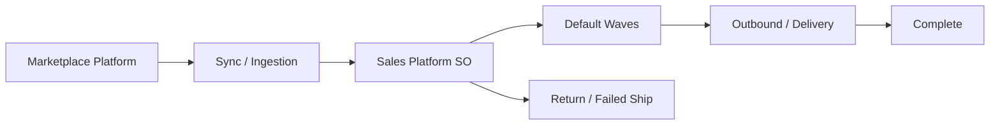
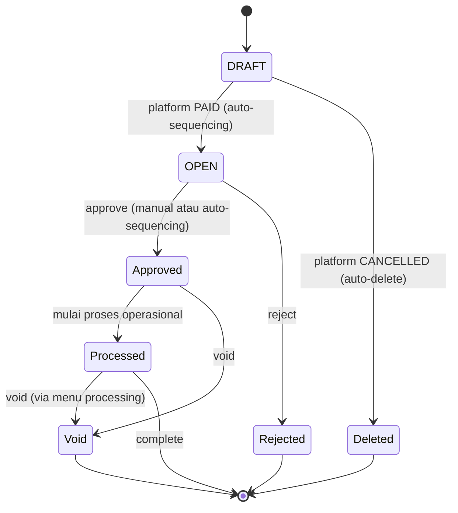
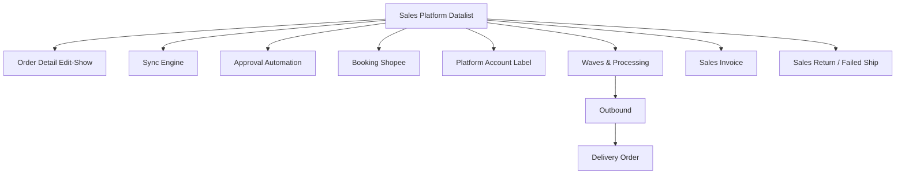

# Sales Platform — Datalist Page — Source of Truth

> Catatan scope: file ini **hanya** mengcover halaman list (entry point). Halaman edit/show, sync engine, approval automation, dan booking lifecycle ada di SOT terpisah dan hanya dirujuk di sini (lihat Section 8). Prinsip 1 fakta = 1 tempat dijaga lintas file.

## 1. Ringkasan Eksekutif

Sales Platform (nama UI saat ini: **Dev - Sales Platform**) adalah datalist **read-only** yang menampilkan seluruh order yang ditarik dari marketplace. Berbeda fundamental dari menu Sales Order general: data di sini berasal dari hasil sync platform, **bukan** create internal — karena itu tombol Create sengaja mengarahkan ke order internal. Halaman ini jadi entry point operasional: monitoring status order, mendeteksi order gagal sync atau kena error flag, dan mendorong order lanjut ke proses waves sampai outbound. Audience utama: tim Ops.



## 2. Prasyarat

| Prerequisite | Sumber | Catatan |
|---|---|---|
| Store authorized dan active | Master Store (omni) | Hanya store authorized yang di-sync dan dihitung di panel Order Synchronize Status |
| Platform status Active | Config Active/Inactive per platform | Jika Inactive, tidak ada API call ke platform tsb (detail di SOT sync engine) |
| Warehouse Process tersedia | Store, fallback ke Omni Channel Setting | Jika tidak ada di dua sumber, order kena `warehouse-error` |
| Binding produk platform ke System Product | Master System Product | Wajib untuk lanjut proses; binding dianggap valid hanya jika owner id system product sama dengan default owner store |
| Order Sync Start Date (opsional) | Omni Channel Configuration | Membatasi order lama masuk; detail di SOT sync engine |

## 3. Siklus Status

Status di menu ini terbagi dua sumbu yang **terpisah**: (a) status internal SO, dan (b) processing icon state (pipeline gudang 6 tahap). Summary button di Section 6 adalah filter atas kombinasi kedua sumbu ini plus referensi transaksi.

### 3a. Status internal SO



| Status | Kondisi transisi | Editable? | Tombol muncul |
|---|---|---|---|
| DRAFT | Order platform UNPAID; bucket "Sales Request". Tetap DRAFT sampai platform PAID. Jika platform CANCELLED saat masih DRAFT maka order auto-delete | Ya | Edit, Delete, Approve, Reject |
| OPEN | Order platform sudah PAID (hasil auto-sequencing dari DRAFT); booking Shopee mentok di sini sampai match | Ya (inline edit SKU/qty) | Approve, Reject, Delete, Sync |
| Approved | Sudah approve, belum masuk proses | Tidak (locked) | Void, Print, Sync |
| Processed | Sudah masuk proses operasional (waves ke atas) | Tidak | Void (via processing), Print, Sync |
| Rejected | Hasil reject; **tidak** masuk summary button manapun (intended) | Tidak | — |
| Void | Dari Approved/Processed; tidak bisa lanjut proses | Tidak | Print |

**Sequencing status.** Order platform yang status platformnya UNPAID selalu masuk DRAFT dan tidak boleh otomatis pindah ke OPEN sampai PAID. Begitu PAID, order pindah ke OPEN agar segera ikut jadwal auto-approve. Auto-approve di sini bukan hanya proses approval, tapi juga auto-sequencing status: DRAFT ke OPEN lalu OPEN ke Approved. Jika DRAFT ke OPEN belum eligible (belum PAID), order tetap stuck di DRAFT. Detail engine auto-approve ada di SOT approval automation.

**Auto-delete.** Order dengan status internal DRAFT yang status platformnya CANCELLED akan auto-delete oleh sistem (data tidak punya nilai operasional). Update status platform sebagai pemicu: Shopee dan TikTok realtime lewat webhook; Lazada tidak punya webhook sehingga ikut schedule harian pukul 06:00, atau bisa dipicu langsung lewat tombol Sync di order Lazada tersebut. `[VERIFY: CODEBASE]`: apakah auto-delete ini soft delete (masih terlihat lewat Show Deleted Data) atau hard delete.

Catatan `[VERIFY: CODEBASE]`: enum status internal lengkap (termasuk kemungkinan Closed) dan kondisi transisi persisnya perlu diverifikasi. Booking Shopee dengan `platform_order_id` NULL: internal OPEN, `total_amount = 0`, boleh approve manual tapi **di-exclude** dari auto-approve (detail di SOT approval automation dan booking).

## 4. Datalist

### 4a. Kolom datatable

Legend visible default: `✓` tampil, `✗` hidden (tetap ada di data, bisa dibuka via Columns Show/Hide).

| # | Kolom | Vis | Sumber data | Keterangan |
|---|---|---|---|---|
| 1 | ID | ✗ | Internal | Identifier internal |
| 2 | Trx Code \| Platform Order ID | ✓ | Internal + platform | Platform Order ID `-` jika NULL (booking belum match) |
| 3 | Platform | ✗ | Store | Shopee / TikTok / Lazada / dll |
| 4 | Booking Number | ✓ | API booking Shopee | Wajib tampil untuk order booking |
| 5 | Booking Status | ✗ | API booking | Shopee only |
| 6 | Booking Match Status | ✗ | API booking | Shopee only |
| 7 | Booking Tracking No. | ✗ | API booking | Shopee only |
| 8 | Booking Shipper | ✗ | API booking | Shopee only |
| 9 | Booking Deadline Time | ✗ | API booking | Shopee only |
| 10 | Booking Pickup at | ✗ | API booking | Shopee only |
| 11 | Booking Handover | ✗ | API booking | Shopee only |
| 12 | Customer \| Buyer Name | ✓ | Store + platform | Customer = nama store; Buyer Name **disensor** (ketentuan privasi API Shopee) |
| 13 | Shipper | ✗ | Platform / master | — |
| 14 | Shipper Service \| Tracking Number | ✓ | Platform / master shipping | Nama shipper dari master internal jika sudah bind; jika belum, murni nama service platform |
| 15 | Processing Status | ✓ | Stock mutation proses | 6 icon pipeline (lihat Section 6d) |
| 16 | Pre-sale time \| Trx Date | ✓ | API platform | Pre-sale time per platform (Shopee `ship_by_date`, TikTok `shipping_due_time`, Tokopedia `preorder_deadline`, Lazada tidak diambil); detail di SOT sync engine |
| 17 | Payment Time \| Deadline Time | ✓ | API platform | — |
| 18 | Customer Ref | ✗ | Internal | — |
| 19 | Trx Ref | ✗ | Internal | Terisi jika order turunan/copy |
| 20 | Curr | ✗ | Platform | Mata uang order |
| 21 | Exchange Rate | ✗ | Platform | — |
| 22 | Product Amount | ✓ | Kalkulasi | Lihat formula Section 6e |
| 23 | Net Sales | ✓ | Kalkulasi | Lihat formula Section 6e |
| 24 | Type | ✗ | Internal | PLATFORM atau GENERAL |
| 25 | Is COD | ✗ | Platform | Informational; order internal default NO |
| 26 | Process Order | ✗ | Kalkulasi bucket | Label bucket summary tempat order jatuh |
| 27 | Trx Status \| Platform Status | ✓ | Internal + platform | Platform Status baca `booking_status` jika `platform_order_id` NULL, else `order_status`. Enum platform `[VERIFY: CODEBASE]` |
| 28 | Cancel Reason | ✗ | Platform | — |
| 29 | Product | ✗ | Detail order | List SKU dalam order; **searchable** by SKU via Advanced Filter |
| 30 | Total SKU \| Total Qty Product | ✓ | Detail order | — |
| 31 | Cancel By | ✗ | Platform / internal | — |
| 32 | Outbound Code \| Outbound Date | ✓ | Referensi outbound | Dasar bucket "Complete" |
| 33 | Delivery Order Code \| Delivery Order Date | ✓ | Referensi DO | Terisi = order dalam pengiriman |
| 34 | Sales Invoice Code \| Sales Invoice Date | ✓ | Referensi SI | Bisa multiple |
| 35 | Buyer Notes | ✓ | Platform | — |
| 36 | Warehouse Process | ✓ | Store / omni setting | — |
| 37 | Instant Processing | ✗ | Order Process Setting | Flag per SO `[VERIFY: CODEBASE]` (asumsi diturunkan dari toggle global) |
| 38 | Last Sync at \| Synchronize By | ✓ | Sync | — |
| 39 | Data Owner | ✗ | Config store (default owner data) | Snapshot saat order masuk; perubahan config hanya berlaku order berikutnya |
| 40 | Sync | ✓ | Aksi | Icon sync manual per order (lihat Section 6f) |
| 41 | Delay Duration | ✗ | Internal | — |
| 42 | Created by \| Created at | ✓ | Internal | — |
| 43 | Action | ✓ | Aksi | Edit/Show, Delete, Print, Approve/Reject, Void |

### 4b. Fitur datalist

Global Search, Advanced Filter (termasuk cari by SKU via kolom Product), Columns Show/Hide, Show Deleted Data, Export advanced (Section 6g), summary shortcut button (Section 6a), pill button (Section 6b–6c), Bulk Sync (Section 6f), Create (redirect ke order internal), Log Data (Section 6h). Live update via echo: tombol refresh muncul saat ada log/data baru.

## 5. Kontrol Input Datalist

Form create/edit order **tidak** didokumentasikan di sini — lihat SOT order detail. Di halaman list, input yang tersedia:

| Kontrol | Fungsi | Catatan |
|---|---|---|
| Global Search | Cari cepat lintas kolom utama | — |
| Advanced Filter | Filter multi-kolom, termasuk by SKU (kolom Product) | Dipakai juga oleh summary button dan pill |
| Columns Show/Hide | Buka/tutup kolom hidden | Default sesuai Section 4a |
| Show Deleted Data | Tampilkan data ter-soft-delete | — |
| Export config | With/without details, mengikuti filter aktif | Section 6g |

Sub-datalist **Order Failed Synchronize** punya kontrol sendiri (global search, advanced filter, export, column show/hide) — lihat Section 6c.

## 6. How It Works

### 6a. Summary Shortcut Button (9 bucket)

Setiap button menampilkan count dan saat di-klik memfilter datalist sesuai kondisi bucket-nya. Bucket bersifat **mutually exclusive** — satu order hanya menyala di satu bucket (tidak boleh double-count).

| Button | Tooltip | Kondisi | Baca dari |
|---|---|---|---|
| Sales Request | Sales platform with draft status | Status internal DRAFT | Status internal |
| Review | Order received and under review | Internal OPEN/Approved, icon processing masih unassign wave | Internal + processing icon |
| Processed | The order is being packaged | Internal Approved/Processed, icon processing In Wave sampai Collected | Internal + processing icon |
| Shipment Ready | The order is ready for shipment | Internal Approved/Processed, icon Ship posisi "waiting for shipping" | Internal + processing icon |
| Delivered | The order is shipping | Internal Approved/Processed, icon Ship posisi "shipped" | Internal + processing icon |
| Received | The buyer received the order | Internal Approved/Processed, icon Ship "shipped", plus platform status Shopee `TO_CONFIRM_RECEIVE`/`SHIPPED` atau TikTok `DELIVERED` | Internal + processing + platform status |
| Complete | The order is completed | Internal Approved/Processed, punya referensi **Outbound Approved** | Referensi transaksi (bukan platform status) |
| Return | The order return process | Internal Approved/Processed, punya referensi **Sales Return** dan/atau **Failed Ship** | Referensi transaksi |
| Cancelled | Order Cancelled | Status platform mengandung string `cancel` (case-insensitive), status internal apapun | Platform status |

Catatan penting untuk KB dan test:
- **Received** untuk order internal/general hanya membaca status internal dan processing icon (tidak baca platform status), sehingga count Delivered dan Received berpotensi **sama** untuk order internal. Ini by design, bukan bug.
- **Cancelled** hanya untuk order platform; order internal/general tidak masuk bucket ini.
- **Complete** dan **Return** membaca referensi transaksi, bukan status platform.
- Order status **Rejected** tidak masuk bucket manapun (intended saat ini — lihat GAP-SPL-01).

### 6b. Pill — Failed Process

Menampilkan dan memfilter order yang kolom error flag-nya mengandung icon tertentu. Icon muncul saat validasi approve gagal (detail engine validasi di SOT approval automation).

| Flag key | Icon | Arti (tooltip) |
|---|---|---|
| shipping-error | truck | Platform/kurir belum ditemukan, belum bind master shipping, over max weight/dimension |
| shipping-error-min-weight | truck | Berat SO di bawah minimum kurir |
| bind-error | link-slash | Produk belum/tidak valid terikat System Product |
| coa-error | share-nodes | COA belum di-set/belum lengkap di SKU system product |
| stock-error | boxes-stacked | Stock tidak tersedia/kurang di WH process (tippy tampil nama WH bila ada) |
| price-error | tag | Price null |
| bundle-error | flag | Bundle detail belum lengkap/masih inactive |
| warehouse-error | warehouse | WH process/stock tidak ditemukan (cek store lalu omni settings) |
| (unknown) | triangle-exclamation | Fallback — tippy menampilkan pesan `error_info.error` apa adanya |

Catatan: `bind-error` nyala bukan hanya saat SKU belum di-bind, tapi juga saat bound ke System Product dengan owner id **berbeda** dari default owner store (dianggap masih unbinded) — `[VERIFY: CODEBASE]` untuk memastikan cakupan ini.

### 6c. Pill — Order Failed Synchronize

List **per order** yang gagal masuk sistem, dengan alasan. Contoh reason: gagal ambil detail dari marketplace; produk belum sync ke sistem; line item kosong; bundle product kosong; store unauthorized; exception saat store SO; webhook sync gagal; Shopee booking sync gagal; order create time sebelum tanggal yang diizinkan (mis. `01-07-2026 00:00:00`).

Sub-datalist kolom: checkbox (bulk), Platform Order, Trx Order (terisi otomatis jika retry sukses masuk sistem), Store Name, Failed at, Reason, Created by \| Created at, Action (Retry).

Perilaku Retry: retry berhasil selama order eligible masuk sistem. Untuk order yang gagal karena batasan tanggal, retry manual **tetap eligible** karena user sendiri yang memicu sync untuk order spesifik itu. Centang multiple memunculkan tombol Retry bulk di pojok kiri header. Tersedia Export dan Column Show/Hide.

### 6d. Processing Status — 6 icon pipeline

Di Sales Platform, availability product icon tidak ditampilkan, jadi yang tampil selalu 6 icon berurutan. Warna: abu = belum mulai/ready, oranye = antre default wave, kuning = progress berjalan, hijau = selesai/approved.

| # | Icon | Tahap | State ringkas |
|---|---|---|---|
| 1 | fa-circle-check | Wave | abu `unassign wave` / oranye `process to default wave` / hijau `In Wave` |
| 2 | fa-cart-flatbed | Pick | abu `waiting for picking`/`Ready to Pick` / kuning `Picking Progress` / hijau `Picked` |
| 3 | fa-list-check | Check | abu `waiting for checking`/`Ready to Check` / kuning `Checking Progress` / hijau `Checked` |
| 4 | fa-box-open | Pack | abu `waiting for packing`/`Ready to Pack` / kuning `Packing Progress` / hijau `Packed` |
| 5 | fa-box-archive | Collect | abu `waiting for collect`/`Ready to Collect` / hijau `Collected` (tanpa state kuning) |
| 6 | fa-truck-fast | Ship | abu `waiting for shipping`/`Ready to Ship` / hijau `Shipped` (tanpa state kuning) |

State icon Ship (nomor 6) inilah yang membedakan bucket Shipment Ready (abu, waiting for shipping) versus Delivered (hijau, shipped).

### 6e. Product Amount dan Net Sales

Formula display di datalist:

```
Product Amount = (unit price x qty order) - disc per item SKU + VAT
Net Sales      = Product Amount + additional cost - additional disc
```

Contoh angka konkret: unit price 50.000, qty 2, disc item 10.000, VAT 4.000, additional cost 3.000, additional disc 1.000.
Product Amount = (50.000 kali 2) kurang 10.000 tambah 4.000 = 94.000.
Net Sales = 94.000 tambah 3.000 kurang 1.000 = 96.000.

`[VERIFY: CODEBASE]` (kritis): pastikan kolom Total Price per row di detail berisi **extended price (unit price kali qty saja)**, bukan yang sudah dikurangi disc dan ditambah VAT. Jika Total Price sudah mengandung disc dan VAT, akumulasi di Section Totals order detail akan menghitung disc dan VAT dua kali. Additional cost dan additional disc berasal dari mapping menu Platform Account Label dan **tidak** mengalir ke Sales Invoice — Net Sales order karenanya tidak sama dengan nilai yang dibawa Sales Invoice.

### 6f. Sync: tiga jalur berbeda

| Jalur | Trigger | Cakupan |
|---|---|---|
| Bulk Sync Sales Order (toolbar) | Klik user | Get/sync order dari semua store authorized dan active, via background job |
| Sync per order (kolom 40) | Klik user pada 1 row | Refresh 1 order spesifik (mis. platform sudah COMPLETED tapi internal masih IN_TRANSIT) |
| Retry (Order Failed Synchronize) | Klik user pada order gagal | Coba masukkan ulang order yang gagal sync |

Bulk Sync dilindungi guard anti-overlap: jika job sync sejenis masih berjalan/antre, klik berikutnya tidak menjalankan ulang, button blocked sementara, dan muncul notifikasi. Sync per order pada booking (`platform_order_id` NULL) memanggil API booking, bukan `get_order_detail` (detail di SOT booking).

### 6g. Export

Export advanced: with details dan without details, dan mengikuti filter yang sedang aktif dari user.

### 6h. Log Data (toolbar) dan Order Synchronize Status

**Log Data** (slideover dari toolbar) = riwayat **batch/event sync** per store (Sync Order, Update Store auto-sync ON/OFF, Revalidate Order), dengan agregat Created/Updated/Failed/Skipped, waktu Started/Ended, dan Updated By. Satu baris = satu batch/event, bukan satu order. Jangan tertukar dengan **API Data Log** di halaman detail order (raw response API per order) yang didokumentasikan di SOT lain.

**Order Synchronize Status** (pill, panel "Today Status", tanpa counter, tidak memfilter datalist): membandingkan jumlah order di platform hari ini versus yang sudah masuk sistem, per store, plus waktu sync terakhir. Kolom: Store Name, Authorization, Platform SO Total (sejak start of day; tampil `failed` jika API platform gagal), Sync to OlshopERP (SO tersimpan dengan tanggal transaksi hari ini), Latest Sync. Scope baris: hanya store authorized dan active, diurutkan by jumlah SO sync hari ini (DESC). Gap mencurigakan bila Platform SO Total jauh lebih besar dari Sync to OlshopERP, atau Platform SO Total `failed`, atau Latest Sync lama/kosong.

## 7. Validasi

| # | Kondisi | Behavior | Error/Message |
|---|---|---|---|
| V1 | Buyer Name ditampilkan | Selalu disensor sebelum tampil | — (ketentuan API Shopee; `[VERIFY]` apakah semua platform atau Shopee only) |
| V2 | Klik Bulk Sync saat job sejenis masih jalan/antre | Tidak dijalankan ulang, button blocked | "The system is currently processing your request in the background. Please wait until the process is completed before trying again." |
| V3 | Satu order dihitung di summary bucket | Hanya boleh satu bucket (mutually exclusive) | — |
| V4 | Order status Rejected | Tidak dihitung di summary manapun | — |
| V5 | Retry order gagal-sync karena batasan tanggal | Tetap eligible masuk sistem (dipicu manual user) | — |
| V6 | Shipper platform belum bind master internal | Nama shipper murni dari service platform | — |
| V7 | WH process tidak ada di store maupun omni setting | Order kena `warehouse-error` | — |
| V8 | Order internal dibuka via tombol Create | Redirect ke create order internal, bukan platform | — |
| V9 | Order platform status UNPAID | Masuk/ tetap DRAFT; tidak auto-pindah ke OPEN sampai PAID | — |
| V10 | Order platform status PAID | Pindah ke OPEN agar ikut auto-approve | — |
| V11 | Order status internal DRAFT dan platform CANCELLED | Auto-delete oleh sistem | — |

## 8. Relasi Menu Lain



| Menu | Peran dalam relasi |
|---|---|
| Order Detail (edit/show) | Halaman turunan dari row datalist; SOT terpisah |
| Sync Engine | Sumber ingestion order; menentukan data yang muncul di list |
| Approval Automation | Menentukan transisi OPEN ke Approved dan error flag |
| Booking Shopee | Lifecycle order booking (kolom 4–11) |
| Platform Account Label | Sumber additional cost/disc lewat mapping label API |
| Waves & Processing | Konsumen order Approved; menggerakkan processing icon |
| Outbound / Delivery Order | Referensi untuk bucket Complete dan kolom 32–33 |
| Sales Invoice | Referensi kolom 34; sumber Invoice Status |
| Sales Return / Failed Ship | Referensi bucket Return; sumber Failed Ship Status |

## 9. Gap Registry

| ID | Deskripsi | Dampak | Status |
|---|---|---|---|
| GAP-SPL-01 | Order status Rejected tidak terhitung di summary button manapun | Order rejected tidak ter-monitor lewat shortcut summary | Open (intended sementara) |

Item lain yang masih perlu verifikasi codebase (belum dikonfirmasi jadi gap): enum platform status (kolom 27), komposisi kolom Total Price versus risiko double-count Net Sales (Section 6e), cakupan `bind-error` untuk kasus owner mismatch (Section 6b), sumber flag Instant Processing per order (kolom 37), dan apakah sensor Buyer Name berlaku semua platform atau Shopee only (V1). Semua ditandai `[VERIFY: CODEBASE]` di section terkait, tidak dimasukkan ke Gap Registry sampai terkonfirmasi.

## 10. FAQ

**Kenapa aku tidak bisa create order platform lewat tombol Create?**
Order platform hanya bisa ditarik dari marketplace, tidak bisa dibuat manual. Tombol Create mengarah ke create order internal/general.

**Kenapa nama buyer tampil disensor?**
Untuk mematuhi ketentuan privasi API Shopee. Tanpa sensor, akses API bisa dicabut.

**Order sudah ada di Shopee tapi tidak muncul di sistem, kenapa?**
Cek pill Order Failed Synchronize untuk lihat alasannya (mis. gagal ambil detail, produk belum sync, atau tanggal order di luar batas). Bisa coba Retry manual.

**Apa beda Failed Process, Order Failed Synchronize, dan Ready to Process?**
Failed Process = order sudah masuk sistem tapi punya error flag. Order Failed Synchronize = order gagal masuk sistem. Ready to Process = order tanpa error flag, siap lanjut ke default waves.

**Kenapa count Delivered dan Received sama untuk beberapa order?**
Untuk order internal/general, Received tidak membaca status platform, jadi bisa sama dengan Delivered. Ini normal.

**Kenapa tombol Bulk Sync tidak bisa diklik?**
Karena job sync sejenis masih berjalan atau antre. Tunggu sampai selesai.

**Icon processing warnanya beda-beda, artinya apa?**
Abu = belum mulai/menunggu, oranye = antre default wave, kuning = sedang berjalan, hijau = tahap selesai. Urutan: Wave, Pick, Check, Pack, Collect, Ship.

**Status order Lazada kok telat update dibanding Shopee/TikTok?**
Shopee dan TikTok update realtime lewat webhook. Lazada tidak punya webhook, jadi statusnya ikut sync terjadwal harian pukul 06:00, atau tekan tombol Sync di order Lazada itu untuk update langsung.

**Order DRAFT yang dibatalkan platform hilang sendiri, kenapa?**
Order DRAFT (belum dibayar) yang di-cancel oleh platform akan auto-delete sistem karena tidak akan diproses. Ini normal.

## 11. Changelog

| Tanggal | Versi | Perubahan |
|---|---|---|
| 2026-07-15 | 1.0 | Draft awal — datalist page |

## 12. Knowledge Base Hints (untuk operator)

Istilah teknis ke padanan awam:

| Istilah teknis | Padanan awam untuk KB |
|---|---|
| Binding / unbinded | Produk platform sudah/belum dicocokkan ke produk sistem |
| Error flag | Tanda masalah yang bikin order belum bisa diproses |
| Sync / synchronize | Tarik data order dari marketplace |
| Bucket / summary button | Tombol ringkasan untuk filter cepat status order |
| Processing icon | Ikon tahapan gudang (wave sampai ship) |
| Outbound Approved | Barang sudah keluar gudang dan disetujui |
| Failed Ship | Order gagal kirim / retur pengiriman |

Skenario troubleshooting:
- Order tidak muncul di sistem: cek Order Failed Synchronize, baca Reason, coba Retry.
- Order ada tapi ada tanda merah/ikon error: cek Failed Process, ikuti arti ikon (kurir, binding, COA, stok, harga, bundle, gudang).
- Angka order platform jauh lebih banyak dari yang masuk sistem: cek panel Order Synchronize Status untuk deteksi store yang lag/gagal sync.
- Tombol sync tidak bisa diklik: ada proses yang masih jalan, tunggu.

Field yang tidak relevan untuk operator (skip di KB): ID, Customer Ref, Trx Ref, Curr, Exchange Rate, Delay Duration, Data Owner (internal snapshot owner), Instant Processing flag.

## 13. Technical Hints (untuk developer)

Area codebase yang perlu didokumentasikan (nama umum): controller datalist Sales Platform, query count tiap summary bucket, renderer kolom error flag, renderer processing status (6 icon), service export, sync log / riwayat batch, panel Order Synchronize Status, sub-list Order Failed Synchronize beserta aksi retry dan bulk retry.

Invariants (kandidat assertion test):
- Setiap order hanya masuk maksimal satu summary bucket (mutually exclusive).
- Per SKU: Σ(Invoice Status prepared + processed) ≤ qty order primary unit.
- Per SKU: Σ(Failed Ship Status prepared + processed) ≤ qty order primary unit. `[VERIFY]` apakah cap Invoice dan Failed Ship independen atau gabungan (1 unit tidak boleh ter-invoice sekaligus failed-ship).
- Buyer Name tidak pernah tampil/tersimpan tanpa sensor.
- Binding valid hanya jika `system_product.owner_id == store.default_owner_data`; jika tidak, treat unbinded (nyalakan bind-error).
- Product Amount = (unit price kali qty) kurang disc item tambah VAT; Net Sales = Product Amount tambah additional cost kurang additional disc.

Failure modes:
- Bulk Sync overlap: guard cegah job kembar; klik saat job jalan tidak menambah antrean, button blocked, notif ditampilkan.
- API platform gagal saat hitung Order Synchronize Status: kolom Platform SO Total tampil `failed`, jangan blank.
- Live update echo log baru: tombol refresh muncul, jangan auto-replace data yang sedang dilihat user.

Data lifecycle lintas dokumen:
- Status platform (mengandung `cancel`) menggerakkan bucket Cancelled; status platform Shopee `TO_CONFIRM_RECEIVE`/`SHIPPED` dan TikTok `DELIVERED` menggerakkan bucket Received.
- Munculnya referensi Outbound Approved memindahkan order ke bucket Complete.
- Munculnya referensi Sales Return atau Failed Ship memindahkan order ke bucket Return.
- Invoice Status bergerak dari prepared (SI unapproved) ke processed (SI approved); Failed Ship Status mengikuti pola sama terhadap transaksi Failed Ship.
- Data Owner order = snapshot default owner store saat order masuk; perubahan config store hanya berlaku untuk order berikutnya.
- Status platform PAID memicu sequencing DRAFT ke OPEN; auto-approve engine melakukan sequencing DRAFT ke OPEN lalu OPEN ke Approved (stuck di DRAFT jika belum eligible).
- DRAFT dengan platform CANCELLED memicu job auto-delete. Sumber update status platform: webhook realtime (Shopee, TikTok) versus schedule harian 06:00 atau manual sync (Lazada). Konsekuensi test: cancelled Lazada bisa lag sampai schedule atau manual sync.

## 14. Referensi Struktur untuk Cursor

```
Section 1-11 → material utama untuk requirement.md
Section 5, 6, 7, 10 → adaptasi ke knowledge-base.md dengan tone awam (lihat Section 12 KB Hints)
Section 13 Technical Hints → seed untuk technical.md, dilengkapi Cursor dari codebase
Frontmatter YAML di atas → copy ke 3 file utama, sinkronkan version + last_updated
Golden reference tone & struktur: docs/qa-docs/accounting-supplier-invoice/
```
