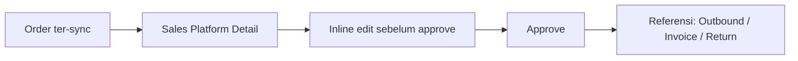
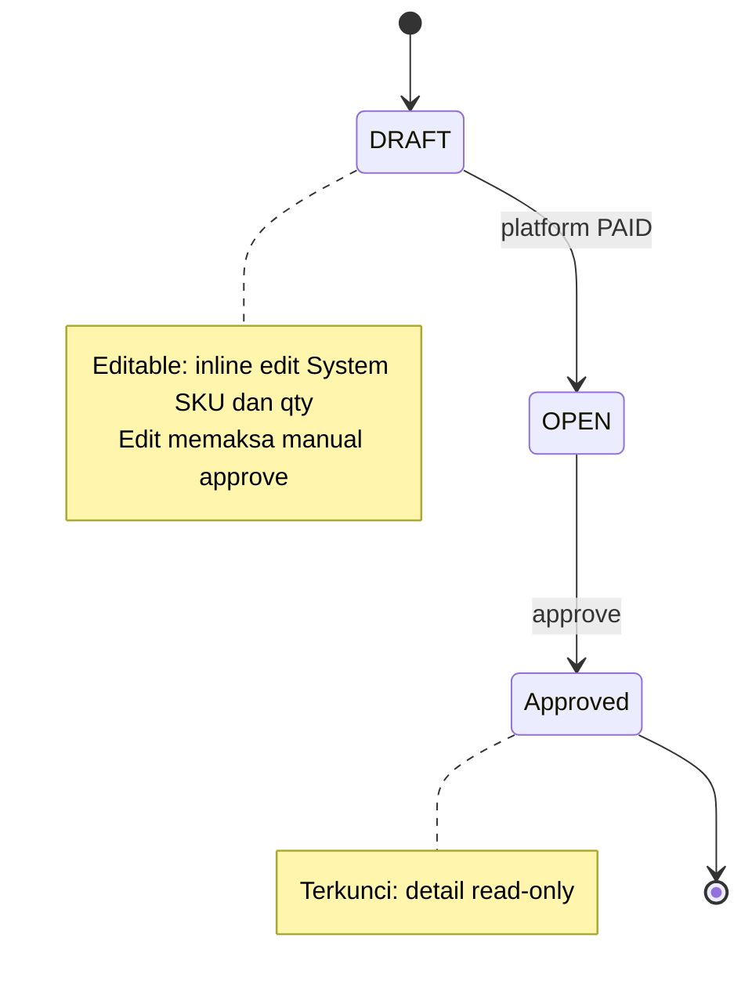
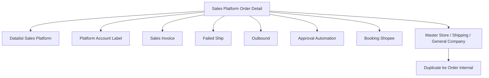

# Sales Platform — Order Detail (Edit/Show) — Source of Truth

> Scope: halaman detail satu order platform (edit dan show). Status cycle penuh, summary bucket, dan datalist ada di SOT datalist. Engine harga (bundle proportion, benchmark COGS, auto-approve) ada di SOT approval automation. File ini fokus ke field, section, dan aksi di halaman detail.

## 1. Ringkasan Eksekutif

Halaman ini menampilkan detail satu Sales Order platform: header (Basic Information + Other Information), line item (Platform Detail), komponen tambahan (Additional Cost/Disc), dan ringkasan nilai (Section Totals). Karena order berasal dari platform, mayoritas field bersifat read-only hasil sync; titik edit utama hanya di Platform Detail (System SKU dan qty) selama order belum approve. Halaman ini juga jadi tempat aksi per order: print, void, sync, sync tracking, dan duplicate. Audience: Ops dan Finance yang perlu verifikasi nilai order sebelum lanjut proses.



## 2. Prasyarat

| Prerequisite | Sumber | Catatan |
|---|---|---|
| Order sudah ter-sync ke sistem | Sync engine | Detail dibuka dari row datalist |
| Binding produk platform ke System Product | Master System Product | Wajib agar Price Before VAT, Benchmark COGS, dan validasi harga jalan |
| Mapping Platform Account Label | Menu Platform Account Label | Sumber isi Additional Cost dan Additional Disc |
| Master default (Store, Shipping, General Company) | Master data | Dipakai saat aksi Duplicate/Clone ke order internal |

## 3. Siklus Status (sudut pandang edit-permission)

Semantik transisi status penuh ada di SOT datalist. Di sini fokus ke kapan detail bisa diedit.



| Status | Editable di detail? | Catatan |
|---|---|---|
| DRAFT / OPEN | Ya (inline edit System SKU dan SO Qty di Platform Detail) | Setiap edit menandai order harus manual approve; tidak ikut auto-approve |
| Approved / Processed | Tidak (read-only) | — |
| Void | Tidak | Tidak bisa lanjut proses |

## 4. Datalist — Platform Detail (line item)

Legend visible default: `✓` tampil, `✗` hidden.

| # | Kolom | Vis | Keterangan |
|---|---|---|---|
| 1 | System SKU \| Platform SKU | ✓ | Inline edit sebelum approve; jika belum bind, System SKU NULL dan icon unbinded muncul di Error Flag |
| 2 | Error Flag | ✓ | Ikon masalah per line (unbinded, COA, stock, price, bundle, dll) |
| 3 | System Name \| Platform Name | ✓ | Nama produk sistem dan platform |
| 4 | SO Qty \| Platform Qty | ✓ | Inline edit sebelum approve |
| 5 | Unit | ✓ | — |
| 6 | Description | ✓ | — |
| 7 | Req Delivery Date | ✓ | — |
| 8 | Price | ✓ | Harga satuan (sumber per platform, lihat SOT sync engine) |
| 9 | Disc | ✓ | Diskon per item SKU |
| 10 | DPP | ✓ | Dasar Pengenaan Pajak |
| 11 | VAT | ✓ | Nilai pajak |
| 12 | Total Price | ✓ | Ada summary akumulasi di bawah datatable |
| 13 | Invoice Status | ✓ | prepared (masuk SI unapproved) / processed (masuk SI approved), basis qty primary unit |
| 14 | Failed Ship Status | ✓ | prepared (masuk Failed Ship unapproved) / processed (masuk Failed Ship approved), basis qty primary unit |
| + | Price Before VAT | ✗ | Harga satuan sebelum pajak; posisi sebelum DPP; dipakai validasi COGS (SOT approval automation) |
| + | Benchmark COGS | ✗ | Snapshot nilai COGS saat binding/order dibuat; statis meski master berubah; per SKU bound (parent SKU untuk bundle/random) |

Inline edit System SKU: user boleh pilih System Product lain di luar bindingan default. Konsekuensi: begitu diedit, order **tidak** ikut auto-approve dan wajib manual approve. Sama untuk edit SO Qty.

## 5. Form & Field

### 5a. Section Basic Information

| Field | Editable? | Sumber | Catatan |
|---|---|---|---|
| Transaction Code | Tidak | Internal | Nomor order internal |
| Platform Order ID | Tidak | Platform | `-` jika booking belum match |
| Tracking Number | Tidak | Platform | Terisi bila resi sudah didapat |
| Booking Number | Tidak | API booking Shopee | — |
| Transaction Date | Tidak | Platform | Tanggal order platform |
| Deadline Time | Tidak | Platform | — |
| Customer | Tidak | Store | Nama store sebagai customer |
| Store | Tidak | Store | — |
| Transaction Status | Tidak | Internal | Status internal SO |
| Warehouse Process | Tidak | Store / omni setting | — |
| Shipper Service | Tidak | Platform / master shipping | Nama internal jika sudah bind, else nama service platform |
| Shipping Method | Tidak | Platform | `[VERIFY: CODEBASE]` sumber pastinya |

### 5b. Sub-section Other Information

| Field | Editable? | Tipe / opsi | Catatan |
|---|---|---|---|
| Currency | Tidak | — | Mata uang order |
| Exchange Rate | Tidak | — | — |
| Payment Type | Tidak | — | — |
| Buyer Name | Tidak | — | Disensor (ketentuan privasi API Shopee) |
| Booking Status | Tidak | Freetext | Shopee only |
| Booking Match Status | Tidak | Freetext | Shopee only |
| Booking Tracking No. | Tidak | Freetext | Shopee only |
| Booking Shipper | Tidak (platform) | Dropdown Master Shipping Service | Untuk manual SO bisa diisi user |
| Booking Deadline Time | Tidak (platform) | Date & Time | — |
| Booking Pickup At | Tidak (platform) | Date & Time | — |
| Booking Handover Method | Tidak (platform) | Freetext | — |
| Shipping Address | Tidak | Platform | — |
| Billing Address | Tidak | Platform | — |
| Buyer Notes | Tidak | Platform | — |
| Term and Condition | `[VERIFY]` | — | — |
| Is COD | Tidak (platform) | Radio Yes/No | Dari platform; order internal default No |

Catatan: untuk order platform, field booking auto-populated dari API. Field booking baru editable manual di menu All Sales Order (order manual), bukan di sini.

## 6. How It Works

### 6a. Additional Cost dan Additional Disc

Untuk Sales Order platform, kedua section ini **tidak bisa di-insert manual**. Isinya berasal dari mapping data di menu Platform Account Label (label API platform yang dipetakan sebagai faktor penambah atau pengurang). Additional Cost menambah nilai order; Additional Disc mengurangi. Keduanya bersifat informasi saja: order platform tidak menerbitkan journal, dan additional cost/disc **tidak** mengalir ke transaksi Sales Invoice (independen, berbeda dari pola PO ke Purchase Invoice). Konsekuensi: nilai Net Sales order tidak sama dengan nilai yang dibawa Sales Invoice.

### 6b. Section Totals dan Net Sales

| Baris | Isi |
|---|---|
| Total Products | Akumulasi Total Price dari Platform Detail |
| Disc Products | Akumulasi Disc dari Platform Detail |
| Total DPP | Akumulasi DPP dari Platform Detail |
| Total VAT | Akumulasi VAT dari Platform Detail |
| Total Additional Cost | Akumulasi Additional Cost |
| Total Additional Disc | Akumulasi Additional Disc |
| Net Sales IDR | Total Products kurang Disc Products tambah Total VAT tambah Total Additional Cost kurang Total Additional Disc |

```
Net Sales IDR = Total Products - Disc Products + Total VAT + Total Additional Cost - Total Additional Disc
```

`[VERIFY: CODEBASE]` (kritis): pastikan kolom Total Price per row berisi **extended price (unit price kali qty saja)**, bukan yang sudah dikurangi Disc dan ditambah VAT. Jika Total Price sudah net, maka rumus Net Sales akan mengurangi Disc dua kali dan menambah VAT dua kali. Invariant ini menentukan benar/salahnya seluruh angka amount.

### 6c. Invoice Status dan Failed Ship Status

Per SKU, keduanya bergerak dari prepared ke processed:
- Invoice Status prepared: qty (primary unit) SKU yang sudah masuk Sales Invoice **unapproved**. processed: sudah masuk Sales Invoice **approved**.
- Failed Ship Status prepared: qty SKU yang sudah masuk Failed Ship **unapproved**. processed: sudah masuk Failed Ship **approved**.

Akumulasi prepared tambah processed **tidak boleh melebihi** qty total order untuk masing-masing outcome. `[VERIFY: CODEBASE]`: apakah cap dihitung independen per outcome atau gabungan (satu unit tidak boleh ter-invoice sekaligus failed-ship).

### 6d. Icon aksi

| Icon | Fungsi |
|---|---|
| Print | Print order |
| Void | Void order (muncul setelah approved); order void tidak bisa lanjut proses |
| Sync Sales Order | Get data order spesifik dari platform untuk cek update terakhir |
| Sync Tracking Number | Ambil update nomor resi dari platform |
| Duplicate | Clone data order (lihat Section 6e) |

### 6e. Duplicate / Clone — dua perilaku berbeda

Ada dua mekanisme bernama "duplicate" yang **provenance-nya berlawanan** dan harus dipisah:

1. **Duplicate dari icon di halaman detail (clone ke order internal).** Membuat Sales Order internal baru yang di-pre-populate dari **Master default**, bukan dari transaksi terakhir user dan bukan dari data platform: Store dari Set as Default Master Store, WH Process dinamis mengikuti Store terpilih, Shipper Service dari Set as Default Master Shipping Service, Customer dari Set as Default Master General Company.
2. **Duplicate dari proses void (via menu processing seperti picking/checking/packing).** Order hasilnya jadi **order platform** dengan data 100 persen dari order platform asal, hanya beda nomor internal, sehingga masih bisa re-sync dari platform selama platform order id-nya exist.

`[VERIFY: CODEBASE]`: pastikan kedua mekanisme ini memang fitur terpisah (bukan konflik satu fitur). Lihat GAP-SPD-01.

### 6f. Price Before VAT dan Benchmark COGS (snapshot)

Dua kolom hidden di Platform Detail. Price Before VAT = harga satuan sebelum pajak (tax include: price dibagi 1 tambah tax rate; tax exclude: price apa adanya), mengikuti setting tax System Product yang bound. Benchmark COGS = nilai COGS di-capture saat order dibuat/binding selesai dan **tidak berubah** meski master Benchmark COGS berubah kemudian (bersifat history). Nilai ini dipakai validasi auto-approval (Price Before VAT lebih kecil dari Benchmark COGS memblokir auto-approve) — engine detail di SOT approval automation. Untuk bundle/random, nilai diambil dari Parent SKU.

## 7. Validasi

| # | Kondisi | Behavior | Message |
|---|---|---|---|
| V1 | Edit System SKU atau SO Qty sebelum approve | Order ditandai wajib manual approve; tidak ikut auto-approve | — |
| V2 | Produk platform belum bind | System SKU NULL, icon unbinded di Error Flag | — |
| V3 | Insert manual di Additional Cost/Disc | Tidak diizinkan; hanya dari mapping Platform Account Label | — |
| V4 | Akumulasi Total Price | Summary akumulasi tampil di bawah datatable | — |
| V5 | Invoice Status per SKU | Σ(prepared + processed) tidak melebihi qty order | — |
| V6 | Failed Ship Status per SKU | Σ(prepared + processed) tidak melebihi qty order | — |
| V7 | Void order | Muncul setelah approved; order void tidak bisa lanjut proses | — |
| V8 | Master Benchmark COGS berubah setelah order terbentuk | Nilai Benchmark COGS di detail tidak ikut berubah (snapshot) | — |

## 8. Relasi Menu Lain



| Menu | Peran dalam relasi |
|---|---|
| Datalist Sales Platform | Halaman induk; row dibuka ke detail ini |
| Platform Account Label | Sumber Additional Cost dan Additional Disc |
| Sales Invoice | Sumber Invoice Status (prepared/processed) |
| Failed Ship | Sumber Failed Ship Status |
| Outbound | Referensi penyelesaian order (bucket Complete di datalist) |
| Approval Automation | Engine validasi approve, COGS, dan bundle proportion |
| Booking Shopee | Field booking di Other Information |
| Master Store / Shipping / General Company | Sumber default saat Duplicate/Clone ke order internal |

## 9. Gap Registry

| ID | Deskripsi | Dampak | Status |
|---|---|---|---|
| GAP-SPD-01 | Dua perilaku bernama "Duplicate" dengan provenance berlawanan (clone ke order internal dari master default versus duplicate dari void jadi order platform) belum dipastikan pemisahannya | Risiko salah dokumentasi/salah pakai jika dianggap satu fitur | Open |

Item lain yang masih `[VERIFY: CODEBASE]` (belum jadi gap): komposisi kolom Total Price versus risiko double-count Net Sales (Section 6b), cap Invoice versus Failed Ship independen atau gabungan (Section 6c), sumber Shipping Method dan Term and Condition (Section 5).

## 10. FAQ

**Kenapa aku tidak bisa edit order setelah approved?**
Setelah approved, detail order terkunci (read-only). Edit hanya bisa saat status masih DRAFT atau OPEN.

**Aku edit SKU/qty, kenapa order jadi tidak auto-approve?**
Setiap order platform yang diedit user wajib di-approve manual, supaya perubahan diverifikasi dulu. Ini disengaja.

**Kenapa Additional Cost/Disc tidak muncul di Sales Invoice?**
Untuk order platform, additional cost/disc hanya bersifat informasi dan tidak mengalir ke Sales Invoice. Jadi wajar nilai Net Sales berbeda dari nilai invoice.

**Kenapa nilai Net Sales beda dengan nilai di Sales Invoice?**
Karena additional cost/disc berhenti di order (tidak dibawa ke invoice), dan order platform tidak menerbitkan journal.

**Kolom System SKU kosong dan ada ikon merah, kenapa?**
Produk platform belum dicocokkan ke produk sistem (belum bind). Bind dulu produknya agar order bisa lanjut.

## 11. Changelog

| Tanggal | Versi | Perubahan |
|---|---|---|
| 2026-07-15 | 1.0 | Draft awal — order detail (edit/show) |

## 12. Knowledge Base Hints (untuk operator)

Istilah teknis ke padanan awam:

| Istilah teknis | Padanan awam untuk KB |
|---|---|
| Inline edit | Ubah langsung di baris tabel |
| Binding / unbinded | Produk platform sudah/belum dicocokkan ke produk sistem |
| Price Before VAT | Harga sebelum pajak |
| Benchmark COGS | Patokan harga pokok untuk cek kewajaran harga jual |
| Snapshot / capture | Nilai dikunci saat order dibuat, tidak ikut berubah |
| Invoice Status prepared/processed | Sudah masuk invoice (belum/ sudah disetujui) |
| Additional Cost/Disc | Biaya/potongan tambahan dari platform (info saja) |

Skenario troubleshooting:
- Order tidak ikut auto-approve: cek apakah SKU/qty pernah diedit manual; jika ya, harus approve manual.
- Angka Net Sales terlihat aneh: cek isi Additional Cost/Disc dan pastikan Disc serta VAT tidak terhitung dobel.
- Nilai invoice tidak sama dengan order: normal, karena additional cost/disc tidak dibawa ke invoice.

Field yang tidak relevan untuk operator (skip di KB): Exchange Rate, Currency, kolom hidden Price Before VAT dan Benchmark COGS (lebih ke Finance/dev), Billing Address bila tidak dipakai.

## 13. Technical Hints (untuk developer)

Area codebase yang perlu didokumentasikan (nama umum): controller detail Sales Platform, logic inline edit + flag prevent auto-approve, renderer Section Totals, service mapping Platform Account Label ke additional cost/disc, capture snapshot Benchmark COGS dan Price Before VAT, modal detail bundle, aksi duplicate (clone ke internal) dan duplicate dari void.

Invariants (kandidat assertion test):
- Total Price row = unit price kali qty (extended, sebelum disc dan sebelum VAT).
- Net Sales = Total Products kurang Disc Products tambah Total VAT tambah Additional Cost kurang Additional Disc.
- Per SKU: Σ(Invoice prepared + processed) tidak melebihi qty order primary unit; idem Failed Ship.
- Benchmark COGS dan Price Before VAT di detail bersifat statis setelah capture (tidak ikut master).
- Edit System SKU atau qty men-set flag prevent auto-approve untuk order tersebut.
- Additional Cost/Disc order platform tidak menghasilkan journal dan tidak mengalir ke Sales Invoice.

Failure modes:
- Gagal ambil meta data platform untuk detail: tampilkan notifikasi jelas, jangan blank.
- Mapping Platform Account Label belum lengkap: additional cost/disc tidak terisi; nilai order jadi kurang lengkap namun tidak memblokir.
- Duplicate/clone gagal menemukan master default (Store/Shipping/Customer): form clone tidak ter-pre-populate; perlu penanganan.

Data lifecycle lintas dokumen:
- Additional Cost/Disc berasal dari mapping label API di Platform Account Label, di-refresh saat data label API sync.
- Invoice Status prepared ke processed mengikuti approval transaksi Sales Invoice; Failed Ship Status mengikuti approval Failed Ship.
- Benchmark COGS di-capture saat binding; berbeda dari nilai master saat ini bila master sudah berubah.
- Duplicate dari void menghasilkan order platform baru dengan platform order id sama dan nomor internal berbeda (interaksi dedup sync dibahas di SOT booking dan sync engine).

## 14. Referensi Struktur untuk Cursor

```
Section 1-11 → material utama untuk requirement.md
Section 5, 6, 7, 10 → adaptasi ke knowledge-base.md dengan tone awam (lihat Section 12 KB Hints)
Section 13 Technical Hints → seed untuk technical.md, dilengkapi Cursor dari codebase
Frontmatter YAML di atas → copy ke 3 file utama, sinkronkan version + last_updated
Golden reference tone & struktur: docs/qa-docs/accounting-supplier-invoice/
```
