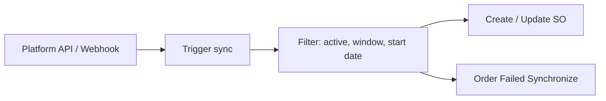
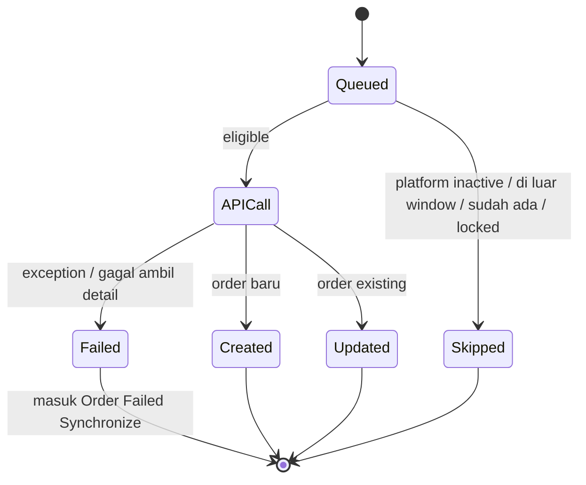
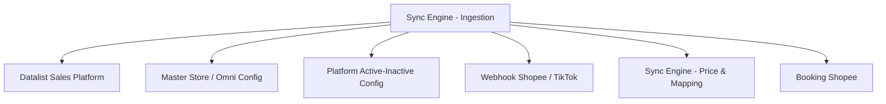

# Sales Platform — Sync Engine: Ingestion & Scheduling — Source of Truth

> Scope: mekanisme penarikan order dari platform ke sistem — trigger, jadwal, window tanggal, gating platform aktif, dan riwayat batch (Log Data). Logic harga produk (Shopee/TikTok), pre-sale time, API Data Log detail order, dan relasi Platform Account Label ada di SOT sync engine bagian price & mapping. Halaman list dan detail ada di SOT masing-masing.

## 1. Ringkasan Eksekutif

Sync engine menarik order dari marketplace dan menyimpannya sebagai Sales Order platform. Order bisa masuk lewat beberapa trigger (jadwal otomatis, manual, webhook), lalu difilter berdasarkan platform aktif, window tanggal, dan Order Sync Start Date sebelum di-create/update. Order yang gagal masuk tercatat di Order Failed Synchronize. Setiap batch sync dan event store terekam di Log Data. Audience: Ops (monitoring sync) dan dev.



## 2. Prasyarat

| Prerequisite | Sumber | Catatan |
|---|---|---|
| Store authorized dan active | Master Store | Hanya store ini yang disync dan dihitung di Order Synchronize Status |
| Platform status Active | Config Active/Inactive platform | Inactive berarti tidak ada API call sama sekali |
| Webhook aktif (Shopee, TikTok) | Integrasi platform | Untuk update realtime; Lazada tanpa webhook |
| Order Sync Start Date (opsional) | Omni Channel Configuration | Membatasi order lama masuk |

## 3. Siklus Status (outcome per order saat sync)



| Outcome | Kondisi | Efek |
|---|---|---|
| Created | Order baru berhasil dibuat | Counter `order_created` naik |
| Updated | Order existing berhasil di-update | Counter `order_updated` naik |
| Skipped | Sudah ada, `order_sn` kosong, di-lock, di luar window | Counter `order_skipped` naik |
| Failed | Exception, gagal ambil detail, produk belum sync | Counter `order_failed` naik; masuk Order Failed Synchronize |

## 4. Datalist — Log Data (riwayat batch sync)

Log Data adalah slideover dari toolbar datalist. Satu baris = satu batch/event sync (bukan satu order). Default sort `sync_started` DESC. Legend visible: `✓` tampil, `✗` hidden.

| Kolom | Field | Vis | Definisi |
|---|---|---|---|
| Store | `store_name` | ✓ | Store yang di-sync, dengan badge platform |
| Action | `type` | ✓ | Sync Order / Update Store / Revalidate Order |
| Description | `description` | ✓ | Narasi event (rentang waktu sync, ON/OFF auto sync, revalidate) |
| Date | `created_at` | ✓ | Waktu log dicatat |
| Success | `order_success` | ✓ | `order_created + order_updated`; `-` jika keduanya kosong |
| Failed | `order_failed` | ✓ | Jumlah order gagal di batch |
| Skipped | `order_skipped` | ✓ | Jumlah order dilewati |
| Started | `sync_started` | ✓ | Awal window/proses sync |
| Ended | `sync_ended` | ✓ | Selesai batch; kosong jika job masih jalan atau event tanpa end |
| Updated By | `created_by_formatted` | ✓ | User pemicu (manual); kosong jika auto/system |
| Created | `order_created` | ✗ | Order baru dibuat |
| Updated | `order_updated` | ✗ | Order existing di-update |
| Platform | `platform_name` | ✗ | Nama platform store |

Jenis Action: **Sync Order** (batch sync order), **Update Store** (toggle auto-sync store ON/OFF), **Revalidate Order** (manual re-check failed process batch). Live update lewat echo: tombol refresh muncul jika ada log baru. Retention: job pembersih menghapus log lama. Log Data ini **berbeda** dari API Data Log di halaman detail order (raw response per order) — lihat SOT sync engine price & mapping.

## 5. Form & Field (config yang menyetir sync)

| Field | Lokasi | Tipe | Catatan |
|---|---|---|---|
| Order Sync Start Date | Omni Channel Configuration | Date Time (DD-MM-YYYY HH:MM:SS) | Opsional; kosong berarti pakai default 48 jam. Diasumsikan global per company `[VERIFY: CODEBASE]` per-store atau global |
| Platform Active/Inactive | Config platform | Toggle | Inactive menonaktifkan Sync Product, Sync Order, Sync Return, Sync Warehouse |
| Auto Sync store ON/OFF | Per store | Toggle | OFF berarti order dari platform tidak disinkronkan; tercatat sebagai Update Store di Log Data |

Tooltip Order Sync Start Date: order yang dibuat sebelum tanggal ini tidak akan disync, apapun trigger-nya; kosongkan untuk pakai default window 48 jam.

## 6. How It Works

### 6a. Window tanggal: 48 jam lookback dan Order Sync Start Date

Baseline: sistem maksimal ambil order 48 jam ke belakang dari waktu sync. Jika Order Sync Start Date diisi, batas awal ditentukan tabel berikut:

| Kondisi | Batas awal order yang disync |
|---|---|
| Order Sync Start Date tidak diisi | 48 jam ke belakang dari waktu sync |
| Waktu auth/sync sebelum Order Sync Start Date | Order Sync Start Date |
| Waktu auth/sync setelah Order Sync Start Date, selisih ≤ 48 jam | Order Sync Start Date |
| Waktu auth/sync setelah Order Sync Start Date, selisih > 48 jam | 48 jam ke belakang dari waktu sync |

Perubahan nilai Order Sync Start Date hanya berlaku untuk sync berikutnya; order yang sudah masuk tetap tersimpan.

### 6b. Interval sync berbasis jam (semua platform)

Sistem membaca waktu server untuk menentukan interval auto sync. Pukul 05:59 sampai 18:00 auto sync jalan setiap 5 menit; pukul 18:01 sampai 06:00 auto sync jalan setiap 1 jam. Range data yang diambil tetap 48 jam ke belakang. Transisi antar interval otomatis tanpa gap dan tanpa restart service. Berlaku semua platform.

`[VERIFY: CODEBASE]`: timezone yang dipakai — waktu server UTC atau waktu lokal WIB (UTC+7). Belum terkonfirmasi; menentukan jam efektif transisi.

### 6c. Gating platform Active/Inactive

Jika platform Inactive, sistem tidak melakukan API call sama sekali ke platform tersebut, dan seluruh sinkronisasi (Product, Order, Return, Warehouse) dinonaktifkan. Semua scheduler/job harus cek status config ini sebelum menjalankan proses. Jika Active, sync berjalan seperti existing.

### 6d. Tiga jalur sync

| Jalur | Trigger | Cakupan |
|---|---|---|
| Bulk Sync Sales Order | Klik user di toolbar datalist | Semua store authorized dan active, via background job |
| Sync per order | Klik user di row / detail | 1 order spesifik (refresh update terakhir) |
| Retry (Order Failed Synchronize) | Klik user di order gagal | Masukkan ulang order yang gagal sync |

Bulk Sync dilindungi guard anti-overlap: jika job sync sejenis (jenis dan parameter sama) masih berjalan atau antre, klik berikutnya tidak dijalankan ulang, button blocked sementara, dan muncul notifikasi. Wording: "The system is currently processing your request in the background. Please wait until the process is completed before trying again."

`[VERIFY: CODEBASE]`: kamu menyebut anti-overlap idealnya membuat job baru hanya memproses order yang belum kepegang job sebelumnya. Yang teridentifikasi di codebase adalah mekanisme lock (cegah job kembar) plus cek existing, bukan persis "job baru ambil sisa order job sebelumnya". Perlu diverifikasi nuansanya.

### 6e. Auto-sync store ON/OFF dan Revalidate

Toggle auto-sync per store: OFF berarti order platform store tidak disinkronkan; ON/OFF tercatat sebagai event Update Store di Log Data. Revalidate Order = manual re-check failed process untuk seluruh SO di satu store (tercatat sebagai event Revalidate).

## 7. Validasi

| # | Kondisi | Behavior | Message |
|---|---|---|---|
| V1 | Platform status Inactive | Tidak ada API call; sync Product/Order/Return/Warehouse nonaktif | — |
| V2 | Order dibuat sebelum Order Sync Start Date | Tidak disync apapun trigger-nya | — |
| V3 | Order Sync Start Date dikosongkan | Fallback ke window 48 jam | — |
| V4 | Bulk Sync saat job sejenis masih jalan/antre | Tidak dijalankan ulang; button blocked | Wording di Section 6d |
| V5 | Retry order gagal-sync karena batasan tanggal | Tetap eligible karena dipicu manual user | — |
| V6 | Order sudah ada / `order_sn` kosong / di-lock | Skipped, counter `order_skipped` naik | — |

## 8. Relasi Menu Lain



| Menu | Peran dalam relasi |
|---|---|
| Datalist Sales Platform | Menampilkan hasil sync; toolbar Bulk Sync dan Log Data |
| Master Store / Omni Config | Sumber store aktif, WH process, Order Sync Start Date |
| Platform Active-Inactive Config | Gate apakah sync jalan |
| Webhook Shopee / TikTok | Update realtime (Lazada ikut schedule 06:00) |
| Sync Engine Price & Mapping | Melengkapi harga, pre-sale time, additional cost/disc |
| Booking Shopee | Sync/webhook booking dengan dedup; Order ID orphan (advance package tanpa booking_sn) skip create sampai **MATCHED** — lihat SOT booking v1.1 |

## 9. Gap Registry

| ID | Deskripsi | Dampak | Status |
|---|---|---|---|
| GAP-SYN-01 | Optimasi skip sync Shopee (skip order Cancelled/Completed sebelum API call, exclude order in-process dari auto sync 5 menit, event-based sync, audit skip reason) belum diimplementasi — terverifikasi via analisa codebase QA, tidak bisa dites manual karena tidak ada store Shopee aktif di staging | API call Shopee tetap boros; risiko store Shopee kena unauthorized akibat API limit harian | Open |

Item lain yang masih `[VERIFY: CODEBASE]`: timezone interval (UTC atau WIB), Order Sync Start Date per-store atau global, nuansa anti-overlap Bulk Sync (lock versus ambil sisa order).

Catatan GAP-SYN-01: requirement-nya sudah lengkap dengan open item terjawab (pengecekan status pakai contains bukan exact; kondisi AC3 cukup sudah get resi/tracking number; order yang cancel setelah di-exclude dibiarkan tertangkap saat proses operasional; alert API limit belum perlu). Requirement dipakai sebagai target implementasi, bukan behavior AS-IS.

## 10. FAQ

**Kenapa order lama tidak ikut masuk saat store baru di-authorize?**
Karena ada Order Sync Start Date atau window 48 jam. Order sebelum batas awal tidak akan disync.

**Kenapa malam hari sync terasa lebih jarang?**
Di luar jam operasional (18:01 sampai 06:00) interval auto sync jadi 1 jam untuk hemat API call. Siang (05:59 sampai 18:00) tetap 5 menit.

**Aku matikan platform tapi masih ragu, apakah masih ada API call?**
Jika platform di-set Inactive, tidak ada API call sama sekali ke platform itu.

**Store Shopee sering kena unauthorized, kenapa?**
Terkait limit API call harian Shopee. Optimasi skip sync yang seharusnya menekan ini masih berstatus gap (GAP-SYN-01), belum aktif.

## 11. Changelog

| Tanggal | Versi | Perubahan |
|---|---|---|
| 2026-07-15 | 1.0 | Draft awal — sync engine ingestion & scheduling |

## 12. Knowledge Base Hints (untuk operator)

Istilah teknis ke padanan awam:

| Istilah teknis | Padanan awam untuk KB |
|---|---|
| Lookback window 48 jam | Ambil order maksimal 2 hari ke belakang |
| Order Sync Start Date | Batas awal tanggal order yang boleh masuk |
| Active/Inactive platform | Nyalakan/matikan tarik data dari platform |
| Auto sync ON/OFF | Nyalakan/matikan tarik order otomatis untuk store |
| Batch / event sync | Satu putaran tarik order atau perubahan setting store |
| Skipped | Order dilewati (sudah ada / tidak valid / di-lock) |

Skenario troubleshooting:
- Order platform tidak masuk padahal ada: cek window tanggal dan Order Sync Start Date; kalau memang perlu, retry manual per order.
- Status Lazada telat: Lazada tanpa webhook, ikut sync 06:00 atau tekan Sync di order-nya.
- Sync terasa berhenti: cek panel Order Synchronize Status (di datalist) untuk store yang lag.

Field yang tidak relevan untuk operator (skip di KB): `so_date_greater_than`, `is_success`, kolom audit `owned_by`, counter internal mentah.

## 13. Technical Hints (untuk developer)

Area codebase (nama umum): scheduler auto sync, command/job sync order, service ingestion (create/update SO), handler webhook Shopee/TikTok, guard anti-overlap Bulk Sync, controller dan entity Log Data, job pembersih log lama, config Active/Inactive platform, resolver window tanggal.

Invariants (kandidat assertion test):
- Success batch = `order_created + order_updated`.
- Batas awal sync = hasil precedence Section 6a (48 jam lookback versus Order Sync Start Date), bukan campuran keduanya.
- Platform Inactive berarti nol API call ke platform tersebut untuk semua jenis sync.
- Interval auto sync ditentukan jam server: 05:59 sampai 18:00 lima menit, 18:01 sampai 06:00 satu jam; range data tetap 48 jam.
- Bulk Sync tidak menjalankan job kembar saat job sejenis masih berjalan/antre.

Failure modes:
- API limit Shopee tercapai: store bisa di-override unauthorized oleh platform (akar masalah GAP-SYN-01).
- API platform gagal saat hitung Platform SO Total: tampil `failed`, jangan blank.
- Job overlap: guard cegah duplikat; pastikan tidak double-count order.
- Perubahan Order Sync Start Date ke tanggal lebih maju: berpotensi memotong order yang sebelumnya bisa masuk (open item warning dialog belum diputus).

Data lifecycle lintas dokumen:
- Perubahan Order Sync Start Date hanya berlaku untuk sync berikutnya.
- Status platform PAID/CANCELLED yang masuk lewat webhook/schedule memicu sequencing dan auto-delete (detail di SOT datalist).
- Booking Shopee sync/webhook dedup by `booking_number` atau `platform_order_id` (detail di SOT booking).

## 14. Referensi Struktur untuk Cursor

```
Section 1-11 → material utama untuk requirement.md
Section 5, 6, 7, 10 → adaptasi ke knowledge-base.md dengan tone awam (lihat Section 12 KB Hints)
Section 13 Technical Hints → seed untuk technical.md, dilengkapi Cursor dari codebase
Frontmatter YAML di atas → copy ke 3 file utama, sinkronkan version + last_updated
Golden reference tone & struktur: docs/qa-docs/accounting-supplier-invoice/
```
