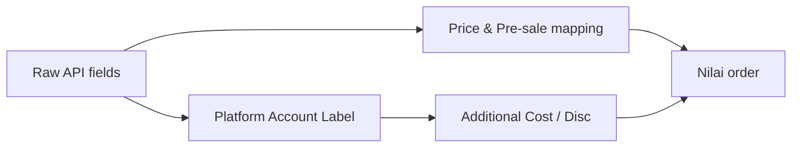
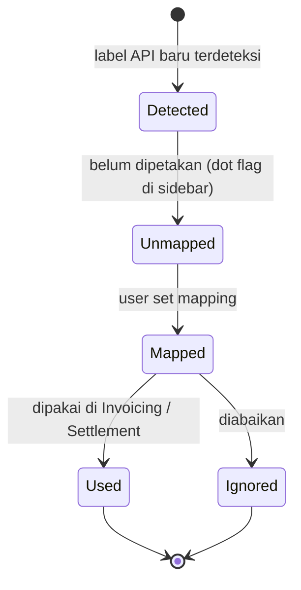
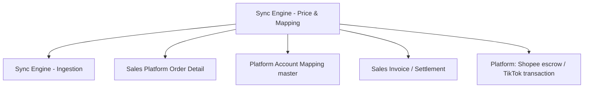

# Sales Platform — Sync Engine: Price & Data Mapping — Source of Truth

> Scope: bagaimana nilai mentah dari API platform diterjemahkan jadi nilai order — harga produk (Shopee/TikTok), pre-sale time, additional cost/disc lewat Platform Account Label — plus transparansi raw data (API Data Log). Trigger, jadwal, dan window sync ada di SOT sync engine ingestion. Section Totals dan Net Sales ada di SOT order detail.

## 1. Ringkasan Eksekutif

Bagian ini mengatur pemetaan data platform: dari field API mentah menjadi harga produk, pre-sale time, dan komponen additional cost/disc yang dipakai proses Invoicing/Settlement. Menu Platform Account Label jadi kontrol user untuk menentukan label API mana yang dipakai atau diabaikan. API Data Log menyediakan raw response platform untuk audit. Audience: Finance (akurasi nilai) dan dev.



## 2. Prasyarat

| Prerequisite | Sumber | Catatan |
|---|---|---|
| Binding produk platform ke System Product | Master System Product | Wajib agar nilai harga dan COGS terpetakan benar |
| Master Platform Account Mapping | Menu Platform Account Mapping | Harus dibuat dulu sebelum mapping label |
| Akses API tambahan | Integrasi platform | Shopee `v2.payment.get_escrow_detail`, TikTok `get-transaction-by-order` |

## 3. Siklus Status (lifecycle label API)



| State | Kondisi | Efek |
|---|---|---|
| Detected | Label baru muncul dari API SO yang masuk | Masuk daftar Platform Account Label |
| Unmapped | Belum dipetakan; last edit user lebih lama dari latest sync label | Dot flag muncul di sidebar menu |
| Used / Ignored | User memetakan sebagai dipakai atau diabaikan | Menentukan apakah label jadi additional cost/disc |

## 4. Datalist & Panel

### 4a. Menu Platform Account Label

Datalist menampilkan seluruh nama label API dari platform, tiap baris dari master Platform Account Mapping. Kolom inti: nama label API, field select untuk mencocokkan ke master mapping, dan penanda dipakai/diabaikan. Di atas datatable ada info **Updated At** (kapan terakhir sistem menerima sync data label API). Khusus Shopee, field name dari `v2.payment.get_escrow_detail` ikut muncul; khusus TikTok dari `get-transaction-by-order`.

### 4b. API Data Log (di halaman detail order)

Modal di halaman detail order menampilkan raw response API platform (read-only, untuk audit). Dua section:

| Section | Default | Catatan |
|---|---|---|
| API Data Log | Expand | Data API integrasi default |
| API get_escrow_detail | Collapsed | Hanya muncul jika platform Shopee; jika bukan Shopee tampil teks "No data available" |

Jika pengambilan data gagal, tampilkan notifikasi jelas — jangan blank. Ini berbeda dari Log Data (riwayat batch sync) di toolbar datalist.

## 5. Form & Field

| Field | Lokasi | Tipe | Catatan |
|---|---|---|---|
| Label API | Platform Account Label (row) | Read-only | Nama label dari API platform |
| Mapping select | Platform Account Label (row) | Select | Cocokkan ke master Platform Account Mapping |
| Dipakai/Diabaikan | Platform Account Label (row) | Toggle/flag | Menentakan masuk additional cost/disc atau tidak |
| Updated At | Header datatable | Read-only | Waktu terakhir sync data label API |

## 6. How It Works

### 6a. Harga produk Shopee

Harga produk pada detail order Shopee **selalu** diambil dari field API `modal_discounted_price`, tanpa fallback. Jika `modal_discounted_price` bernilai 0, harga produk di sistem = 0 (tidak fallback ke `original_price`). Field `original_price` tidak lagi dipakai sebagai fallback. Berlaku hanya untuk Shopee; order Shopee yang sudah masuk sebelum perubahan tidak di-recalculate.

Contoh: `modal_discounted_price` 50.000 memberi harga 50.000. `modal_discounted_price` 0 dengan `original_price` 80.000 tetap memberi harga 0.

### 6b. Harga produk TikTok

Harga produk pada detail order TikTok dihitung dari `sale_price` tambah `platform_discount`, keduanya diambil dari API TikTok saat sync. Ini menyamakan nilai produk dengan file settlement TikTok (yang memakai harga sebelum diskon platform). Berlaku hanya untuk TikTok; order lama tidak di-recalculate.

Contoh: `sale_price` 80.000 tambah `platform_discount` 20.000 memberi harga 100.000.

`[VERIFY: CODEBASE]`: behavior jika `platform_discount` tidak ada atau NULL di response API — diperlakukan sebagai 0 atau error. Open item ini perlu dikonfirmasi hasil implementasinya.

### 6c. Pre-sale time per platform

| Platform | Sumber pre-sale time |
|---|---|
| Shopee | Field API `ship_by_date` |
| TikTok | Field API `shipping_due_time` |
| Tokopedia | Field `preorder_deadline` (khusus preorder) |
| Lazada | Tidak diambil — `fulfillment_sla` hanya teks bebas, bukan datetime valid |

Shopee dan TikTok menyediakan waktu pengiriman pasti sehingga tidak perlu hitung manual (sebelumnya Shopee memakai `created_time` tambah `days_to_ship`). Lazada tanpa pre-sale time valid adalah limitation yang didokumentasikan, bukan gap.

### 6d. Platform Account Label ke Additional Cost/Disc

Komponen harga di luar nilai produk (dibawa API sebagai label seperti diskon coin, voucher, biaya platform) dipetakan lewat Platform Account Label. User menentukan tiap label dipakai atau diabaikan saat Invoicing/Settlement, sebagai faktor penambah (additional cost) atau pengurang (additional disc) nilai order. Untuk Sales Order platform, additional cost/disc **tidak bisa di-insert manual** — murni dari mapping ini (lihat SOT order detail). Sistem mendeteksi label API baru dan memberi flag (dot) di sidebar agar user segera memetakan. Audit log dicatat setiap user mengedit mapping. COA yang di-setup harus mengikuti owner id store.

### 6e. Escrow detail Shopee

Data payment buyer seperti Discount Coins dan discount voucher dari Shopee tidak tersedia di API standar, sehingga diambil dari API legal `v2.payment.get_escrow_detail` dan ditampilkan di API Data Log (section get_escrow_detail). Tujuannya transparansi dan mencegah mismatch antara dashboard Shopee, sistem omnichannel, dan OlshopERP. Tidak mengubah mapping data utama.

## 7. Validasi

| # | Kondisi | Behavior | Message |
|---|---|---|---|
| V1 | Order Shopee, `modal_discounted_price` = 0 | Harga produk = 0, tidak fallback ke `original_price` | — |
| V2 | Order TikTok masuk | Harga = `sale_price` tambah `platform_discount` | — |
| V3 | Order TikTok, `platform_discount` NULL/tidak ada | `[VERIFY: CODEBASE]` treat 0 atau error | — |
| V4 | Order Lazada | Pre-sale time tidak diambil | — |
| V5 | Buka API Data Log pada order non-Shopee | Section get_escrow_detail tampil "No data available" | — |
| V6 | Gagal ambil raw data platform | Tampilkan notifikasi jelas, jangan blank | — |
| V7 | Ada label API baru belum dipetakan (last edit user lebih lama dari latest sync) | Dot flag muncul di sidebar Platform Account Label | — |

## 8. Relasi Menu Lain



| Menu | Peran dalam relasi |
|---|---|
| Sync Engine Ingestion | Menyediakan order mentah yang dipetakan harganya di sini |
| Sales Platform Order Detail | Menampilkan harga, pre-sale time, additional cost/disc hasil mapping |
| Platform Account Mapping master | Sumber master untuk mencocokkan label API |
| Sales Invoice / Settlement | Konsumen mapping label (dipakai/diabaikan) |
| Platform (Shopee/TikTok) | Sumber API escrow detail dan transaction |

## 9. Gap Registry

| ID | Deskripsi | Dampak | Status |
|---|---|---|---|

Belum ada gap terkonfirmasi untuk bagian ini. Item yang masih `[VERIFY: CODEBASE]`: hasil implementasi behavior TikTok `platform_discount` NULL (treat 0 atau error), dan keputusan backfill order lama Shopee/TikTok (spec menyatakan tidak recalculate — konfirmasi apakah ada backfill dilakukan). Pre-sale time Lazada yang tidak diambil adalah limitation yang didokumentasikan, bukan gap.

## 10. FAQ

**Kenapa harga produk Shopee bisa 0?**
Jika `modal_discounted_price` dari Shopee memang 0 (misal produk gratis, full discount, bundle promo), harga di sistem tetap 0. Sistem tidak lagi menggantinya dengan harga normal.

**Kenapa nilai produk TikTok di sistem lebih tinggi dari harga jual bersih?**
Karena harga TikTok kini dihitung `sale_price` tambah `platform_discount`, supaya konsisten dengan file settlement TikTok.

**Kenapa order Lazada tidak punya pre-sale time?**
Field waktu pengiriman Lazada berupa teks bebas, tidak bisa diproses sebagai tanggal, jadi tidak diambil.

**Section get_escrow_detail kosong di order non-Shopee, kenapa?**
Escrow detail hanya tersedia untuk Shopee. Platform lain menampilkan "No data available".

**Ada titik/dot di menu Platform Account Label, artinya apa?**
Ada label API baru dari platform yang belum dipetakan. Segera cek dan mapping.

## 11. Changelog

| Tanggal | Versi | Perubahan |
|---|---|---|
| 2026-07-15 | 1.0 | Draft awal — sync engine price & data mapping |

## 12. Knowledge Base Hints (untuk operator)

Istilah teknis ke padanan awam:

| Istilah teknis | Padanan awam untuk KB |
|---|---|
| modal_discounted_price / sale_price / platform_discount | Field harga dari platform |
| Pre-sale time | Batas waktu pengiriman dari platform |
| Label API | Komponen harga/biaya yang dikirim platform |
| Mapping label | Menentukan komponen dipakai atau diabaikan |
| Escrow detail | Rincian pembayaran buyer dari Shopee |
| API Data Log | Data mentah dari platform untuk pengecekan |

Skenario troubleshooting:
- Nilai order beda dengan settlement platform: cek mapping Platform Account Label dan pastikan label penambah/pengurang sudah dipetakan.
- Harga produk terlihat 0: untuk Shopee ini bisa benar bila memang gratis/full discount.
- Ada dot di menu label: mapping label baru dulu agar Invoicing/Settlement akurat.

Field yang tidak relevan untuk operator (skip di KB): nama field API mentah, `original_price` (tidak lagi dipakai Shopee), raw JSON escrow (lebih ke audit dev/Finance).

## 13. Technical Hints (untuk developer)

Area codebase (nama umum): mapper harga per platform, resolver pre-sale time, integrasi API escrow Shopee dan transaction TikTok, controller Platform Account Label, detektor label API baru dan flagging sidebar, renderer API Data Log modal.

Invariants (kandidat assertion test):
- Harga produk Shopee = `modal_discounted_price` (tanpa fallback, termasuk saat 0).
- Harga produk TikTok = `sale_price` tambah `platform_discount`.
- Pre-sale time sesuai sumber per platform (Section 6c); Lazada tidak diisi.
- Additional cost/disc order platform hanya berasal dari label yang dipetakan sebagai dipakai; tidak bisa insert manual.
- Section get_escrow_detail hanya terisi untuk Shopee.
- COA mengikuti owner id store.

Failure modes:
- `platform_discount` NULL pada TikTok: perlu penanganan pasti (treat 0 atau error) — belum terkonfirmasi.
- API escrow/transaction gagal: tampilkan notifikasi, jangan blank.
- Label API baru belum dipetakan: nilai additional cost/disc bisa kurang lengkap; flag sidebar memandu user.

Data lifecycle lintas dokumen:
- Order lama Shopee/TikTok tidak di-recalculate saat logic harga berubah (hanya order sync setelah deploy).
- Mapping label API menentukan additional cost/disc yang dipakai Invoicing/Settlement.
- Nilai additional cost/disc masuk Section Totals dan Net Sales di order detail, tetapi tidak menerbitkan journal dan tidak mengalir ke Sales Invoice.

## 14. Referensi Struktur untuk Cursor

```
Section 1-11 → material utama untuk requirement.md
Section 5, 6, 7, 10 → adaptasi ke knowledge-base.md dengan tone awam (lihat Section 12 KB Hints)
Section 13 Technical Hints → seed untuk technical.md, dilengkapi Cursor dari codebase
Frontmatter YAML di atas → copy ke 3 file utama, sinkronkan version + last_updated
Golden reference tone & struktur: docs/qa-docs/accounting-supplier-invoice/
```
