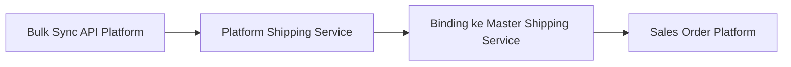
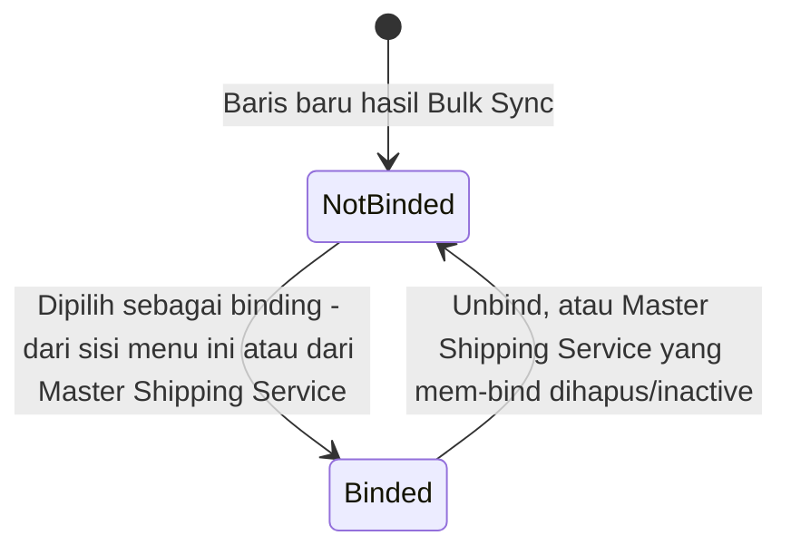
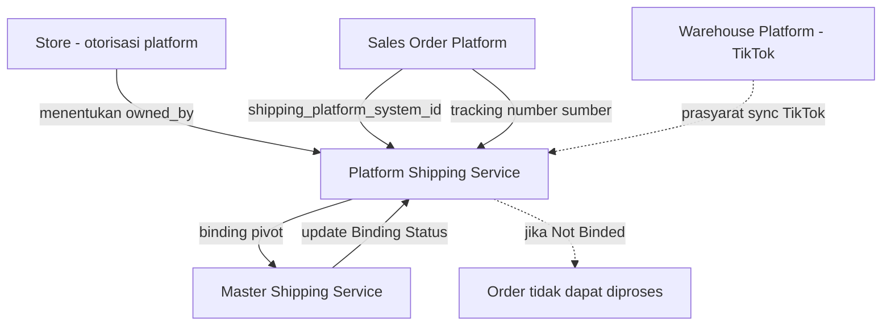

# Platform Shipping Service — Source of Truth

## 1. Ringkasan Eksekutif

Platform Shipping Service adalah menu master data read-only yang menampilkan katalog shipping service (jasa kirim) hasil sinkronisasi dari API marketplace milik store yang sudah authorized di OlshopERP. Data ini menjadi jembatan binding ke Master Shipping Service internal, sebelum bisa dipakai memvalidasi dan memproses Sales Order platform. Untuk saat ini, proses sync otomatis (Bulk Sync) hanya berjalan untuk platform Shopee dan TikTok Shop — lihat GAP-PSP-07 soal status Tokopedia dan Lazada. Audience utama: tim Omni Channel Operation dan QA.



> Dokumen ini adalah versi 2.0, menggantikan `platform_shipping_service_requirement.md` v1.0 (23 Juni 2026). Sebagian besar item `[VERIFY: CODEBASE]` di v1.0 sudah terjawab lewat analisa codebase 31 Juli 2026 — lihat Section 11 Changelog.

---

## 2. Prasyarat

| Prasyarat | Sumber | Catatan |
|---|---|---|
| Store platform (Shopee/TikTok) berstatus authorized dan active | Master Store | Wajib supaya Bulk Sync bisa jalan; tanpa ini muncul pesan reauthorize per platform |
| Untuk TikTok: Warehouse Platform sudah tersinkron per store | Warehouse Platform | Delivery options TikTok butuh warehouse platform id lebih dulu |
| Tidak ada job lock `sync_shipping` yang sedang berjalan | Queue System | Divalidasi lewat endpoint validate queue sebelum tombol Start Sync aktif |
| Token OAuth store masih valid | Otorisasi Store | Kalau expired, user diarahkan reauthorize store |

---

## 3. Siklus Status

Menu ini tidak punya siklus dokumen transaksional — status yang relevan adalah Binding Status per baris data.



| Status | Kondisi Transisi | Editable Manual? | Tombol yang Muncul |
|---|---|---|---|
| Not Binded | Baris baru dari Bulk Sync, belum pernah dipilih sebagai binding target | Tidak — read only | Icon link menuju Binding Modal |
| Binded | Sudah terhubung ke 1 Master Shipping Service (lihat Section 7 soal batas 1 binding) | Tidak — read only | Icon link menuju Binding Modal (lihat/unbind) |

---

## 4. Datalist

| Kolom | Visible Default | Sumber Data | Keterangan |
|---|---|---|---|
| Code | Ya | Diambil langsung dari platform | Contoh: `SP-J&T Express-DO` |
| Service Name | Ya | Diambil langsung dari platform | Nama layanan versi marketplace |
| Type Service | Ya | Diambil dari relasi tipe internal, bukan murni dari API | Hanya 2 opsi Pickup/Dropoff secara konsep — AS-IS selalu di-set ke tipe id yang sama saat sync, lihat GAP-PSP-01 |
| Max Weight | Ya | Diambil dari platform | Format gram |
| Max Dimensions | Ya | Diambil dari platform | Format L x W x H cm |
| Platform Name | Ya | Diambil dari platform | Shopee / TikTok Shop / Tokopedia / Lazada |
| Binding Status | Ya | Sistem, cek keberadaan pivot binding | Not Binded / Binded — lihat Section 3 |
| Active | Ya | Sistem | Selalu Yes secara default; tidak ada akses edit untuk mengubah ke No |
| Created By \| Created At | Ya | User dan waktu saat trigger Bulk Sync | - |
| Action | Ya | - | Icon link ke Binding Modal |
| ID | Tidak (hidden) | Sistem | ID internal OlshopERP, bukan ID dari platform |
| Store Name | Tidak (hidden) | Store aktif pertama per platform | Bukan store spesifik sumber sync baris tersebut — lihat GAP-PSP-04 |

**Fitur datalist lain:** Show Deleted Data (soft delete toggle), Bulk Delete (checkbox multi), Filter kolom. Tidak ada tombol Create — operator tidak bisa input manual dari list ini.

---

## 5. Form & Field — Bulk Sync Shipping Service

Menu ini tidak punya halaman create/edit untuk operator. Satu-satunya titik input adalah side page Bulk Sync.

| Field / Aksi | Wajib? | Default | Sumber Opsi | Validasi | Catatan |
|---|---|---|---|---|---|
| Tombol Start Sync | - | - | - | Ditolak jika ada job lock `sync_shipping` aktif | Trigger dispatch job sync per store Shopee/TikTok yang authorized+active |
| Sync Log (tabel history) | - | - | Data hasil sync sebelumnya | - | Menampilkan riwayat eksekusi Bulk Sync |
| Preview Store IDs | - | - | Store per platform | - | Menampilkan `shopee_store_id`, `tiktok_store_id`, `lazada_store_id` yang terdeteksi |
| Live Preview Logistics | - | - | Panggilan langsung `getLogistics` ke API platform | Butuh store active | Untuk Lazada hanya menampilkan pesan API belum tersedia |

---

## 6. How It Works

### 6.1 Bulk Sync per Platform

Setiap channel logistic dari platform biasanya terpecah menjadi 2 baris data — suffix `-DO` (Drop Off) dan `-PU` (Pick Up) pada `code`/`name`. Contoh: `SP-J&T Express-DO` dan `SP-J&T Express-PU`.

- **Shopee**: sync menarik seluruh channel dari endpoint logistics platform, kecuali channel yang statusnya nonaktif di sisi platform. Dimensi diambil apa adanya dari respons API; kasus khusus channel tertentu (contoh: opsi ekspres milik Shopee) yang datang dengan dimensi kosong akan diisi nilai default 120 cm per sisi.
- **TikTok Shop**: sync berjalan 2 tahap — ambil daftar opsi pengiriman per gudang platform, lalu ambil daftar penyedia jasa kirim per opsi tersebut. Prasyarat: Warehouse Platform toko itu sudah tersinkron.
- **Tokopedia dan Lazada**: lihat GAP-PSP-07 — belum ada bukti implementasi sync aktif untuk kedua platform ini di codebase yang dianalisis.

### 6.2 Data Owner — Multi-Company pada Platform yang Sama

Owner data (`owned_by`) mengikuti company yang melakukan otorisasi store saat Bulk Sync dijalankan — bukan input manual. Karena itu, 2 company berbeda yang masing-masing mengotorisasi store di platform yang sama bisa menghasilkan 2 baris data yang identik secara nama dan platform, namun beda owner. Ini bukan duplikasi error.

### 6.3 Tracking Number di Sales Order Platform

Informasi tracking number yang tampil di menu Sales Order Platform bersumber dari data Platform Shipping Service — bukan dari Master Shipping Service internal, meskipun baris tersebut sudah Binded.

---

## 7. Validasi

| # | Kondisi | Behavior / Pesan |
|---|---|---|
| 1 | Ada store Shopee tapi tidak ada yang authorized+active | "Please reauthorize Shopee stores for synchronization" |
| 2 | Ada store TikTok tapi tidak authorized+active | "Please reauthorize TikTok stores for synchronization" |
| 3 | Tidak ada store yang bisa disync | Sync log dibuat, langsung selesai dengan total 0 |
| 4 | Job sync duplikat / error tak terduga | "Failed to synchronize shipping service" |
| 5 | Sync berhasil dispatch | "The shipping service data has been successfully synchronized and imported." |
| 6 | 1 Platform Shipping Service sudah pernah dibinding | "This Platform Shipping Service has already been binded." — binding baru ditolak selama status masih Binded |
| 7 | Field `shipping_service_id` kosong saat proses binding | "Please select Shipping Service" |
| 8 | Proses unbind tanpa memilih target | "Please select Shipping Service to Unbind" |
| 9 | Order platform masuk dengan shipping service masih Not Binded | Order tidak bisa diproses — muncul flag error, mengharuskan user melakukan binding terlebih dulu |
| 10 | Lihat data Master Shipping Service milik company lain lewat menu ini | "Access Denied — belongs to another company" |

**Rule binding kepemilikan (owner):** 1 Platform Shipping Service hanya boleh terbinding ke 1 Master Shipping Service dengan owner yang sama — namun requirement bisnis menyebut 1 Platform Shipping Service seharusnya bisa dibinding ke banyak Master asal beda owner id. AS-IS codebase menerapkan batas keras 1 binding aktif per baris Platform Shipping Service (lihat validasi #6 di atas). **Kontradiksi ini dicatat di GAP-PSP-02, bukan diasumsikan sepihak.**

---

## 8. Relasi Menu Lain



| Menu | Peran dalam Relasi |
|---|---|
| Master Shipping Service | Konsumen data — Platform Shipping Service jadi opsi binding di section Shipping Binding. Detail lengkap lihat SOT `omni-shipping-service`. |
| Sales Order Platform | Order membawa data shipper yang di-lookup terhadap katalog ini untuk resolve `shipping_platform_system_id`; tracking number juga bersumber dari sini |
| Store | Proses otorisasi store menentukan `owned_by` hasil sync, bukan field langsung per baris |
| Warehouse Platform (TikTok) | Prasyarat teknis — sync TikTok butuh data warehouse platform per store sebelum bisa panggil delivery options |
| Failed Ship / AWB | Memakai logistic channel ID yang sama secara tidak langsung (opsional, bukan relasi UI langsung) |

---

## 9. Gap Registry

| ID | Deskripsi | Dampak | Status |
|---|---|---|---|
| GAP-PSP-01 | Kolom Type Service AS-IS selalu di-set ke 1 tipe internal yang sama saat sync, baik untuk baris `-DO` maupun `-PU` dari platform yang sama — bukan benar-benar dibaca dari API per baris | Kolom Type Service tidak benar-benar membedakan Pickup vs Dropoff secara data; pembeda sebenarnya cuma ada di code/name | Open |
| GAP-PSP-02 | Requirement bisnis: 1 Platform Shipping Service bisa dibinding ke banyak Master Shipping Service asal beda owner id. AS-IS codebase: binding dari sisi Platform keras 1:1, ditolak begitu ada 1 binding aktif | Ambiguitas requirement vs implementasi — butuh keputusan dev/PM mana yang jadi source of truth | Open |
| GAP-PSP-03 | Field Logistic Label Template muncul di halaman Show Platform Shipping Service, padahal field ini secara konsep cuma relevan di Master Shipping Service (dan di sana pun belum fungsional — lihat GAP-MSS-05 di SOT Master) | Duplikasi field yang membingungkan operator, berpotensi dikira bisa dipakai padahal tidak | Open — recommend removal dari menu ini |
| GAP-PSP-04 | Kolom Store Name (hidden) AS-IS berisi store aktif pertama per platform, bukan store spesifik sumber sync baris data tersebut | Informasi Store Name tidak akurat kalau company punya lebih dari 1 store aktif di platform yang sama | Open |
| GAP-PSP-05 | Toggle Insurance di halaman Show tidak jelas apakah benar-benar editable untuk data hasil sync, atau seharusnya ikut non-editable seperti field lain di halaman ini | Berpotensi user mengira field ini bisa diubah dan berdampak, padahal statusnya belum jelas | `[VERIFY: CODEBASE]` — belum cukup bukti untuk masuk gap pasti |
| GAP-PSP-06 | Mapping dimensi TikTok AS-IS silang: `max_height` disimpan ke `length`, `max_length` ke `width`, `max_width` ke `height` — bukan mapping 1:1 nama field | Berpotensi data dimensi TikTok salah sumbu kalau dibaca ulang tanpa tahu mapping silang ini | Open |
| GAP-PSP-07 | Requirement menyebut 4 platform didukung (Tiktok, Shopee, Tokopedia, Lazada). Analisa codebase hanya menemukan implementasi sync aktif untuk Shopee dan TikTok; Lazada baru stub (getLogistics selalu return pesan tidak tersedia, tidak ikut Bulk Sync); Tokopedia tidak ditemukan sama sekali di area yang dianalisis | Requirement scope vs implementasi tidak sinkron — perlu klarifikasi apakah Tokopedia memang belum dikerjakan, atau ada di area codebase lain yang belum tercakup analisa ini | Open |

---

## 10. FAQ

**Q: Kenapa saya tidak bisa membuat data baru di menu ini?**
A: Menu ini murni read-only — seluruh data berasal dari hasil Bulk Sync terhadap API platform.

**Q: Kenapa ada 2 baris data dengan nama dan platform yang sama persis?**
A: Kemungkinan ada 2 company berbeda yang masing-masing mengotorisasi store di platform yang sama, sehingga data tersimpan dengan Data Owner berbeda. Ini bukan duplikasi error.

**Q: Data shipping service baru tidak muncul otomatis setelah saya authorize store baru, kenapa?**
A: Belum ada mekanisme auto-sync setelah otorisasi. Perlu trigger Bulk Sync Shipping Service secara manual.

**Q: Kolom Type Service saya kelihatannya sama semua padahal ada yang Drop Off dan Pick Up, kenapa?**
A: Ini sesuai GAP-PSP-01 — kolom ini AS-IS belum benar-benar membedakan tipe per baris data hasil sync.

**Q: Kenapa order platform saya tidak bisa diproses padahal sudah masuk ke sistem?**
A: Cek Binding Status shipping service yang dipakai order tersebut di menu ini. Kalau masih Not Binded, order akan tertahan sampai proses binding selesai.

---

## 11. Changelog

| Tanggal | Versi | Perubahan |
|---|---|---|
| 2026-06-23 | 1.0 | Dokumen awal berbasis pemahaman bisnis, 8 item `[VERIFY: CODEBASE]` terbuka |
| 2026-08-03 | 2.0 | Update penuh berbasis analisa codebase 31 Juli 2026: endpoint dan mekanisme sync per platform terkonfirmasi (job/queue per store, bukan sinkron langsung), field mapping Shopee/TikTok terdokumentasi lengkap, upsert key sync terkonfirmasi (`platform_id` + `shipping_platform_id` + `owned_by`). 7 gap baru ditambahkan (GAP-PSP-01 s.d. 07), termasuk kontradiksi Type Service, arah binding, dan status dukungan Tokopedia |

---

## 12. Knowledge Base Hints (untuk operator)

**Istilah teknis → padanan awam:**

| Istilah Teknis | Padanan Awam |
|---|---|
| Bulk Sync | Tombol untuk menarik data jasa kirim terbaru dari marketplace |
| Binding | Menyambungkan jasa kirim marketplace ke standar internal perusahaan |
| Not Binded / Binded | Belum / sudah tersambung ke jasa kirim internal |
| Data Owner / owned_by | Perusahaan pemilik data ini (berdasarkan otorisasi store) |
| Suffix -DO / -PU | Kode untuk membedakan metode Drop Off (antar sendiri ke agen) atau Pick Up (dijemput kurir) |

**Skenario troubleshooting:**

- Order platform tidak bisa diproses → cek Binding Status shipping service order tersebut, lakukan binding kalau masih Not Binded.
- Data shipping service tidak muncul walau store baru saja diauthorize → jalankan Bulk Sync Shipping Service manual.
- Muncul pesan reauthorize saat klik Start Sync → token store sudah kedaluwarsa, reauthorize store terkait dulu.

**Field yang tidak relevan operator:** kolom ID (internal reference), Store Name (hidden, tidak akurat — lihat GAP-PSP-04).

---

## 13. Technical Hints (untuk developer)

**Area codebase yang perlu didokumentasikan:** controller list/sync/binding Platform Shipping Service, job sync per store, service integrasi Shopee dan TikTok (`sync_logistic_all`, `getLogistics`), service Lazada (stub), model Platform Shipping Service dan Binding Pivot, logic validasi Sales Order yang resolve platform service.

**Invariants:**
- 1 baris Platform Shipping Service AS-IS hanya boleh punya 1 binding pivot aktif ke Master Shipping Service.
- Upsert sync AS-IS dicari berdasarkan kombinasi `platform_id` + `shipping_platform_id` + `owned_by` pada baris aktif (belum soft-deleted).
- Kolom Active AS-IS selalu true untuk baris yang belum di-soft-delete; tidak ada jalur untuk set false selain delete.

**Failure modes:**
- Store tidak authorized/active saat Bulk Sync → sync gagal per platform dengan pesan reauthorize, tidak menghentikan platform lain yang masih valid.
- Job lock `sync_shipping` bentrok → request Bulk Sync baru ditolak sampai job sebelumnya selesai.
- Binding gagal kalau shipping service platform target sudah terikat binding aktif lain.

**Data lifecycle lintas dokumen:** Binding Status berubah dari Not Binded ke Binded ketika baris ini dipilih di Section Shipping Binding menu Master Shipping Service, dan sebaliknya berubah ke Not Binded lagi kalau di-unbind dari salah satu sisi menu.

---

## 14. Referensi Struktur untuk Cursor

```
Section 1-11 → material utama untuk requirement.md
Section 5, 6, 7, 10 → adaptasi ke knowledge-base.md dengan tone awam (lihat Section 12 KB Hints)
Section 13 Technical Hints → seed untuk technical.md, dilengkapi Cursor dari codebase
Frontmatter YAML di atas → copy ke 3 file utama, sinkronkan version + last_updated
Golden reference tone & struktur: docs/qa-docs/accounting-supplier-invoice/
```
