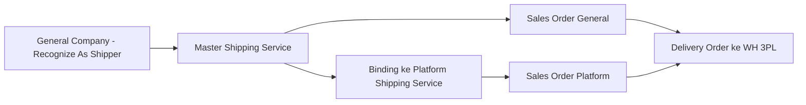
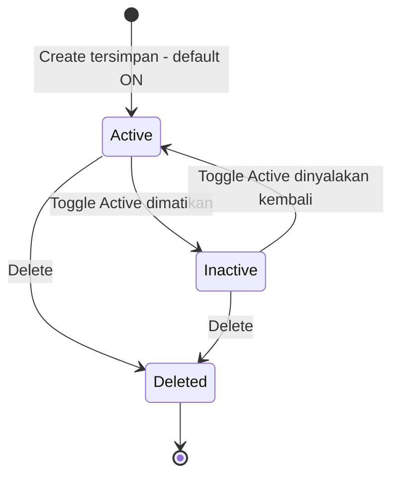
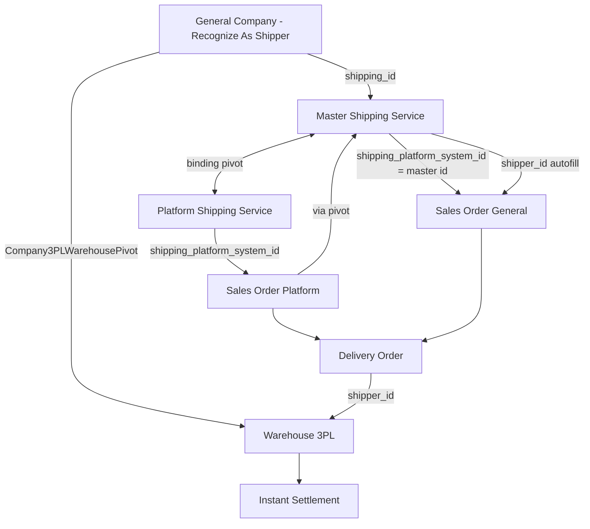

# Master Shipping Service — Source of Truth

## 1. Ringkasan Eksekutif

Master Shipping Service adalah standar jasa kirim internal per company, dipakai untuk menyatukan berbagai channel logistic marketplace (lewat binding ke Platform Shipping Service) sekaligus jadi opsi jasa kirim langsung untuk Sales Order General. Menu ini terikat ke General Company yang di-recognize sebagai Shipper, dan menjadi kunci penentu gudang 3PL tujuan pengiriman barang saat proses shipping berjalan. Audience utama: tim Omni Channel Operation, Warehouse, dan Finance (berdampak ke Instant Settlement).



---

## 2. Prasyarat

| Prasyarat | Sumber | Catatan |
|---|---|---|
| General Company sudah di-recognize sebagai Shipper (active) | Master General Company | Sistem otomatis membuat Warehouse 3PL + pivot saat company pertama kali ditandai shipper |
| Warehouse 3PL dan pivot company-warehouse untuk shipper terkait sudah terbentuk | General Company / Warehouse 3PL | **Tidak divalidasi saat Save Master** — wajib ada sebelum proses Shipping DO, lihat GAP-MSS-01 |
| Master Shipping Service Type (Pick Up / Drop Off) tersedia | Reference internal | Dipilih maksimal 1 saat create, terlihat locked setelah tersimpan |
| Company yang akan melakukan binding sudah jadi default owner data store | Store / Company Setting | Wajib — kalau belum, proses binding ditolak, lihat Section 7 |

---

## 3. Siklus Status



| Status | Kondisi Transisi | Editable? | Catatan |
|---|---|---|---|
| Active | Default saat create | Ya, lewat Edit | - |
| Inactive | User matikan toggle Active | Ya | Requirement: hanya boleh dilakukan jika shipper service belum dipakai di order manapun (platform maupun general) — lihat Section 7 dan GAP-MSS-02 soal status implementasi saat ini |
| Deleted (soft delete) | User klik Delete | - | Hanya boleh jika belum dipakai di order manapun |

**Efek ke Binding Status:** kalau Master Shipping Service yang statusnya sudah Binded di-inactive-kan atau dihapus (dalam kondisi yang diizinkan), Binding Status baris Platform Shipping Service yang terkait berubah dari Binded menjadi Not Binded. Detail siklus Binding Status ada di SOT `omni-shipping-service-platform` Section 3.

---

## 4. Datalist

Datatable menu ini ditampilkan **grouped by Shipper Name (shipper company)**.

| Kolom | Visible Default | Sumber Data | Keterangan |
|---|---|---|---|
| (ikon warning) | Ya | Perbandingan weight/dimensi master vs Platform Shipping Service yang di-bind | Muncul kalau ada selisih data antara master dan platform yang terikat |
| Code | Ya | Input user | - |
| Service Name | Ya | Input user | - |
| Shipper | Ya | Relasi General Company (`shipping_id`) | Jadi basis pengelompokan datatable |
| Type Service | Ya | Pilihan user saat create (`shipping_service_type_id`) | Drop Off / Pick Up, benar-benar 2 value berbeda sesuai pilihan user — berbeda dari Platform Shipping Service yang AS-IS hardcode 1 tipe (GAP-PSP-01) |
| Min Weight | Ya | Input user | Gram |
| Max Weight | Ya | Input user | Gram |
| Max Dimensions | Ya | Input user | L x W x H cm |
| Binding Status | Ya | Sistem, cek pivot binding | Not Binded / Binded |
| Active | Ya | Toggle user | Yes/No |
| Created By \| Created At | Ya | Sistem | - |
| As Default | Tidak (sering hidden) | `is_default_shipping_service` | - |
| Action: Edit/Show | Ya | - | Untuk edit maupun lihat data yang sudah tersimpan |
| Action: Delete | Ya | - | Lihat validasi Section 7 |

**Fitur datalist lain:**
- Global Search — `[VERIFY: CODEBASE]` apakah pencarian bersifat exact match atau contains.
- Show Deleted Data, Column Show/Hide — perilaku sama seperti menu lain di OlshopERP.
- Export — sudah mendukung Advanced Export dengan 2 varian, With Details dan Without Details. `[VERIFY: CODEBASE]` perbedaan konkret kedua varian ini (kolom apa saja yang ditambahkan di versi With Details).

---

## 5. Form & Field

### 5.1 Basic Information

| Field | Wajib? | Default | Sumber Opsi | Validasi | Catatan |
|---|---|---|---|---|---|
| Code | Ya | - | Input manual | Unik (di antara data belum dihapus) | - |
| Shipper Name | Ya | - | General Company, `is_shipper` aktif | Harus company bertipe General + recognized shipper + active | Kalau shipper yang sedang dipakai di-inactive-kan dari sisi General Company, muncul pesan shipper tidak aktif saat update |
| Shipper Service | Ya | - | Input manual | - | Nama layanan jasa kirim internal |
| Service Type | Ya | - | Reference internal, max 1 pilihan | Wajib salah satu Pick Up / Drop Off | Field ini biasanya terkunci (tidak bisa diubah) setelah data tersimpan pertama kali |
| Minimum Weight | Ya | - | Input manual, numerik | Minimal 0 | Standar berat minimum shipper service ini |
| Maximum Weight | Ya | - | Input manual, numerik | Minimal 0 | **Catatan koreksi:** requirement awal menyebut field ini tergabung dengan label "Maximum Dimensions", kemungkinan salah ketik — cross-check codebase dan kolom Datalist (Section 4) menunjukkan Max Weight adalah field numerik tersendiri, terpisah dari Max Dimensions (L/W/H). `[VERIFY: CODEBASE]` untuk konfirmasi label persis di UI |
| Maximum Dimensions (Length, Width, Height) | Ya | - | Input manual, numerik, 3 field | Masing-masing minimal 0 | Satuan otomatis CM |
| Logistic Label Template | Tidak | Kosong | - | - | Rencana fitur standar printout resi, bisa custom design. **AS-IS belum fungsional / tidak persist** — lihat GAP-MSS-05 |
| Description | Tidak | Kosong | Input manual | Maksimal 150 karakter | - |
| Toggle Available Insurance | Tidak | OFF | - | - | Flag informasi bahwa shipper service ini mengandung asuransi. Saat ini murni flag, belum ada relasi fungsional ke proses lain |
| Toggle Set as Default Shipping Service | Tidak | OFF | - | Hanya 1 default aktif per company (`owned_by`), auto-switch default lama ke OFF saat ada default baru | Hanya berlaku sebagai default value create order **pertama kali** — Sales Order General/Internal selanjutnya sudah pakai metode auto-save dari transaksi terakhir |
| Toggle Active | Tidak | ON | - | Lihat Section 7 soal validasi inactive | - |
| Toggle Show for all company | Tidak | OFF (private) | - | Kalau ON, company lain bisa melihat data ini tapi tidak bisa mengubahnya | `is_all_company` — detail permission lintas company `[VERIFY: CODEBASE]` |

Duplikasi bisnis: kombinasi Shipper + Shipper Service (name) + Service Type yang sama persis akan ditolak sistem saat create maupun update.

### 5.2 Shipping Binding

| Field | Wajib? | Sumber Opsi | Validasi | Catatan |
|---|---|---|---|---|
| Shipper Service (view only) | - | Ambil dari input Basic Information | - | Disabled, hanya informasi |
| Select Shipping Service | Ya (untuk proses binding) | Seluruh Platform Shipping Service active yang statusnya masih Not Binded | Ditolak kalau company belum jadi default owner data store; ditolak kalau target sudah Binded ke master lain | Bisa pilih multiple sekaligus, selama tiap target platform shipping masih Not Binded. Tooltip: pilihan di field ini akan otomatis terhubung ke shipping service yang dipilih |

**Contoh kasus penolakan binding:**
1. Platform Shipping Service `SP-SPX Sameday-PU` sudah terbinding ke Master Shipping Service `SHP-001`.
2. Di halaman edit `SHP-002`, user memilih `SP-SPX Sameday-PU` di field Select Shipping Service lalu klik Save.
3. Sistem menampilkan notifikasi: platform shipping tersebut sudah terikat ke shipping service lain (menyebut kode master yang sudah memilikinya).

### 5.3 Warehouse Shipper (view only)

Menampilkan tree Warehouse 3PL yang terhubung ke Shipper Name yang dipilih di Basic Information — sumber datanya dari pivot antara General Company (shipper) dan Warehouse 3PL. Kalau pivot belum terbentuk, tree ini tampil kosong tanpa peringatan tambahan di halaman ini — lihat GAP-MSS-01.

### 5.4 Audit Log

Menampilkan standar log perubahan data pada menu ini, konsisten dengan pola Audit Log menu lain di OlshopERP.

---

## 6. How It Works

### 6.1 Shipper yang Dipakai Order Mengikuti Data Terbaru, Bukan Snapshot Saat Order Masuk

Sistem membaca kondisi Master Shipping Service **terkini** saat order diproses menuju pengiriman — bukan mengunci kondisi shipper pada saat order pertama kali masuk. Contoh:

```
1 Agustus 2026, 10:00 — Order 001 masuk, memakai shipping master "Reg-Lumi"
                          shipper saat itu: "PT. Express Lumi"

1 Agustus 2026, 11:00 — Master "Reg-Lumi" diedit, Shipper Name diganti
                          menjadi "PT. Lumielle Express Indonesia"

1 Agustus 2026, 13:20 — Order 001 diproses hingga status Shipped
                          Gudang 3PL yang dipakai: "PT. Lumielle Express Indonesia"
                          (bukan "PT. Express Lumi" yang berlaku saat order masuk)
```

Ini konsisten dengan alur teknis: field shipper pada Delivery Order diisi dari `shipping_id` Master Shipping Service saat Delivery Order dibuat/diproses, bukan disalin/snapshot di titik Sales Order dibuat.

### 6.2 Gate Keras Pergerakan Stok ke Gudang 3PL

Proses Save Master Shipping Service **tidak** memvalidasi apakah Shipper Name yang dipilih sudah punya Warehouse 3PL (lewat pivot Company-Warehouse). Validasi ini baru benar-benar dicek saat proses **approve Shipping DO** — kalau pivot tidak ditemukan, proses gagal dengan pesan yang tidak secara eksplisit mengarahkan user kembali ke Master Shipping Service atau ke setup Warehouse 3PL. Lihat GAP-MSS-01.

### 6.3 Default Shipping Service untuk Sales Order

Toggle Set as Default hanya berlaku sebagai autofill saat **create order pertama kali**. Sales Order General/Internal sudah memakai mekanisme auto-save dari transaksi terakhir, sehingga default ini tidak akan terlihat lagi setelah user pernah membuat order sebelumnya.

---

## 7. Validasi

### 7.1 Create

| Field | Rule | Pesan |
|---|---|---|
| Code | Wajib, unik | "The code has already been taken." |
| Shipper Name | Wajib, harus General Company + recognized shipper + active | "Shipper not found" |
| Min/Max Weight, Dimensi | Wajib, numerik, minimal 0 | - |
| Service Type | Wajib, maksimal 1 pilihan | "The shiping service type field is required" *(typo AS-IS, dipertahankan di pesan sistem)* |
| Description | Opsional, maksimal 150 karakter | - |
| Duplikat Shipper + Name + Type | Ditolak | "Shipping service {name} {type} in {shipper} already exist" |

### 7.2 Update

Mengikuti rule Create, ditambah:

| Kondisi | Pesan |
|---|---|
| Shipper sudah tidak aktif | "Shipper is inactive. Please select another active shipper." |
| Service Type kosong | "The service type field is required" |
| Service Type di UI | Biasanya terkunci setelah data pertama kali disimpan |

### 7.3 Binding

| Kondisi | Pesan |
|---|---|
| Company belum jadi default owner data store | "Binding failed. Only master shipping from internal company that is already set as default owner data store can be bound." |
| Target Platform Shipping Service sudah terikat master lain (owner sama) | "The shipping service platform '{name}' is already bound to shipping service ({codes})" |

### 7.4 Delete

| Kondisi | Behavior |
|---|---|
| Shipper service belum dipakai di order manapun (platform maupun general) | Delete berhasil; kalau sebelumnya Binded, Binding Status berubah jadi Not Binded |
| Shipper service sudah dipakai di transaksi order | "Cannot delete this data because it is already used in transaction." — delete ditolak |

Catatan: mekanisme cek pemakaian ini AS-IS mengandalkan kolom yang untuk Sales Order Platform biasanya berisi ID Platform Shipping Service (bukan ID Master) — berpotensi tidak mendeteksi pemakaian lewat jalur binding SO Platform. Lihat GAP-MSS-03.

### 7.5 Toggle Active — Requirement Penolakan Inactive

Requirement (belum terkonfirmasi sudah berjalan di codebase, lihat GAP-MSS-02): proses inactive **harus ditolak** dengan kondisi berikut:

| # | Kondisi | Behavior yang Diharapkan |
|---|---|---|
| 1 | Shipper service sudah dipakai di order manapun (platform maupun general/internal) | Inactive ditolak — sama seperti validasi Delete |
| 2 | Shipper service belum dipakai di order manapun, tapi Binding Status sudah Binded | Inactive tetap bisa dilakukan; Binding Status berubah jadi Not Binded |

**Alasan requirement ini muncul** — 2 masalah yang saat ini terjadi kalau shipper service yang sudah dipakai order tetap bisa di-inactive-kan:
1. Field shipper di halaman Basic Information Sales Order yang bersangkutan menjadi NULL — meski approval order tetap sukses, dan nama shipper service masih tampil di datalist order.
2. Order yang lanjut ke tahap processing bisa gagal di proses Skip Processing pada tahap generate Delivery Order (setelah tahap Packed), karena sistem tidak bisa memperoleh data Shipper Name yang sudah inactive — tanpa keterangan error yang jelas ke user.

---

## 8. Relasi Menu Lain



| Menu | Peran dalam Relasi |
|---|---|
| General Company | Sumber pilihan Shipper Name; status recognized-shipper menentukan apakah company bisa dipakai; onboarding shipper otomatis membuat Warehouse 3PL + pivot |
| Platform Shipping Service | Konsumen dan sumber binding — lihat SOT `omni-shipping-service-platform` untuk detail Binding Status dan gap-nya |
| Sales Order Platform | Resolve Master lewat binding; validasi weight/dimensi order dibandingkan terhadap Master yang di-bind |
| Sales Order General | Pilih Master langsung tanpa binding; `shipper_id` diambil langsung dari `Master.shipping_id`; wajib Master berstatus active |
| Delivery Order | Tujuan akhir rantai — `shipper_id` DO menentukan Warehouse 3PL tujuan lewat pivot Company-Warehouse |
| Warehouse 3PL | Gudang tujuan pengiriman fisik, terhubung lewat shipper company, bukan langsung dari Master Shipping Service |
| Instant Settlement | Mengharapkan stok sudah berpindah ke Warehouse 3PL lewat proses Shipping DO — kalau pivot 3PL tidak lengkap, settlement outbound ikut tersendat |
| Skip Processing | Tahap generate Delivery Order di menu ini bisa gagal kalau Shipper Name yang dipakai order sudah inactive — lihat GAP-MSS-02 |

---

## 9. Gap Registry

| ID | Deskripsi | Dampak | Status |
|---|---|---|---|
| GAP-MSS-01 | Save Master Shipping Service tidak memvalidasi apakah Shipper Name yang dipilih sudah punya Warehouse 3PL (pivot Company-Warehouse). Gate keras baru terjadi saat approve Shipping DO, dengan pesan error yang tidak eksplisit mengarah ke Master Shipping Service | User baru sadar ada masalah setup jauh setelah data Master disimpan dan dipakai order, saat proses shipping sudah berjalan | Open |
| GAP-MSS-02 | Toggle Active saat ini belum menolak proses inactive walau shipper service sudah dipakai di order manapun, menyebabkan (a) field shipper di SO jadi NULL, (b) Skip Processing gagal di tahap generate Delivery Order tanpa keterangan jelas. Requirement: tolak inactive kalau sudah dipakai order; kalau belum dipakai tapi Binded, inactive tetap boleh dan Binding Status berubah Not Binded | 2 potensi kegagalan proses order tanpa error message yang jelas ke user | Open — perlu dev ticket |
| GAP-MSS-03 | Cek Destroy/Delete mengandalkan kolom yang untuk Sales Order Platform biasanya berisi ID Platform Shipping Service, bukan ID Master — berpotensi tidak mendeteksi pemakaian master lewat jalur binding SO Platform | Master Shipping Service yang sebenarnya sedang dipakai (via binding) berpotensi lolos delete | Open |
| GAP-MSS-04 | Requirement bisnis: 1 Platform Shipping Service bisa dibinding ke banyak Master Shipping Service asal beda owner id. AS-IS codebase: binding dari sisi Platform keras 1:1. Sama dengan GAP-PSP-02 di SOT `omni-shipping-service-platform` | Ambiguitas requirement vs implementasi, butuh keputusan dev/PM | Open |
| GAP-MSS-05 | Field Logistic Label Template ada di UI Master Shipping Service tapi belum fungsional / tidak persist. Field yang sama juga tampil (dan direkomendasikan dihapus) di halaman Show Platform Shipping Service — lihat GAP-PSP-03 | Fitur belum bisa dipakai meski di lokasi yang "benar" sekalipun | Open |

---

## 10. FAQ

**Q: Kenapa shipper yang dipakai order saya berubah padahal order sudah dibuat dari kemarin?**
A: Sistem membaca data Master Shipping Service terkini saat order diproses menuju pengiriman, bukan kondisi saat order pertama kali masuk. Kalau Master diedit di antara waktu itu, order akan ikut memakai data terbaru.

**Q: Kenapa saya tidak bisa memilih platform shipping service tertentu saat binding?**
A: Kemungkinan platform shipping service tersebut sudah terikat ke Master Shipping Service lain. Cek Binding Status-nya di menu Platform Shipping Service.

**Q: Kenapa proses shipping ke 3PL saya gagal padahal Master Shipping Service sudah lengkap terisi?**
A: Kemungkinan shipper company yang dipilih di Master belum punya Warehouse 3PL yang terhubung (pivot company-warehouse). Cek section Warehouse Shipping di halaman edit Master untuk konfirmasi.

**Q: Apa bedanya Min Weight dan Max Weight dengan Max Dimensions?**
A: Min/Max Weight mengatur batas berat (gram), sedangkan Max Dimensions mengatur batas ukuran fisik paket (panjang x lebar x tinggi dalam cm). Keduanya field yang terpisah.

---

## 11. Changelog

| Tanggal | Versi | Perubahan |
|---|---|---|
| 2026-08-03 | 1.0 | Dokumen awal disusun dari requirement mentah dan analisa codebase 31 Juli 2026. Termasuk 5 gap terbuka (GAP-MSS-01 s.d. 05), koreksi typo field Maximum Weight/Dimensions, dan requirement baru validasi inactive (GAP-MSS-02) |

---

## 12. Knowledge Base Hints (untuk operator)

**Istilah teknis → padanan awam:**

| Istilah Teknis | Padanan Awam |
|---|---|
| Shipper | Perusahaan jasa kirim/kurir yang dipakai |
| Binding | Menyambungkan jasa kirim marketplace ke standar internal |
| Warehouse 3PL / pivot | Gudang milik kurir tempat barang dikumpulkan sebelum dikirim ke pembeli |
| Default Shipping Service | Jasa kirim yang otomatis terisi saat bikin order baru pertama kali |
| Show for all company | Data ini bisa dilihat perusahaan lain, tapi tidak bisa mereka ubah |

**Skenario troubleshooting:**

- Shipping ke 3PL gagal terus → cek apakah shipper company di Master ini sudah punya Warehouse 3PL yang terhubung.
- Field shipper di order tiba-tiba kosong → kemungkinan Master Shipping Service yang dipakai baru saja di-inactive-kan.
- Tidak bisa binding ke platform tertentu → platform tersebut sudah terikat ke master lain, cek dulu di menu Platform Shipping Service.

**Field yang tidak relevan operator:** payload key teknis untuk binding, ID internal Platform Shipping Service di balik proses binding.

---

## 13. Technical Hints (untuk developer)

**Area codebase yang perlu didokumentasikan:** controller CRUD dan binding Master Shipping Service, model Master Shipping Service dan Binding Pivot, controller General Company (pembuatan Warehouse 3PL + pivot saat company ditandai shipper), controller Shipping DO (gate 3PL saat approve), logic validasi Sales Order (weight/dimensi vs Master).

**Invariants:**
- 1 Master Shipping Service hanya boleh 1 `shipping_service_type_id` aktif (max 1 pilihan).
- Hanya 1 Master Shipping Service per `owned_by` yang boleh berstatus Default aktif dalam satu waktu.
- Delivery Order shipper harus punya pivot Company-Warehouse 3PL sebelum approve Shipping DO bisa sukses.

**Failure modes:**
- Shipper tanpa pivot Warehouse 3PL saat approve Shipping DO → approval gagal, stok tidak berpindah, Instant Settlement ikut tersendat.
- Payload binding memakai key bertypo (`shipping_service_platfrom`) yang dipertahankan AS-IS — dicatat sebagai technical debt, bukan gap fungsional, tapi wajib konsisten dijaga di technical.md supaya tidak salah replikasi saat maintenance.
- Master Shipping Service di-inactive-kan saat masih dipakai order (AS-IS belum ditolak) → field shipper SO jadi NULL, Skip Processing berpotensi gagal di tahap generate DO.

**Data lifecycle lintas dokumen:** Binding Status pada Platform Shipping Service bergantung penuh pada keberadaan pivot binding ke Master ini — perubahan Active/Delete pada Master ini langsung memengaruhi status tersebut di menu Platform Shipping Service.

---

## 14. Referensi Struktur untuk Cursor

```
Section 1-11 → material utama untuk requirement.md
Section 5, 6, 7, 10 → adaptasi ke knowledge-base.md dengan tone awam (lihat Section 12 KB Hints)
Section 13 Technical Hints → seed untuk technical.md, dilengkapi Cursor dari codebase
Frontmatter YAML di atas → copy ke 3 file utama, sinkronkan version + last_updated
Golden reference tone & struktur: docs/qa-docs/accounting-supplier-invoice/
```
