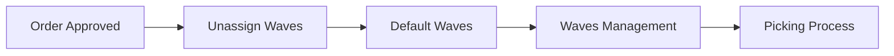
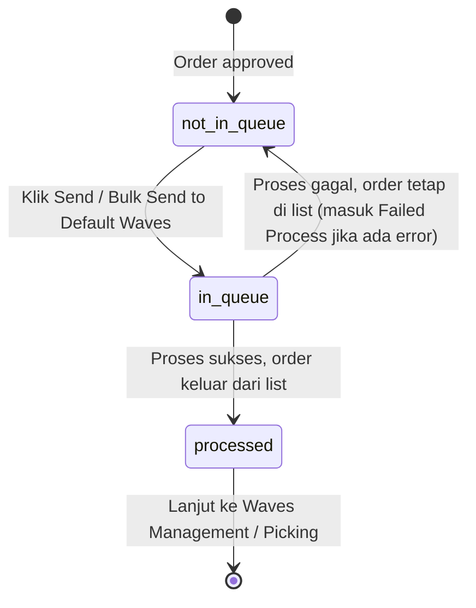
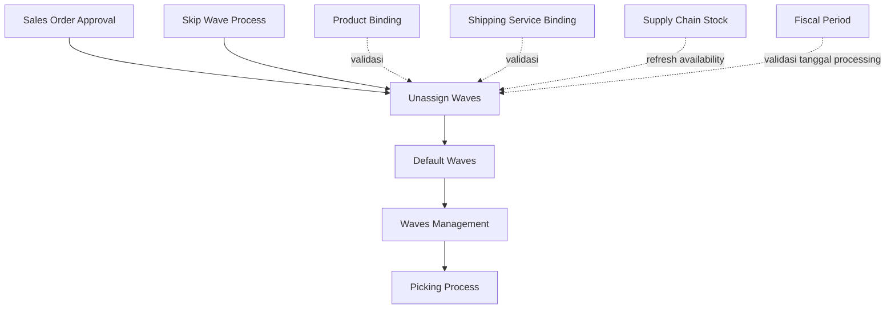

# Unassign Waves — Source of Truth

## 1. Ringkasan Eksekutif

Unassign Waves adalah **gate utama** sebelum order lanjut ke processing gudang. Menu ini menampilkan order dengan status **approved** dari order type **Platform** dan **General** yang belum dikirim ke Default Wave. Operator melakukan proses Send to Default Waves secara single maupun bulk supaya stock ter-reserve dan order siap masuk ke rantai fulfillment (picking, checking, packing, shipping). Audience utama: tim Warehouse Operation / Fulfillment.



---

## 2. Prasyarat

| Prasyarat | Sumber | Catatan |
|---|---|---|
| Order sudah berstatus approved | Sales Order Platform / General | Order dengan status di bawah approved (draft, open, dsb) tidak muncul di list ini |
| Order type Platform atau General | Sales Order | Kedua tipe muncul di datalist yang sama |
| Belum ada quantity yang sudah keluar (outbound) dari detail order | Sales Order detail | [VERIFY: CODEBASE] jika ada sebagian qty yang sudah diproses keluar, order kemungkinan tidak lagi eligible tampil di sini |
| Setting proses ke wave aktif untuk order type terkait | Order Process Setting | Jika setting mewajibkan proses lewat wave dimatikan untuk order General, maka order General bisa dikecualikan dari list ini — [VERIFY: CODEBASE] |

---

## 3. Siklus Status



| Status | Kondisi transisi | Muncul di Unassign Waves? | Tombol yang muncul |
|---|---|---|---|
| Not in Queue | Order baru approved, atau proses sebelumnya gagal | Ya | Button "Send to Default Waves" per row aktif |
| In Queue | Sedang diproses (single atau bulk) | Ya, dengan indikator sedang proses | Button disabled, tampil di pill "On Process to Default Waves" |
| Processed | Proses sukses ke Default Waves | Tidak, order hilang dari list | Tidak ada, lanjut ke Waves Management |

---

## 4. Datalist

**URL:** `https://staging.olshoperp.com/omni/unassign-wave`

### 4.1 Fitur di atas datatable

| Fitur | Perilaku |
|---|---|
| Pill "Failed Process" | Filter khusus menampilkan order yang punya error flag (icon error di kolom Error Flag). Perilakunya sama seperti tampilan failed process di halaman Sales Order Platform maupun General |
| Pill "On Process to Default Waves {count order}" | Filter menampilkan order yang sedang dalam proses send to default waves (status in queue), lengkap dengan counter jumlah order |
| Global Search | Pencarian across kolom datatable |
| Advanced Filter | Pencarian dengan multi kondisi sekaligus |
| Field "Tanggal Processing" (date time picker) | Terletak di sebelah kiri tombol "Refresh Availability Stock". Acuan tanggal processing untuk seluruh order yang diproses Send to Default Waves (single maupun bulk), menggantikan acuan tanggal order individual. Detail lengkap di Section 6.7 |
| Button "Refresh Availability Stock" | Mengecek ulang last availability stock per SKU di detail order, terhadap data stock terbaru di module Supply Chain Management. Kalau stock sudah cukup, icon error flag unavailable stock hilang dan order bisa diproses send to default waves |
| Column show and hide | Standar datatable |
| Export | Support export advanced, dengan opsi with detail dan without detail — standar datatable |
| Log Data ("Send Wave Logs") | Slide right page menampilkan log proses send to default waves |
| Toolbar bulk action | Muncul di atas tabel saat ada row yang terselect via checkbox, berisi button "Send to Default Waves" untuk proses beberapa order sekaligus |

### 4.2 Kolom datatable utama

| # | Kolom | Keterangan |
|---|---|---|
| 1 | Trx Code \| Platform Order | Kode transaksi order internal dan kode order di platform |
| 2 | Error Flag | Icon indikator error, detail lengkap lihat Section 6.1 |
| 3 | Store Name \| Buyer Name | Nama store dan nama buyer |
| 4 | Shipper \| Tracking Number | Info logistik pengiriman |
| 5 | Pre-sale Time \| Trx Date | Waktu pre-sale dan tanggal transaksi |
| 6 | Payment Time \| Deadline Time | Waktu pembayaran dan deadline proses |
| 7 | Trx Status \| Platform Status | Status transaksi internal dan status di platform |
| 8 | Process | Hanya muncul 1 icon yaitu stage 1 (wave process). Order yang sudah sukses send to default waves tidak muncul lagi di list, sehingga stage lanjutan tidak perlu ditampilkan di sini |
| 9 | Total SKU \| Total Qty Products | Agregat jumlah SKU dan quantity produk |
| 10 | Created by \| Created at | User dan waktu pembuatan order |
| 11 | Action | Button "Send to Default Waves" untuk proses single order per row |

Di sisi kiri datatable ada checkbox untuk select multiple order, dipakai bersama toolbar bulk action "Send to Default Waves" di atas tabel.

### 4.3 Slideover "Send Wave Logs"

Fitur di dalam slideover: global search, advanced filter, column show and hide, export (support advanced export).

| # | Kolom | Keterangan |
|---|---|---|
| 1 | Trx Code \| Platform Order | Kode transaksi order internal dan platform order |
| 2 | Store | Store order |
| 3 | Status | Status proses send to default: success atau failed |
| 4 | Error Message | Pesan error ketika order gagal proses |
| 5 | Started at | Timestamp order mulai diproses send to default waves, untuk tracing timeline |
| 6 | Completed at | Timestamp order selesai (success atau failed), untuk tracing timeline |
| 7 | Processed by | User yang eksekusi proses send to default waves |
| 8 | Notes | Log ditampilkan per order, bukan per batch execute. Walaupun user proses dari bulk action, log yang muncul tetap satu baris per order |

---

## 5. Form & Field

Menu ini bukan form create/edit — tidak ada halaman input transaksi baru. Interaksi utama operator ada di tiga permukaan berikut.

| Permukaan | Field yang bisa diinteraksi | Catatan |
|---|---|---|
| Datalist Page | Checkbox select row, pill filter, advanced filter, field date time "Tanggal Processing" | Field Tanggal Processing memengaruhi tanggal processing order yang dikirim ke Default Waves — lihat Section 6.7 |
| Slideover "Send Wave Logs" | Read-only, hanya display kolom log | Tidak ada field yang bisa diedit di slideover ini |

### 5.1 Field "Tanggal Processing"

| Field | Wajib? | Default | Sumber Opsi | Validasi | Catatan |
|---|---|---|---|---|---|
| Tanggal Processing | Tidak wajib diubah, selalu ada default | Tanggal hari ini, jam 23:59:59 | Input manual date time picker, mengikuti standar komponen date time picker yang sudah ada di sistem | Tidak boleh memilih tanggal yang jatuh di fiscal period berstatus closed/locked | Value tersimpan per company; berubah di menu ini otomatis ikut berubah juga di menu Skip Wave Process, dan berlaku sebaliknya. Default berikutnya mengikuti input terakhir user, tidak reset ke now |

---

## 6. How It Works

### 6.1 Pill "Failed Process"

Pill ini menampilkan order yang eligible di Unassign Waves tetapi punya error flag, dengan perilaku dan kriteria yang sama seperti tampilan failed process di halaman Sales Order Platform maupun General. Order masuk kategori ini karena gagal validasi saat proses send to default waves, atau karena store belum punya konfigurasi warehouse stock.

Kemungkinan error flag yang tampil di kolom Error Flag:

| Flag | Arti | Akar masalah tipikal |
|---|---|---|
| Shipping error | Shipping service belum di-bind, atau berat/dimensi melebihi batas | Binding shipping, DNW produk |
| Bind error | Produk belum di-binding ke system product | Product Binding |
| COA error | COA produk belum lengkap | Product COA |
| Stock error | Stock FIFO di warehouse process kurang | Stock In / Transfer |
| Price error | Harga jual kosong | Edit order / sync platform |
| Bundle error | Komponen bundle tidak lengkap | System Product Bundle |
| Warehouse error | Warehouse process belum di-set | Store Omni settings, Default Warehouse |
| Cancelled | Order dibatalkan di platform | Ikuti SOP cancel |
| Broken data | Data platform pada order tidak lengkap (misal nama platform kosong) | Perbaikan data order |

Satu order bisa membawa lebih dari satu flag sekaligus karena validasi berjalan bertahap.

### 6.2 Pill "On Process to Default Waves"

Menampilkan order dengan status sedang diproses (in queue) beserta counter jumlah order. Pill ini dan pill Failed Process saling eksklusif — mengaktifkan salah satu akan menonaktifkan yang lain.

### 6.3 Refresh Availability Stock

Tombol ini khusus untuk membersihkan flag Stock error:

1. Ambil order Unassign Waves yang punya error stock.
2. Cek ulang availability stock di warehouse process terkait (termasuk warehouse anak non-virtual).
3. Kalau semua produk sudah cukup stock, flag Stock error dihapus dari order dan detail terkait.
4. Error selain stock (bind, shipping, COA, dll) **tidak** dihapus oleh tombol ini.

### 6.4 Send to Default Waves — single dan bulk

- **Single:** klik button Action "Send to Default Waves" di row order yang bersangkutan.
- **Bulk:** centang checkbox beberapa order, lalu klik "Send to Default Waves" di toolbar yang muncul di atas tabel.

Setelah diklik, status order berubah jadi in queue dan tampil di pill On Process. Kalau proses sukses, order keluar dari list (status processed). Kalau gagal, order kembali ke status not in queue dan tetap tampil di list — masuk kategori Failed Process kalau ada error yang tersimpan.

### 6.5 Log Data "Send Wave Logs"

Mencatat histori tiap kali order diproses send to default waves, baik dari single action, bulk action di menu ini, maupun dari menu Skip Wave Process (lihat Section 8). Satu baris log mewakili satu order, bukan satu batch eksekusi.

### 6.6 Relasi dengan menu Skip Wave Process

Skip Wave Process adalah menu shortcut yang menggabungkan proses besar Unassign Waves dengan proses besar Skip Processing dalam satu batch import (bisa sampai ribuan order sekaligus). Order dengan status approved dan belum di-send ke default waves bisa langsung diproses sampai ke status shipped lewat menu ini. Setiap tahap proses tetap menggunakan standar validasi yang sama seperti proses reguler di Unassign Waves. Karena job yang dipakai sama, log proses dari Skip Wave Process juga muncul di slideover Send Wave Logs milik Unassign Waves.

### 6.7 Tanggal Processing Manual (Custom Processing Date)

Sebelumnya tanggal processing (dipakai mulai dari Send to Default Waves sampai proses lanjutan di gudang) otomatis mengikuti tanggal order ditambah 10 menit. Aturan ini dipakai supaya histori transaksi tetap merepresentasikan tanggal order, dengan konsekuensi stock harus sudah tersedia sebelum tanggal order tersebut. Kalau stock baru tersedia setelah tanggal order (misal order masuk tanggal 27 Juli tapi stock baru ada tanggal 28 Juli), order jadi tidak bisa diproses karena tanggal processingnya kepatok ke tanggal order yang lebih awal dari ketersediaan stock.

Field Tanggal Processing mengubah acuan ini menjadi input manual:

1. User set tanggal dan waktu processing lewat date time picker di sebelah kiri tombol Refresh Availability Stock.
2. Default value adalah tanggal hari ini jam 23:59:59, sebelum ada input manual.
3. Setelah user mengubah value, default berikutnya mengikuti input terakhir, tidak reset ke now.
4. Value ini disimpan per company. Seluruh order yang diproses Send to Default Waves (single maupun bulk) dari company yang sama memakai tanggal ini, bukan lagi tanggal order individual masing-masing.
5. Value ini shared dengan menu Skip Wave Process — perubahan dari salah satu menu otomatis ter-update juga di menu satunya, untuk company yang sama. Company lain tidak terpengaruh.
6. Seluruh logic validasi terkait ketersediaan stock dan validasi lain terhadap tanggal processing tidak berubah — hanya sumber tanggalnya saja yang berubah, dari otomatis (tanggal order) menjadi manual (value field ini).
7. Sistem menolak perubahan value field ini kalau tanggal yang dipilih jatuh pada fiscal period berstatus closed/locked.

**[VERIFY: CODEBASE]** Icon flag error di kolom Error Flag (Section 6.1) belum ditentukan apakah pengecekannya membaca tanggal processing manual ini atau tetap membaca kondisi real time (now) — masih pending discussion, lihat GAP-UW-04.

---

## 7. Validasi

### 7.1 Eligibility masuk datalist

| # | Kondisi | Arti bisnis |
|---|---|---|
| E1 | Status order approved | Order sudah lolos approval |
| E2 | Order type Platform atau General | Kedua tipe tampil di list yang sama |
| E3 | Belum diproses send to default waves | Order dengan status processed tidak tampil lagi |

### 7.2 Validasi saat Send to Default Waves

| # | Kondisi | Behavior | Error message |
|---|---|---|---|
| V1 | Order harus approved saat proses dijalankan | Gagal kalau status berubah sebelum job jalan | Order belum approved |
| V2 | Komponen bundle harus lengkap (kalau ada produk bundle) | Gagal untuk order terkait | Order tidak bisa diproses, detail bundle tidak ditemukan |
| V3 | Validasi order dan detail (binding, COA, harga, bundle, stock, shipping, cancel platform) | Gagal simpan flag error sesuai kategori — lihat Section 6.1 | Bervariasi per flag |
| V4 | Store harus aktif dan tidak terhapus | Gagal, tercatat di Log Data | Store inactive / Store deleted |
| V5 | Lock proses per warehouse untuk mencegah race saat bulk | Order menunggu antrian, bisa timeout | Lock wait timeout acquiring warehouse process lock |

### 7.3 Validasi bulk action

| # | Kondisi | Behavior |
|---|---|---|
| B1 | Satu order gagal dalam bulk tidak menghentikan order lain di batch yang sama | Order lain tetap lanjut diproses |
| B2 | Order yang masih berstatus in queue setelah batch selesai | Direset ke not in queue supaya tidak "menggantung" |

### 7.4 Validasi Tanggal Processing

| # | Kondisi | Behavior | Error message |
|---|---|---|---|
| T1 | Tanggal yang dipilih jatuh pada fiscal period berstatus closed/locked | Perubahan value field ditolak, value sebelumnya tetap dipakai | Fiscal period pada tanggal ini sudah closed |
| T2 | Tanggal belum pernah diubah user | Sistem pakai default tanggal hari ini jam 23:59:59 | Tidak ada error, kondisi normal |

---

## 8. Relasi Menu Lain



| Menu | Peran dalam relasi |
|---|---|
| Sales Order Approval (Platform / General) | Hulu, order yang approved masuk ke Unassign Waves |
| Skip Wave Process | Batch shortcut yang menggabungkan proses Unassign Waves dan Processing sekaligus, tetap pakai log yang sama, dan share value field Tanggal Processing per company (Section 6.7) |
| Default Waves / Waves Management | Hilir, tujuan order setelah sukses send to default waves |
| Product Binding | Prasyarat, menyelesaikan flag Bind error |
| Shipping Service Binding | Prasyarat, menyelesaikan flag Shipping error |
| Supply Chain Management (Stock) | Sumber data availability stock, dipakai saat Refresh Availability Stock |
| Fiscal Period | Prasyarat validasi, tanggal processing yang di-set tidak boleh jatuh di periode berstatus closed/locked |

---

## 9. Gap Registry

| ID | Deskripsi | Dampak | Status |
|---|---|---|---|
| GAP-UW-01 | Kolom Error Flag di datatable bisa tampil kosong (dash) untuk order yang masuk Failed Process murni karena store belum punya konfigurasi warehouse stock, sementara counter pill tetap menghitung order tersebut | Operator bisa bingung kenapa order masuk Failed Process tapi tidak ada icon error yang bisa di-hover | Open |
| GAP-UW-02 | Kriteria counter pill Failed Process dan kriteria list hasil filter Failed Process tidak identik — kemungkinan beda cakupan status transaksi yang dihitung | Angka di pill bisa berbeda dari jumlah baris yang tampil setelah filter diaktifkan | Open |
| GAP-UW-03 | Belum ada requirement eksplisit soal disable condition tombol "Send to Default Waves" per row (misal saat order sedang in queue atau setting tertentu mematikan proses ke wave) | Perlu dipastikan aturan disable button di requirement final supaya QA test case lengkap | Open |
| GAP-UW-04 | Icon flag error di kolom Error Flag (Section 6.1) belum ditentukan apakah pengecekannya membaca tanggal processing manual yang baru di-set (Section 6.7) atau tetap membaca kondisi real time (now) | Icon flag berpotensi tidak akurat memprediksi hasil proses sebenarnya kalau salah acuan tanggal | Open |
| GAP-UW-05 | Requirement terpisah soal trx date dokumen transfer di Skip Wave Process (mengacu ke tanggal order ditambah 10 menit) belum dikonfirmasi apakah masih berlaku atau digantikan oleh field Tanggal Processing manual yang baru ini | Berpotensi ada dua sumber acuan tanggal yang tidak sinkron antara requirement trx date lama dan field Tanggal Processing baru | Open |

---

## 10. FAQ

**Q: Kenapa order approved saya belum muncul di Unassign Waves?**
A: Cek apakah order sudah benar-benar approved dan belum ada quantity yang keluar dari detail order. Kalau masih tidak muncul, cek juga setting proses ke wave untuk order type General.

**Q: Kenapa order saya ada di Failed Process tapi kolom Error Flag-nya kosong?**
A: Kemungkinan order masuk kategori ini karena store belum punya konfigurasi warehouse stock, bukan karena error validasi biasa. Cek setting warehouse stock di store terkait.

**Q: Apa bedanya Refresh Availability Stock dengan Retry Send to Default Waves?**
A: Refresh Availability Stock hanya membersihkan flag Stock error kalau stock sudah cukup. Kalau ada flag error lain (bind, shipping, COA, dll), operator tetap harus perbaiki data master dulu sebelum retry Send to Default Waves.

**Q: Order saya sudah diproses tapi masih muncul di list, kenapa?**
A: Berarti proses gagal dan status kembali ke not in queue. Cek Log Data "Send Wave Logs" untuk tahu pesan error-nya.

**Q: Apa bedanya proses lewat Unassign Waves dengan Skip Wave Process?**
A: Skip Wave Process adalah shortcut batch yang otomatis melanjutkan proses sampai shipped setelah proses send to default waves sukses, tapi tetap pakai validasi yang sama seperti proses reguler di Unassign Waves.

**Q: Kenapa ada field tanggal baru di sebelah tombol Refresh Availability Stock?**
A: Itu field Tanggal Processing, dipakai sebagai acuan tanggal untuk semua order yang diproses Send to Default Waves di company kamu. Defaultnya hari ini jam 23:59:59, bisa diubah manual kalau order baru bisa diproses di tanggal lain (misal karena stock baru tersedia belakangan).

**Q: Kalau aku ubah Tanggal Processing di Unassign Waves, apakah Skip Wave Process ikut berubah?**
A: Ya, keduanya share value yang sama untuk company yang sama. Ubah dari salah satu menu, otomatis ter-update juga di menu satunya.

**Q: Kenapa perubahan Tanggal Processing aku ditolak sistem?**
A: Kemungkinan tanggal yang dipilih jatuh di fiscal period yang sudah closed/locked. Pilih tanggal di periode yang masih terbuka.

---

## 11. Changelog

| Tanggal | Versi | Perubahan |
|---|---|---|
| 2026-07-18 | 1.0 | Draft awal dari requirement mentah Yemima + referensi analisa codebase AS-IS |
| 2026-07-28 | 1.1 | Tambah field Tanggal Processing manual (custom processing date), shared per company dengan Skip Wave Process; tambah validasi fiscal period closed; tambah GAP-UW-04 dan GAP-UW-05 |

---

## 12. Knowledge Base Hints (untuk operator)

**Istilah teknis ke padanan awam:**

| Istilah teknis | Padanan awam untuk KB |
|---|---|
| Unassign Wave / Unassign Waves | Antrian order yang siap dikirim ke gudang tapi belum masuk proses default |
| Send to Default Waves | Proses "kirim ke gudang" atau "lepas ke proses gudang" |
| In queue | Sedang diproses sistem |
| Not in queue | Belum diproses / gagal diproses |
| Error Flag | Tanda peringatan yang menunjukkan order belum bisa diproses ke gudang |
| Failed Process | Daftar order yang bermasalah dan perlu dicek |
| Refresh Availability Stock | Cek ulang stok terbaru untuk order yang kena tanda "stok tidak cukup" |
| Bind error | Produk di order belum terhubung ke data produk sistem |
| WH Process / Warehouse Process | Gudang tujuan proses order |
| Tanggal Processing | Tanggal acuan proses order ke gudang, bisa diatur manual kalau order perlu diproses di tanggal lain dari tanggal order aslinya |

**Skenario troubleshooting (bahasa awam):**

| Gejala | Penyebab umum | Solusi |
|---|---|---|
| Order tidak bisa dikirim ke gudang, ada tanda merah di kolom Error Flag | Ada data yang belum lengkap (produk belum terhubung, harga kosong, stok kurang, dll) | Cek jenis tanda dengan hover, perbaiki data sesuai jenis error, lalu klik ulang Send to Default Waves |
| Tombol kirim order abu-abu / tidak bisa diklik | Order sedang dalam proses, atau setting tertentu mematikan fitur ini untuk tipe order tertentu | Tunggu proses selesai, atau cek setting terkait ke tim terkait |
| Order sudah dikirim tapi hilang lalu muncul lagi | Proses gagal di tengah jalan | Cek log "Send Wave Logs" untuk tahu pesan error-nya |
| Sudah tambah stok tapi order masih kena tanda stok kurang | Data stok belum di-refresh | Klik "Refresh Availability Stock" |
| Order gagal diproses padahal stok sudah tersedia | Field Tanggal Processing masih di-set ke tanggal lama (sebelum stok tersedia) | Ubah field Tanggal Processing ke tanggal saat stok sudah tersedia |
| Perubahan Tanggal Processing ditolak sistem | Tanggal yang dipilih jatuh di fiscal period yang sudah closed | Pilih tanggal di periode yang masih terbuka |

**Field yang tidak relevan operator:** tidak ada field teknis (path/class/ID internal) yang perlu ditampilkan di dokumen requirement ini — seluruh field di Section 4 dan 5 sudah level bisnis, aman untuk KB.

---

## 13. Technical Hints (untuk developer)

**Area codebase yang perlu didokumentasikan:**
- Controller list dan action untuk datalist (single send, bulk send, refresh stock, count failed process, count on process)
- Job / batch orchestrator yang menjalankan proses send to default waves
- Logic validasi order dan detail sebelum reserve stock
- Service yang menangani reserve stock ke warehouse virtual wave
- Controller dan model untuk log "Send Wave Logs"
- Job / proses yang menangani batch Skip Wave Process yang reuse job yang sama
- Service/tabel penyimpanan value Tanggal Processing per company, dan mekanisme sync real time antara menu Unassign Waves dan Skip Wave Process
- Validasi cross-check value Tanggal Processing terhadap status Fiscal Period saat user mengubah value

**Invariants:**
- Order dengan status processed tidak boleh muncul lagi di datalist Unassign Waves.
- Order yang gagal diproses (in queue lalu gagal) harus kembali ke status not in queue, tidak boleh "menggantung" di in queue.
- Satu baris log Send Wave Logs merepresentasikan satu order, bukan satu batch eksekusi, walaupun trigger-nya dari bulk action.
- Counter pill Failed Process dan counter pill On Process harus konsisten dengan jumlah baris hasil filter masing-masing (lihat GAP-UW-02).
- Value Tanggal Processing hanya boleh ada 1 per company pada satu waktu, dan harus konsisten dibaca oleh proses Send to Default Waves maupun Skip Wave Process.

**Failure modes:**
- Kegagalan validasi per order tidak boleh menghentikan proses order lain dalam satu batch bulk (allow partial failure).
- Lock warehouse process saat proses paralel harus mencegah race condition reserve stock, dengan timeout yang wajar dan pesan error yang jelas ke Log Data.
- Kegagalan kirim AWB/shipping platform setelah stock berhasil di-reserve harus tetap tercatat sebagai error tanpa merusak data reserve stock yang sudah berhasil (perlu diverifikasi rollback behavior-nya — [VERIFY: CODEBASE]).
- Perubahan value Tanggal Processing yang race antara dua user di company yang sama berpotensi membuat proses yang sedang berjalan memakai value berbeda dari yang terlihat user — perlu diverifikasi mekanisme locking/broadcast-nya ([VERIFY: CODEBASE]).

**Data lifecycle lintas dokumen:**
- Status "belum di-wave" pada order berubah jadi "processed" setelah sukses di Unassign Waves — status ini jadi prasyarat guard di menu Waves Management, Picking, Checking, Packing.
- Flag error order (Bind error, Stock error, dll) juga dipakai bersama oleh halaman Failed Process di Sales Order Platform/General — perubahan behavior flag ini berdampak ke kedua tempat.
- Order yang diproses lewat Skip Wave Process tetap menulis ke log yang sama dengan Unassign Waves reguler — perubahan struktur log harus dipastikan kompatibel dengan kedua sumber trigger.
- Value Tanggal Processing menggantikan sumber tanggal order individual sebagai acuan trx date processing (Send to Default Waves sampai proses lanjutan) — perlu dipastikan seluruh dokumen turunan (wave move, transfer pick/check/pack/collect/ship) konsisten memakai value ini, termasuk keterkaitannya dengan requirement trx date terpisah di Skip Wave Process (GAP-UW-05).

---

## 14. Referensi Struktur untuk Cursor

```
Section 1-11 → material utama untuk requirement.md
Section 5, 6, 7, 10 → adaptasi ke knowledge-base.md dengan tone awam (lihat Section 12 KB Hints)
Section 13 Technical Hints → seed untuk technical.md, dilengkapi Cursor dari codebase
Frontmatter YAML di atas → copy ke 3 file utama, sinkronkan version + last_updated
Golden reference tone & struktur: docs/qa-docs/accounting-supplier-invoice/
```
