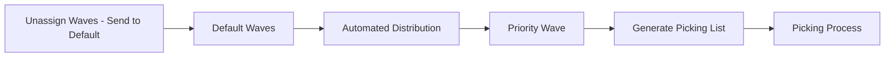
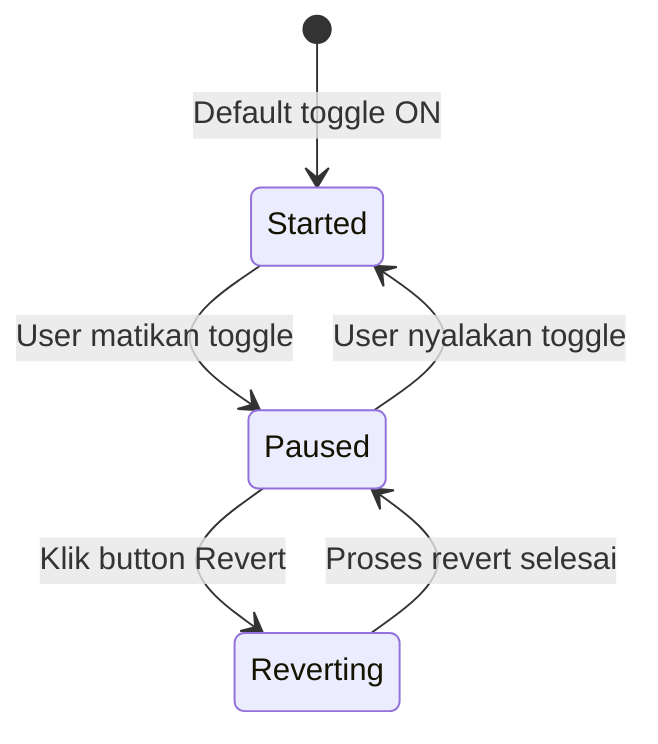
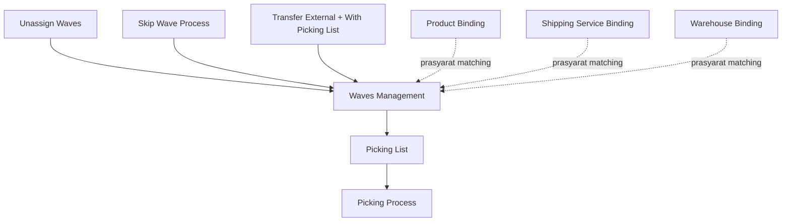

# Waves Management — Source of Truth

## 1. Ringkasan Eksekutif

Waves Management mengatur pengelompokan order dan transfer skala ribuan ke dalam grouping (wave) berdasarkan kriteria yang sama, lalu mendistribusikannya secara otomatis berdasarkan priority yang ditentukan user. Order yang sudah masuk grouping wave siap diproses picking oleh tim operasional, sehingga waktu picking jadi lebih efisien karena barang yang diambil sudah dikelompokkan berdasarkan kriteria yang sama (misal SKU, lokasi rack, atau kombinasi lainnya). Audience utama: tim Warehouse Operation / Fulfillment Lead.



Alur analog untuk Transfer External: Transfer disetujui dengan flag with picking list menyala, otomatis masuk Default Waves Transfer, lalu otomatis generate Picking List tanpa melalui proses distribusi manual seperti jalur order.

---

## 2. Prasyarat

| Prasyarat | Sumber | Catatan |
|---|---|---|
| Order sudah sukses Send to Default Waves di menu Unassign Waves | Unassign Waves | Order baru bisa didistribusikan setelah ada di Default Waves (grouping tampungan utama) |
| Master Store aktif | Master Store | Dipakai di Participating Store; tidak perlu status authorized |
| Master Warehouse Structure aktif | Master Warehouse | Dipakai di Building dan Building Rack |
| Master Company yang di-recognize sebagai Shipper | Master Company | Dipakai di field Shipper |
| Master Label Group | Master Label Group | Opsi: Single Batch, Multi Rack Batch, Mixed Batch |
| Master System Product aktif | Master Product | Dipakai di Assign Specific Product |
| Warehouse Binding dan Shipping Service Binding sudah lengkap | Warehouse Binding, Shipping Binding | Dipakai saat validasi silang Building-Store dan Shipper-Platform |

---

## 3. Siklus Status

Status utama di menu ini adalah status Automated Distribution per company, yang menentukan apakah wave existing boleh diedit atau tidak.



| Status | Kondisi transisi | Wave existing bisa diedit/dihapus? | Tombol/info yang muncul |
|---|---|---|---|
| Started | Default sistem, atau user nyalakan toggle | Tidak bisa | Toggle ON, field interval menit, Create, informasi Last success attempt |
| Paused | User matikan toggle Automated Distribution | Bisa | Toggle OFF, Create, Revert aktif bisa diklik |
| Reverting | User klik Revert saat status Paused | Tidak bisa, proses sedang berjalan | Banner proses revert, tombol lain disabled sementara |

Catatan tambahan siklus order di dalam wave (bukan status menu, tapi status keanggotaan order): order berada di Default Waves sampai match kriteria salah satu priority wave lewat Automated Distribution, lalu pindah ke priority wave tersebut. Kalau di-revert, seluruh order di priority wave kembali ke Default Waves.

---

## 4. Datalist

**URL:** `https://staging.olshoperp.com/omni/waves-management`

### 4.1 Fitur umum (berlaku di kedua pill)

| Fitur | Perilaku |
|---|---|
| Global Search | Pencarian across kolom datatable pada pill yang sedang aktif |
| Choose Warehouse | Opsional, default null. Opsi dari master warehouse structure level dropoff. Filter ini men-scope angka agregat (SO/Transfer/SKU/Qty) ke warehouse process tertentu, bukan menyembunyikan baris wave. Filter mengikuti pill yang sedang aktif — di Waves SO memfilter data Waves SO, di Waves Transfer memfilter data Waves Transfer |

### 4.2 Pill "Sales Order" (default aktif)

| Elemen | Perilaku |
|---|---|
| Button Revert | Mengembalikan semua order yang ada di priority wave kembali ke Default Waves. Hanya bisa diklik saat toggle Automated Distribution OFF |
| Button Create | Membuat wave baru, lihat Section 5 |
| Toggle Automate Distribution | Mengaktifkan/menonaktifkan proses distribusi otomatis. Tooltip learn more menjelaskan: toggle ON menjalankan distribusi otomatis sesuai interval; semua data wave hanya bisa diedit saat toggle OFF; saat toggle dimatikan sistem mereset order di masing-masing wave ke default; toggle bisa dinyalakan lagi untuk menjalankan distribusi dengan rules terbaru |
| Field interval (menit) | Numeric, di samping toggle. Menentukan seberapa sering proses automate distribute dijalankan. Default 1 kali per 3 menit |
| Info "Last success attempt" | Timestamp terakhir proses distribusi sukses dijalankan sistem. Kosong/null kalau belum pernah ada distribusi |

**Kolom datatable Waves Sales Order:**

| # | Kolom | Keterangan |
|---|---|---|
| 1 | Wave Name | Nama wave input user. Default Waves namanya tetap "Default Waves", tidak bisa diubah |
| 2 | Priority | Angka priority yang di-set user. Default Waves tidak punya priority yang bisa diedit |
| 3 | SO Total \| Min Sales Order | Baris 1: total SO yang ada di wave ini. Baris 2: nilai Min Sales Order yang diinput user — syarat minimum jumlah order supaya wave ini eligible menampung order, kalau tidak terpenuhi maka order lanjut ke next priority wave |
| 4 | Total SKU \| Total Qty Products | Total detail baris SKU dan total akumulasi quantity SKU dari seluruh order di wave ini |
| 5 | Label Group | Nama label group yang di-set di wave |
| 6 | Specific Product Conditions | Yes kalau wave punya setting specific product di section Assign Specific Product, No kalau tidak |
| 7 | Automated \| Last Update | Info update terakhir dari proses automasi |
| 8 | Created by \| Created at | User dan waktu pembuatan wave |
| 9 | Updated by \| Updated at | User dan waktu update terakhir wave |
| 10 | Action | Button "Generate Pick List" per row, hanya muncul untuk wave yang dibuat user, tidak muncul untuk Default Waves |

Di sisi kiri datatable ada checkbox untuk select multiple wave, dipakai untuk bulk delete (hanya aktif saat toggle Automated Distribution OFF).

### 4.3 Pill "Waves Transfer"

| Elemen | Perilaku |
|---|---|
| Button Revert, Create, Toggle Automated Distribution | Tidak ada di tab ini |
| Data wave | Hanya ada 1 data yaitu Default Waves, dibuat sebagai initial data yang tidak akan hilang walau sistem di-migrate |
| Automated distribution | Selalu OFF untuk Waves Transfer karena semua transfer external dengan flag Picking List otomatis masuk ke Default Waves ini |
| Visibility transfer external | Menampilkan transaksi transfer external yang sudah approve satu kali dan belum punya picking list |
| Generate picking list | Manual by user, bisa bulk. Satu picking list mewakili satu dokumen transfer external |

**Kolom datatable Waves Transfer:**

| # | Kolom | Keterangan |
|---|---|---|
| 1 | Wave Name | Sama seperti Waves SO, hanya ada Default Waves |
| 2 | Transfer Total | Total dokumen transfer external tanpa picking list di wave ini. Tooltip: total di kolom ini merepresentasikan dokumen transfer external tanpa picking list |
| 3 | Total SKU \| Total Qty Products | Total SKU dan quantity dari transfer di wave ini (kolom Min Sales Order di-hide untuk tab ini) |
| 4 | Picking List | Menampilkan jumlah dokumen picking list yang sudah tergenerate dari wave transfer ini. Angka bisa diklik untuk memunculkan datalist detail picking list |
| 5 | Automated \| Last Update | Sama pola dengan Waves SO |
| 6 | Created by \| Created at, Updated by \| Updated at | Sama pola dengan Waves SO |

Tooltip kolom SO Total (di tab Waves SO): total di kolom ini merepresentasikan minimum dokumen sales order di masing-masing wave.

---

## 5. Form & Field — Halaman Create/Edit Waves

Section disclosure: **A. Waves & Picking List Rules**, **B. Assign Specific Product**, **C. Audit Log** (hanya muncul di edit).

### 5.1 Section A1 — Waves Rules

| Field | Wajib? | Tipe | Sumber opsi | Catatan |
|---|---|---|---|---|
| Waves Code | Otomatis | text | - | Digenerate sistem setelah data tersimpan, tidak diinput user |
| Waves Name | Ya | text | - | - |
| Minimum order in each waves | Ya | numeric | - | Syarat minimum jumlah order supaya wave eligible menampung order |
| Waves Priority | Tidak | numeric | - | Kalau kosong, jadi prioritas paling akhir — lihat GAP-WM-03 |
| Participating Platform | Tidak | multiselect | Shopee, Tiktok Shop, Lazada, Others (Others untuk order general/internal) | Tooltip: kalau dikosongkan, dianggap semua platform dipilih |
| Participating Store | Ya | multiselect | Master Store aktif | Store tidak wajib berstatus authorized, karena ini terkait proses order — authorized hanya wajib untuk keperluan sync order dari platform |
| Building | Tidak | multiselect | Master Warehouse Structure aktif, level 19-21 | - |
| Building Rack | Tidak | multiselect | Master Warehouse Structure aktif, level lebih dari 30 | Terfilter berdasarkan Building yang dipilih — rack harus satu parent tree dengan Building terpilih supaya data valid dan selaras |
| Shipper | Tidak | multiselect | Master Company yang recognize sebagai shipper, aktif | - |
| Set condition for the settings above | Ya | radio: any / all | - | Any: order lolos kalau match minimal satu kriteria yang di-set. All: order harus match seluruh kriteria yang di-set 100 persen |
| Label Group | Ya | select | Single Batch, Multi Rack Batch, Mixed Batch | Untuk identifikasi klasifikasi proses picking list nantinya |

### 5.2 Section A2 — Pick List Rules

Fungsi section ini untuk memecah data dokumen picking list dalam satu grouping wave.

| Field | Wajib? | Tipe | Catatan |
|---|---|---|---|
| Grouped by platform | Tidak | checkbox | Kalau dicentang, picking list yang tergenerate dikelompokkan berdasarkan platform order |
| Grouped by stores | Tidak | checkbox | Dikelompokkan berdasarkan store order |
| Grouped by shipper | Tidak | checkbox | Dikelompokkan berdasarkan shipper order |
| Maximum order in each picking list | Tidak | numeric | Membatasi jumlah order maksimum dalam satu dokumen picking list |
| SKU Qty | Lihat catatan | numeric min-max | Membatasi jumlah SKU maksimum dalam satu dokumen picking list — lihat GAP-WM-04 soal field Min |
| Product Qty | Lihat catatan | numeric min-max | Membatasi jumlah quantity SKU maksimum, dihitung dari primary unit system product (order dalam unit BOX otomatis dikonversi ke pieces kalau primary unit-nya pieces) |
| Max. Dimension & Weight (Length, Width, Height, Weight) | Tidak | numeric | Membatasi dimensi dan berat maksimum dalam satu dokumen picking list |

Kalau salah satu batas di atas terlampaui (max order, max SKU, max product qty, atau max dimension/weight), sisa order yang belum tertampung akan otomatis digenerate ke dokumen picking list baru yang masih merujuk ke wave yang sama.

### 5.3 Section B — Assign Specific Product

| Field | Wajib? | Tipe | Sumber opsi | Catatan |
|---|---|---|---|---|
| Select Product | Tidak | multiselect | Master System Product aktif, tipe single, variant, bundle, atau random | Produk yang dipilih akan masuk ke datatable di bawahnya |
| Datatable SKU | - | - | - | Kolom: System Product SKU, System Product Name |
| Set condition for the settings above | Ya (kalau ada product di-assign) | radio: Any / All / Exact Match | - | Any: order minimal harus contains salah satu SKU di datatable. All: order minimal harus contains semua SKU di datatable, boleh lebih. Exact Match: detail SKU order harus sama persis dengan datatable, tidak boleh kurang atau lebih |

### 5.4 Section C — Audit Log

Slideover/section yang mencatat seluruh perubahan yang dilakukan user pada data wave ini (hanya muncul di halaman edit).

---

## 6. How It Works

### 6.1 Automated Distribution — cara kerja matching

Setiap interval waktu yang di-set (default 3 menit), sistem menjalankan proses distribusi terhadap order yang ada di Default Waves dengan status toggle Automated Distribution menyala:

1. Ambil order yang ada di Default Waves.
2. Screening kandidat berdasarkan priority wave, dari angka terkecil ke terbesar.
3. Untuk tiap wave, cek kriteria order (Participating Platform selalu dievaluasi; Participating Store, Building, Building Rack, dan Shipper hanya dievaluasi kalau field tersebut diisi di wave) sesuai radio Set Condition (any/all).
4. Cek juga kriteria Assign Specific Product (kalau di-set) sesuai radio Any/All/Exact Match.
5. Kriteria order dan kriteria product digabungkan secara AND — order harus lolos kedua-duanya untuk masuk wave tersebut.
6. Order yang lolos, pindah ke grouping wave tersebut dan tidak lagi discreening ke wave dengan priority berikutnya.
7. Order yang tidak match kriteria manapun tetap tinggal di Default Waves, bukan dianggap error.

Contoh kasus (5.000 order masuk): Wave 1 (priority 1, filter SKU001) di-screening lebih dulu — order yang match 100 persen masuk Wave 1. Sisa order yang tidak match, di-screening ulang ke Wave 2 (priority 2, filter Rack001) — sistem otomatis mencocokkan lokasi stock SKU di order dengan rack yang di-set di Wave 2. Proses ini berjalan otomatis berurutan berdasarkan priority sampai seluruh wave habis dicek.

**Priority duplikat:** kalau ada dua wave dengan angka priority yang sama, requirement bisnis mengharapkan sistem mendahulukan wave dengan id terkecil — lihat GAP-WM-01, ini belum terjamin di behavior AS-IS.

**Minimum order:** requirement bisnis mengharapkan field Minimum Order in Each Waves berfungsi sebagai syarat gate — order tidak akan masuk grouping kalau total order di wave belum memenuhi angka minimum, dan order tersebut lanjut discreening ke priority berikutnya — lihat GAP-WM-02, field ini secara AS-IS baru berfungsi sebagai display, bukan gate keputusan.

### 6.2 Refresh dan pause sebelum edit

Karena wave yang sudah dibuat bisa saja sudah kemasukan data order, sistem hanya mengizinkan edit wave saat toggle Automated Distribution OFF. Alasannya supaya perubahan kriteria wave tidak bentrok dengan order baru yang sedang otomatis terdistribusi.

### 6.3 Proses Revert

1. User matikan toggle Automated Distribution supaya order baru tidak otomatis terdistribusi selama perubahan berlangsung.
2. User klik button Revert.
3. Sistem mengembalikan seluruh order yang ada di semua priority wave kembali ke Default Waves.
4. Setelah semua order terkumpul di Default Waves, masing-masing wave yang dibuat user baru bisa di-edit.
5. Setelah edit selesai, user menyalakan lagi toggle Automated Distribution.
6. Seluruh order di Default Waves otomatis terdistribusi kembali ke wave sesuai rules terbaru dan priority yang berlaku.

Proses revert berlaku untuk seluruh company (bukan per-wave yang dipilih dari UI) dan hanya relevan di pill Waves Sales Order.

### 6.4 Alur Waves Transfer

1. User membuat Transfer External dengan flag "With Picking List" menyala.
2. Setelah transfer di-approve, transfer otomatis masuk ke Default Waves Transfer (tanpa proses distribusi manual/otomatis seperti jalur order).
3. Sistem otomatis generate Picking List mengikuti Pick List Rules dari Default Waves Transfer (satu dokumen transfer umumnya jadi satu picking list).
4. Kolom Picking List di datatable bertambah, tim gudang mengerjakan picking list tersebut.
5. Setelah picking selesai, transfer lanjut ke proses berikutnya sesuai flow Transfer External reguler.

Transfer tanpa flag With Picking List tidak melalui menu ini sama sekali.

### 6.5 Cascade field di form Create/Edit

- Ubah Participating Platform, otomatis me-refresh opsi Participating Store, Shipper, dan Building.
- Ubah Participating Store, otomatis me-refresh opsi Building.
- Ubah Building, otomatis me-refresh opsi Building Rack.
- Centang Grouped by stores tanpa Grouped by platform dicentang, sistem otomatis ikut mencentang Grouped by platform.

---

## 7. Validasi

### 7.1 Validasi field wajib (Section Waves Rules)

| # | Field | Aturan |
|---|---|---|
| V1 | Waves Name | Wajib diisi |
| V2 | Minimum order in each waves | Wajib diisi, angka |
| V3 | Participating Store | Wajib pilih minimal satu store |
| V4 | Set condition (any/all) | Wajib pilih salah satu |
| V5 | Label Group | Wajib pilih, error kalau kosong |

### 7.2 Validasi silang antar field

| # | Kondisi gagal | Pesan |
|---|---|---|
| V6 | Store terpilih bukan bagian dari platform yang dipilih | Store tidak cocok dengan platform |
| V7 | Building tidak punya warehouse binding process ke store terpilih | Warehouse tidak cocok dengan store |
| V8 | Building Rack bukan child dari Building yang dipilih | Rack tidak cocok dengan warehouse yang dipilih |
| V9 | Shipper tidak punya shipping service yang ter-bind ke platform terpilih | Shipper tidak cocok dengan platform |

### 7.3 Gate edit / delete / bulk action

| # | Aksi | Syarat |
|---|---|---|
| V10 | Edit wave | Toggle Automated Distribution harus OFF (paused) |
| V11 | Delete wave | Toggle OFF, wave tidak sedang menampung order, dan bukan Default Waves |
| V12 | Edit atau delete Default Waves | Tidak diizinkan sama sekali |
| V13 | Bulk delete dari datalist | Hanya aktif kalau toggle Automated Distribution OFF |
| V14 | Generate Pick List | Tidak muncul untuk Default Waves, hanya untuk wave hasil create user |
| V15 | Klik Revert | Menurut requirement bisnis, wajib toggle OFF dulu — lihat GAP-WM-05 soal enforcement-nya |

### 7.4 Validasi khusus Waves Transfer

| # | Kondisi | Behavior |
|---|---|---|
| V16 | Transfer external tanpa flag With Picking List | Tidak masuk Waves Transfer, langsung proses mutasi stock biasa |
| V17 | Transfer sudah approve tapi belum punya picking list | Baru tampil di Waves Transfer |
| V18 | Transfer sudah punya picking list | Tidak lagi tampil di Waves Transfer |

---

## 8. Relasi Menu Lain



| Menu | Peran dalam relasi |
|---|---|
| Unassign Waves | Hulu, order yang sukses send to default waves jadi kandidat distribusi di menu ini |
| Skip Wave Process | Jalur batch alternatif yang juga mengirim order ke Default Waves, ikut jadi kandidat distribusi |
| Transfer External | Hulu untuk pill Waves Transfer, lewat flag With Picking List saat approve |
| Picking List / Picking Process | Hilir, tujuan akhir setelah order/transfer selesai dikelompokkan di wave |
| Product Binding, Shipping Service Binding, Warehouse Binding | Prasyarat, dipakai saat validasi silang field form dan saat proses matching distribusi |

---

## 9. Gap Registry

| ID | Deskripsi | Dampak | Status |
|---|---|---|---|
| GAP-WM-01 | Requirement mengharapkan kalau dua wave punya priority number sama, wave dengan id terkecil menang. AS-IS belum menjamin ini karena job distribusi tidak eksplisit order by priority saat load data wave | Urutan pemenang matching bisa tidak konsisten dengan ekspektasi bisnis kalau ada priority duplikat | Open |
| GAP-WM-02 | Requirement mengharapkan Minimum Order in Each Waves berfungsi sebagai gate — order baru masuk wave kalau syarat minimum terpenuhi. AS-IS field ini baru berfungsi sebagai display di kolom SO Total, tidak dipakai sebagai kondisi keputusan saat distribusi order | Order bisa masuk wave walau belum memenuhi minimum order, tidak sesuai requirement | Open |
| GAP-WM-03 | Requirement menyatakan Waves Priority kosong berarti "prioritas paling akhir". AS-IS priority kosong membuat wave dianggap tidak aktif dan di-exclude dari proses matching | Wave dengan priority kosong tidak akan pernah menampung order otomatis, berbeda dari ekspektasi bisnis | Open |
| GAP-WM-04 | Field SKU Qty (Min) di Pick List Rules berpotensi membuat SKU tertentu tidak pernah bisa masuk ke picking list manapun kalau syarat minimum tidak pernah terpenuhi. Business (Yemima) mengusulkan field ini seharusnya hanya punya batas Max, bukan Min-Max | Bisa terjadi SKU yang "nyangkut", tidak pernah tergenerate ke picking list | Open |
| GAP-WM-05 | Requirement bisnis mewajibkan toggle Automated Distribution OFF sebelum proses Revert dijalankan. AS-IS belum ada validasi keras di level backend untuk syarat ini, baru guard di level UI (disable tombol) | Kalau ada cara lain memicu revert di luar tombol UI standar, proses bisa berjalan walau toggle masih ON | Open |
| GAP-WM-06 | Di datatable Waves Transfer, kolom berlabel "Qty Total" secara AS-IS berisi hitungan distinct SKU (bukan total quantity), dan kolom Automated Last Update masih membaca sumber data yang sama dengan pola Waves SO | Label kolom berpotensi membingungkan operator; perlu diverifikasi ulang penamaan dan sumber data saat implementasi final | Open |

---

## 10. FAQ

**Q: Kenapa order saya tidak masuk ke wave manapun, tetap di Default Waves?**
A: Berarti order tidak match kriteria wave manapun yang aktif, atau toggle Automated Distribution sedang OFF sehingga proses distribusi belum berjalan. Cek juga interval waktu distribusi terakhir di info Last success attempt.

**Q: Kenapa saya tidak bisa edit wave yang sudah ada?**
A: Wave hanya bisa diedit saat toggle Automated Distribution dimatikan (OFF). Matikan dulu togglenya sebelum melakukan perubahan.

**Q: Setelah saya matikan toggle, order yang sudah ada di wave hilang?**
A: Tidak otomatis hilang atau kembali ke Default Waves hanya karena toggle dimatikan. Kalau ingin mengembalikan semua order ke Default Waves, harus klik tombol Revert secara eksplisit.

**Q: Kenapa Default Waves tidak bisa saya edit atau hapus?**
A: Default Waves adalah bucket bawaan sistem untuk menampung seluruh order yang belum masuk kriteria wave manapun, sehingga tidak bisa diubah atau dihapus oleh user.

**Q: Bedanya Waves Sales Order dan Waves Transfer apa?**
A: Waves Sales Order mengelompokkan order untuk picking fulfillment marketplace/general, sedangkan Waves Transfer mengelompokkan dokumen transfer external yang butuh picking list untuk perpindahan stock antar gudang. Keduanya punya bucket default terpisah.

**Q: Kenapa transfer saya tidak muncul di Waves Transfer?**
A: Cek apakah transfer sudah dibuat dengan flag With Picking List menyala dan sudah di-approve. Transfer tanpa flag tersebut tidak akan lewat menu ini.

---

## 11. Changelog

| Tanggal | Versi | Perubahan |
|---|---|---|
| 2026-07-19 | 1.0 | Draft awal dari requirement mentah Yemima (datalist + halaman create/edit) dan referensi analisa codebase AS-IS |

---

## 12. Knowledge Base Hints (untuk operator)

**Istilah teknis ke padanan awam:**

| Istilah teknis | Padanan awam untuk KB |
|---|---|
| Wave | Kelompok order/transfer yang siap dipicking bareng |
| Default Waves | Tampungan utama, tempat order menunggu sebelum masuk kelompok khusus |
| Automated Distribution | Proses otomatis sistem mengelompokkan order ke wave yang sesuai |
| Priority | Urutan wave mana yang diperiksa lebih dulu |
| so_condition (any/all) | Aturan kecocokan: cukup salah satu syarat, atau harus semua syarat terpenuhi |
| Revert | Mengembalikan semua order dari kelompok wave ke tampungan utama |
| Picking List | Daftar barang yang harus diambil tim gudang dalam satu kali proses |
| Assign Specific Product | Aturan tambahan supaya wave hanya menampung order dengan produk tertentu |

**Skenario troubleshooting (bahasa awam):**

| Gejala | Penyebab umum | Solusi |
|---|---|---|
| Order menumpuk di Default Waves, tidak pindah ke wave khusus | Toggle automasi mati, atau order memang tidak cocok kriteria wave manapun | Nyalakan toggle, atau cek ulang kriteria masing-masing wave |
| Tidak bisa ubah pengaturan wave | Toggle automasi masih menyala | Matikan toggle dulu sebelum mengubah wave |
| Sudah matikan toggle tapi order di wave tidak balik ke tampungan utama | Mematikan toggle tidak otomatis mengembalikan order | Klik tombol Revert untuk mengembalikan order |
| Transfer tidak muncul untuk dipicking | Transfer belum di-approve, atau dibuat tanpa opsi picking list | Cek status approve dan opsi With Picking List saat membuat transfer |

**Field yang tidak relevan operator:** tidak ada field teknis (path/class/ID internal) yang perlu ditampilkan di dokumen requirement ini.

---

## 13. Technical Hints (untuk developer)

**Area codebase yang perlu didokumentasikan:**
- Controller dan service untuk list wave, create/edit wave, revert, dan generate picking list
- Job/command scheduler yang menjalankan Automated Distribution secara berkala
- Logic matching kriteria order (platform, store, building, rack, shipper) dan kriteria product (any/all/exact match)
- Service yang menangani proses revert (perpindahan order dari priority wave kembali ke default)
- Service khusus untuk jalur Waves Transfer (approve transfer external dengan flag picking list, auto masuk default, auto generate picking list)
- Validasi silang field form (store-platform, warehouse-store, rack-warehouse, shipper-platform)

**Invariants:**
- Order yang statusnya sudah masuk wave (baik Default maupun priority) tidak boleh hilang dari sistem, hanya boleh berpindah antar wave.
- Wave dengan kode Default (baik untuk Sales Order maupun Transfer) tidak boleh terhapus dari sistem.
- Wave hanya boleh diedit atau dihapus saat status Automated Distribution sedang OFF (paused).
- Satu picking list hanya boleh merujuk ke satu wave sebagai sumbernya.
- Untuk Waves Transfer, satu dokumen transfer external hanya boleh punya satu picking list aktif pada satu waktu.

**Failure modes:**
- Proses distribusi otomatis gagal untuk satu order tidak boleh menghentikan proses distribusi order lain dalam batch yang sama.
- Proses revert yang gagal di tengah jalan untuk satu order harus tetap tercatat (log), dan tidak boleh menghentikan proses revert order lain dalam batch yang sama.
- Kalau dua company/proses generate wave berjalan bersamaan untuk company yang sama, harus ada mekanisme yang mencegah race condition/duplikasi distribusi (perlu diverifikasi mekanisme lock-nya — [VERIFY: CODEBASE]).

**Data lifecycle lintas dokumen:**
- Status keanggotaan order di wave (Default atau priority tertentu) memengaruhi apa yang muncul di kolom Generate Pick List dan proses Picking selanjutnya.
- Data hasil Assign Specific Product di form wave dipakai sebagai salah satu kriteria matching saat Automated Distribution berjalan.
- Perubahan pada Warehouse Binding atau Shipping Service Binding bisa memengaruhi validitas Building dan Shipper yang sudah ter-assign di wave existing.

---

## 14. Referensi Struktur untuk Cursor

```
Section 1-11 → material utama untuk requirement.md
Section 5, 6, 7, 10 → adaptasi ke knowledge-base.md dengan tone awam (lihat Section 12 KB Hints)
Section 13 Technical Hints → seed untuk technical.md, dilengkapi Cursor dari codebase
Frontmatter YAML di atas → copy ke 3 file utama, sinkronkan version + last_updated
Golden reference tone & struktur: docs/qa-docs/accounting-supplier-invoice/
```
