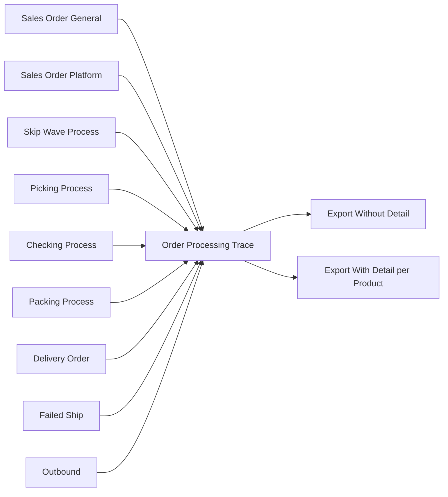
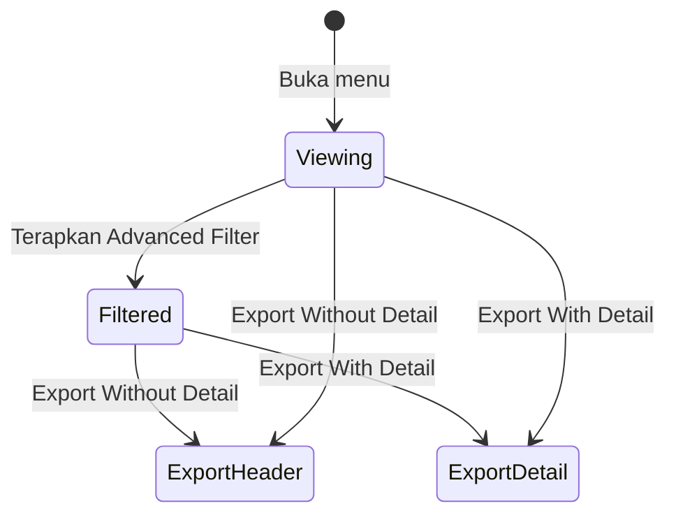
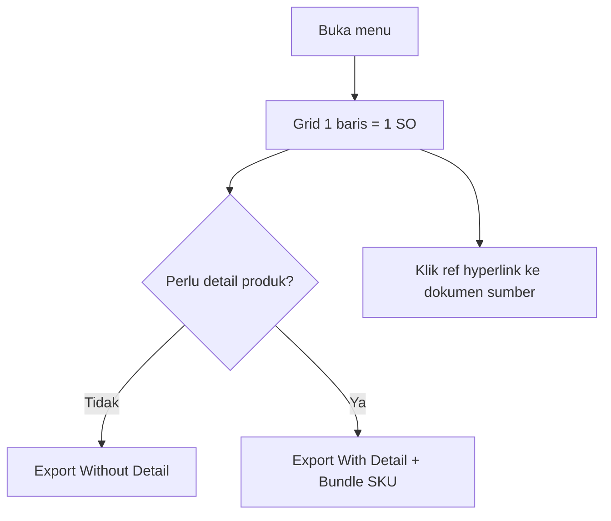
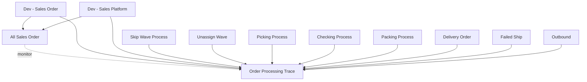

# Order Processing Trace — Source of Truth (TO-BE)

**Status dokumen:** TO-BE — menu **belum ada** di codebase per 2026-09-02. Spesifikasi ini menjadi acuan dev implementasi dan QA acceptance testing sebelum split ke folder canonical `docs/qa-docs/order-processing-trace/`.

**Keputusan nama (2026-09-02):** sidebar **Order Processing Trace** — POV tetap Sales Order (general + platform); nama dipendekkan dari opsi "Sales Order Processing Trace".

**Tujuan bisnis:** Satu layar read-only untuk menjawab pertanyaan operator/QA/support — *"Order ini sudah diproses lewat dokumen apa saja?"* — dari **Sales Order** (general dan platform), tanpa membuka satu per satu menu Picking, Checking, Packing, DO, Failed Ship, atau Outbound.

**Route (satu halaman, dua entry sidebar):**

| Entry sidebar | Route FE usulan |
|---------------|-----------------|
| **SupplyChain → Report** | `/supplychain/order-processing-trace` |
| **OmniChannel → Report** | `/omni/order-processing-trace` |

Kedua route menampilkan **komponen & API yang sama** (satu menu, dua pintu modul). Bukan duplikasi data atau dua implementasi terpisah.

**Modul sidebar (final):** masuk **SCM dan Omni** — bukan Business Development Report.

---

## Nama menu (final)

| Item | Nilai |
|------|--------|
| **Sidebar** | **Order Processing Trace** |
| **Slug** | `order-processing-trace` |
| **POV data** | Sales Order — general + platform (satu baris = satu SO) |

**Catatan naming:** "Order" di konteks menu ini = **Sales Order**, bukan Purchase Order. POV data tetap general + platform (sama seperti [All Sales Order](../../all-sales-order/README.md)), meski entry sidebar ada di SCM dan Omni.

### Opsi lain (tidak dipakai)

| Nama | Alasan tidak dipakai |
|------|----------------------|
| Sales Order Processing Trace | Terlalu panjang — disingkat per keputusan PM/QA |
| Order Fulfillment Trace | Kurang eksplisit POV baris = SO |
| Sales Order Trx Reference Report | Terlalu teknis |

**Hindari:**

- **Sales Order Report** — sudah dipakai menu lain (agregasi revenue per hari/store).
- **All Sales Order** — menu operasional monitor + aksi (sync, recheck, import), bukan laporan referensi proses.

**Label kolom UI:** gunakan istilah yang konsisten dengan menu sumber (Picking Process, Checking Process, Packing Process, Delivery Order, Failed Ship, Outbound) — jangan alias karangan.

---

## 1. Ringkasan Eksekutif

Order Processing Trace adalah laporan **read-only**, **satu baris = satu Sales Order** (general atau platform), menampilkan kode order internal + platform (jika ada) dan **referensi transaksi fulfillment** beserta tanggalnya: Skip Wave Process, Picking, Checking, Packing, Delivery Order, Failed Ship, dan Outbound.

Fitur wajib: **Advanced Filter**, **Export Without Detail** (mirror grid header), **Export With Detail** (satu baris per **produk order**, dengan mapping referensi per produk — termasuk partial Failed Ship / Outbound dan kolom **Bundle SKU** untuk komponen bundle).



---

## 2. Prasyarat

| Prasyarat | Sumber data | Catatan |
|-----------|-------------|---------|
| Privilege `viewAny` menu baru | Gate / policy baru | Scope per company (`owned_by` / token) |
| Sales Order general | Menu Dev - Sales Order | Baris tipe `general` |
| Sales Order platform | Menu Dev - Sales Platform | Baris tipe `platform`; kolom platform order |
| Order sudah / belum proses | Rantai fulfillment SCM/Omni | Order tanpa picking tetap tampil; kolom ref = `-` |
| Soft-deleted dokumen | Semua tabel sumber | **Tidak** tampil sebagai referensi aktif |
| Company scope | Sanctum token | Sama pola report lain (Purchase Report, All Sales Order) |

**Audience:** operator fulfillment, QA regression, support — **bukan** menu create/edit/approve transaksi.

---

## 3. Siklus Status

Menu ini **bukan transaksi** — tidak punya Draft/Open/Approved sendiri.



| Konsep | Perilaku |
|--------|----------|
| Baris grid | Satu SO = satu baris (header POV) |
| Status kolom ref | Menampilkan dokumen proses **aktual** yang terhubung ke SO; `-` jika belum ada |
| Hyperlink | Setiap kode trx ref **wajib** clickable ke halaman edit dokumen sumber (tab/route sesuai menu asal) |

---

## 4. Datalist (grid header — POV Sales Order)

### 4.1 Umum grid

| Aspek | Spesifikasi |
|-------|-------------|
| Granularitas | **1 baris = 1 Sales Order** (general atau platform) |
| Default sort | Trx Date (kolom internal) **DESC** — usulan; final konfirmasi PM jika beda |
| Default filter tanggal | **Awal–akhir bulan kalender berjalan** pada kolom **Trx Date** (internal) — pola konsisten Purchase Report |
| Global Search | Ya — minimal: Trx Code, Trx Platform, Skip Wave batch, semua kode ref |
| Advanced Filter | Ya (SearchBuilder / pola Advanced Filter report existing) |
| Columns Show/Hide | Ya |
| Grouping | **Tidak** — flat per order |
| Pagination | Standard DataTables server-side |

### 4.2 Kolom grid (9 pasang / 10 field tampilan)

Urutan kolom **wajib** mengikuti tabel di bawah. Format tampilan pasangan: dua sub-kolom visual **Ref** dan **Date** (header gabungan seperti `Picking Ref | Date`).

| # | Header kolom (UI) | Isi — Ref (kiri) | Isi — Date (kanan) | Tooltip / catatan |
|---|-------------------|------------------|--------------------|-------------------|
| 1 | **Trx Code \| Trx Platform** | Kode order **internal** (SO General / SO Platform code) — hyperlink ke edit SO | Nomor order **platform** (marketplace). Jika tidak ada → tampilkan **`-`** (bukan kosong/null tanpa tanda) | Tooltip Trx Code: "Nomor transaksi Sales Order di OlshopERP." Tooltip Trx Platform: "Nomor order dari marketplace. Order general menampilkan '-'." |
| 2 | **Trx Date \| Platform Date** | Lihat **§4.3 Aturan tanggal** | Lihat **§4.3** | Tooltip Trx Date: lihat §4.3. Tooltip Platform Date: lihat §4.3. |
| 3 | **Skip Wave Process No** | `batch_code` batch Skip Wave Process jika order pernah diproses lewat jalur Skip Wave Process; selain itu **`-`** | *(kolom tunggal — tidak ada pasangan Date)* | Tooltip: "Kode batch import Skip Wave Process. Hanya terisi jika order masuk proses lewat menu Skip Wave Process; order reguler (Unassign Wave / wave normal) menampilkan '-'." |
| 4 | **Picking Ref \| Date** | Kode transaksi Picking terkait SO | `transaction_date` dokumen Picking | Tooltip: "Referensi Picking Process untuk order ini." |
| 5 | **Checking Ref \| Date** | Kode transaksi Checking | `transaction_date` Checking | Tooltip: "Referensi Checking Process untuk order ini." |
| 6 | **Packing Ref \| Date** | Kode transaksi Packing | `transaction_date` Packing | Tooltip: "Referensi Packing Process untuk order ini." |
| 7 | **Delivery Order Ref \| Date** | Kode Delivery Order | `transaction_date` DO | Tooltip: "Referensi Delivery Order untuk order ini." |
| 8 | **Failed Ship \| Date** | **Satu** kode Failed Ship per order (jika ada). Partial per SKU tetap **satu doc FS** | `transaction_date` Failed Ship | Tooltip: "Referensi Failed Ship untuk order ini. Satu order hanya boleh satu dokumen Failed Ship." |
| 9 | **Outbound \| Date** | Kode Outbound | `transaction_date` Outbound | Tooltip: "Referensi Outbound / pengeluaran stok terkait order ini." |

**Format tanggal di grid:** tampilan konsisten report lain (tanggal + opsional jam jika field sumber datetime — keputusan FE; minimal tanggal `DD-MM-YYYY` atau format locale app).

**Format multi-referensi di header:** hanya berlaku untuk stage Picking / Checking / Packing / Delivery Order jika (edge case langka) ada lebih dari satu dokumen — tampilkan kode ref dipisah **koma + spasi**. **Failed Ship dan Outbound tidak ikut aturan koma:** masing-masing **maksimal satu dokumen per Sales Order** (AS-IS).

### 4.5 Kardinalitas referensi per order (AS-IS — verifikasi codebase 2026-09-02)

| Stage | Maks dokumen per SO (AS-IS) | Multi-ref (koma) di header? | Sumber verifikasi |
|-------|----------------------------|-----------------------------|-------------------|
| Skip Wave Process No | **1** batch code | Tidak | Alur Skip Wave / log batch |
| Picking / Checking / Packing | **1** rangkaian transfer per order (normal) | **Jarang** — fallback koma hanya jika edge re-process | Rantai processing Omni |
| Delivery Order | **1** (alur shipped) | **Jarang** | Alur DO / shipping |
| **Outbound External** | **1** | **Tidak** | `StockMutationOutboundDetailController` — *"Sales Order … has already been used in another outbound"* |
| **Failed Ship** | **1** | **Tidak** | `FailedShipController@useSo` — jika `PROCESS_TYPE_FAILED_SHIP` sudah ada → *"already been processed as failed shipment"*; import: *"already has a Failed Ship document"*; requirement **1 SO = 1 FS** (§5.5.2) |

**Partial Failed Ship ≠ multi dokumen.** Order boleh **partial per SKU** (beberapa line masuk FS, beberapa outbound) — tetap dalam **satu** dokumen FS (`FS-01`) + **satu** outbound (`OT-01`) bila ada. Lihat §6.2 Case A & D.

**Kesimpulan GAP-SOPT-01 (revised):** Header grid **selalu single ref** untuk Failed Ship dan Outbound. Fallback **koma** hanya untuk Picking–DO jika edge case re-process terbukti di staging — bukan skenario uji utama.

### 4.3 Aturan tanggal — Trx Date \| Platform Date

| Tipe order | Kolom **Trx Date** (internal) | Kolom **Platform Date** |
|------------|--------------------------------|-------------------------|
| **General** | `transaction_date` Sales Order General | **`-`** |
| **Platform** | **Tanggal order masuk ke sistem** = `created_at` header Sales Order Platform (tanggal kalender; jam mengikuti field datetime sumber) | `transaction_date` order platform (tanggal transaksi dari marketplace / field trx date SP) |

**Tooltip wajib (copy persis atau setara):**

- **Trx Date:** "Tanggal transaksi order. Order **general**: tanggal transaksi Sales Order. Order **platform**: tanggal order **pertama kali tercatat di OlshopERP** (created at)."
- **Platform Date:** "Tanggal transaksi order di **platform/marketplace**. Hanya untuk order platform; order general menampilkan '-'."

### 4.4 Kolom tambahan (disarankan — tidak wajib v1 kecuali PM setuju)

| Kolom | Alasan |
|-------|--------|
| Order Type | `General` / `Platform` — memudahkan filter & export |
| Store / Customer | Konteks All Sales Order |
| SO Status | Status approval/processing SO — read-only |

Jika tidak diimplementasi v1, catat di Gap Registry (**GAP-SOPT-05**).

---

## 5. Advanced Filter

Wajib mendukung filter kombinasi (SearchBuilder). Field filter **minimum**:

| Field filter | Tipe | Default / catatan |
|--------------|------|-------------------|
| Trx Date (internal) | Date range | Awal–akhir **bulan berjalan** |
| Platform Date | Date range | Opsional; hanya relevan baris platform |
| Order Type | Enum | All / General / Platform |
| Trx Code | Text | Contains / equals |
| Trx Platform | Text | Contains / equals |
| Store | Multiselect | Platform orders |
| Customer | Multiselect | General orders |
| Skip Wave Process No | Text | Exact / contains |
| Picking / Checking / Packing / DO / Failed Ship / Outbound Ref | Text | Contains |
| "Has ref" toggles | Boolean per stage | Contoh: "Has Outbound = Yes" — opsional v1 (**GAP-SOPT-06**) |

Filter tanggal **Trx Date** memakai aturan §4.3 (bukan selalu `transaction_date` platform untuk baris platform).

---

## 6. Export

Dua mode export **wajib**, keduanya respect filter Advanced Filter aktif. Pola async **Export All** + **This Page** mengikuti report mature (contoh Purchase Report).

### 6.1 Export Without Detail

| Aspek | Spesifikasi |
|-------|-------------|
| Granularitas | **Sama persis grid header** — 1 baris = 1 Sales Order |
| Kolom | Mirror §4.2 (+ kolom opsional §4.4 jika ada) |
| Multi-ref | Koma **hanya** stage Picking–DO (edge case). Outbound & Failed Ship: **single ref** |
| Hyperlink | Excel: URL edit SO + URL edit tiap trx ref (kolom terpisah atau hyperlink cell — ikuti standar export report existing) |
| Nama file | Usulan: `order-processing-trace-header-{company}-{timestamp}.xlsx` |

### 6.2 Export With Detail (POV produk order)

| Aspek | Spesifikasi |
|-------|-------------|
| Granularitas | **1 baris = 1 baris produk (SO detail line)** — **bukan** duplikasi baris per partial qty |
| Kolom header order | Semua kolom §4.2 **diulang** di setiap baris produk |
| Kolom produk **wajib** | SKU, Product Name, Qty order (grain line SO) |
| Kolom **Bundle SKU** | **Wajib** jika line komponen bundle: SKU **header bundle**; non-bundle → **`-`** |
| Picking / Checking / Packing / DO | Ref + date **per produk** — hanya jika line produk tersebut ada di dokumen stage itu |
| **Outbound** | **1 SO = 1 outbound doc** (AS-IS). Semua SKU yang **ikut outbound** menampilkan **ref outbound yang sama** pada baris masing-masing. SKU yang **tidak** masuk outbound → Outbound Ref \| Date = **`-`** |
| **Failed Ship** | **1 FS doc per SO**. Semua line yang punya qty FS → **ref FS sama** (`FS-01`). Line tanpa qty FS → Failed Ship = **`-`** |
| **Kolom FS & Outbound terpisah** | Satu baris produk **boleh** terisi **keduanya**: Failed Ship ref **dan** Outbound ref — untuk partial qty pada **line yang sama** (contoh Case D) |

**Aturan partial (Failed Ship vs Outbound) — resolved GAP-SOPT-02:**

| Situasi | Expected export with detail |
|---------|----------------------------|
| SO 5 SKU — 3 SKU outbound (`OT-01`), 2 SKU partial FS dalam **satu** `FS-01` | 3 baris: Outbound = `OT-01`; Failed Ship = `-`. 2 baris: Failed Ship = **`FS-01` (ref sama)**; Outbound = `-` |
| Semua SKU dalam 1 outbound (5 SKU → 1 `OT-01`) | Kelima baris: Outbound ref **sama** (`OT-01`) |
| **Partial qty 1 line** — SKU qty 10: 2 pcs Failed Ship, 7 pcs Outbound | **Satu baris** SKU tersebut: kolom Failed Ship **dan** Outbound **keduanya terisi** (ref masing-masing doc). Qty breakdown **tidak** perlu kolom terpisah v1 — cukup ref doc yang benar |
| Multi outbound **per SKU** | **Tidak ada AS-IS** — backend menolak SO dipakai di 2 outbound; **jangan** duplikasi baris untuk multi outbound per SKU |

**Contoh case QA (wajib lulus):**

**Case A — Partial order: 2 SKU di FS + 3 SKU outbound (masing-masing 1 doc)**

- SO `SO-100`, 5 SKU (A–E).
- **`FS-01`** — satu dokumen Failed Ship; line A & B punya qty FS (partial SKU). Line C–E tidak masuk FS.
- **`OT-01`** — satu outbound; berisi SKU C, D, E.
- Header grid: Failed Ship = `FS-01` (bukan koma); Outbound = `OT-01`.
- Export with detail:
  - Baris A, B: Failed Ship = `FS-01`; Outbound = `-`.
  - Baris C, D, E: Outbound = `OT-01`; Failed Ship = `-`.

**Case B — Bundle**

- SO general line bundle header `BUNDLE-01` explode ke child `SKU-C1`, `SKU-C2`.
- Export with detail: kolom **Bundle SKU** = `BUNDLE-01` pada kedua baris child; kolom SKU = masing-masing child.

**Case C — Skip Wave**

- Order diproses Skip Wave batch `SWP-BATCH-20260902-001`.
- Header grid & export without detail: Skip Wave Process No = batch code.
- Export with detail: kolom Skip Wave **sama** di setiap baris produk order tersebut.

**Case D — Partial qty satu line (FS + Outbound sekaligus)**

- SO line `SKU-X` qty **10**.
- Settlement dalam **satu** `FS-01`: 2 pcs qty → Failed Ship; 7 pcs → Outbound **`OT-01`** (satu doc outbound order yang sama).
- Export with detail — **satu baris** `SKU-X`:
  - Failed Ship Ref \| Date = `FS-01` + tanggal FS.
  - Outbound Ref \| Date = `OT-01` + tanggal OB.
  - (Qty 10 tetap di kolom Qty order; tidak pecah jadi 3 baris.)

### 6.3 Export UX

| Item | Spesifikasi |
|------|-------------|
| Pilihan mode | Dropdown atau dua tombon: **Export Without Detail** / **Export With Detail** |
| Progress async | Queue + daftar file download (pola export report async) |
| This Page Only | Kedua mode respect pagination |
| Privilege | Sama `viewAny`; export tidak privilege terpisah kecuali Gate minta |

---

## 7. How It Works — Alur operator

1. Buka **Order Processing Trace** dari sidebar **SupplyChain → Report** *atau* **OmniChannel → Report** (halaman sama).
2. Grid load order company aktif; default filter Trx Date = bulan berjalan.
3. Cari order via Global Search atau Advanced Filter (Trx Code / Platform / ref picking dll.).
4. Baca kolom ref untuk tahu stage proses order.
5. Klik hyperlink ref untuk buka dokumen sumber di tab baru.
6. Export without detail untuk share ringkasan per order; export with detail untuk audit per SKU / partial outbound / bundle.



---

## 8. Validasi & aturan bisnis

| ID | Rule | Expected |
|----|------|----------|
| R-01 | Read-only | Tidak ada tombol Create / Save / Approve di menu ini |
| R-02 | Scope company | Hanya SO & dokumen proses company token |
| R-03 | General + Platform | Kedua tipe SO masuk satu grid |
| R-04 | Platform number kosong | Trx Platform = `-` |
| R-05 | General order | Platform Date = `-` |
| R-06 | Skip Wave | Kolom terisi **hanya** jika order melalui Skip Wave Process; else `-` |
| R-06b | Failed Ship | **Maks 1** dokumen FS per SO — header **single ref**, bukan koma |
| R-06c | Outbound | **Maks 1** dokumen outbound per SO — header **single ref** |
| R-07 | Belum ada stage | Kolom ref stage = `-`; Date = `-` |
| R-08 | Soft delete | Dokumen ter-soft-delete tidak muncul sebagai ref |
| R-09 | Export with detail — Outbound | Satu SO **maksimal satu** outbound doc; ref outbound **sama** pada semua line produk yang ikut outbound |
| R-10 | Export with detail — Failed Ship vs Outbound | Kolom terpisah; **satu baris produk boleh punya keduanya** jika partial qty line (Case D) |
| R-11 | Export with detail — mapping produk | Ref FS/Outbound hanya pada SKU yang benar-benar ada di dokumen / qty processed |
| R-12 | Bundle | Bundle SKU terisi untuk komponen bundle; non-bundle = `-` |
| R-13 | Tooltip | Tooltip §4.2 & §4.3 tampil di header kolom (icon info) |
| R-14 | Hyperlink | Trx Code → edit SO; tiap ref → edit menu sumber |
| R-15 | Dual sidebar | Route SCM dan Omni membuka halaman & dataset identik |

**Error handling (usulan):**

| Kondisi | Pesan / perilaku |
|---------|------------------|
| Tidak ada privilege | 403 / toast standard Gate |
| Export timeout / queue gagal | Toast error + retry; job log |
| Filter invalid date range | Validasi FE + pesan SearchBuilder standard |

---

## 9. Relasi menu lain



| Menu | Relasi ke report ini |
|------|----------------------|
| [All Sales Order](../../all-sales-order/README.md) | Window monitor SO yang sama (general+platform); user sering buka ASO lalu trace ref di menu ini |
| [Dev - Sales Order](../../sales-order-general/README.md) | Sumber baris general; Trx Date = transaction_date |
| [Dev - Sales Platform](../../omni-sales-platform/README.md) | Sumber baris platform; Trx Platform + Platform Date |
| [Skip Wave Process](../../omni-skip-wave-process/README.md) | Sumber Skip Wave Process No (`batch_code`) |
| [Unassign Wave](../../omni-unassign-wave/README.md) | Jalur alternatif tanpa skip wave — kolom Skip Wave = `-` |
| [Picking / Checking / Packing Process](../../omni-picking-process/README.md) | Sumber ref + date |
| Delivery Order, Failed Ship, Outbound | Sumber ref downstream; **partial** mapping kritis di export detail |

**Bukan duplikasi:**

| Menu | Beda |
|------|------|
| **Sales Order Report** (`omni-sales-order-report`) | Agregasi revenue harian/chart — bukan trace dokumen proses |
| **All Sales Order** | Operasional + aksi — bukan laporan ref lintas stage |

---

## 10. Acceptance Criteria — QA testing

Checklist ini **wajib lulus** sebelum menu dianggap selesai (UAT / Test Case origin).

### 10.1 Grid & filter

- [ ] Menu tampil di **SupplyChain → Report** dan **OmniChannel → Report** (halaman sama); privilege `viewAny` terdaftar.
- [ ] Grid menampilkan **general dan platform** dalam satu datalist.
- [ ] Kolom §4.2 ada, urutan benar, tooltip §4.3 tampil dan teks sesuai spec.
- [ ] Order general: Trx Platform = `-`, Platform Date = `-`, Trx Date = transaction_date SO general.
- [ ] Order platform: Trx Platform terisi; Trx Date = created_at (masuk sistem); Platform Date = trx date platform.
- [ ] Order via Skip Wave: Skip Wave Process No = batch code; order reguler = `-`.
- [ ] Order belum picking: kolom Picking = `-`; pola sama stage lain.
- [ ] Advanced Filter: Trx Date default bulan berjalan; filter kombinasi (Trx Code + Store) bekerja.
- [ ] Global Search menemukan SO by code platform/internal.
- [ ] Hyperlink Trx Code & ref membuka halaman edit benar.
- [ ] Soft-deleted SO / dokumen proses tidak muncul.

### 10.2 Export Without Detail

- [ ] Jumlah baris = jumlah SO terfilter (1:1 dengan grid).
- [ ] Kolom mirror grid; `-` konsisten.
- [ ] Multi-ref header: Outbound & Failed Ship **single ref** per order; koma hanya edge Picking–DO (jika ada).
- [ ] Respects Advanced Filter & Export All / This Page.

### 10.3 Export With Detail

- [ ] Setiap baris = **1 SO detail line** (tidak duplikasi per partial qty).
- [ ] Kolom Bundle SKU: bundle child terisi header; non-bundle `-`.
- [ ] **Case A:** 5 SKU — 3 outbound + 2 failed ship — ref sesuai §6.2 Case A.
- [ ] **Case D:** 1 line qty 10 — FS ref **dan** Outbound ref **sama baris**.
- [ ] Outbound: semua line dalam satu OT → ref outbound identik; line tanpa outbound → `-`.
- [ ] Failed Ship: **1 doc per SO** — line dengan qty FS pakai **ref FS sama**; line tanpa FS → `-`.
- [ ] Picking/Checking/Packing/DO: ref per produk selaras detail dokumen.
- [ ] Case bundle (Case B) & skip wave (Case C) lulus.
- [ ] Header columns duplicated per product row.
- [ ] **Tidak ada** duplikasi baris untuk multi outbound per SKU (scenario tidak valid AS-IS).

### 10.4 Non-functional

- [ ] Response grid acceptable dengan volume SO bulan berjalan (target performa: setuju PM — usulan P95 load grid < 5s staging FAT).
- [ ] Export async tidak block UI; file list muncul.
- [ ] Company A tidak melihat data company B.

### 10.5 Regression lintas menu

- [ ] Data ref Picking = sama dengan drill SO / transfer reference (spot check: full flow, skip wave, partial FS+outbound).
- [ ] Spot check Case D — export detail: satu baris dual ref FS + Outbound.
- [ ] Route `/supplychain/...` dan `/omni/...` menampilkan dataset identik.

---

## 11. Gap Registry

| ID | Deskripsi | Type | Dampak | Status |
|----|-----------|------|--------|--------|
| GAP-SOPT-01 | Multi-ref header: fallback koma **hanya** Picking–DO edge case; **FS & Outbound = single ref** (1 SO = 1 doc) | Contradiction | Tampilan header | **Resolved** — deep check `useSo` + import + requirement §5.5.2 |
| GAP-SOPT-02 | Export detail: grain **1 baris = 1 SO detail line**; partial qty = FS **dan** Outbound **kolom terpisah same row**; **1 SO = 1 outbound** | Missing Behavior | Excel detail | **Resolved** — lihat §6.2 Case D |
| GAP-SOPT-03 | Sidebar dual **SCM + Omni** (satu halaman) | Missing Behavior | Navigasi | **Resolved** — § route dual entry |
| GAP-SOPT-04 | Join teknis ref SO ke tiap stage (transfer reference, outbound detail, FS detail) — detail implementasi dev | Unverified | Risiko ref salah | Open — dev saat build |
| GAP-SOPT-05 | Kolom opsional Order Type / Store / Customer di v1 | Missing Behavior | UX filter | Open |
| GAP-SOPT-06 | Filter boolean "Has Outbound" dll. | Missing Behavior | UX power user | Open |
| GAP-SOPT-07 | Timezone tampilan `created_at` platform untuk Trx Date | Missing Behavior | Off-by-one date QA | Open |

---

## 12. FAQ

**Q: Bedanya dengan All Sales Order?**  
A: All Sales Order untuk monitor dan aksi operasional. Order Processing Trace khusus **melacak nomor transaksi proses** (picking sampai outbound) per Sales Order dalam satu grid/read-only.

**Q: Bedanya dengan Sales Order Report?**  
A: Sales Order Report agregasi revenue per hari. Menu ini **tidak** menghitung omzet — hanya referensi dokumen proses.

**Q: Kenapa Trx Date platform bukan tanggal marketplace?**  
A: Kolom Trx Date internal sengaja membedakan **kapan order masuk OlshopERP**; tanggal marketplace ada di **Platform Date**.

**Q: Order general kenapa Platform Date `-`?**  
A: Order general tidak punya nomor/tanggal platform.

**Q: Order partial Failed Ship — kenapa header Failed Ship cuma satu ref?**  
A: AS-IS **1 SO = 1 dokumen Failed Ship**. Partial artinya **beberapa SKU/qty** masuk doc FS yang **sama**, bukan beberapa doc FS.

**Q: Export With Detail untuk apa?**  
A: Audit per SKU — partial Failed Ship vs Outbound per line, bundle, dan **Case D** (satu line qty 10: ref FS dan Outbound bisa **sama baris**).

**Q: Kenapa entry menu ada di SCM dan Omni?**  
A: Satu laporan trace dipakai tim fulfillment (SCM) dan tim order platform (Omni) — **data & halaman sama**, hanya pintu sidebar berbeda.

---

## 13. Changelog

| Version | Date | Changes |
|---------|------|---------|
| 1.3 | 2026-09-02 | Koreksi: **1 SO = 1 Failed Ship** (bukan multi FS/koma); partial = multi SKU dalam satu doc FS |
| 1.2 | 2026-09-02 | Resolve GAP-SOPT-01/02/03; kardinalitas AS-IS (1 SO = 1 outbound); export detail Case D; dual sidebar SCM+Omni |
| 1.1 | 2026-09-02 | Nama menu final: **Order Processing Trace** (`order-processing-trace`); rename file SOT |
| 1.0 | 2026-09-02 | Draft TO-BE awal dari requirement user — kolom grid, filter, export dual mode, AC QA |

---

## 14. Knowledge Base Hints (seed split)

- Istilah **Trx Date (internal)** vs **Platform Date** — jelaskan dengan contoh order Shopee masuk sistem kemarin tapi order date platform minggu lalu.
- Troubleshooting: "Outbound `-` padahal sudah kirim" → cek partial (SKU lain sudah OB); gunakan export with detail.
- Troubleshooting: "Skip Wave `-`" → order lewat Unassign/Wave reguler, bukan Skip Wave Process.

---

## 15. Technical Hints (seed split — dev)

**Implementasi belum ada — hint arah investigasi:**

| Area | Petunjuk |
|------|----------|
| Entry point | Controller report baru scoped company; policy `viewAny` |
| Query core | Base: unified SO view (pattern `AllSalesOrder` / gabungan general+platform) LEFT JOIN atau subquery per stage |
| Skip Wave | `batch_code` dari log/job Skip Wave per `sales_order_id` — lihat `SkipWaveProcessJob`, `SkipProcessingLog` |
| Picking–Packing | Transfer documents dengan `transaction_reference` ke SO / wave — lihat docs `omni-picking-process/technical.md` |
| DO / Outbound / Failed Ship | Join detail line untuk export with detail — grain harus match line SO detail id |
| Bundle | Explode lines: child lines carry `bundle_header_sku` or relation BOM |
| Export | Dua query/export class: `HeaderExport`, `DetailExport`; detail query grain = SO detail lines |
| FE | Satu page DataTablesV3 + SearchBuilder; tooltip header kolom; export modal pilih mode |
| Route FE | `OrderProcessingTrace/` — mount di **dua** path: `/supplychain/order-processing-trace` & `/omni/order-processing-trace` |
| API usulan | `GET supplychain/order-processing-trace` **atau** alias `omni/order-processing-trace` (satu controller; duplikasi route group boleh) |
| Outbound guard | `StockMutationOutboundDetailController` — 1 SO tidak boleh di 2 outbound |
| Failed Ship guard | `FailedShipController@useSo` + `FailedShipImportJob` — 1 SO = 1 FS; requirement [§5.5.2](../../supplychain-failed-ship/requirement.md) |
| Outbound detail grain | `OutboundMutationDetail.transaction_reference_id` → `SalesOrderDetail.id` |
| FS detail grain | `FailedShipDetail.transaction_reference_id` → SO detail |

**Invariants dev wajib jaga:**

1. Export detail **tidak boleh** men-copy header outbound ke semua SKU jika dokumen partial.
2. Bundle SKU hanya dari header bundle, bukan dari SKU child duplikat salah.
3. Hyperlink ref harus resolve meski order general vs platform beda route edit.

---

## 16. Referensi Struktur untuk Proses Split

```
Section 1-11 → material utama untuk requirement.md
Section 5, 6, 7, 10 → adaptasi ke knowledge-base.md dengan tone awam (lihat Section 14)
Section 15 Technical Hints → seed untuk technical.md
Section 10 → test case QA (TC-SOPT-xxx) setelah renumber
Frontmatter YAML di atas → copy ke 3 file utama (+ user-guide.md setelah gate review/final)
Golden reference tone & struktur report: docs/qa-docs/accounting-purchase-report/
Manifest: tambah entry order-processing-trace saat split canonical
```

**Setelah implementasi:** update manifest `code_globs`, mirror ke `olshoperp-docs/qa-docs/` (test-cases saat QA siap).

**Split canonical (2026-09-02):** folder `docs/qa-docs/order-processing-trace/` — README + KB + requirement + technical (draft); user-guide pending.
