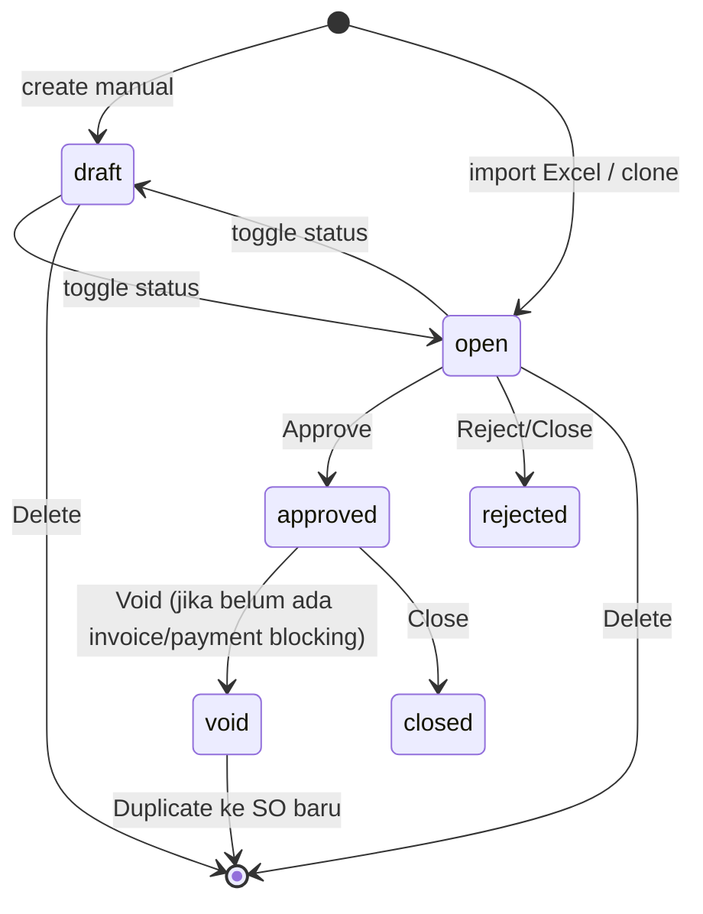
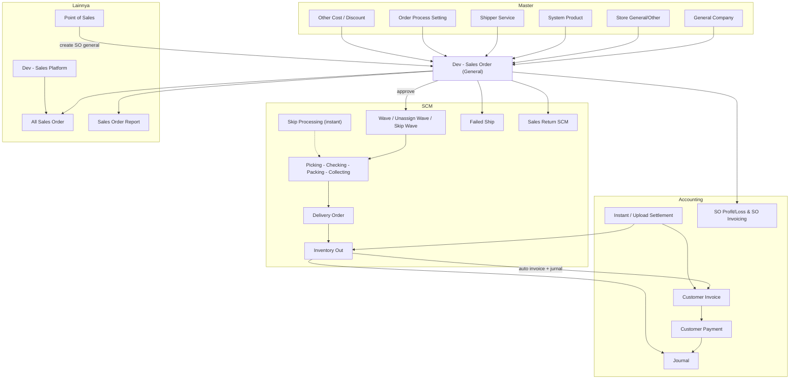

# Dev - Sales Order (Sales Order General) — Source of Truth

## 1. Ringkasan Eksekutif

Sales Order General (`type_sales_order = general`) adalah dokumen penjualan internal/manual di OlshopERP — untuk order B2B, offline, telepon/WA, import Excel massal, dan transaksi POS, bukan hasil sync marketplace. Menu utamanya **Dev - Sales Order**; menu **All Sales Order** menjadi window gabungan general plus platform. Output hilirnya: proses gudang (wave sampai outbound), Customer Invoice otomatis, jurnal, dan settlement. Audience utama: tim Operations, Busdev, Finance, dan QA.


## 2. Prasyarat

| Prerequisite | Sumber (Menu) | Catatan |
|---|---|---|
| Customer aktif | General Company | Company `company_type = general`, `is_customer = 1`; wajib di header |
| Store tipe General/Other | Store (Omni) | Platform store harus `PL_OTHER`; menentukan warehouse proses |
| Produk aktif plus unit | System Product / Master Unit | Detail line; produk PARENT tidak boleh dipakai |
| Shipper service aktif | Shipper Service | Wajib; import kosong pakai default (`is_default_shipping_service = 1`) |
| Fiscal period aktif | Accounting Setting | Transaction date harus dalam periode fiskal aktif |
| Order Process Setting | General Setting | Kontrol `process_to_wave`, `instant_processing`, random SKU |
| Currency plus exchange rate | Master Currency | Rate harus 1 jika currency primary |
| (Opsional) Other Cost / Discount master | Master Omni | Untuk biaya/diskon tambahan; harus aktif dan sesuai scope company |
| Stok cukup (kondisional) | SCM Stock | Hanya divalidasi FIFO jika `approve_with_validation = true` |

## 3. Siklus Status



| Status | Kondisi transisi | Editable? | Tombol muncul |
|---|---|---|---|
| draft | Default create manual | Ya (header + detail) | Save, toggle Open, Delete |
| open | Toggle dari draft; default hasil import (`is_import = 1`) | Ya | Save, toggle Draft, Approve, Reject/Close, Delete |
| approved | Klik Approve dari open | Tidak | Void, Close |
| rejected / closed | Reject/Close dari open (rejected) atau dari approved (closed) | Tidak | — |
| void | Void dari approved; dicek relasi invoice/payment dulu | Tidak | Duplicate (clone) |

Catatan: SO draft **tidak bisa diapprove**. Approve saat import masih berjalan diblokir.

## 4. Datalist

Endpoint list: `POST omnichannel/sales-order/get?type=general` (All Sales Order pakai `type=all`, engine kolom sama).

### 4.1 Kolom utama (visible default / penting)

| Kolom | Visible default | Sumber data | Keterangan |
|---|---|---|---|
| Trx. Code / Trx. Date | Ya | `code` + `transaction_date` | Link ke edit SO |
| Platform Order ID | Ya | `platform_order_id` | Opsional di General; referensi eksternal |
| Customer | Ya | `customer_id` ke General Company | — |
| Store Name | Ya | `store_id` | Store General/Other |
| Shipper Service + Tracking | Ya | Shipper service + other info | Tracking di other info SO |
| Processing Status | Ya | Status proses gudang + ikon ketersediaan | Wave/pick/pack dan seterusnya |
| Product Amount | Ya | `grand_total_before_vat` | Total produk setelah diskon, belum VAT/other cost |
| Net Sales | Ya | `grand_total` | Setelah diskon plus VAT plus other cost/discount |
| Trx. Status | Ya | `transaction_status` | draft/open/approved/rejected/void/closed |
| Outbound Code/Date | Ya | Relasi outbound | Kode `OT...` |
| Delivery Order Code/Date | Ya | Relasi DO | — |
| Sales Invoice Code/Date | Ya | Relasi Customer Invoice | — |
| Buyer Notes | Ya | Notes SO | — |
| CURR. / Exchange | Tidak | `currency_id`, `exchange_rate` | Column visibility |
| Product | Tidak | Agregat SKU detail | — |
| COD Amount | Tidak | Other info | — |
| Your Ref. | Tidak | `customer_reference_document` | — |
| Warehouse Process / Instant Processing / Data Owner | Tidak | Berbagai flag | — |
| Booking (number/status/tracking/dll.) | Tidak | Other info booking | Lebih relevan Platform, tampil di list shared |
| Error Flag | Kondisional | Error flags proses | Muncul saat filter Failed Process (ASO) |

### 4.2 Fitur datalist

| Fitur | Keterangan |
|---|---|
| Carousel process status | Kartu Sales Request, Review, Processed, Shipment Ready, Delivered, Received, Completed, Return, Canceled — count di-cache sekitar 10 menit; klik kartu = filter list |
| Advanced Filter / SearchBuilder | Termasuk filter tracking number di other info |
| Column Show/Hide | Kolom hidden bisa diaktifkan |
| Import (bulk) | Upload Excel 2 sheet — lihat Bagian 6.3 |
| Import History plus Log | Riwayat sesi import, detail per SO, error log per baris |
| Export template | Download `Template Import Sales Order.xlsx` |
| Create | Auto-create draft lalu redirect ke edit |
| (ASO saja) PillButtons | Failed Process, Order Failed Synchronize, Ready to Process, Order Synchronize Status; plus tombol Recheck Failed Process |

## 5. Form & Field

### 5.1 Section Header

| Field | Wajib | Default | Sumber opsi | Validasi | Catatan |
|---|---|---|---|---|---|
| Transaction Date | Ya | Hari ini | Date picker | Fiscal period aktif | — |
| Customer | Ya | Default values API | General Company aktif (`is_customer = 1`) | Exists; tidak boleh diubah setelah ada detail | — |
| Store | Ya | Default values API | Store General/Other | Required | Menentukan warehouse proses |
| Currency | Ya | ID 1 | Master Currency | Exists; locked setelah ada detail | — |
| Exchange Rate | Ya | 1 | Manual | Numeric, minimal 1; harus 1 jika primary | — |
| Shipper Service | Ya | Default shipper | Shipper Service aktif | Valid dan aktif | — |
| With Quotation | Ya | 0 | Toggle | Boolean | — |
| Platform Order ID | Tidak | — | Manual | Maksimal 100 karakter; unique antar SO non-void | Referensi eksternal |
| Tracking Number | Tidak | — | Manual | Maksimal 100 karakter; unique antar SO non-void | — |
| Description | Tidak | — | Manual | Maksimal 150 karakter | — |
| Your Ref. (customer reference) | Tidak | — | Manual | Maksimal 50 karakter | — |
| COD Amount | Tidak | 0 | Manual | Numeric, minimal 0 | — |
| Attachment | Tidak | — | Upload | Extension sesuai whitelist sistem | — |

### 5.2 Section Detail Line Item

| Field | Wajib | Default | Sumber opsi | Validasi | Catatan |
|---|---|---|---|---|---|
| Product | Ya | — | System Product company SO | Aktif, bukan PARENT, tidak deleted; bundle header harus aktif | — |
| Qty | Ya | — | Manual | Lebih dari 0, bilangan bulat (desimal ditolak) | — |
| Unit | Ya | Primary unit | Primary/alternate unit produk | Unit alternatif harus aktif | — |
| Price (before discount before VAT) | Ya | Harga produk | Manual | Numeric, minimal 0 | — |
| Sales Discount | Tidak | 0 | Manual | Numeric, minimal 0 | — |
| Description | Tidak | — | Manual | Maksimal 150 karakter | — |

Maksimal **100 detail line** per SO (`max_child`). Import detail per SO tersedia di tab Detail (lihat Bagian 6.4).

### 5.3 Section Other Cost / Other Discount

| Field | Wajib | Validasi |
|---|---|---|
| Code | Ya | Exists di master OtherCost/OtherDiscount, aktif, scope company atau all-company |
| Amount | Ya | Numeric, tidak nol, tidak negatif |

## 6. How It Works

### 6.1 Create Manual

Klik Create di datalist tidak membuka form kosong — frontend mengambil default values (customer, store, warehouse, shipper) lalu **langsung create SO draft** dan redirect ke halaman edit. User mengisi header, detail, dan other cost/discount di sana, lalu toggle Draft ke Open saat siap.

### 6.2 Approve

Approve mengubah status ke approved, menyimpan MA buffer dan price history produk, lalu:

- Jika `process_to_wave = OFF`: alokasi Random SKU langsung.
- Jika config `approve_with_validation = true`: validasi bundle, cek belum ada outbound, generate random SKU, cek stok FIFO per warehouse, lalu buat wave transfer (SO langsung masuk wave).
- **Default saat ini `approve_with_validation = false`**: approve tidak assign wave. SO tetap `unassign_wave_status = not in queue` — user harus jalankan **Unassign Wave** atau **Skip Wave Process** di SCM agar SO masuk wave.

Contoh: SO 10 pcs SKU-A diapprove dengan validasi ON, stok FIFO warehouse hanya 8 → approve gagal "Insufficient Stock" dengan detail per line.

### 6.3 Import Bulk (Excel 2 Sheet)

Upload `.xlsx/.xls` di datalist. Sheet 1 = header plus detail; Sheet 2 (opsional) = other cost/discount per Platform Order ID.

**Grouping 1 SO** = kombinasi `Customer Code + Store Name + Transaction Date + Platform Order ID + Shipper Service Code + Tracking Number`. Baris dengan kombinasi sama menjadi satu SO; tiap baris = satu detail line.

Alur: upload → history dibuat (processing) → validasi sinkron semua baris → dispatch batch job (1 job = 1 SO) → recalculate SO-based stock → update history success/failed. SO hasil import langsung **open**, `is_import = 1`, currency default 1, rate 1, payment type 8.

Kolom Sheet 1 (header baris 1 exact match, case-sensitive): Transaction Date (wajib, `DD-MM-YYYY` / `YYYY-MM-DD` / serial Excel), Customer Code (wajib, satu kode), Store Name (wajib, General/Other), Platform Order ID (opsional, unique, konsisten dalam grup), Shipper Service Code (opsional, fallback default), Tracking Number (opsional, unique), System Product SKU (wajib), Qty (wajib, lebih dari 0), Unit (wajib), Price (wajib, minimal 0).

Sheet 2: Platform Order ID (harus match Sheet 1), OC/OD Code (aktif di master), Amount (numeric, tidak nol, tidak negatif).

Batasan: max **100 detail per SO**; format `.xlsx/.xls` saja; tidak ada hard cap baris total file; 1 batch import aktif — upload baru auto-cleanup batch lama; approve SO diblokir selama import berjalan; cell berformula Excel ditolak.

Contoh grouping: 3 baris — baris 1 dan 2 sama persis kombinasi headernya (PO-001), baris 3 beda customer → hasilnya 2 SO: satu SO dengan 2 detail, satu SO dengan 1 detail.

### 6.4 Import Detail per SO

Di form edit SO (draft/open), tab Detail: upload Excel 1 sheet (Product ID atau SKU, Qty, Unit, Unit Price) untuk menambah line items. Total detail existing plus import tetap maksimal 100.

### 6.5 Fulfillment Pasca-Approve

1. **Wave assignment**: stok `reserved_quantity` naik, `available_quantity` turun; `unassign_wave_status` menjadi processed.
2. **Processing chain**: Picking ke Checking ke Packing ke Collecting — setiap approve memindahkan qty antar virtual warehouse. Generate outbound otomatis di packing **sudah dinonaktifkan** (ETM-10761).
3. **Instant processing** (jika flag ON dari Order Process Setting): SO yang sudah di wave di-auto-approve pick sampai collect oleh scheduler tiap menit, lanjut auto-create dan approve Delivery Order. SO instant dikecualikan dari generate picklist manual.
4. **Delivery Order**: butuh collecting list sudah ada; approve DO generate transfer shipping-DO.
5. **Inventory Out (Outbound, prefix `OT`)**: pemicu utama dari settlement generate outbound atas shipping-DO yang approved. Approve outbound: `used_quantity` naik, `reserved_quantity` turun, `processed_to_out_quantity` naik di detail SO. **Trigger auto Customer Invoice** (jika belum ada invoice qty, langsung approve) plus **jurnal outbound**.

### 6.6 Finance

Approve SO General **sendiri tidak membuat invoice** (beda dengan POS yang auto invoice plus outbound plus receive). Invoice terbentuk saat: outbound approve (otomatis), settlement upload dan approve, manual di Sales Invoice, atau alur POS. Settlement General pakai template CSV kolom Order ID, Date, Total plus OC/OD — pipeline generate outbound, invoice, payment, dan jurnal sekaligus.

### 6.7 Dampak Stok per Fase

| Fase | available | reserved | used | Outstanding SO |
|---|---|---|---|---|
| SO open/draft (belum wave) | — | — | — | Naik (ATS turun) |
| Wave assign | Turun | Naik | — | Keluar outstanding |
| Pick/Check/Pack | Pindah antar virtual WH | — | — | — |
| Outbound approve | — | Turun | Naik | — |

Formula ATS:

```
ATS = On Hand - Outstanding SO - Reserved Out
```

ATS direcalculate async setelah perubahan SO.

## 7. Validasi

### 7.1 Header

| # | Kondisi | Behavior | Error message |
|---|---|---|---|
| 1 | Transaction date kosong / di luar fiscal period | Ditolak | Pesan fiscal period |
| 2 | Customer kosong / bukan general customer aktif | Ditolak | — |
| 3 | Store / currency / shipper / with_quotation kosong | Ditolak | — |
| 4 | Exchange rate bukan 1 saat currency primary | Ditolak | — |
| 5 | Code duplikat per company | Ditolak | — |
| 6 | Platform Order ID / Tracking Number duplikat antar SO non-void | Ditolak | "...has already been taken" |
| 7 | Edit saat status bukan draft/open | Diblokir | `can_update = false` |
| 8 | Ubah customer/tipe/currency setelah ada detail | Diblokir | — |

### 7.2 Detail

| # | Kondisi | Behavior | Error message |
|---|---|---|---|
| 9 | Qty nol/negatif/desimal | Ditolak | — |
| 10 | Price negatif | Ditolak | — |
| 11 | Produk inactive / deleted / beda company | Ditolak | — |
| 12 | Produk tipe PARENT | Ditolak | "PARENT product type can't be used" |
| 13 | Bundle header atau unit alternatif inactive | Ditolak | — |
| 14 | Detail melebihi 100 | Ditolak | — |

### 7.3 Approval

| # | Kondisi | Behavior | Error message |
|---|---|---|---|
| 15 | Status draft | Diblokir | "This sales order is draft, you can't approve" |
| 16 | Status sudah final (approved/void/closed) | Diblokir | — |
| 17 | Import sedang berjalan | Diblokir | "Updating process is in progress" |
| 18 | Tidak ada detail | Diblokir | — |
| 19 | Ada produk inactive (termasuk bundle header) | Diblokir | "contains inactive product(s)" |
| 20 | Approval concurrent (lock cache 60 detik) | Diblokir | "Approval process is in progress" |
| 21 | Validasi ON dan stok FIFO kurang | Diblokir | "Insufficient Stock" plus detail per line |
| 22 | Validasi ON dan outbound sudah ada | Diblokir | "Sales order has generated outbound" |

### 7.4 Import (per baris / per sesi)

| # | Kondisi | Behavior | Error message |
|---|---|---|---|
| 23 | Header kolom tidak match template | Sesi gagal | "The file format doesn't match the system template." |
| 24 | File kosong (hanya header) | Sesi gagal | "The data you have entered is empty." |
| 25 | Cell berisi formula Excel | Baris gagal | "...contains an Excel formula. Please input a static value only." |
| 26 | Store bukan General/Other | Baris gagal | "Store {name} is not a 'General/Other' type store" |
| 27 | Platform Order ID / Tracking dipakai header lain di file | Baris gagal | "...already used in another header" |
| 28 | SKU tidak ditemukan | Baris gagal | "Product SKU {sku} not found" |
| 29 | Unit tidak valid | Baris gagal | "Unit {code} not valid" |
| 30 | Sheet 2 Platform Order ID tidak ada di Sheet 1 | Baris gagal | "...does not exist in Sheet 1" |
| 31 | Semua baris gagal | Import failed | Cek log |

### 7.5 Void / Close / Delete

| # | Kondisi | Behavior |
|---|---|---|
| 32 | Delete saat status bukan draft/open | Diblokir |
| 33 | Void saat ada invoice/payment terkait | Bisa diblokir sesuai relasi |
| 34 | Close/Reject dari status selain open | Diblokir |
| 35 | Duplicate dari SO non-void | Diblokir; clone wajib tracking dan platform order ID unik |

## 8. Relasi Menu Lain



| Menu | Peran dalam relasi |
|---|---|
| General Company | Customer B2B wajib di header |
| Store (General/Other) | Store internal `PL_OTHER`; penentu platform dan warehouse proses |
| System Product / Master Unit | Sumber SKU dan satuan detail; produk inactive blokir approve |
| Shipper Service | Kurir/layanan kirim; default dipakai import jika kosong |
| Order Process Setting | Kontrol wave path, instant processing, random SKU |
| Other Cost / Other Discount | Biaya/diskon tambahan; mengubah grand total, ikut ke invoice dan settlement |
| Wave / Unassign Wave / Skip Wave Process | Assign SO ke wave; reserve stok; wajib manual jika `approve_with_validation = false` |
| Picking / Checking / Packing / Collecting | Rantai proses gudang; transfer stok antar virtual warehouse |
| Skip Processing | Auto-skip chain saat instant processing ON |
| Delivery Order | Surat jalan; update qty prepared/processed DO; approve draft invoice terkait |
| Inventory Out (Outbound) | Stok fisik keluar; **trigger auto Customer Invoice plus jurnal** |
| Failed Ship | Error handling gagal kirim (shared flags, lebih sering platform) |
| Customer Invoice (Sales Invoice) | Tagihan AR; `prepared_to_invoice_quantity` |
| Instant Settlement / Upload Settlement | Rekonsiliasi; generate outbound plus invoice plus payment sekaligus (template General CSV) |
| Customer Payment | Pelunasan invoice; jurnal kas/bank |
| Journal | Jurnal outbound, AR, payment |
| Sales Return (SCM plus Accounting) | Retur barang dari SO yang sudah outbound (platform sync exclude General/Other) |
| SO Profit/Loss dan SO Invoicing | Laporan read-only |
| Point of Sales | Sumber create SO General retail; approve POS auto invoice plus outbound plus receive, bypass wave |
| **All Sales Order** | Window gabungan general plus platform (`type=all`); Create dan Import mengikuti pola General; edit form tergantung tipe (General editable, Platform sebagian besar read-only); punya PillButtons Failed Process, Failed Synchronize, Ready to Process, Sync Status, plus Recheck |
| **Dev - Sales Platform** | SO marketplace sync — satu tabel dengan General tapi beda alur: butuh product binding, approve async, AWB/logistic API, tanpa import Excel; tampil bersama General di ASO |
| Sales Order Report | Analytics revenue lintas tipe |

### 8.1 Perbandingan cepat General vs Platform vs ASO

| Aspek | SO General | SO Platform | All Sales Order |
|---|---|---|---|
| Sumber data | Manual, import Excel, POS | Sync marketplace | Gabungan view |
| Customer | Wajib General Company | Buyer info; `customer_id` opsional | Ikut tipe |
| Product binding | Tidak perlu | Wajib sebelum approve/wave | Ikut tipe |
| Approval | Sinkron langsung | Async via queue job | Ikut tipe |
| Import Excel | Ya (2 sheet) | Tidak | Ya, tipe general |
| Edit | Luas (draft/open) | Sebagian besar read-only | Tergantung tipe |
| Settlement | Template General CSV | Mapping per marketplace | — |

## 9. Gap Registry

| ID | Deskripsi | Dampak | Status |
|---|---|---|---|
| GAP-SOG-01 | Import sekitar 2.000 baris stuck: parsing plus validasi Sheet 1 berjalan sinkron di HTTP request sebelum job di-dispatch → timeout/memory, progress 0%, tidak ada sinyal gagal di Horizon | User tidak tahu import jalan atau gagal; tim dev tidak punya sinyal debug | Open |
| GAP-SOG-02 | History import stuck `processing` — baru berubah `failed` setelah user upload file baru (stale batch cleanup terjadi saat upload berikutnya) | Status misleading; user mengira import lama masih berjalan | Open |
| GAP-SOG-03 | Beberapa error (struktur / max 100 detail) menyebabkan seluruh sesi import gagal — belum partial success per order | Order valid ikut terblokir | Open |
| GAP-SOG-04 | Belum ada fitur export order gagal dalam format template re-importable; error log belum konsisten pakai nomor baris Excel asli user | User harus manual copas dari file asli untuk perbaikan | Open |
| GAP-SOG-05 | Improvement bulk import 5.000+ baris (parse async, 1 order = 1 job, partial success atomic per order, export failed) sudah dispesifikasikan tapi belum diimplement | Target kapasitas belum tercapai | In Progress |
| GAP-SOG-06 | Granularitas failed import: log per baris tapi history detail per SKU, bukan per order/group | Sulit membedakan "1 order gagal" vs "1 baris gagal" | Open |

## 10. FAQ

**Q: Apa beda Dev - Sales Order, All Sales Order, dan Dev - Sales Platform?**
A: Dev - Sales Order khusus SO internal (general). Dev - Sales Platform khusus SO marketplace hasil sync. All Sales Order layar gabungan keduanya untuk monitoring — create dan import di ASO mengikuti pola General.

**Q: Kenapa klik Create langsung pindah ke halaman edit?**
A: By design — sistem otomatis membuat SO draft dengan nilai default, lalu user tinggal melengkapi data.

**Q: Kenapa SO hasil import langsung Open, bukan Draft?**
A: Import dianggap data yang sudah lengkap, jadi bisa langsung direview dan diapprove tanpa toggle status.

**Q: Setelah approve, kenapa SO tidak masuk wave?**
A: Config default approve tanpa validasi wave. SO tetap "not in queue" sampai dijalankan Unassign Wave atau Skip Wave Process di SCM.

**Q: Kapan stok benar-benar keluar gudang?**
A: Saat Outbound diapprove. Sebelum itu stok hanya di-reserve (saat masuk wave) atau masuk hitungan Outstanding SO (sebelum wave).

**Q: Kapan invoice terbentuk?**
A: Bukan saat approve SO. Invoice otomatis saat outbound approve, atau via settlement, atau manual di Sales Invoice, atau alur POS.

**Q: Bisa pakai store marketplace (misal Shopee) di import General?**
A: Tidak. Store harus tipe General/Other — kalau tidak, baris ditolak dengan pesan error.

**Q: Berapa maksimal data import?**
A: Maksimal 100 detail per SO. Total baris file tidak ada batas eksplisit, tapi saat ini file sekitar 2.000 baris berisiko stuck (lihat Gap Registry) — improvement 5.000 baris sedang berjalan.

**Q: Bisa approve SO saat import masih jalan?**
A: Tidak — diblokir dengan pesan "Updating process is in progress."

**Q: Apa fungsi Platform Order ID di SO General?**
A: Referensi eksternal sekaligus kunci grouping baris menjadi satu SO saat import. Bukan ID marketplace. Harus unik antar SO non-void.

**Q: Bagaimana cek error import?**
A: Buka Import History di datalist, lihat log per baris (sheet, nomor baris, pesan error).

**Q: SO General bisa diretur?**
A: Ya, manual jika sudah outbound (atau dengan flag tanpa outbound). Sync retur platform mengecualikan store General/Other.

## 11. Changelog

| Tanggal | Versi | Perubahan |
|---|---|---|
| 2026-07-21 | 1.0 | Dokumen awal — konsolidasi requirement v2.0, analisa datalist/ASO, dan spesifikasi improvement bulk import |

## 12. Knowledge Base Hints (untuk operator)

**Istilah teknis → padanan awam:**

| Istilah | Padanan awam |
|---|---|
| SO General | Pesanan penjualan internal (bukan dari marketplace) |
| Wave | Antrian proses gudang — pesanan dikelompokkan sebelum diambil barangnya |
| Unassign Wave / Skip Wave | Langkah manual memasukkan pesanan ke antrian gudang setelah approve |
| Outstanding SO | Barang yang sudah dipesan tapi belum diproses gudang |
| ATS (Available To Sell) | Stok yang masih boleh dijual = stok fisik dikurangi pesanan berjalan |
| Reserved quantity | Stok yang sudah "dipesan" untuk order tertentu, tidak bisa dipakai order lain |
| Outbound / Inventory Out | Bukti barang keluar gudang secara fisik |
| Delivery Order | Surat jalan pengiriman |
| Settlement | Pencocokan pembayaran order — sekali proses bisa bikin outbound, tagihan, dan pembayaran |
| Instant processing | Mode otomatis: sistem melewati proses picking sampai packing tanpa langkah manual |
| Platform Order ID | Nomor referensi luar (bukan nomor Shopee/Lazada) — juga penanda pengelompokan baris import |
| Fiscal period | Periode pembukuan aktif — tanggal transaksi harus di dalamnya |

**Skenario troubleshooting:**

| Gejala | Penyebab umum | Solusi |
|---|---|---|
| Approve gagal padahal stok ada | Validasi stok FIFO aktif tapi stok di gudang proses kurang; atau produk nonaktif; atau SO masih draft; atau import masih jalan | Cek pesan error per baris; pastikan status Open; tunggu import selesai |
| Setelah approve pesanan tidak diproses gudang | Sistem tidak otomatis memasukkan ke antrian (setting default) | Jalankan Unassign Wave atau Skip Wave Process di SCM |
| Import stuck lama di 0% | File terlalu besar (sekitar 2.000 baris ke atas) — keterbatasan sistem saat ini | Pecah file jadi lebih kecil; laporkan ke tim jika status tidak berubah |
| Baris import ditolak "formula Excel" | Cell berisi rumus, bukan nilai statis | Copy paste values only lalu upload ulang |
| Invoice tidak muncul setelah approve SO | Memang tidak dibuat saat approve | Invoice muncul setelah outbound approve atau settlement |
| Store ditolak saat import | Store yang dipakai bukan tipe General/Other | Ganti ke store internal |

**Field yang skip di KB:** `is_import`, `owned_by`, `unassign_wave_status`, `sales_order_process_status_id`, `prepared_to_do_quantity`, `processed_to_out_quantity`, exchange rate internal, error flags mentah, snapshot MA buffer/price history.

## 13. Technical Hints (untuk developer)

**Area codebase yang perlu didokumentasikan:** model SalesOrder/SalesOrderGeneral plus detail/other cost/discount/other info; controller SO (store, approve, detail, upload, progress, import history/log, filter-process-status, pill-count); import sheet classes (Sheet 1, Sheet 2, detail import); job import per grup, job move SO ke wave, job skip processing, job recalculate SO-based stock; wave service dan processing service; trait delivery order process; helper mutasi stok (approve transfer/outbound); helper auto-generate customer invoice; settlement general (pipeline generate outbound/invoice/payment); frontend DataList General, DataList ASO, Form, DatalistDetail, PillButtons; config `general.max_child`, `omni.approve_so.approve_with_validation`, Order Process Setting.

**Invariants:**

- `count(details) <= 100` per SO
- `sales_order_quantity` integer dan `> 0`; price `>= 0`
- `platform_order_id` dan `tracking_number` unique antar SO non-void
- SO import selalu `transaction_status = open` dan `is_import = 1`
- `processed_to_out_quantity <= sales_order_quantity` per detail
- Store SO general selalu platform `PL_OTHER`
- SO draft tidak pernah bisa approved
- ATS = on_hand − outstanding_so − reserved_out setelah recalculate
- Outbound approve pertama tanpa invoice existing → tepat 1 Customer Invoice auto-approved

**Failure modes:**

- Parsing import sinkron mati di HTTP request → tidak ada job di queue, history stuck processing (GAP-SOG-01/02); expected to-be: parse async, history segera failed dengan pesan
- Approval concurrent → lock cache 60 detik, request kedua ditolak
- Approve saat import → diblokir via cache key per SO
- Job import gagal di tengah 1 order → expected atomic per order (rollback, tanpa SO setengah detail)
- Stale batch import → dibersihkan saat upload baru (perilaku saat ini; sumber gejala misleading status)
- Kill parse job (to-be) → history harus failed, tidak stuck selamanya

**Data lifecycle lintas dokumen:**

- Outstanding SO (open/approved belum wave) → wave assign memindahkan ke `reserved_quantity`, keluar dari outstanding; recalculate ATS async
- `prepared_to_do_quantity` / `processed_to_do_quantity` di detail SO bergerak saat DO dibuat/diapprove
- `processed_to_out_quantity` naik saat outbound approve; sekaligus trigger `prepared_to_invoice_quantity` via auto invoice
- Settlement approve mengisi rantai outbound → invoice → payment → jurnal untuk SO yang belum lengkap
- Flag `is_instant_processing` di SO menentukan apakah scheduler skip processing memprosesnya
- SO void bisa di-duplicate — clone reset relasi, wajib tracking/platform order ID baru yang unik

## 14. Referensi Struktur untuk Cursor

```
Section 1-11 → material utama untuk requirement.md
Section 5, 6, 7, 10 → adaptasi ke knowledge-base.md dengan tone awam (lihat Section 12 KB Hints)
Section 13 Technical Hints → seed untuk technical.md, dilengkapi Cursor dari codebase
Frontmatter YAML di atas → copy ke 3 file utama, sinkronkan version + last_updated
Golden reference tone & struktur: docs/qa-docs/accounting-supplier-invoice/
```
