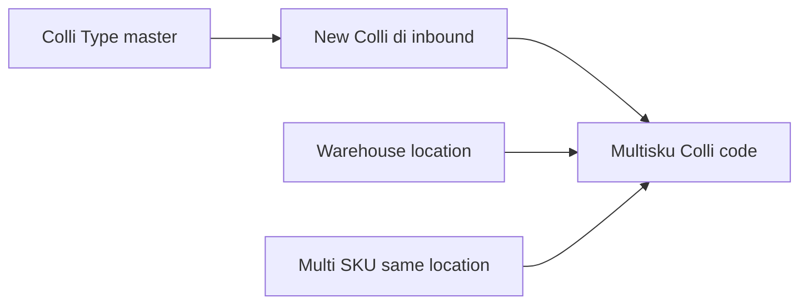
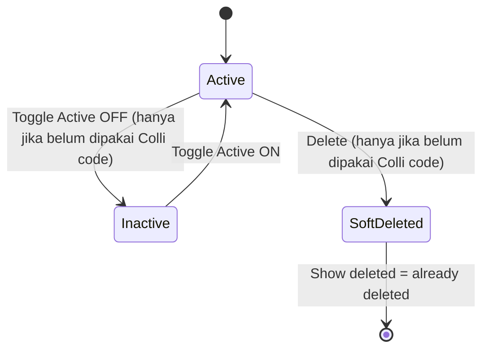
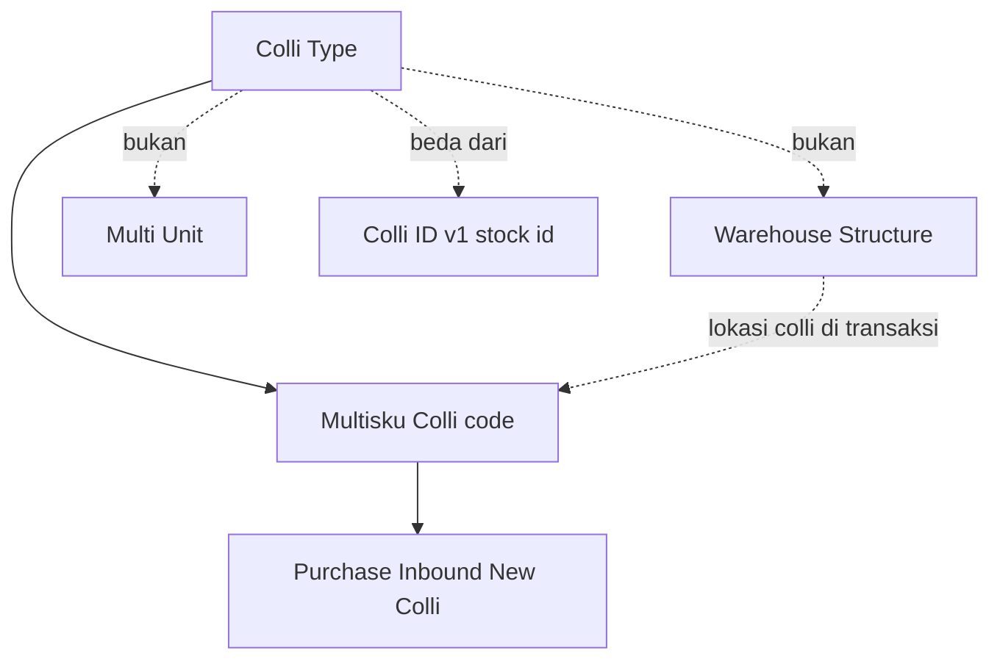

# Colli Type — Source of Truth

## 1. Ringkasan Eksekutif

**Colli Type** adalah master Supply Chain untuk menamai **jenis wadah colli** (Box, Pallet, dll.). Dipakai sebagai label tipe saat user **create New Colli** di transaksi (mulai Purchase Inbound — SOT transaksi menyusul). Ini **bukan** multi-unit dan **bukan** warehouse; juga **beda** dari Colli ID v1 (1 colli = 1 stock id dengan qty isi tetap).

**Colli v2 (konteks):** colli code = **wadah multi-SKU** di **satu lokasi WH** yang sama. Availability colli = total qty semua SKU di dalam colli itu. Master Colli Type hanya mendefinisikan **tipe wadah**; lokasi colli mengikuti Location Destination transaksi.



**Audience:** Warehouse / SCM ops + admin master.  
**UI create (staging):** [https://staging.olshoperp.com/supplychain/colli-type/create](https://staging.olshoperp.com/supplychain/colli-type/create) · route `/supplychain/colli-type`.

## 2. Prasyarat

| Prerequisite | Sumber | Catatan |
|--------------|--------|---------|
| Privilege menu Colli Type | Gate | view / create / update / delete |
| Company context | Sanctum token | Data scoped `owned_by` kecuali Show for all company |
| (Konsumen nanti) Purchase Inbound + WH destination | Purchase Inbound | Default Colli Type dipakai saat **New Colli** — di luar scope CRUD master ini |

Tidak wajib punya Colli code dulu untuk create type.

## 3. Siklus Status

Master **tanpa** approval Draft/Open/Approved. Yang relevan: Active flag, Default flag, soft-delete.



| Kondisi | Boleh? |
|---------|--------|
| Active ON | Type muncul di opsi transaksi yang memakai Colli v2 |
| Active OFF | Tidak muncul di opsi transaksi |
| Inactive saat sudah ada Multisku Colli memakai type | **Ditolak** + notifikasi EN (§7) |
| Soft delete saat sudah dipakai | **Ditolak** |
| Soft delete belum dipakai | Ya — muncul di Show deleted dengan keterangan deleted |

## 4. Datalist

**Route:** `/supplychain/colli-type`

### 4.1 Kolom

| Kolom | Visible default | Sumber |
|-------|-----------------|--------|
| **Code** | true | `code` |
| **Name** | true | `name` |
| **Description** | true | `description` (boleh kosong) |
| **Default Data** | true | Flag default (ON/OFF) — kolom DB `is_default` **belum** di migration lokal (GAP-CT-01) |
| **Active** | true | `status` (1/0) |
| **Created by \| Created at** | true | Audit create |
| **Action** | true | Edit / Delete (privilege-aware; delete blok jika used) |

**Tidak** diminta di requirement list: Updated by, Show for all company sebagai kolom — boleh ada di form/edit; jika FE menambah kolom, dokumentasikan saat split.

### 4.2 Fitur toolbar (pola master SCM)

| Fitur | Expected |
|-------|----------|
| Global Search | Ya |
| Advanced Filter | Ya (pola DataTablesV3) |
| Create | Ya → `/supplychain/colli-type/create` |
| Show deleted | Ya — baris soft-deleted + label *already deleted* (konsisten master lain) |
| Column show/hide | Ya (standar) |
| Export | Tidak disebut requirement — treat **out of scope** kecuali FE sudah ada |

## 5. Form & Field

### 5.1 Create / Edit

| Field | Required | Default create | Aturan |
|-------|----------|----------------|--------|
| **Code** | Ya | — | Unik per company scope (ikuti pola master SCM). **Boleh diubah** meski type sudah dipakai Colli code |
| **Name** | Ya | — | **Boleh diubah** meski sudah dipakai |
| **Description** | Tidak | kosong | Teks bebas |
| **Set as Default Data** | — | Lihat §6.1 | Max **1** ON per company scope; ON baru → OFF-kan default lama |
| **Active** | — | **ON** | OFF diblok jika sudah ada Colli code memakai type |
| **Show for all company** | — | **OFF** | ON = master terlihat/bisa dipakai internal company lain (pola `is_all_company`) |

### 5.2 Audit Log (sidenav / section)

Wajib mencatat perubahan user pada master ini, termasuk (minimal):

| Action | Yang harus ter-log |
|--------|-------------------|
| Create | Code, name, description, default, active, is_all_company |
| Update field | Before/after per field yang berubah (code, name, description, …) |
| Toggle Default | ON/OFF + efek demote default lain |
| Toggle Active | ON/OFF (termasuk attempt gagal jika perlu — prefer success path) |
| Toggle Show for all company | ON/OFF |
| Soft delete | Siapa/kapan |

**[VERIFY: CODEBASE]** Audit handler per-action belum diverifikasi di controller (controller/FE Colli Type **belum** ada di workspace lokal — GAP-CT-02).

## 6. How It Works

### 6.1 Set as Default Data

| Situasi | Hasil |
|---------|--------|
| Perusahaan **belum punya** Colli Type sama sekali → create pertama | Default **ON** otomatis |
| Create type ke-2 dst. tanpa user set default | Default **OFF** |
| User set Default **ON** pada type A sementara B sedang ON | A = ON, B dipaksa **OFF** (hanya 1 default) |
| Semua boleh OFF? | Requirement: first create ON; setelah itu user pilih custom. **Tidak** wajib selalu ada default — jika user OFF-kan satu-satunya default tanpa ON yang lain, opsi New Colli di inbound **tanpa** default terpilih (GAP-CT-03 soft: konfirmasi UX) |

**Fungsi sementara (konsumen):** saat user di detail Purchase Inbound pilih SKU + create colli = **New Colli**, dropdown Colli Type **preselect** type yang Default ON.

### 6.2 Active vs used by Colli code

“Digunakan” = ada record **Multisku Colli** (`scm_multisku_collis`) dengan `colli_type_id` = type ini (relasi entity `ColliType::multiskuCollis`).

| Aksi | Belum dipakai | Sudah dipakai |
|------|---------------|---------------|
| Edit code / name / description | Ya | Ya |
| Active OFF | Ya | **Tidak** |
| Soft delete | Ya | **Tidak** |
| Active ON / Show for all company | Ya | Ya |

### 6.3 Konteks bisnis Colli v2 (bukan scope implementasi master)

Contoh inbound multi-SKU ke 1 box di lokasi yang sama (Seruni Drop Off): beberapa SKU masuk **satu colli code** tipe Box; total availability colli = sum qty SKU di dalamnya. Colli ID v1 (N stock id × isi per colli) **tidak** memenuhi case itu — diganti konsep wadah + Colli Type.

Hierarki WH (building → drop off → lorong → rack): lokasi colli = Location Destination transaksi; opsi existing colli code harus **sama lokasi**. Detail aturan inbound → SOT Purchase Inbound / Colli v2 nanti.

### 6.4 Contoh kasus (master)

| # | Situasi | Expected |
|---|---------|----------|
| 1 | Create pertama: Code `BOX`, Name `Box` | Tersimpan; Default **ON**; Active ON; Show all company OFF |
| 2 | Create kedua `PLT` / Pallet tanpa set default | Default **OFF** |
| 3 | Set `PLT` Default ON | `BOX` jadi OFF; `PLT` ON |
| 4 | Type sudah punya Colli code → Active OFF | Error EN (§7) |
| 5 | Type sudah dipakai → Delete | Ditolak |
| 6 | Type belum dipakai → Delete | Soft delete; Show deleted menampilkan *already deleted* |
| 7 | Type sudah dipakai → ganti Code/Name | Sukses; audit log tercatat |
| 8 | Active OFF type → tidak muncul di New Colli inbound | (saat fitur inbound live) |

## 7. Validasi

| Kondisi | Behavior / pesan |
|---------|------------------|
| Code / Name kosong | Required — blok save |
| Code duplikat (scope company) | Reject unique (pola master) — **[VERIFY]** pesan exact |
| Active OFF padahal `multiskuCollis` exists | Reject. **Rekomendasi notif (EN):** *This Colli Type cannot be set to Inactive because it is already used by one or more Colli codes. Keep it Active, or create a new Colli Type for future use.* |
| Delete padahal dipakai | Reject. **Rekomendasi notif (EN):** *This Colli Type cannot be deleted because it is already used by one or more Colli codes.* |
| Set Default ON | Demote default lain di scope yang sama (1 ON) |

## 8. Relasi Menu Lain



| Menu | Relasi |
|------|--------|
| Multisku Colli / Colli code (tabel `scm_multisku_collis`) | Child memakai `colli_type_id`; gate inactive/delete |
| Purchase Inbound (TO-BE) | Konsumen Default + New Colli type select |
| Warehouse Structure | Lokasi colli di transaksi — bukan field di master type |
| Unit / Warehouse master | **Bukan** pengganti Colli Type |

**Manifest:** slug `supplychain-colli-type` **belum** ada di `manifest.yaml` — tambah saat split 5 file.

## 9. Gap Registry

| ID | Deskripsi | Type | Dampak | Status |
|----|-----------|------|--------|--------|
| GAP-CT-01 | Kolom **Default** (`is_default`) **belum** ada di migration `scm_colli_types` (hanya `name`, `description` + baseColumns). Entity fillable juga belum include `is_default` | Missing Behavior | Default Data tidak bisa persist | Open — Dev harus tambah kolom + unique-one-default logic |
| GAP-CT-02 | Controller, Policy, routes API, Menu seeder, FE pages Colli Type **belum** ada di workspace lokal; staging create URL sudah disebut — treat sebagai **WIP** | Unverified / Missing Behavior | CRUD/audit/AS-IS UI | Open — verifikasi ulang setelah merge FE/BE |
| GAP-CT-03 | Jika user mematikan satu-satunya Default tanpa meng-ON-kan type lain: preselect New Colli kosong — OK? | Pending Decision | UX inbound | Pending Decision — Yemima (minor) |
| GAP-CT-04 | Unique `code`: base migration `with_unique` default — pastikan scope company (+ soft delete) selaras master lain | Unverified | Duplikat code | Open — verify saat FormRequest ada |
| GAP-CT-05 | Audit Log per-action (create/update toggles/delete) — requirement wajib; implementasi belum dicek | Missing Behavior | Compliance / trace | Open — ikuti AuditHandler pola master SCM |
| GAP-CT-06 | Export datalist tidak disebut requirement | Unverified | Scope | Resolved for SOT — out of scope kecuali sudah ada di FE |
| GAP-CT-07 | Notifikasi inactive/delete: copy EN rekomendasi §7 belum di-hardcode di app | Missing Behavior | Pesan user | Open — pakai rekomendasi §7 saat implement |

## 10. FAQ

**Q: Colli Type vs Warehouse vs Unit?**  
A: Type = nama wadah (Box/Pallet). Warehouse = lokasi fisik. Unit = satuan qty (pcs, dll.). Terpisah.

**Q: Colli Type vs Colli ID lama?**  
A: Colli ID lama pecah stock id per colli dengan qty isi tetap. Colli v2 = satu kode wadah berisi banyak SKU di lokasi yang sama; Type hanya mengklasifikasi wadah.

**Q: Boleh ganti Code setelah dipakai?**  
A: Ya. Yang tidak boleh: Inactive atau hapus jika sudah ada Colli code.

**Q: Kenapa harus ada Default?**  
A: Mempercepat New Colli di inbound — type default langsung terpilih.

**Q: Show for all company?**  
A: ON = type bisa dipakai company internal lain (data shared), sama pola master SCM lain.

## 11. Changelog

| Version | Date | Changes |
|---------|------|---------|
| 1.0 | 2026-08-14 | Initial SOT Colli Type master dari requirement Yemima + schema `scm_colli_types` / `MultiskuColli`; konteks Colli v2; gap WIP FE/BE & `is_default` |

## 12. Knowledge Base Hints

### Kamus

| Istilah | Awam |
|---------|------|
| Colli Type | Jenis wadah (Box, Pallet, …) |
| Default Data | Type yang otomatis terpilih saat New Colli |
| Active | Boleh / tidak dipakai di transaksi |
| Show for all company | Type dibagikan ke company lain |
| Colli code | Nomor wadah aktual di gudang (bukan master type) |
| Digunakan | Sudah ada Colli code yang memakai type ini |

### Troubleshooting

| Gejala | Cek |
|--------|-----|
| Tidak bisa Inactive | Type sudah dipakai Colli code |
| Tidak bisa Delete | Sama — masih ada Colli code |
| Dua type Default ON | Bug — seharusnya hanya satu |
| Type tidak muncul di inbound | Active OFF? atau Show for all company / company scope |
| Create pertama Default OFF | Bug vs rule first create = ON |

### Skip di KB

Migration path, fillable, MultiskuColli class internals, Colli ID v1 print QR detail.

## 13. Technical Hints

### File map (real, AS-IS lokal)

| Layer | Path / nama |
|-------|-------------|
| Entity | `Modules/SupplyChain/Entities/ColliType.php` — table `scm_colli_types` |
| Migration type | `…/2026_08_12_140135_create_colli_types_table.php` — `baseColumns` + `name` + `description` |
| Consumer entity | `Modules/SupplyChain/Entities/MultiskuColli.php` — `scm_multisku_collis.colli_type_id`, `code_identifier = COL` |
| Migration colli | `…/2026_08_12_140249_create_multisku_collis_table.php` |
| Controller / Policy / Routes / FE | **Belum** di workspace — GAP-CT-02 |
| UI staging | `/supplychain/colli-type`, create `/supplychain/colli-type/create` |

### Invariants (TO-BE / requirement)

1. Max satu `is_default = 1` per company scope (saat kolom ada).  
2. First Colli Type create → default ON.  
3. Create Active default ON; Show for all company default OFF.  
4. Tidak boleh Active OFF / delete jika `multiskuCollis()->exists()`.  
5. Code & name tetap editable setelah used.  
6. Soft delete + Show deleted = *already deleted*.  
7. Select transaksi hanya type Active.

### Failure modes

| Mode | Expected |
|------|----------|
| ValidationException required/unique | FormRequest |
| Cannot inactive / cannot delete | Pesan EN §7 |
| Race dua default ON | Lock/transaction demote others |

### Data lifecycle

Create type → (opsional) dipakai saat generate Multisku Colli di inbound → type terkunci dari inactive/delete → code/name masih bisa diubah → audit log setiap perubahan.

## 14. Referensi Struktur untuk Proses Split

```
Section 1-11 → material utama untuk requirement.md
Section 5, 6, 7, 10 → adaptasi ke knowledge-base.md dengan tone awam (lihat Section 12)
Section 13 Technical Hints → seed untuk technical.md, sudah pakai path/nama real
Frontmatter YAML di atas → copy ke 3 file utama (+ user-guide.md kalau gate review/final), sinkronkan version + last_updated
Golden reference tone & struktur: docs/qa-docs/accounting-supplier-invoice/
```

**Catatan split:** tambah entry `supplychain-colli-type` di `manifest.yaml` + folder 5 file; code_globs include entity/migration + FE saat ada. SOT transaksi Purchase Inbound / Colli v2 = dokumen terpisah.
