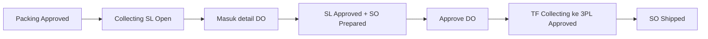
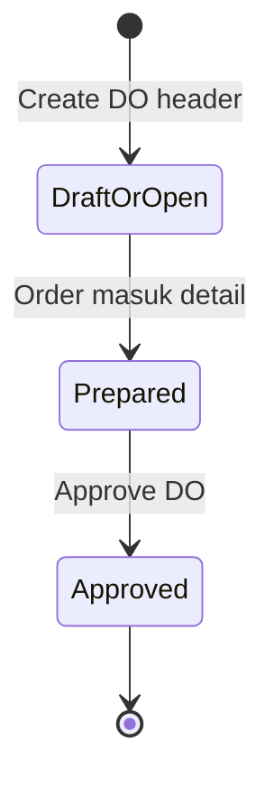
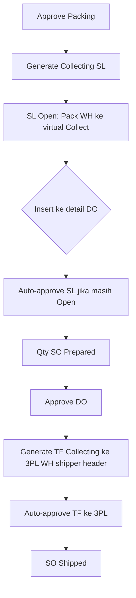
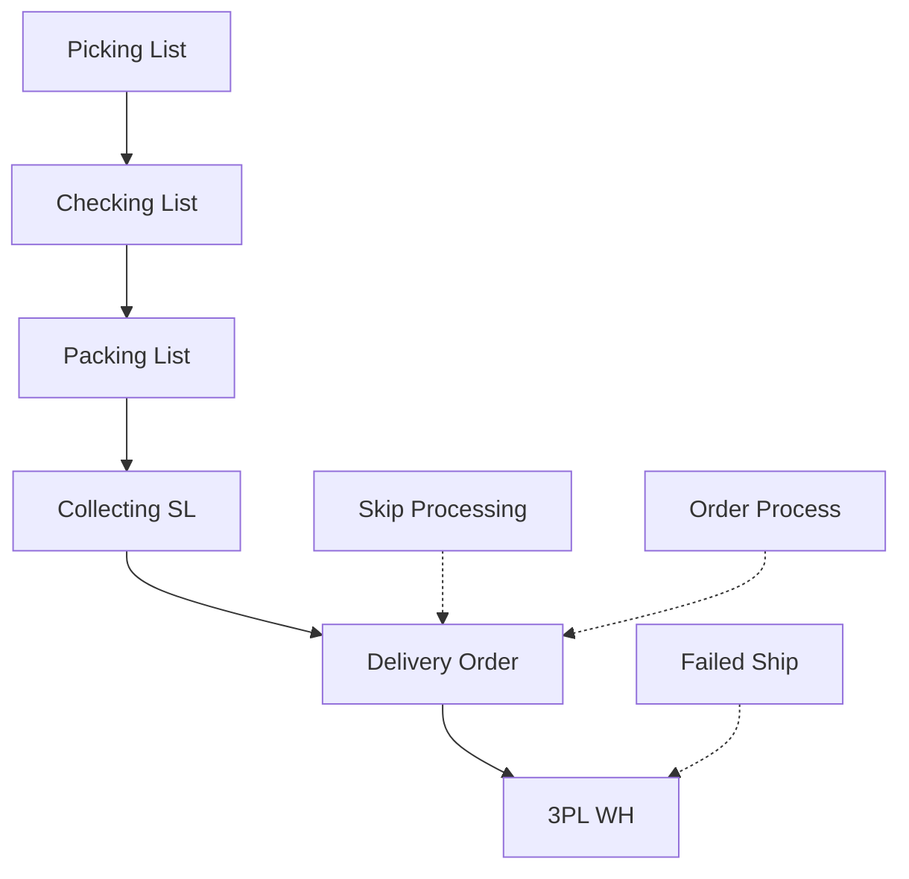

# Delivery Order — Source of Truth v1.0

**UI:** `/supplychain/delivery-order` · create/edit `/supplychain/delivery-order/edit/:id`  
**Verified:** Yemima (2026-10-05) + Collecting/Shipping List generate + DO detail insert + DO approve.

---

## 1. Ringkasan Eksekutif

Delivery Order (DO) adalah dokumen **handover pengiriman** setelah collecting. Melayani dua flow besar: **order internal** (shipper & tracking mandiri company) dan **order platform** (shipper dari marketplace). Stok baru resmi pindah ke gudang **3PL** saat **approve DO** — bukan saat baris masuk detail. Satu DO boleh campur banyak order selama **shipper sama**. Live operator: insert **by order** (bukan by SKU).



---

## 2. Prasyarat

| Prasyarat | Sumber | Catatan |
|-----------|--------|---------|
| Rantai pick → check → pack selesai | Processing | Approve packing generate Collecting |
| Collecting (`SL-*`) ada | TF internal `shipping` | Pack WH ke virtual collect/ship WH; awalnya **Open** |
| Shipper header DO terikat gudang 3PL | Binding shipper ↔ 3PL | Tanpa binding, generate TF ke 3PL gagal |
| Order belum void | Sales Order | Void ditolak insert |
| Tanggal SO tidak lebih baru dari tanggal DO | Header DO vs SO | Pesan: tidak bisa add SO dengan trx date lebih baru |
| Tanggal Collecting tidak lebih baru dari tanggal DO | TF SL vs DO | Pesan: cek tanggal Transfer Collected |
| Live insert | By order / by TF Collecting | Jalur by SKU/product di backend ada, **bukan** yang dipakai end user |

---

## 3. Siklus Status



| Dokumen | Status | Kapan |
|---------|--------|--------|
| DO header | Draft/Open | Header dibuat; shipper + customer diisi |
| Sales Order — DO | Prepared + qty | Saat masuk detail DO |
| Collecting `SL-*` | Open → Approved | Open saat packing approve; **Approved saat attach ke DO** (jika belum) |
| TF Collecting ke 3PL | Open lalu Approved | **Dibuat + di-approve saat approve DO** |
| Sales Order processing | Shipping → Shipped | Attach → Shipping; approve DO → Shipped |

**Bukan** “stok sudah di 3PL sebelum create DO”. Yang wajib sebelum insert: stok sudah di jalur **Collecting** (virtual ship). Perpindahan **resmi ke 3PL** = approve DO.

---

## 4. Datalist

Toolbar: Global Search · Advanced Filter · Show Deleted · Column show/hide · Export · Action.

| Kolom | Default | Catatan |
|-------|---------|---------|
| Trx Code \| Trx Date | Visible | Kode DO |
| Sales Order | Visible | — |
| Platform Order \| Platform Status | Visible | Platform flow |
| Shipper \| Tracking Number | Visible (tracking bisa hidden di FE) | Internal vs platform |
| Customer \| Buyer Name | Visible | — |
| Warehouse | Visible | — |
| Trx Date \| Deadline Time | Masih di FE datalist, **tidak** `visible: false` | Header form sudah tidak tampil Deadline. Planned hide kolom datalist — preference user bisa sudah menyembunyikan |
| Trx Status | Visible | Status dokumen DO |
| Trx Ref | Visible | Di header: kode TF ke 3PL jika sudah ada |
| Created By \| Created At | Visible (Created At sering hidden) | — |
| Action | Visible | Edit / approve sesuai hak |

---

## 5. Form & Field

**Header:** tanggal transaksi, customer/store, **shipper** (wajib; linked 3PL WH). Tracking/AWB sesuai flow internal vs platform.

**Detail — Available to Delivery Order (live):**

| Mode | Isi list | Insert |
|------|----------|--------|
| By Sales Order | Order yang punya Collecting `SL-*` dan sisa qty | Attach seluruh sisa qty order |
| By Transfer Internal | TF Collecting `SL-*` **Open dan Approved** (filter “bukan approved” di kode **sudah di-comment**) | Lihat §6.3 |
| By SKU / Inventory Out | Ada di FE/BE | **Tidak** dipakai end user live |

**Kolom di baris/modal Collecting (keputusan Yemima):**

| Label | Isi |
|-------|-----|
| Trx Code | Nomor TF Collecting `SL-*` |
| Trx Ref | Nomor order |
| Status | Status TF Collecting (`SL-*`) |

---

## 6. How It Works

### 6.1 End-to-end stok (wajib jelas)



Contoh: packing `PK-1` di-approve → lahir `SL-100` Open (asal pack, tujuan virtual collect). Operator create DO shipper JNE, insert order. `SL-100` jadi Approved; SO menampilkan Prepared. Approve DO → lahir TF internal ke gudang 3PL JNE, auto-approved; SO Shipped.

Skip Processing: Collecting di-approve saat **attach DO**; TF ke 3PL di-approve saat **DO Approved** — sama urutan, otomatis.

### 6.2 Dua flow order

| Flow | Shipper / tracking |
|------|---------------------|
| Internal | Company punya pengiriman standar + tracking mandiri |
| Platform | Shipper dari platform (beragam); binding ke 3PL WH yang sama dengan shipper DO |

Campur internal + platform dalam **satu DO boleh** selama **shipper header sama**.

### 6.3 Insert by Transfer Internal (`SL-*`)

| Kondisi `SL-*` | Saat dipilih masuk DO |
|----------------|------------------------|
| Open | Auto-approve Collecting, lalu masuk detail |
| Approved | Tidak ubah status lagi; boleh masuk / **re-insert** dari Available to DO jika masih ada sisa qty |

### 6.4 Approve DO

1. Qty Prepared menjadi Processed pada SO / outbound terkait.  
2. Generate TF Collecting → **3PL WH** dari binding `shipper` **header DO**, lalu auto-approve.  
3. SO processing → Shipped.  
4. Tidak generate Collecting baru di langkah ini (Collecting sudah dari packing).

Pesan gagal jika shipper tidak punya 3PL: `Approval failed because the shipper doesn’t have a 3PL warehouse.`

### 6.5 Ganti shipper platform A ke B

| Sudah di detail DO? | AS-IS |
|---------------------|--------|
| Belum | Available to DO filter logistic vs binding shipper DO → order muncul di DO shipper **terbaru**. Relatif aman. |
| Sudah | **Tidak ada** kick / blok approve / pindah DO. Approve tetap pakai **3PL shipper header DO** (bisa masih A) padahal order sudah B. |

**Keputusan Yemima:** dokumentasikan sebagai **known gap / bug candidate** — belum TO-BE enforce. Lihat GAP-DO-01.

---

## 7. Validasi

| Kondisi | Behavior / message (verbatim) |
|---------|-------------------------------|
| Shipper tanpa 3PL WH saat generate TF DO | `Approval failed because the shipper doesn’t have a 3PL warehouse.` |
| Tanggal Collecting lebih baru dari DO | `{SO code} This SO can’t be used in this DO. Please check the transaction date in the Transfer Collected document.` |
| Tanggal SO lebih baru dari DO | `Cannot add an SO with a later transaction date than {DO code}. Please check the DO date.` |
| SO void | `Sales order has been voided.` |
| SO cancel (platform) dan belum outbound approved | `Sales order has been cancelled` |
| DO sudah approved, masih insert | `This delivery order and it's properties already approved, you can't modify this data anymore.` |
| By SKU | Tersedia teknis; **bukan** flow live |

---

## 8. Relasi Menu Lain



| Menu | Relasi |
|------|--------|
| Packing List | Approve packing generate Collecting Open |
| Collecting / Shipping List | Dokumen `SL-*`; label operator **Collecting** |
| Skip Processing | Auto attach + approve DO sampai Shipped |
| Order Process | Get Resi / AWB; pantau tahap |
| Failed Ship | Setelah stok/DO ke 3PL gagal kirim |
| Instant Settlement | Butuh Shipped |
| Sales Platform | Void / shipper / logistic platform |

---

## 9. Gap Registry

| ID | Deskripsi | Type | Dampak | Status |
|----|-----------|------|--------|--------|
| GAP-DO-01 | Platform ganti shipper A ke B **setelah** order sudah di detail DO: tidak ada rebind/blok; approve DO tetap ke 3PL header (A). Belum insert: filter latest, relatif aman. | Missing Behavior / Bug candidate | Stok bisa masuk 3PL salah kurir | Open — known gap; **belum** TO-BE (Yemima 2026-10-05) |
| GAP-DO-02 | Kolom datalist Trx Date \| Deadline Time masih default tampil di FE; header form Deadline sudah tidak tampil | Unverified vs UX | Kedobelan Trx Date | Planned hide; preference kolom bisa sudah hide |
| GAP-DO-03 | Header Trx Ref menampilkan TF ke 3PL; detail Trx Code = `SL-*` — dua “Trx” beda dokumen | Unverified UX | Bingung operator | Resolved di SOT: label Collecting vs TF 3PL dipisah |

---

## 10. FAQ

**Kapan barang “benar-benar” ke gudang kurir?** Saat **approve DO**, bukan saat klik masukkan order ke detail.

**Kenapa order belum bisa masuk DO?** Belum Collecting (belum complete packing), shipper DO belum ikat 3PL, tanggal tidak cocok, atau qty sudah prepared penuh.

**Bisa campur order internal dan platform?** Ya, asal **satu shipper** di header DO.

**Available to DO by TF Internal tampil apa?** Kode **SL** Collecting, Open dan Approved.

**Ganti kurir di platform setelah order sudah di DO?** Saat ini **berisiko**: sistem tidak otomatis pindahkan. Laporkan sebagai bug candidate (GAP-DO-01).

---

## 11. Changelog

| Version | Date | Author | Changes |
|---------|------|--------|---------|
| 1.0 | 2026-10-05 | QA - Yemima | AS-IS E2E packing→Collecting→prepared→approve 3PL; two flows; insert SL Open/Approved; GAP-DO-01 shipper A→B |

---

## 12. Knowledge Base Hints

| Teknis | Awam |
|--------|------|
| Collecting `SL-*` | Dokumen pengumpulan setelah packing |
| Virtual collect/ship WH | Lokasi dalaman gudang proses, **bukan** gudang kurir |
| 3PL WH | Gudang milik kurir / shipper |
| Prepared | Order sudah di-list di DO, belum “dikirim resmi” |
| Approve DO | Stok dipindah ke gudang kurir + order Shipped |

Troubleshooting: tidak muncul di Available to DO → cek packing complete & `SL-*`. Gagal approve “doesn’t have a 3PL warehouse” → binding shipper. Kurir berubah setelah prepared → GAP-DO-01, jangan asumsikan 3PL ikut pindah.

Jangan masukkan GAP-ID ke KB operator sebagai ID; jelaskan gejala saja.

---

## 13. Technical Hints

- Packing approve: `TransferShippingController::generateShippingList` — `process_type` shipping, prefix `SL`, origin packing dest, dest process group ship, status Open; SO collecting.  
- Insert by order: `storeSalesOrder` — approve collecting `SL` jika belum Approved.  
- Insert by TF: `storeTransferInternal` + `outstanding_transfer_internal_group` (`process_type` shipping; filter not-approved **commented out**).  
- Approve DO: `approveDeliveryOrder` — generate `TransferShippingDoController::generateShippingList` (`SHIPPING_DO`, dest `Company3PLWarehousePivot` by **DO shipper_id**) lalu approve TF; SO `SHIPPED_ID`.  
- GAP-DO-01: tidak ada sync `platform_logistic` / `shipper_id` SO vs baris DO setelah insert.  
- FE datalist: `SCM/DeliveryOrder/DataList.vue` kolom deadline tanpa `visible: false`.  
- FE available TF: `AvailableTransferInternal.vue`.

**Invariants:** 1 DO = 1 shipper; live insert by order; 3PL move only on DO approve; Collecting approve on attach.

**Failure modes:** missing 3PL pivot; date Collecting/SO vs DO; void/cancel; DO already approved.

---

## 14. Referensi Struktur untuk Proses Split

```
Section 1-11 → material utama untuk requirement.md
Section 5, 6, 7, 10 → adaptasi ke knowledge-base.md dengan tone awam (lihat Section 12)
Section 13 Technical Hints → seed untuk technical.md, sudah pakai path/nama real
Frontmatter YAML di atas → copy ke 3 file utama (+ user-guide.md kalau gate review/final), sinkronkan version + last_updated
Golden reference tone & struktur: docs/qa-docs/accounting-supplier-invoice/
```
