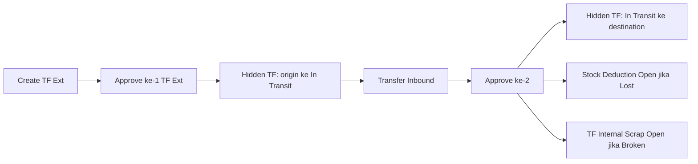
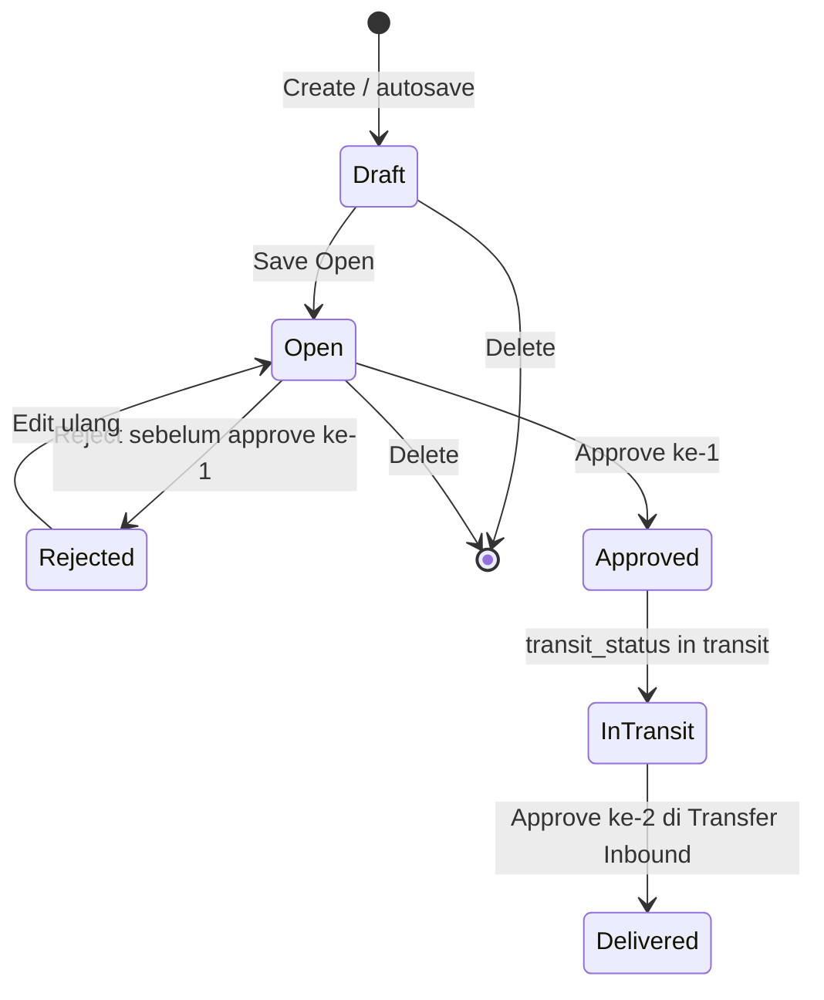
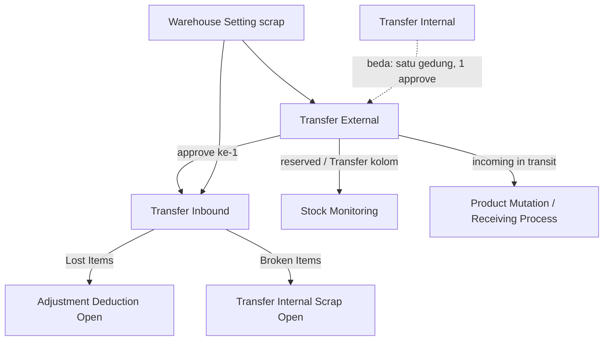

# Transfer External — Source of Truth

> **Pasangan wajib:** approval ke-1 di menu ini; approval ke-2 di [Transfer Inbound](./supplychain-transfer-inbound-source-of-truth.md). Satu dokumen bisnis, dua surface UI.  
> **Produksi (end-user):** [`/supplychain/mutation-transfer-external`](https://staging.olshoperp.com/supplychain/mutation-transfer-external) — **tanpa Colli**.  
> **BETA Colli:** [`/supplychain/new-mutation-transfer-external`](https://staging.olshoperp.com/supplychain/new-mutation-transfer-external) — experimental; **bukan** expected produksi. Gap Colli: §9.

## 1. Ringkasan Eksekutif

**Transfer External** memindahkan stok **antar gedung / struktur warehouse berbeda** (contoh: GD Surabaya ke GD Sidoarjo). Butuh **dua kali approve**: pengirim di Transfer External, penerima di Transfer Inbound. Kode transaksi prefix **TF**, `type = tf external`.

Setelah approve ke-1, sistem membuat dokumen hidden (tidak tampil di datalist normal) ke **virtual In Transit** milik warehouse destination. Stok origin masuk kolom **Transfer** (availability turun). Di destination, qty masih **incoming / Receiving Process** sampai approve ke-2. Setelah approve ke-2, Delivery Status dokumen utama menjadi **Delivered** dan availability di destination resmi.



## 2. Prasyarat

| Prerequisite | Sumber | Catatan |
|--------------|--------|---------|
| Origin WH level lebih dari sama dengan 20 (drop-off ke rack) | Master Warehouse | Tooltip: *Level 20 or below (drop-off to rack) only.* FIFO tidak mengambil Outrack & WIP |
| Destination level 20, leaf (tanpa child), beda struktur dari origin, **wajib ada WH Scrap** di Warehouse Setting | Warehouse Setting scrap | Tooltip destination; dipakai Broken Items di approval ke-2 |
| Stok availability lebih dari 0 di origin | Item Stock | Select Product / Import |
| Fiscal period valid | Fiscal Period | Tanggal transaksi |
| Privilege TF External | Gate | view / create / update / approve |
| Virtual WH In Transit pada destination | Template virtual WH sequence In Transit | Wajib ada sebelum approve ke-1 |

## 3. Siklus Status

**Tidak ada Void.** Setelah approve ke-1, alur **harus dilanjut** sampai Delivered (Transfer Inbound). Reject hanya relevan **sebelum** approve ke-1 (setara Draft/Open).



| Status | Delivery Status | Edit detail | Delete | Approve |
|--------|-----------------|-------------|--------|---------|
| Draft / Open / Rejected | `-` | Ya jika `can_update` | Ya | Approve ke-1 jika eligible |
| Approved | **In Transit** | Header view; qty received/lost/broken di **Transfer Inbound** | Tidak | Tombol Approve ke-1 hilang; lanjut di Inbound |
| Approved | **Delivered** | Tidak (sudah selesai) | Tidak | Tidak |

**Reserved vs Stock Monitoring**

- Insert/edit qty (belum approve): qty masuk **reserved**, availability berkurang.
- **Delete header** (hanya Draft/Open/Rejected, belum approve): reserved **berkurang**, availability **bertambah** (bukan pindah ke kolom Transfer).
- Setelah **approve ke-1**: qty origin pindah ke kolom **Transfer**; destination punya incoming, belum availability penuh.

**Action datalist (produksi)**

- Draft/Open: Update, Delete, Approve (jika eligible).
- Approved + 0/1 child hidden belum lengkap: Update; Approve ulang hanya di konteks Transfer Inbound jika 1 child sudah approved.
- Soft-deleted: Restore/Delete sesuai policy.
- Saat job approve berjalan: status tampil loading hourglass.

## 4. Datalist

Route produksi: `supplychain/mutation-transfer-external`. Filter default: origin & destination **non-virtual** (kecuali voided-order virtual). Dokumen auto-gen In Transit (`is_visible = 0`) **tidak** muncul.

| # | Fitur | Expected |
|---|--------|----------|
| 1 | Global Search | SearchBuilder / global DataTablesV3 |
| 2 | Advanced Filter | SearchBuilder |
| 3 | Reset Filter | Clear |
| 4 | **Create** | Hanya di TF External, **tidak** di Transfer Inbound |
| 5 | **Show Virtual WH** | **TO-BE hide** (sudah diminta ke dev). Produksi FE `is_show_virtual=false`. Backend index TF Ext **tidak** memproses `show_virtual`. BETA masih menampilkan toggle. |
| 6 | Show Deleted Data | Soft-deleted |
| 7 | Column Show/Hide | Ya |
| 8 | Export | §4.1 |
| 9 | Bulk Action | Checkbox kiri → **Delete** & **Approve** |
| 10 | Kolom | §4.2 |

### 4.1 Export

Opsi: **With Details**, **Without Details**, **Active Page Only**.

| Opsi | Isi |
|------|-----|
| **Without Details** | Trx Code, Date, System Product SKU, Name, Building Origin, Location Destination, Qty, Description, Trx Ref, Trx Status, Created By/At, Updated By/At, Approved By/At |
| **With Details** | Header + per baris SKU: Availability, Qty Transfered, Qty Received, Qty Lost Items, Qty Broken Items, Unit, Is Fifo (Yes/No/`-`) |
| **Active Page Only** | Subset halaman datalist |

Building Origin di export memakai **nama building** (level building), bukan full path rack.

### 4.2 Kolom datatable

| Kolom | Isi |
|-------|-----|
| Trx Code \| Trx Date | Kode TF + tanggal; link edit TF Ext (Inbound: link ke `transfer-inbound/edit/{id}`) |
| Building Origin | WH origin (full path jika config render full name) |
| Location Destination | WH destination |
| Qty | Jumlah `transfer_quantity` semua detail |
| Description | Header |
| Trx. Ref | Jika `trx_reference` adalah Stock Mutation: class Transfer External → edit TF Ext; Deduction → Adjustment Deduction; else → TF Internal. Doc user-created biasanya kosong. Doc hidden auto-gen punya ref ke doc utama tapi tidak di list ini |
| Trx. Status | Draft / Open / Rejected / Approved |
| Delivery Status | `-` / **In Transit** / **Delivered** |
| Created / Updated | Audit |
| Action | §3 |

## 5. Form & Field

### 5.1 Basic Information

| Field | Aturan |
|-------|--------|
| Transaction Code | Auto prefix **TF** setelah save |
| Transaction Date | Fiscal period valid. Setelah ada detail, tanggal **tidak** boleh diubah |
| **Origin** | Level lebih dari sama dengan 20. Tooltip: FIFO tidak berlaku Outrack & WIP — pastikan lokasi stok SKU bukan dari situ. Origin ≠ destination; destination tidak boleh child tree origin. Setelah ada detail, origin **tidak** boleh diubah |
| **Location Destination** | Tooltip: *Level 20 only, no sub-locations, different structure from origin, and must have a scrap warehouse configured.* Leaf (`no_child`). Wajib setting scrap |
| Autosave | Ambil origin + destination dari transaksi TF Ext terakhir (visible). **First time** (belum ada transaksi) isi manual |

### 5.2 Product Transfer Detail (produksi)

| Elemen | Aturan |
|--------|--------|
| Select Product | SKU availability lebih dari 0 di origin; default qty **1**, unit primary, loc dest = header (editable) |
| Group View | Default (agregasi SKU) |
| Detail View | Multi stock ID |
| Available Products | Per **stock ID**; Use/bulk Use — §6.2 |
| Import | Excel — §6.3 |
| Print detail | SKU QR / Stock ID QR (opsi COLLI ID/DEV ada di print options; **bukan** Colli v2 produksi) |
| Approval | Siapa / kapan |
| Audit Log | Perubahan header/detail |

### 5.3 Yang tidak ada di produksi

- Colli Origin / Colli Destination / Bulk Colli — hanya BETA (§6.5, §9).
- `with_picking_list` — tidak ada UI; save selalu 0. Bukan SOP menu ini (Manual Picking List generate **TF Internal**).

## 6. How It Works

### 6.1 Alokasi stok — Single Rack FIFO (lalu FIFO klasik)

Helper fulfill-after-FIFO. Exclude **WIP** dan **Outrack** dari setting WH origin. Exclude WH destination dari kandidat.

1. Cari **satu** batch (inbound paling lama) dengan availability **lebih dari sama dengan** qty diminta.
2. Jika ada → pakai batch itu saja (**Single Rack FIFO**).
3. Jika tidak → **FIFO klasik**: ambil bertahap dari batch terlama.
4. Total stok kurang dari qty → tolak: **Insufficient stock** (plus nama/qty jika helper melempar detail).

**Contoh availability (user):**

| Tanggal | Rack | Qty |
|---------|------|-----|
| 1 Jan | A | 50 |
| 2 Jan | B | 100 |
| 3 Jan | C | 150 |
| 4 Jan | D | 200 |

| Out qty | Alokasi |
|---------|---------|
| 50 | A saja |
| 75 | B saja |
| 150 | C saja |
| 200 | D saja |
| 250 | A(50)+B(100)+C(100) — fallback FIFO klasik |

Berlaku **insert** dan **edit qty** untuk Select Product & Import. **Tidak** untuk Available Products (stock-id only).

### 6.2 Tiga sumber insert

| Sumber | Default qty | Alokasi | Edit qty |
|--------|-------------|---------|----------|
| **Select Product** | 1 | Single Rack FIFO → FIFO klasik; boleh multi stock ID | Re-run aturan |
| **Import** | Dari file | Sama | Sama |
| **Available Products Use** | Availability **stock ID terpilih** | **Tidak** FIFO — ikat stock ID | Max = availability stock ID; lebih → pesan HTML: *Quantity entered cannot exceed available stock for this specific product stock ID. This product is selected from the 'Available Products' section. To input larger quantities, please use the 'Add Product' feature or import function instead.* |

**Contoh Available Products:** SKUPENSIL total 80 = stock ID 10:00 (50) + 11:00 (30). User Use stock ID 11:00. Edit qty 40 → ditolak (pesan di atas).

### 6.3 Import detail

Template header **exact** baris 1: `Product ID` \| `System Product SKU` \| `Qty` \| `Unit`.

Validasi file/row: lihat §7. Proses baris: Single Rack FIFO dari origin; insert per stock ID hasil alokasi (`is_fifo = 1`). Partial success: history hitung success/failed row. **Tidak** mengisi Colli / Lost / Broken.

### 6.4 Dual approve & dokumen hidden (contoh user)

SKUPENSIL 1.000 pcs, origin `GD.SBY → Rack-001`, destination `GD-SDA → Drop OFF`.

| Dokumen | Kapan | Origin | Destination | Visible |
|---------|-------|--------|-------------|---------|
| TF001 (utama) | Create | GD.SBY Rack-001 | GD-SDA Drop OFF | Ya |
| TF002 | Setelah approve ke-1 | GD.SBY Rack-001 | **In Transit** (child virtual destination) | Tidak (`is_visible = 0`) |
| TF003 | Setelah approve ke-2 | In Transit | GD-SDA Drop OFF | Tidak |

Approve ke-1 set `transit_status = in transit` + header **Approved**. Approve ke-2 (menu Inbound) set **Delivered**, proses received/lost/broken, approve leg In Transit ke destination.

### 6.5 Colli v2 — hanya BETA (bukan produksi)

Produksi **tanpa Colli**. BETA meniru TF Internal tapi Existing Colli di-scope ke **warehouse destination** (beda gedung), bukan origin. Risiko: colli code origin SBY tidak muncul sebagai Existing di SDA; full-transfer origin colli lintas building; Detail view BETA POST bulk-colli ke route TF Internal. **Jangan** jadikan expected produksi sampai redesign. Lihat §9.

## 7. Validasi

| ID | Kondisi | Behavior / pesan (verbatim) |
|----|---------|------------------------------|
| V-TFE-01 | Origin = destination atau dest di child tree origin | *The selected warehouse origin and destination must be different.* |
| V-TFE-02 | Destination bukan leaf | *You can only select a destination warehouse without child locations.* |
| V-TFE-03 | Ubah origin saat sudah ada detail | *This stock mutation transfer already has prepared detail data which relate to specific warehouse, so you can't modify warehouse* |
| V-TFE-04 | Ubah tanggal saat sudah ada detail | *…relate to specific transaction date, so you can't modify transaction date* |
| V-TFE-05 | Approve tanpa detail | *This stock mutation transfer doesn't have any detail data* |
| V-TFE-06 | Approve, dest detail = origin header | *Warehouse destination must be different from the origin. Please select another warehouse.* |
| V-TFE-07 | Approve ke-1, origin level kurang dari 20 | *Warehouse Origin level must be greater than or equal to 20.* |
| V-TFE-08 | Detail belum lengkap WH | *Please select warehouse on all details* |
| V-TFE-09 | Stok tidak cukup (Select/Import) | *Insufficient stock* (varian dengan nama + request/available) |
| V-TFE-10 | Qty Available Products lebih dari stock ID | *Quantity entered cannot exceed available stock for this specific product stock ID.* + arahkan Add Product / import |
| V-TFE-11 | Import file kosong | *The imported file is empty. Please add at least one product.* |
| V-TFE-12 | Header import salah | *The file format doesn't match the system template.* |
| V-TFE-13 | Product ID & SKU kosong | *Product ID or SKU is required.* |
| V-TFE-14 | Product ID tidak ketemu | *Product ID {x} not found* |
| V-TFE-15 | SKU tidak ketemu | *Product SKU {x} not found* |
| V-TFE-16 | Qty kosong | *QTY is empty.* |
| V-TFE-17 | Qty bukan angka | *QTY must be a number.* |
| V-TFE-18 | Qty kurang dari 0 | *QTY must be greater than 0.* |
| V-TFE-19 | Unit kosong | *Unit is required.* |
| V-TFE-20 | Unit pakai name | *The entered unit data isn't from the master unit code.* |
| V-TFE-21 | Unit tidak ada | *Unit is not available in system.* |
| V-TFE-22 | Unit tidak valid untuk produk | *Unit code {x} is not valid for this product.* |
| V-TFE-23 | Melebihi max detail | *Cannot add more than {N} details to this transaction.* |
| V-TFE-24 | Import masih jalan saat approve | Diblok via cache import |
| V-TFE-25 | Approve job lock | *Approval is being processed. Please press the refresh button to reload the data.* / *Approval is in progress. Please wait a moment.* |
| V-TFE-26 | Delete dokumen In Transit auto-gen | *You cannot delete this data because it auto generated from transfer external* |
| V-TFE-27 | Delete sudah approve | *This data approve, you can't delete this data anymore.* |
| V-TFE-28 | Data dari sales platform (`transfer_type`) | Tidak boleh delete/reject |

Validasi received/lost/broken: SOT Transfer Inbound.

## 8. Relasi Menu Lain



| Menu | Relasi |
|------|--------|
| Transfer Inbound | Approval ke-2; list TF Ext In Transit / Delivered |
| Adjustment Deduction | Auto-gen Lost Items; ref **kode dokumen TF Ext utama**; status **Open** — approve manual |
| Transfer Scrap / TF Internal scrap | Auto-gen Broken; origin In Transit → WH scrap setting destination; **Open** — approve manual |
| Warehouse Setting | Wajib scrap di destination |
| Stock Monitoring | Reserved (draft/open); Transfer setelah approve ke-1; availability destination setelah Delivered |
| Transfer Internal | Pola FIFO / Available Products mirip; **bukan** pasangan dual-approve |
| Product Mutation Stock | Receiving Process selama In Transit |

## 9. Gap Registry

| ID | Deskripsi | Type | Dampak | Status |
|----|-----------|------|--------|--------|
| GAP-TFEXT-01 | Show Virtual: produksi sudah `is_show_virtual=false`; BETA masih true; backend TF Ext tidak memproses `show_virtual`. TO-BE hide (diminta ke dev). | Missing Behavior (TO-BE) | Toggle membingungkan jika muncul lagi | Pending Decision — hide in progress |
| GAP-TFEXT-02 | Colli v2 hanya BETA; Existing colli di-scope destination (beda gedung); Detail BETA POST bulk-colli ke route Internal. | Missing Behavior / Contradiction | Colli produksi tidak ada; BETA berisiko major | Open — experimental only di SOT ini |
| GAP-TFEXT-03 | Field `with_picking_list` + guard approve ada; UI TF Ext selalu 0. Manual PL generate TF Internal. | Unverified (legacy) | Jangan masuk UG/operator | Resolved for docs: out of scope user |
| GAP-TFEXT-04 | Requirement: tidak reject setelah approve ke-1. Code masih punya jalur reject/approve residual jika `transit_status` terisi. | Contradiction | Requirement: [tidak ada reject/void setelah approve ke-1]. Codebase: [approve handler masih cek REJECTED/APPROVED + transit]. | Pending Decision — Yemima (docs ikuti requirement user) |
| GAP-TFEXT-05 | Live generate Lost memakai class referensi Transfer (bukan Transfer External) meski **text/URL** ke doc TF Ext utama. | Unverified | Filter deduction by class bisa miss; user-facing = kode TF utama | Open |
| GAP-TFEXT-06 | Tooltip FIFO ignore WIP/outrack; dropdown origin **tidak** hard-exclude lokasi WIP. | Contradiction ringan | User bisa pilih origin WIP; alokasi FIFO tetap skip stok WIP | Open — docs: ikuti tooltip + FIFO exclude |

## 10. FAQ

**Bedanya dengan Transfer Internal?** TF Ext = beda gedung, dua approve, ada In Transit & Delivery Status. TF Internal = satu struktur, satu approve.

**Kenapa stok di SDA belum bisa dipakai setelah approve pengirim?** Masih In Transit. Tunggu Transfer Inbound (approve ke-2).

**Kenapa tidak bisa hapus setelah approve?** Tidak ada Void. Lanjut sampai Delivered.

**Qty Available Products ditolak padahal total SKU cukup?** Yang diikat satu stock ID. Pakai Select Product atau Import untuk gabung beberapa stock ID (Single Rack FIFO / FIFO klasik).

**Show Virtual?** Tidak dipakai di produksi TF Ext. Dokumen In Transit hidden, bukan list virtual seperti TF Internal.

## 11. Changelog

| Version | Date | Changes |
|---------|------|---------|
| 1.0 | 2026-09-01 | SOT awal: dual approve, FIFO, import, pairing Inbound; Colli produksi out; Show Virtual TO-BE hide |

## 12. Knowledge Base Hints

| Istilah teknis | Awam |
|----------------|------|
| Single Rack FIFO | Ambil satu rak/batch lama yang qty-nya cukup |
| FIFO klasik | Ambil bertahap dari stok paling lama |
| Stock-id only | Pilih baris Available Products = satu inbound/stock ID |
| In Transit | Barang sudah keluar origin, belum resmi di destination |
| Delivered | Penerima sudah approve ke-2 |
| Hidden TF | Dokumen sistem In Transit; tidak di datalist |
| Reserved | Stok dikunci di dokumen belum approve |

**Troubleshooting:** Approve stuck hourglass → refresh, cek lock. Import gagal → cek log row + template 4 kolom. Destination tidak muncul → cek scrap setting + leaf + beda building.

**Skip di KB:** `with_picking_list`, path class, Colli BETA kecuali catatan “belum produksi”.

## 13. Technical Hints

**File map:** `StockMutationTransferExternalController`, `StockMutationTransferExternalDetailController`, `TransferMutationMiddleDetailExternalController`, `TransferExternalApproveService`, jobs `TransferExternalTransactionalJob` / `HiddenInTransit` / `ProcessApprove`, `TransferExternalImport`, FE `pages/SCM/StockMutation/TransferExternal/**`, BETA `NewTransferExternal/**`, router `mutation-transfer-external` vs `new-mutation-transfer-external` vs `transfer-inbound`.

**Invariants:** Dual document hidden `is_visible=0`, `type=tf external`; In Transit WH = child virtual destination `process_group` in-transit sequence 1; after approve-1 `transit_status=in transit`; after approve-2 `delivered`; delete unapproved restores reserved→available.

**Failure modes:** Job lock 429; import queue `TRANSFER EXTERNAL DETAIL IMPORT-{id}`; fiscal period; dest tanpa scrap gagal broken di inbound.

**Lifecycle:** TF001 visible → TF002 hidden origin→in-transit → TF003 hidden in-transit→dest; Lost = `StockMutationDeduction` Open `process_type=lost`; Broken = `StockMutationTransfer` Internal `process_type=scrap` Open.

## 14. Referensi Struktur untuk Proses Split

```
Section 1-11 → material utama untuk requirement.md
Section 5, 6, 7, 10 → adaptasi ke knowledge-base.md dengan tone awam (lihat Section 12)
Section 13 Technical Hints → seed untuk technical.md, sudah pakai path/nama real
Frontmatter YAML di atas → copy ke 3 file utama (+ user-guide.md kalau gate review/final), sinkronkan version + last_updated
Golden reference tone & struktur: docs/qa-docs/accounting-supplier-invoice/
```
