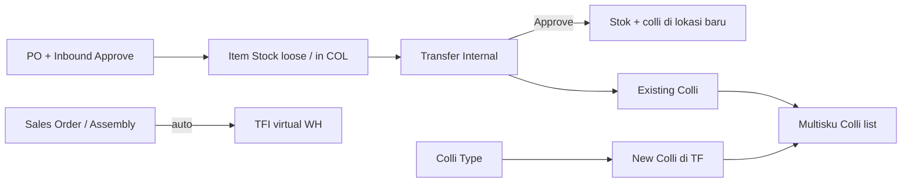
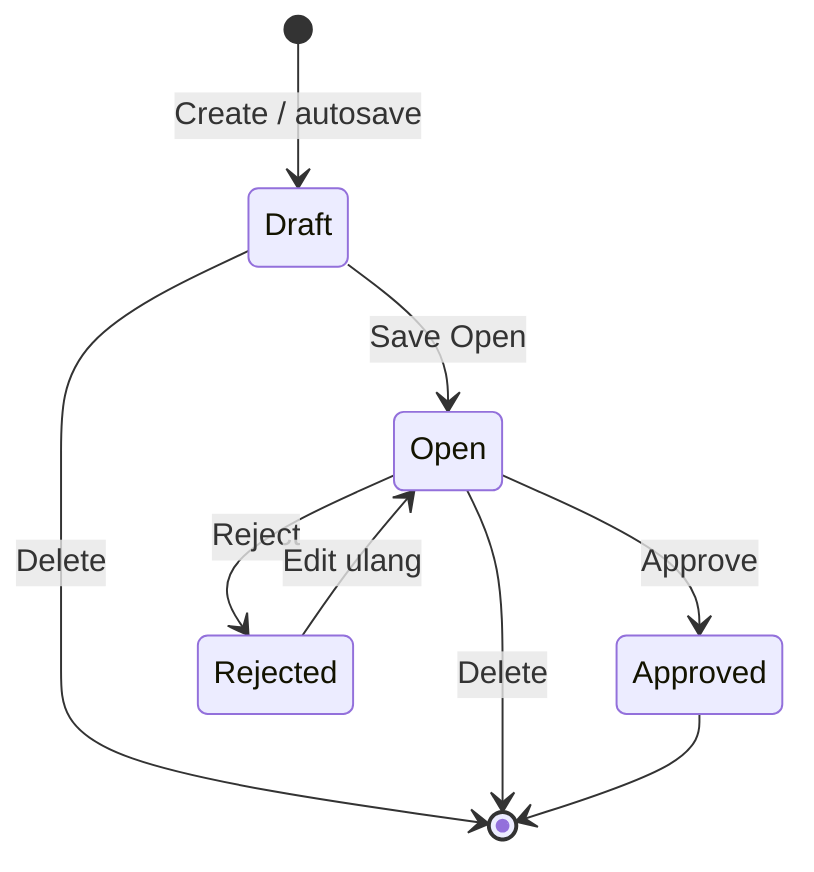
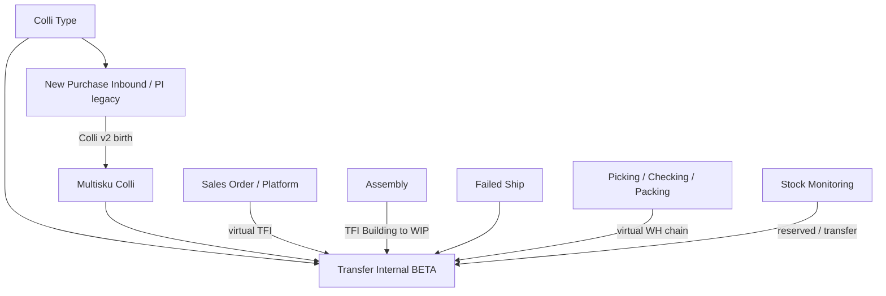

# Transfer Internal — Source of Truth

> **Satu dokumen** untuk menu **Transfer Internal** (legacy end-user + **BETA Colli v2**).  
> **Legacy (tanpa Colli v2):** [`/supplychain/mutation-transfer-internal`](https://staging.olshoperp.com/supplychain/mutation-transfer-internal) — dipakai end-user saat ini.  
> **BETA Colli v2:** [`/supplychain/new-mutation-transfer-internal`](https://staging.olshoperp.com/supplychain/new-mutation-transfer-internal) — fitur **Multisku Colli** diimplementasi di sini; cutover URL setelah fitur complete.  
> **Colli ID v1** (jumlah koli × isi → N Stock ID) **takedown** — yang berlaku **Colli v2** (wadah multi-SKU). Aturan master colli: SOT [Purchase Inbound — Colli v2](./supplychain-purchase-inbound-colli-v2-source-of-truth.md) + [Colli Type](./supplychain-colli-type-source-of-truth.md).

## 1. Ringkasan Eksekutif

**Transfer Internal** memindahkan stok antar lokasi/gudang **dalam satu gedung/struktur WH yang sama** (contoh: SKUPENSIL dari RAK001 Lantai 1 ke RACK005 Lantai 2). Kode transaksi prefix **`TFI`**. API resource `mutation-transfer`, `type = tf internal`.

Selain input manual, TFI sering **auto-generate** dari proses lain (Sales Order fulfillment, Assembly, Failed Ship, dll.) — tercatat di kolom **Trx. Ref**; pergerakan virtual WH bisa dilihat lewat toggle **Show Virtual WH**.

**Colli v2 (BETA)** menambah dimensi **wadah multi-SKU** (`MultiskuColli`, prefix `COL`) pada alokasi stok: **Colli Origin** (dari Item Stock) dan **Colli Destination** (existing / new). Dua flow utama terpisah di §6.4–§6.5.



## 2. Prasyarat

| Prerequisite | Sumber | Catatan |
|--------------|--------|---------|
| Struktur warehouse & level leaf (≥ level 20 untuk destination detail) | Master Warehouse | Origin level ≤20; destination detail harus leaf dalam struktur yang sama dengan origin header |
| Stok availability lebih dari 0 di origin | Item Stock (post inbound/addition approve) | Per stock ID / colli |
| Fiscal period aktif | Fiscal Period | Tanggal transaksi tidak di masa depan |
| Privilege TF Internal | Gate | viewAny / create / update / approve |
| **Colli Type Active** (untuk **New Colli** di BETA) | Colli Type | Sama PI: Default ON preselect; lihat SOT Colli Type |
| Stok dari inbound dengan Colli v2 | New Purchase Inbound / legacy PI | Colli code permanen setelah inbound **Approved** — list [Multisku Colli](https://staging.olshoperp.com/supplychain/multisku-colli) |

## 3. Siklus Status

**Tidak ada Void** untuk TF Internal manual. Status transaksi (verified enum `MainModel`):



| Status | Edit header/detail | Approve | Reserved stok |
|--------|-------------------|---------|---------------|
| Draft / Open | Ya (jika `can_update`) | Ya jika detail ada | Qty detail → **reserved** (kurangi availability di Stock Monitoring) |
| Approved | Tidak | — | Mutasi stok final |
| Rejected | Ya | — | Reserved tetap sampai delete/edit |

**Delete header (Draft/Open/Rejected):** reserved pada Stock Monitoring **berpindah ke kolom Transfer** (bukan hilang tanpa jejak).

## 4. Datalist (legacy + BETA share API)

Route datalist legacy; BETA memakai query `from_menu=new-transfer-internal` (filter sama, breadcrumb BETA).

| # | Fitur datalist | Expected |
|---|----------------|----------|
| 1 | Global Search | SearchBuilder / global filter standar DataTablesV3 |
| 2 | Advanced Filter | SearchBuilder kolom terdaftar |
| 3 | Reset Filter | Clear filter |
| 4 | **Create** | Form create TFI baru |
| 5 | **Show Virtual WH** | Toggle `show_virtual` — tampilkan TFI dari proses SO/fulfillment (virtual warehouse) |
| 6 | **Show Deleted Data** | Soft-deleted rows |
| 7 | Column Show/Hide | Column manager |
| 8 | **Export** | Lihat §4.1 |
| 9 | **Bulk Action** | Checkbox kiri → **Delete** & **Approve** (multi row) |
| 10 | Kolom datatable | Lihat §4.2 |

### 4.1 Export

Opsi FE: **With Details**, **Without Details**, **Active Page Only** (`EXPORT_OPTIONS_WITH_AND_WITHOUT_DETAILS`).

| Opsi | Isi (ringkas) |
|------|----------------|
| **Without Details** | Header TFI per baris: Trx Code, Date, Building Origin, Location Destination (header), Qty total, Description, Trx Ref, Status, audit columns |
| **With Details** | Header + baris detail per stock line: SKU, qty transfer, origin/destination WH per detail, serial/batch jika ada — async job `StockMutationTransferInternalExportDetailJob` |
| **Active Page Only** | Subset halaman datalist yang sedang tampil |

File export di-tab Export File; progress via `export-progress` API.

### 4.2 Kolom datatable

| Kolom | Isi |
|-------|-----|
| Trx Code \| Trx Date | Kode `TFI-*` + tanggal |
| Building Origin | WH origin header |
| Location Destination | WH destination default header |
| Qty | Akumulasi qty semua detail |
| Description | Header description |
| Trx. Ref | Referensi dokumen sumber (SO, Assembly, dll.) bila auto-generate |
| Trx. Status | Draft / Open / Rejected / Approved |
| Created By \| Created At | Audit |
| Updated By \| Updated At | Audit |
| Action | Edit / Delete / Approve / dll. — tergantung status & privilege (policy `StockMutationTransfer`) |

## 5. Form & Field

### 5.1 Basic Information (Create / Edit)

| Field | Aturan |
|-------|--------|
| Transaction Code | Auto `TFI-*` setelah save |
| Transaction Date | Tidak boleh masa depan; fiscal period valid |
| **Origin** | WH level **≤ 20** (building ke bawah). FIFO **exclude** WH state **Outrack** & **WIP** dalam struktur yang sama — barang di outrack/WIP tidak diambil otomatis |
| **Location Destination** (header) | WH dalam **struktur parent yang sama** dengan origin (satu gedung). Default destination saat insert SKU ke detail |
| Autosave | Setelah ada transaksi TF sebelumnya, field mengikuti autosave pola SCM; **first TF** user isi manual semua field |

### 5.2 Product Transfer Detail (legacy core — berlaku legacy & BETA)

| Elemen | Aturan |
|--------|--------|
| **Select Product** | SKU dengan availability > 0 di origin; masuk detail qty default **1**, unit primary, location dest = header (editable) |
| **Group View** (default) | Agregasi per SKU; user-facing utama |
| **Detail View** | Tampil jika multi stock ID; tombol **Detail View** |
| **Available Product** | Modal list per **stock ID**; bulk/single **Use** — lihat §6.2 |
| **Import detail** | Excel max 500 rows; lihat §6.3 |
| Approval section | Log approve: siapa, kapan |
| Audit Log | Perubahan field/header/detail |

**BETA tambahan kolom detail:** Multi-SKU **Colli Origin**, **Colli Destination**, **Full COLLI Transfer** (hidden default); toolbar **BulkColliAction** (Existing / New + Colli Type).

## 6. How It Works

### 6.1 Alokasi stok — Fulfill-after-FIFO (single-rack) AS-IS

Implementasi: helper **`getFulfillAfterFifo`** (bukan label UI).

1. Cari **satu** Item Stock (batch inbound paling lama) dengan `available_quantity` **lebih dari sama dengan** qty diminta **dan** lokasi bukan Outrack/WIP/destination conflict.
2. Jika ada → pakai **batch itu saja** (single rack).
3. Jika tidak → **fallback FIFO klasik** (`getFifoProduct`) — ambil bertahap dari batch terlama.
4. Jika total stok < qty → tolak: **Insufficient product stock.** (atau setara)

**Contoh availability (user):**

| Tanggal | Rack | Qty |
|---------|------|-----|
| 1 Jan | A | 50 |
| 2 Jan | B | 100 |
| 3 Jan | C | 150 |
| 4 Jan | D | 200 |

| Out qty | Alokasi |
|---------|---------|
| 50 | A saja |
| 75 | B saja |
| 150 | C saja |
| 200 | D saja |
| 250 | A(50)+B(100)+C(100) — fallback FIFO |

Berlaku saat **insert** dan **edit qty** untuk sumber Select Product & Import (bukan Available Product).

**Exclude colli-bound stock:** Untuk baris **tanpa colli** (loose), alokasi **hanya** stock ID dengan `multisku_colli_id` **NULL**. Stock ID yang sudah terikat colli **tidak** boleh diambil oleh FIFO/single-rack loose path — lokasi colli bisa beda dari loose di SKU sama.

### 6.2 Tiga sumber insert detail

| Sumber | Qty default | Alokasi | Edit qty |
|--------|-------------|---------|----------|
| **Select Product** | 1 | Fulfill-after-FIFO; loose only OR colli-bound path (§6.4) | Bebas; re-run aturan |
| **Import Excel** | Dari file | Sama Select Product | Sama |
| **Available Product — bulk/single Use** | Qty = availability **stock ID terpilih** | **Tidak** FIFO — ikat stock ID spesifik | Max = availability stock ID itu; jika lebih: pesan **Quantity entered cannot exceed available stock for this specific product stock ID…** (HTML `<br>`) — arahkan user ke Select Product / Import untuk multi stock ID |

**Contoh Available Product:** SKUPENSIL total 80 = stock ID A 50 + stock ID B 30. User bulk Use stock ID B (30). Edit qty 40 → **ditolak** (pesan di atas).

### 6.3 Import detail

**TO-BE Colli v2 (user requirement):** satu kolom **Colli code**:

| Nilai kolom | Interpretasi |
|-------------|--------------|
| NULL / kosong | Baris **tanpa** Colli v2 |
| Code **belum ada** | **New Colli** (+ Colli Type dari master / default) |
| Code **exist**, lokasi **sama** dengan WH destination baris | **Existing Colli** |
| Code **exist**, lokasi **beda** | **Baris gagal** — pesan jelas; baris lain tetap bisa sukses (partial import) |

**AS-IS codebase:** masih format **Colli × Colli Qty** (v1-style) di `TransferInternalImport` — lihat **GAP-TFI-02**.

Format kolom standar (non-group): Product SKU, Qty, Unit, Location Destination, (+ colli cols legacy). Max **500** data rows.

### 6.4 Flow 1 — Transfer dengan **New Colli** (BETA)

**Trigger UI:** Checkbox baris detail → toolbar **BulkColliAction** → mode **New Colli** + **Choose Colli Type** (Active only; Default ON preselect — **sama Purchase Inbound** §8) → Save.

| Sub-case | Asal baris | Aturan qty / alokasi |
|----------|------------|----------------------|
| **1a — Loose (belum ada colli)** | Select Product / Import | Fulfill-after-FIFO **hanya** stock **tanpa** colli; toolbar assign **New** (atau Existing) — filter Existing: colli di struktur WH origin, **dilarang** colli yang lokasinya **persis sama** dengan lokasi origin stock baris |
| **1b — Sudah ada Colli Origin** | Stock sudah packed | Edit qty **maks** = availability **colli itu**; **tidak** single-rack/FIFO; bulk New/Existing tetap bisa |

Setelah assign: kolom **Colli Origin** / **Colli Destination** tampil di Group & Detail View.

**Invariant lokasi ↔ colli destination (WAJIB — GAP jika belum):**

- Jika user **ubah Location Destination** baris sehingga **tidak sama** dengan lokasi identitas colli destination → **Colli Destination = NULL**; user assign ulang.
- **Pengecualian user usul:** New colli **belum pernah Approved** di transaksi manapun & hanya hidup di draft TF ini → boleh **tetap** tampil saat ganti lokasi (implementasi partial di codebase — lihat **GAP-TFI-01**).
- Alternatif operasional disepakati user: **setiap ganti lokasi → NULL** kecuali lokasi masih match colli (lebih sederhana).

**Existing Colli — exclude self (bulk):** Saat multi-select campuran, opsi Existing **tidak** menampilkan colli code **origin milik baris yang dipilih** (anti assign ke diri sendiri).

### 6.5 Flow 2 — Transfer dengan **Existing Colli** (BETA)

Dua sub-case **(a + b)** boleh terjadi:

#### 2a — Assign ke colli tujuan **existing** (bukan pindah whole colli)

- Toolbar **Existing Colli** — opsi colli di struktur WH origin; exclude lokasi sama dengan origin stock; exclude self (§6.4).
- Multi SKU bisa masuk **satu** colli destination yang sama (multi-SKU wadah).

#### 2b — **Relocate whole colli** (pindah lokasi, code sama)

- **Entry:** Available Product → pilih **semua SKU** dalam colli yang sama → **bulk Use** (+ bulk colli jika perlu).
- Qty = **full qty** per SKU dalam colli; **Colli Origin = Colli Destination = code sama**; Location Destination = lokasi baru (satu lokasi untuk seluruh isi colli).
- Setelah **Approve:** identitas lokasi colli di sistem = lokasi baru; **code COL tetap**.

**Invariant 1 colli = 1 lokasi (WAJIB):**

Relocate whole colli **hanya valid** jika **seluruh** qty sisa colli (available + reserved untuk colli itu) ikut dipindah ke **satu** lokasi yang sama. Jika ada **reserved** di transaksi **lain** (open, belum approve) untuk SKU/colli yang sama di lokasi lama → **approve gagal** / colli **tidak** dianggap pindah — user harus input colli **baru** atau selesaikan transaksi lain dulu.

**Contoh (user):**

- COLLI001 @ RACK001: SKUPENSIL 100 + SKUBUKU 50.
- Transaksi lain: SKUBUKU **2 pcs** reserved masih identitas COLLI001 @ RACK001.
- TF: pindah SKUPENSIL 100 + SKUBUKU **48** ke RACK005 → **tidak boleh** approve sebagai relocate whole COLLI001 (sisa 2 reserved) — **haram** COLLI001 punya 2 lokasi.

Implementasi partial: `MultiskuColliService::fullTransferByColli`, `isFullTransfer`, `promoteToFullColli` / `demoteFromFullColli` — verifikasi pesan approve di **GAP-TFI-04**.

User **tetap boleh** setelah masuk detail mengubah assign (New/Existing lain) — tidak dikunci hanya relocate.

### 6.6 Reserved & Stock Monitoring

Qty di detail TF (Draft/Open) → **reserved** ↓ **availability**. Delete TF → reserved → kolom **Transfer** di Stock Monitoring Report.

### 6.7 Colli v2 vs inbound

| Aspek | Purchase Inbound | Transfer Internal BETA |
|-------|------------------|------------------------|
| Arah | Masuk gudang | Pindah antar lokasi (1 gedung) |
| Filter Existing Colli | Exact WH **destination header** | Struktur WH **origin**; exclude same loc as origin stock |
| New Colli lokasi | WH destination header | WH **destination baris** detail |
| Permanen di Multisku Colli list | Setelah inbound Approve | Colli baru TF: permanen setelah TF **Approve** (selaras lifecycle PI) |

## 7. Validasi

| ID | Kondisi | Behavior / pesan |
|----|---------|------------------|
| V-TFI-01 | Tanggal > hari ini | Transaction date cannot be greater than today |
| V-TFI-02 | Approve tanpa detail | doesn't have any detail data |
| V-TFI-03 | Import in progress | Updating process is in progress |
| V-TFI-04 | Stok tidak cukup (FIFO path) | Insufficient product stock. |
| V-TFI-05 | Qty Available Product > stock ID | Quantity entered cannot exceed available stock for this specific product stock ID… |
| V-TFI-06 | Origin = destination per detail | Origin dan destination tidak boleh sama |
| V-TFI-07 | Edit qty colli-bound > colli avail | Tolak (max qty colli) |
| V-TFI-08 | Import colli exist beda lokasi | Row error — pesan jelas (TO-BE **GAP-TFI-02**) |
| V-TFI-09 | Relocate whole colli + reserved elsewhere | Approve gagal — 1 colli 1 lokasi (**GAP-TFI-04** verify message) |
| V-TFI-10 | Ganti location ≠ lokasi colli dest | Colli destination **NULL** (**GAP-TFI-01** jika codebase belum konsisten) |
| V-TFI-11 | Existing colli = colli origin baris (bulk) | Opsi tidak ditampilkan / ditolak |

## 8. Relasi Menu Lain



| Menu | Relasi |
|------|--------|
| New Purchase Inbound | Sumber stok + colli (`multisku_colli_id` on Item Stock) |
| Colli Type | New Colli Type |
| Multisku Colli | Daftar code; QA lifecycle |
| Purchase Order | Upstream inbound |
| Assembly | Auto TFI Open → Approve job |
| Failed Ship / Omni fulfillment | Auto TFI + Show Virtual |
| Manual Picking List | Pola serupa Available Product |
| Stock Monitoring | Reserved / Transfer columns |

## 9. Gap Registry

| ID | Deskripsi | Type | Dampak | Status |
|----|-----------|------|--------|--------|
| GAP-TFI-01 | **Colli dest NULL saat ganti location** jika lokasi ≠ lokasi colli (wajib user). Codebase: NULL hanya saat `warehouse_destination_id` berubah di beberapa path (`updateAdjustQuantity`, bulk colli store) — belum universal “setiap ganti lokasi kecuali match” | Missing Behavior | UX salah assign; QA TC-MTIN-004/005 | **Open — Major** |
| GAP-TFI-02 | **Import 1 kolom Colli code** (NULL / new / existing / fail beda lokasi). Codebase: masih **Colli × Colli Qty** v1 di `TransferInternalImport` | Missing Behavior | Import QA; partial row | **Open — Major** |
| GAP-TFI-03 | Filter Existing Colli: exclude colli lokasi **sama persis** dengan origin stock baris (struktur WH origin). Perlu verifikasi select2/API `multisku-colli` | Unverified | Salah opsi colli | Open |
| GAP-TFI-04 | **Relocate whole colli** blocked jika reserved di transaksi lain; 1 colli 1 lokasi. Logic ada di `MultiskuColliService::fullTransferByColli` — pesan approve/error perlu verify | Unverified | Contoh COLLI001 + SKUBUKU 2 reserved | Open |
| GAP-TFI-05 | **Colli ID v1** UI/import (Colli × qty) takedown — catatan docs only | Resolved for SOT | Legacy confusion | Note |
| GAP-TFI-06 | BETA route `new-mutation-transfer-internal` vs `MultiskuColliService::transactionUrl` masih map ke legacy edit path | Unverified | Link audit colli | Open |
| GAP-TFI-07 | Loose vs colli FIFO priority — potensi bug campuran SKU always-colli vs loose (user flag) | Missing Behavior | Salah stock ID | Open — QA watch |

## 10. FAQ

**Q: Legacy vs BETA — yang mana dipakai?**  
A: End-user sekarang **legacy URL**. Colli v2 hanya di **BETA** sampai cutover.

**Q: Wajib pakai colli di TF?**  
A: Tidak — NULL = loose (sama PI).

**Q: Kapan colli muncul di Multisku Colli menu?**  
A: Setelah transaksi yang membuat/meng-assign colli di-**Approve** (inbound atau TF).

**Q: Bisa pindah colli sebagian isinya?**  
A: Ya (Flow 1 / 2a). Flow 2b = seluruh isi colli + tidak ada reserved elsewhere.

**Q: Kenapa Available Product tidak bisa qty besar?**  
A: Karena ikat **satu stock ID** — bukan FIFO multi batch.

## 11. Changelog

| Version | Date | Changes |
|---------|------|---------|
| 1.0 | 2026-09-01 | Initial SOT: legacy AS-IS + BETA Colli v2 Flow 1/2; FIFO fulfill-after; import TO-BE; gap major GAP-TFI-01/02 |

## 12. Knowledge Base Hints

| Istilah | Awam |
|---------|------|
| Transfer Internal | Pindah barang antar rak/lokasi dalam gedung yang sama |
| Fulfill-after-FIFO | Coba ambil cukup dari satu batch/rak dulu; kalau tidak cukup, ambil dari beberapa batch terlama |
| Stock ID | Satu “batch” stok dari satu inbound — SKU sama bisa punya banyak stock ID |
| Colli / COL | Kode wadah yang bisa berisi banyak SKU di satu lokasi |
| Reserved | Stok sudah “dipegang” TF draft/open — tidak bisa dipakai transaksi lain |
| Show Virtual WH | Tampilkan TF otomatis dari proses order (bukan input manual gudang) |
| Group View vs Detail View | Ringkas per SKU vs per batch stok |

**Troubleshooting:** Qty Available Product ditolak → pakai Select Product. Colli approve gagal → cek reserved transaksi lain pada colli yang sama. Colli hilang setelah ganti lokasi → assign ulang (by design GAP-TFI-01).

## 13. Technical Hints

| Area | Path / komponen |
|------|-----------------|
| Header CRUD / approve | `StockMutationTransferController`, `StockMutationTransferInternalController` |
| Middle/detail + colli | `TransferMutationMiddleDetailInternalController`, `TransferMutationDetailController` |
| Colli service | `MultiskuColliService` — assign, fullTransferByColli, promote/demote |
| FIFO | `getFulfillAfterFifo`, `getFifoProduct` — `app/Helpers/SupplyChain/WarehouseHelper.php` |
| Import | `TransferInternalImport`, `TransferInternalDetailImportJob` |
| Export detail | `StockMutationTransferInternalExportDetailJob`, `StockMutationTransferInternalDetailExportAll` |
| FE legacy datalist | `Transfer/DataList.vue` → `mutation-transfer-internal` |
| FE BETA | `TransferInternal/DataList.vue` → `new-mutation-transfer-internal`; colli: `BulkColliAction`, `DatalistDetail.vue` |
| Entity colli | `MultiskuColli`, `TransferMutationMiddleDetail.multisku_colli_id` |
| Table | `scm_stock_mutations`, `scm_transfer_mutation_middle_details`, `scm_item_stocks` |

**Invariants:** 1 colli code = 1 lokasi (post approve); loose FIFO excludes `multisku_colli_id` NOT NULL; Available Product binds `item_stock_id`.

**Failure modes:** Insufficient stock; exceed stock ID qty; import row errors; approve lock 60s; full colli demote on partial qty change.

## 14. Referensi Struktur untuk Proses Split

```
Section 1-11 → material utama untuk requirement.md
Section 5, 6, 7, 10 → adaptasi ke knowledge-base.md dengan tone awam (lihat Section 12)
Section 13 Technical Hints → seed untuk technical.md, sudah pakai path/nama real
Frontmatter YAML di atas → copy ke 3 file utama (+ user-guide.md kalau gate review/final), sinkronkan version + last_updated
Golden reference tone & struktur: docs/qa-docs/accounting-supplier-invoice/
Cross-ref Colli master: docs/qa-docs/_meta/sot/supplychain-purchase-inbound-colli-v2-source-of-truth.md
```
