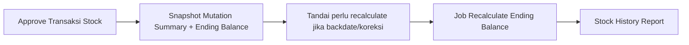
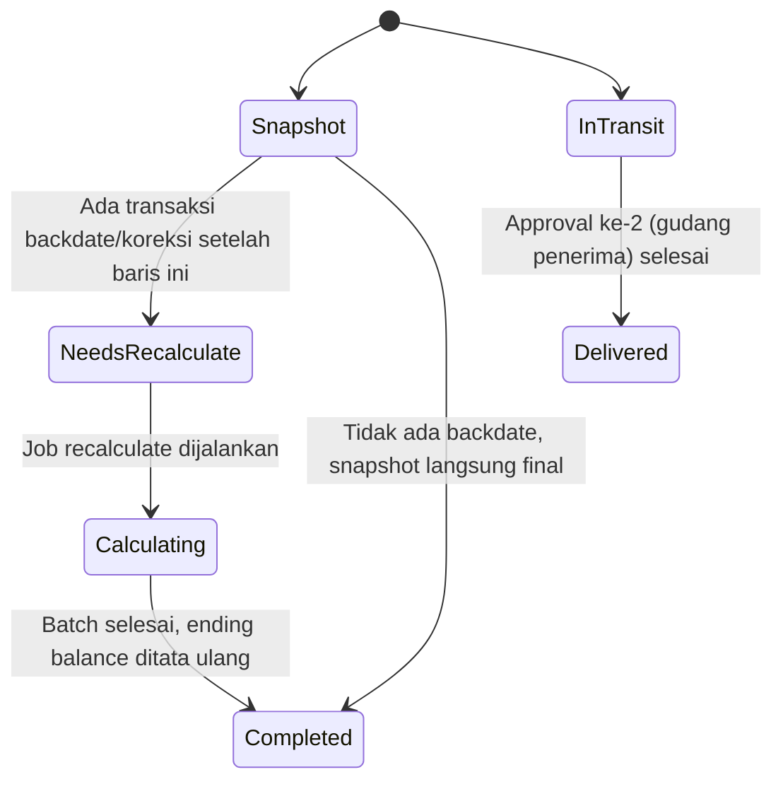
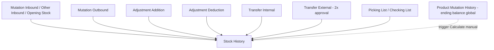

# Stock History — Source of Truth

## 1. Ringkasan Eksekutif

Stock History adalah report yang mencatat seluruh pergerakan stock barang (in dan out) per product, dikelompokkan per building/warehouse, lengkap dengan ending balance berjalan seperti konsep saldo bank statement. Data masuk ke report ini hanya setelah dokumen transaksi stock (inbound, outbound, adjustment, transfer, dan sejenisnya) di-approve. Audience utama: tim Supply Chain dan Warehouse yang perlu memantau pergerakan dan saldo stock per lokasi.

Ending balance di report ini dihitung lewat dua fase: snapshot langsung saat approve, dan recalculate asynchronous kalau ada transaksi backdate atau koreksi yang mempengaruhi baris-baris sebelumnya. Fase kedua inilah sumber dari informasi Latest Calculation yang perlu ditransparansikan lebih baik ke user (lihat Section 6.4 dan Gap Registry).



---

## 2. Prasyarat

| Prasyarat | Sumber | Catatan |
|---|---|---|
| Product tipe single atau variant, status active | Master Product | Dipakai sebagai opsi filter Product, wajib dipilih sebelum report muncul |
| Warehouse structure level 19 ke atas | Master Warehouse Structure | Dipakai sebagai opsi filter Building |
| Warehouse structure level 20 ke bawah | Master Warehouse Structure | Dipakai sebagai opsi filter Building Level; `[VERIFY: CODEBASE]` makna angka level 19/20 ini (apakah fixed constant per tipe struktur atau relatif per tree) |
| Minimal 1 dokumen stock mutation sudah di-approve untuk product terkait | Modul transaksi terkait (Inbound, Outbound, Adjustment, Transfer, dll) | Tanpa approve, tidak ada baris yang tercatat di report ini |

---

## 3. Siklus Status

Report ini sendiri tidak punya siklus dokumen (read-only), tapi setiap baris datalist punya siklus perhitungan ending balance, dan transaksi Transfer External punya siklus in-transit yang mempengaruhi kolom mana yang terisi.



| Status | Kondisi Transisi | Kolom Terdampak | Catatan |
|---|---|---|---|
| Snapshot | Approve transaksi non-backdate | Ending Balance langsung terisi dari formula prev + (in − out) | Kondisi normal, tidak perlu recalculate |
| Needs Recalculate | Ada transaksi baru dengan tanggal lebih lama dari baris yang sudah ada | Todo kalkulasi ditandai perlu proses ulang mulai dari tanggal transaksi tersebut | Ini yang memicu delay antara transaksi terlihat dan ending balance ter-update |
| Calculating | Job recalculate sedang berjalan | Ending balance sedang ditata ulang per baris, urut tanggal | `[VERIFY: CODEBASE]` apakah progress ini ditampilkan real-time ke user atau hanya diam-diam berjalan di background |
| Completed | Job recalculate selesai | Latest Calculation terupdate ke waktu selesai | — |
| In Transit | Transfer External sudah di-approve gudang pengirim, belum di-approve gudang penerima | Kolom Receiving Process terisi, Product In/Out kosong (0) | Qty ini belum masuk ke Ending Balance |
| Delivered | Transfer External sudah di-approve gudang penerima | Qty bergeser dari Receiving Process ke Product In, Ending Balance ter-update | — |

---

## 4. Filter Sebelum Datalist

| Field | Wajib? | Sumber Opsi | Behavior |
|---|---|---|---|
| Product | Ya | Master Product, tipe single dan variant, status active | Datatable tidak muncul sebelum field ini diisi |
| Building | Tidak | Master Warehouse Structure, level 19 ke atas | Kosong berarti semua building. Memilih Building memunculkan kolom Building di datalist |
| Building Level | Tidak | Master Warehouse Structure, level 20 ke bawah | Menentukan level detail struktur gudang yang ditampilkan (contoh: rack, bin) |
| Select Period | Tidak | Input date range | Filter data stock berdasarkan rentang tanggal transaksi |
| Tombol Apply | — | — | Wajib diklik setelah Product (dan filter lain jika ada) diisi, baru datatable dimuat |

---

## 5. Datalist

**Fitur datalist:**

| Fitur | Keterangan |
|---|---|
| Global Search | Search bebas di seluruh datatable |
| Latest Calculation | Timestamp job recalculate ending balance terakhir yang selesai. Lihat Section 6.4 untuk masalah transparansi terkait |
| Info SKU | Menampilkan kode dan nama product yang sedang difilter, format kode SKU dipisah tanda garis dari nama SKU |
| Column Show/Hide | User bisa toggle kolom mana yang tampil |
| Export | Export advanced, tersedia opsi with detail dan without detail |

**Kolom datalist:**

| Kolom | Visible Default | Sumber Data | Keterangan |
|---|---|---|---|
| Date | Ya | Tanggal transaksi mutasi | — |
| Trx. Code | Ya | Kode dokumen mutasi, sekaligus link ke menu asal transaksi (lihat Section 6.2) | Ada tombol copy kode |
| Description | Tidak (hidden) | Deskripsi dokumen mutasi | — |
| Building | Kondisional | Nama warehouse/building | Hidden kalau filter Building kosong, muncul kalau Building dipilih |
| Receiving Process | Ya | Qty transfer external yang masih dalam proses pengiriman, belum diterima gudang tujuan | Tooltip: qty masuk dari transfer external yang belum diterima warehouse. Lihat Section 6.2 untuk alur lengkap |
| Product In | Ya | Qty stock masuk dari transaksi apapun (purchase inbound, stock addition, stock opname in, opening stock, transfer masuk) | Kosong kalau nilainya 0 |
| Product Out | Ya | Qty stock keluar dari transaksi apapun (outbound external, stock deduction, stock opname out, outbound order, transfer keluar) | Kosong kalau nilainya 0 |
| Ending Balance | Ya | Saldo kumulatif setelah baris ini, konsep sama seperti saldo bank statement | Tooltip: angka ini tidak termasuk qty di kolom Receiving Process |

Datatable dikelompokkan (grouping) berdasarkan building/warehouse, supaya user bisa lihat pergerakan stock per lokasi secara terpisah.

---

## 6. How It Works

### 6.1 Formula Ending Balance

```
ending_balance (baris ini) = ending_balance (baris sebelumnya) + (Product In - Product Out)
```

Ending balance dihitung per baris secara berurutan berdasarkan tanggal transaksi, mirip cara kerja saldo mutasi rekening bank: setiap transaksi menambah atau mengurangi saldo dari baris sebelumnya.

### 6.2 Alur Transfer External dan Kolom Receiving Process

Transfer external (antar gedung beda lokasi) melalui 2 kali approval:

1. Approval pertama oleh gudang pengirim (contoh: Surabaya sebagai origin, Gedangan sebagai destination). Sistem mencatat transaksi transfer dari gudang pengirim ke gudang tujuan yang statusnya masih virtual/perantara.
2. Selama menunggu approval kedua, qty ini masuk ke kolom Receiving Process di building tujuan (Gedangan), dengan tooltip yang menjelaskan bahwa ini adalah qty masuk dari transfer external yang belum diterima warehouse. Qty ini belum ikut dihitung di Ending Balance.
3. Approval kedua oleh gudang penerima menyelesaikan transfer dari status perantara ke gudang tujuan final. Setelah approval ini selesai, qty yang tadinya ada di kolom Receiving Process bergeser ke kolom Product In, dan baru saat itu Ending Balance ter-update.

Prefix kode transaksi yang muncul di kolom Trx. Code menentukan menu asal yang bisa dituju lewat link:

| Prefix Kode | Jenis Transaksi |
|---|---|
| IN (dengan supplier) | Mutation Inbound |
| IN (tanpa supplier) | Other Inbound |
| OT | Mutation Outbound |
| AI | Adjustment Addition |
| AO | Adjustment Deduction |
| PL | Picking List |
| CL | Checking List |
| TF (tipe external) | Transfer External |
| TF (lainnya) | Transfer Internal |

### 6.3 Kondisi Khusus Perhitungan

| Kondisi | Perilaku |
|---|---|
| Transfer internal di level building yang sama | Tidak mempengaruhi net ending balance level building, karena stock tidak keluar dari building tersebut |
| Product dengan kategori akuntansi Service | Dikecualikan dari perhitungan Stock History |
| Transaksi return (purchase return, sales return) | Diperlakukan sebagai proses inbound atau outbound sesuai dokumen aslinya |
| Qty missing/scrap di transfer external | Dikurangi dari qty yang diterima sebelum masuk ke Product In |

### 6.4 Latest Calculation, Delay, dan Kebutuhan Transparansi Job

Latest Calculation menunjukkan kapan job recalculate ending balance terakhir selesai — bukan kapan transaksi stock dibuat. Kalau ada transaksi backdate (tanggal transaksinya lebih lama dari baris-baris yang sudah tercatat), sistem menandai perlu recalculate ulang mulai dari tanggal tersebut, tapi recalculate ini tidak langsung terjadi saat approve — job baru memproses saat trigger berikutnya berjalan.

Contoh kasus: user membuat transaksi stock backdate jam 08:30, tapi Latest Calculation di report masih menunjukkan timestamp sebelumnya. Transaksinya sudah muncul di baris datalist, tapi Ending Balance belum ter-update karena menunggu job recalculate berikutnya.

Saat ini user tidak punya cara mengetahui kapan job berikutnya akan jalan, sehingga tidak tahu kapan harus cek ulang report. Kebutuhan tambahan yang diminta:

1. Penjelasan makna Latest Calculation ke user (lewat tooltip, lihat rekomendasi UI di bawah)
2. Informasi Last Job Started, supaya user bisa memperkirakan Next Job Started berdasarkan jadwal job yang berjalan tiap 1 jam sekali
3. Disclaimer text kalau setelah Next Job Started terlewat, Ending Balance dan Latest Calculation masih belum berubah walau ada transaksi baru yang seharusnya diproses — supaya user tahu perlu melaporkan ke tim Dev secara manual

`[VERIFY: CODEBASE]` — jadwal job tiap 1 jam ini perlu dikonfirmasi ke dev: apakah benar ada scheduled task otomatis (bukan hanya trigger manual lewat tombol Calculate di menu lain), dan apakah formula estimasi Next Job Started sebaiknya dihitung dari Last Job Started ditambah 1 jam, atau mengikuti jam bulat tetap sesuai jadwal cron.

`[VERIFY: CODEBASE]` — perlu dikonfirmasi juga apakah field Last Job Started ini benar-benar belum ada di sistem manapun, karena ada kemungkinan sistem sudah punya indikator progress job (status berjalan/selesai/gagal) yang terpasang di menu lain, sehingga perlu dipastikan apakah indikator itu bisa dipakai ulang di sini atau memang perlu dibuat field terpisah khusus untuk Stock History.

### 6.5 Rekomendasi Tooltip dan UI Interaction untuk Info Job

| Elemen | Tooltip / Copy |
|---|---|
| Latest Calculation | "Waktu terakhir sistem selesai menghitung ulang ending balance. Bukan waktu transaksi kamu dibuat." |
| Last Job Started | "Waktu terakhir sistem cek pergerakan stock, tiap 1 jam sekali." |
| Next Job Started | "Perkiraan, bukan jadwal pasti. Ending balance kamu kemungkinan ter-update setelah waktu ini." |
| Disclaimer (kondisional) | "Ending balance belum ter-update setelah jadwal kalkulasi terakhir. Jika kondisi ini berlanjut, silakan laporkan ke tim Dev." |

Interaksi: ikon info di sebelah tiap label, trigger hover di desktop dan tap di mobile. Disclaimer tampil sebagai inline banner warna warning (bukan danger, karena ini kondisi butuh perhatian, bukan error fatal yang memblokir user), diletakkan di bawah info panel Latest Calculation, bukan sebagai popup/modal. Direkomendasikan menambah tombol copy diagnostic info (Latest Calculation, Last Job Started, Next Job Started sekaligus) di dalam disclaimer, supaya saat user lapor ke Dev sudah menyertakan data konkret dan mengurangi bolak-balik tanya jawab. Rekomendasi tombol ini bersifat tambahan, di luar 3 kebutuhan awal, dan bisa didrop kalau dianggap di luar scope.

---

## 7. Validasi

| # | Kondisi | Behavior | Error Message |
|---|---|---|---|
| 1 | Field Product belum diisi, tombol Apply diklik | Datatable tidak muncul | `[VERIFY: CODEBASE]` pesan error/validasi yang muncul |
| 2 | Product bertipe Service (kategori akuntansi) | Tidak muncul di perhitungan Stock History sama sekali | — |
| 3 | Transfer external belum di-approve gudang penerima | Qty tampil di Receiving Process, tidak ikut Ending Balance | — |
| 4 | Job recalculate sedang berjalan untuk product yang sama | `[VERIFY: CODEBASE]` apakah user bisa tetap membuka report di tengah proses, dan apakah datanya bisa berubah saat sedang dilihat | — |
| 5 | Next Job Started terlewat tapi Ending Balance/Latest Calculation belum berubah walau ada transaksi baru | Tampilkan disclaimer text di header info panel | "Ending balance belum ter-update setelah jadwal kalkulasi terakhir. Jika kondisi ini berlanjut, silakan laporkan ke tim Dev." |

---

## 8. Relasi Menu Lain



| Menu | Peran dalam Relasi |
|---|---|
| Mutation Inbound / Other Inbound / Opening Stock | Sumber Product In |
| Mutation Outbound | Sumber Product Out |
| Adjustment Addition / Adjustment Deduction | Sumber Product In / Product Out dari koreksi manual |
| Transfer Internal | Sumber Product In dan Out dalam 1 building/warehouse group yang sama |
| Transfer External | Sumber Receiving Process (in-transit) dan Product In/Out setelah delivered, melalui 2 kali approval |
| Picking List / Checking List | Transaksi transfer terkait proses wave picking di Omni |
| Product Mutation History | Report ending balance global (bukan per warehouse), punya tombol Calculate manual yang bisa memicu recalculate — `[VERIFY: CODEBASE]` apakah trigger ini juga mempengaruhi Latest Calculation di Stock History |

---

## 9. Gap Registry

| ID | Deskripsi | Dampak | Status |
|---|---|---|---|
| GAP-SH-01 | Tidak ada informasi Last Job Started di Stock History, user tidak bisa memperkirakan kapan Ending Balance akan ter-update | User mengira sistem error saat input transaksi backdate, padahal cuma delay normal menunggu job berikutnya | Open |
| GAP-SH-02 | Tidak ada mekanisme (bahkan disclaimer) untuk memberi tahu user kalau kalkulasi benar-benar stuck/delay abnormal, bukan sekadar menunggu jadwal normal | User tidak tahu kapan harus escalate ke tim Dev, berpotensi terlambat mendeteksi masalah nyata | Open |

Catatan: kepastian ada tidaknya scheduled job otomatis tiap jam, dan ada tidaknya indikator progress yang bisa dipakai ulang, masih berstatus `[VERIFY: CODEBASE]` di Section 6.4 — belum dimasukkan ke Gap Registry sampai dikonfirmasi jadi gap nyata.

---

## 10. FAQ

**Q: Kenapa jumlah transaksi stock saya sudah muncul, tapi Ending Balance-nya belum berubah?**
A: Transaksi tercatat langsung, tapi Ending Balance baru ter-update setelah job recalculate jalan. Ini biasanya terjadi kalau transaksinya backdate.

**Q: Kenapa qty transfer saya masuk ke kolom Receiving Process, bukan Product In?**
A: Transfer external butuh 2 kali approval. Selama menunggu approval dari gudang penerima, qty-nya tampil di Receiving Process dan belum ikut dihitung di Ending Balance.

**Q: Kenapa kolom Building tidak muncul di datatable?**
A: Kolom Building baru tampil kalau kamu memilih filter Building. Kalau filter Building dikosongkan, kolom ini disembunyikan karena datanya mencakup semua building.

**Q: Latest Calculation itu apa bedanya dengan waktu saya input transaksi?**
A: Latest Calculation adalah waktu terakhir sistem selesai menghitung ulang Ending Balance, bukan waktu transaksi kamu dibuat.

**Q: Sudah lama tapi Ending Balance masih belum update, harus gimana?**
A: Kalau muncul disclaimer di halaman ini, kondisinya sudah terdeteksi sistem — silakan laporkan ke tim Dev.

---

## 11. Changelog

| Tanggal | Versi | Perubahan |
|---|---|---|
| 17 Juli 2026 | 1.0 | Dokumen awal, scope terbatas ke transparansi Latest Calculation Job |
| 17 Juli 2026 | 2.0 | Diperluas jadi dokumentasi lengkap menu Stock History: filter, datalist, formula ending balance, alur transfer external, dan relasi menu lain, berdasarkan detail user dan analisis codebase |

---

## 12. Knowledge Base Hints (untuk operator)

**Istilah teknis → padanan awam:**

| Istilah Teknis | Padanan Awam untuk KB |
|---|---|
| Latest Calculation | "Terakhir dihitung ulang" |
| Last Job Started | "Terakhir sistem cek pergerakan stock" |
| Next Job Started | "Perkiraan cek berikutnya" |
| Ending Balance | "Saldo stock berjalan" |
| Receiving Process | "Barang masih dalam pengiriman antar gudang" |
| In-transit | "Belum diterima gudang tujuan" |
| Backdate | "Transaksi dengan tanggal mundur" |

**Skenario troubleshooting:**

| Gejala | Penyebab | Solusi |
|---|---|---|
| Transaksi sudah masuk tapi Ending Balance belum berubah | Job kalkulasi ulang belum jalan lagi sejak transaksi backdate dibuat | Tunggu sampai jadwal berikutnya, refresh halaman |
| Qty transfer antar gedung tidak muncul di Product In | Transfer external masih menunggu approval gudang penerima | Cek status approval transfer di menu asal, qty akan pindah otomatis setelah approval selesai |
| Sudah lama tapi Ending Balance tetap belum berubah | Kemungkinan job gagal/stuck | Screenshot kondisi disclaimer text, laporkan ke tim Dev |

**Field yang tidak relevan operator:**
- Nama tabel, nama job, dan detail teknis batch processing — operator cukup tahu "sistem cek tiap 1 jam"
- Kolom Description (hidden default) — informasi internal dokumen, jarang dibutuhkan operator harian

---

## 13. Technical Hints (untuk developer)

**Area codebase yang perlu didokumentasikan:**
- Controller report Stock History (endpoint datalist V2 dan legacy per warehouse)
- Handler snapshot saat approve transaksi (create/update mutation summary dan ending balance, termasuk cascade ke warehouse parent)
- Helper pengambilan previous balance (global, per warehouse, per building)
- Command dan batch job recalculate ending balance (global, per warehouse, per building), termasuk chunking per 10 product per job
- Tabel todo/flag yang menandai perlu recalculate beserta scope-nya (global, per warehouse, per building)
- Endpoint status/progress kalkulasi yang sudah ada — perlu dipastikan apakah dipakai juga untuk run otomatis atau cuma untuk trigger manual
- Komponen frontend datalist Stock History (V2, aktif) dan komponen legacy yang masih ada di repo tapi sudah tidak dipakai route menu

**Invariants:**
- `ending_balance[baris ini] = ending_balance[baris sebelumnya] + (Product In - Product Out)`, urut berdasarkan tanggal transaksi
- Qty di kolom Receiving Process tidak pernah ikut dihitung di Ending Balance
- Transfer external hanya bergeser dari Receiving Process ke Product In setelah approval kedua (gudang penerima) selesai
- `Latest Calculation` tidak pernah lebih baru dari waktu job recalculate benar-benar selesai
- Product dengan kategori akuntansi Service tidak pernah muncul di perhitungan Stock History

**Failure modes:**
- Job recalculate gagal di tengah proses untuk sebagian product dalam 1 batch → perlu dipastikan todo tidak ikut ter-reset ke status selesai untuk product yang gagal
- Transaksi backdate menandai ulang tanggal awal recalculate lebih mundur dari sebelumnya → perlu dipastikan tidak overwrite start_date yang lebih lama kalau ada 2 backdate berbeda tanggal menumpuk sebelum job sempat jalan
- Transfer external dengan qty missing/scrap → perlu dipastikan pengurangan qty diterima terjadi sebelum data tersimpan, bukan sesudah, supaya Ending Balance tidak sempat salah tanggung di baris manapun

**Data lifecycle lintas dokumen:**
- Transfer external membentuk 2 set summary (out di origin, in di destination) yang harus tetap konsisten sebagai 1 dokumen logis meski tercatat di 2 warehouse berbeda
- Todo/flag recalculate bergerak dari level global ke per warehouse dan per building secara paralel, bukan berurutan — ketiganya perlu tetap sinkron di Latest Calculation yang ditampilkan ke user

---

## 14. Referensi Struktur untuk Cursor

```
Section 1-11 → material utama untuk requirement.md
Section 5, 6, 7, 10 → adaptasi ke knowledge-base.md dengan tone awam (lihat Section 12 KB Hints)
Section 13 Technical Hints → seed untuk technical.md, dilengkapi Cursor dari codebase
Frontmatter YAML di atas → copy ke 3 file utama, sinkronkan version + last_updated
Golden reference tone & struktur: docs/qa-docs/accounting-supplier-invoice/
```
