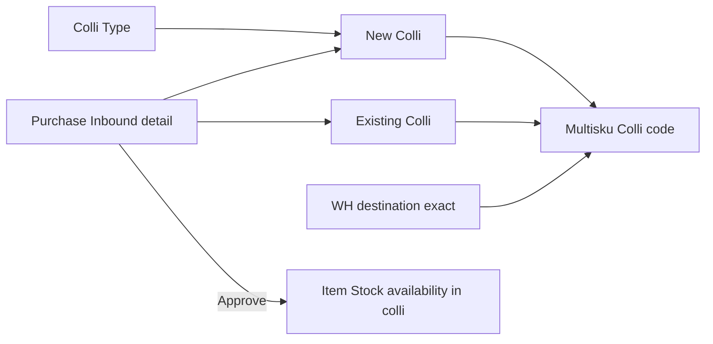
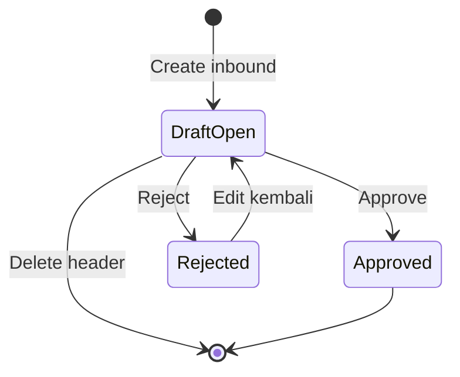
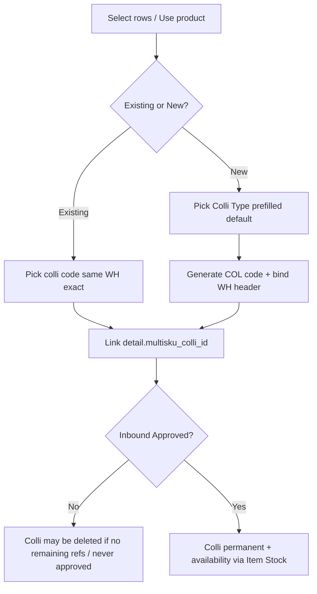
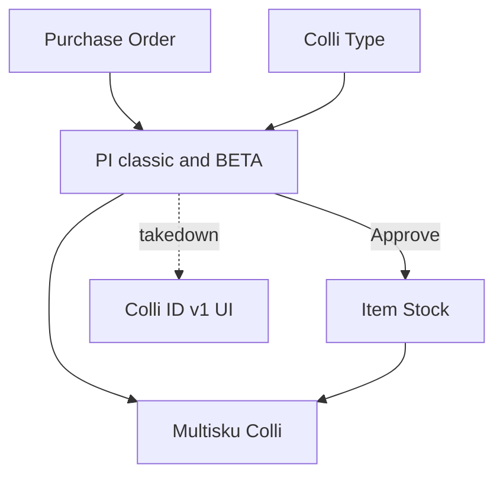

# Purchase Inbound — Colli v2 — Source of Truth

## 1. Ringkasan Eksekutif

**Colli v2** mengganti konsep **Colli ID v1** (jumlah koli × isi → N Stock ID) dengan **wadah multi-SKU**: satu **Colli code** menampung banyak baris SKU di **satu Location Destination (WH terkecil / exact)** yang sama. Availability qty di dalam colli baru bermakna setelah inbound **Approved** (Item Stock).

SOT ini mencakup **parity penuh** di dua UI yang share backend GRN:

| Menu | Slug docs | Route UI |
|------|-----------|----------|
| **BETA - New Purchase Inbound** | `supplychain-new-purchase-inbound` | `/supplychain/new-purchase-inbound` |
| **Purchase Inbound** (legacy) | `supplychain-mutation-inbound` | `/supplychain/mutation-inbound` |

Kedua menu dibedakan hanya agar deep change Colli v2 tidak mengganggu flow existing sekaligus; **aturan Colli v2 identik**. Daftar Colli code: [Multisku Colli](https://staging.olshoperp.com/supplychain/multisku-colli). Master tipe: Colli Type.



**Out of scope kode:** cara teknis takedown input Colli v1 (hapus vs feature-flag) — tidak diarahkan di SOT ini; behavior target = Colli v2 menggantikan v1 di UX inbound.

## 2. Prasyarat

| Prerequisite | Sumber | Catatan |
|--------------|--------|---------|
| Header inbound sudah punya **Location Destination** (WH terkecil) | Purchase Inbound | Existing colli difilter exact WH ini; New Colli mewarisi lokasi header |
| Minimal satu **Colli Type Active** (untuk New Colli) | Colli Type | Default ON dipakai preselect New Colli |
| PO outstanding / product eligible (aturan GRN existing) | Purchase Order / System Product | Qty flow **tidak diubah** Colli v2 |
| Privilege create/update inbound | Gate | — |
| (Opsional) Existing Multisku Colli di WH yang sama | Multisku Colli | Untuk mode Existing |

## 3. Siklus Status

### 3.1 Purchase Inbound (dokumen)

Ikuti status GRN existing (Draft / Open → Approved / Rejected). **Void inbound:** belum ada requirement jelas → **next topic** (GAP-CIV2-08); jangan spekulasi di SOT ini.



| Event inbound | Efek Colli code **baru** (belum pernah di-Approve di inbound mana pun) | Efek Colli **existing** / sudah pernah Approve |
|---------------|------------------------------------------------------------------------|------------------------------------------------|
| Assign di detail (belum Approve) | Row Multisku Colli boleh muncul di list; **masih bisa hilang** jika semua inbound draft yang mereferensikan dihapus | Tetap ada |
| **Approve** | Colli menjadi **permanen** (tidak boleh hilang hanya karena inbound nanti dihapus) | — |
| **Reject** lalu Delete inbound | Colli baru tanpa history Approve → **hapus** dari Multisku Colli list | Tidak hapus colli |
| Delete inbound (draft/open/rejected) | Hapus colli baru **hanya jika** tidak masih direferensikan inbound lain yang masih hidup | Colli tetap |
| Inbound-2 memakai colli dari Inbound-1 (belum Approve-1), hapus Inbound-1 | Colli tetap selama Inbound-2 masih referensi | — |
| Hapus Inbound-2 juga (colli belum pernah Approve) | Colli baru hilang | — |

**Tidak ada** status khusus draft/temp di entity Colli code (AS-IS entity tanpa enum status colli). Persistensi ditentukan oleh **referensi + pernah Approve** (GAP-CIV2-01 jika implementasi beda).

### 3.2 Baris detail ↔ colli

| Aturan | Nilai |
|--------|--------|
| Colli per baris detail | **Maks 1** Colli code (`multisku_colli_id` nullable) |
| Colli wajib? | **Opsional** — NULL = baris tidak pakai Colli v2 |
| 1 SKU multi Stock ID | Tetap dimungkinkan di view group/detail outbound/transfer nanti; di inbound assign: 1 baris ↔ 1 colli |

## 4. Datalist / kolom detail (Colli v2)

Selain kolom GRN existing, detail inbound menampilkan **Colli code** (setelah generate/assign). Multisku Colli list dipakai QA untuk cek generate/hapus.

| Tempat | Kolom / info |
|--------|----------------|
| Detail inbound | Colli code (nullable); inline edit colli di row |
| Toolbar bulk (detail) | Assign Existing / New Colli + Colli Type + Save |
| Multisku Colli menu | List colli code tergenerate (test lifecycle) |

**Takedown Colli v1 UI:** input Jumlah COLLI @ Isi per Colli / template import v1 (`colli` × `colli_qty`) diganti model v2 — lihat §6.5.

## 5. Form & Field — assign Colli v2

### 5.1 Tiga jalur insert SKU (qty = AS-IS, tidak diubah)

| Jalur | Qty default (AS-IS verified) | Assign colli |
|-------|------------------------------|--------------|
| **Select product** (klik SKU → masuk detail) | Qty **1** jika via bulk/select product path (`bulk_product_id` → qty 1) | Setelah baris ada: checkbox bulk → toolbar Colli; atau inline per row |
| **Available product — bulk Use** | Qty = **all outstanding** (`in_balance`) | Saat multi-select di modal: field Colli (Existing/New + Type) + tombol **Use** → multi SKU masuk **satu** colli code yang sama |
| **Available product — single Use** | Default **all outstanding**, **editable** di modal; final = nilai field terakhir | Field Colli method + Colli Type **setelah** toggle Serial Number, **sebelum** Description; **Save** → SKU masuk colli |

### 5.2 Field assign Colli (toolbar / modal / inline)

| Field | Aturan |
|-------|--------|
| **Colli method** | **Existing Colli** \| **New Colli** |
| **Existing Colli** (select) | Opsi = Colli code yang sudah ada; **filter exact** `warehouse` = Location Destination header (WH terkecil, bukan parent). Validasi lokasi dari identitas lokasi colli (= lokasi semua SKU/availability di colli itu) |
| **New Colli** | System generate code baru (`MultiskuColli` prefix **`COL`** via `code_identifier`). Lokasi colli = WH destination header — **tidak** perlu cek lokasi existing |
| **Choose Colli Type** | Hanya Colli Type **Active**. Jika New Colli + ada Default ON di master → **preselect** default |
| **Save** (detail toolbar) | SKU terpilih checkbox masuk setting colli |
| **Use** (available product bulk) | Multi SKU terpilih masuk colli yang sama |

### 5.3 Header Location Destination

Selama **ada detail**, user **tidak bisa** ubah field critical header termasuk destination WH (aturan existing). Ubah destinasi hanya setelah hapus semua detail → case mismatch colli vs header **tidak terjadi** lewat edit header.

## 6. How It Works

### 6.1 Existing vs New



### 6.2 Lifecycle contoh (dari requirement)

1. Inbound-1 di Seruni Drop Off → New Colli `COL-…` muncul di detail + Multisku Colli.  
2. Inbound-2 (destinasi sama) → pilih Existing `COL-…`.  
3. Hapus Inbound-1 → colli **tetap** (masih dipakai Inbound-2).  
4. Hapus Inbound-2 juga, dan colli **belum pernah** Approve → colli **hilang** dari Multisku Colli.  
5. Jika colli pernah dipakai inbound **Approved** → tidak hilang walau inbound draft berikutnya yang mereferensikan dihapus (ada availability history).

### 6.3 Availability vs “isi colli”

- Qty availability di colli **baru ada setelah Approve** (Item Stock + `multisku_colli_id`).  
- Sebelum Approve, assign colli = **link kode**, bukan stock qty.  
- Report jumlah qty dalam colli (terpisah, nanti) = sum availability SKU yang terikat colli itu (semua sumber approved).

### 6.4 Import (in scope)

Template import inbound mendapat **1 kolom Colli** (v2):

| Isi sel | Arti |
|---------|------|
| Angka / numbering yang sama di banyak baris SKU | Dianggap **satu New Colli** bersama → generate **satu** Colli code baru untuk group itu |
| Code colli yang sudah ada di system | Mode **Existing** — wajib lokasi colli **exact** = WH destination header (WH terkecil) |
| Kosong | Baris tanpa Colli v2 (NULL) |

Validasi existing: lokasi colli dari WH identitas colli (lokasi SKU/availability di dalamnya), harus match header.

**AS-IS sekarang:** template Colli v1 (`colli` × `colli_qty` → inbound qty). Diganti aturan di atas (GAP-CIV2-02 implementasi).

### 6.5 Colli ID v1 → v2

| Colli ID v1 (BETA lama) | Colli v2 |
|-------------------------|----------|
| Jumlah koli × isi → N Stock ID per SKU | Satu Colli code = wadah multi-SKU |
| Import colli × colli_qty | Import 1 kolom colli (numbering / existing code) |
| UI InboundColly | Diganti Existing/New + Type |

Takedown input v1 di kedua menu (parity); **jangan** ubah kode di luar arahan Dev untuk cara remove.

### 6.6 Contoh kasus

| # | Situasi | Expected |
|---|---------|----------|
| 1 | Select product 3 SKU, bulk assign New Colli type Box | 1 COL code baru; 3 baris linked; muncul Multisku Colli |
| 2 | Available bulk Use 2 SKU + Existing COL di WH sama | Kedua baris linked ke COL itu |
| 3 | Existing COL beda WH | Tolak — lokasi harus exact |
| 4 | Single Use modal: set qty 50 (dari outstanding 100) + New Colli | Qty 50 (editable); linked colli |
| 5 | Baris tanpa colli | NULL OK |
| 6 | 1 baris coba 2 colli | Tidak boleh — maks 1 |
| 7 | Approve inbound draft yang generate COL baru (tidak dipakai lain, belum Approve) | COL hilang dari list |
| 8 | Reject lalu delete | Sama seperti hapus — COL baru tanpa Approve hilang |
| 9 | Import 5 row numbering `1` + 2 row code `COL-ABC` | Group `1` → 1 new COL; `COL-ABC` existing jika WH match |
| 10 | New Colli tanpa set Type, ada default master | Type = default ON |

## 7. Validasi

| Kondisi | Behavior |
|---------|----------|
| Existing colli WH ≠ header destination | Reject — exact WH terkecil |
| New Colli tanpa Colli Type (dan tidak ada default) | Required Type |
| Colli Type inactive | Tidak muncul di opsi |
| Assign colli opsional | NULL allowed |
| Qty / outstanding / serial | **Tidak diubah** — validasi GRN existing |
| Import existing colli lokasi salah | Row error |
| Ubah destination saat masih ada detail | Diblok existing (hapus detail dulu) |

Pesan exact EN: **[VERIFY: CODEBASE]** setelah FormRequest Colli v2 ada.

## 8. Relasi Menu Lain



| Menu | Relasi |
|------|--------|
| BETA New Purchase Inbound / Purchase Inbound legacy | **Parity** Colli v2; API GRN shared |
| Colli Type | Type Active + Default untuk New Colli |
| Multisku Colli | List colli code; QA lifecycle |
| Purchase Order | Outstanding qty (unchanged) |
| Item Stock | Availability setelah Approve |
| Outbound / Transfer (nanti) | View group/detail multi stock id — bukan scope assign inbound |

## 9. Gap Registry

| ID | Deskripsi | Type | Dampak | Status |
|----|-----------|------|--------|--------|
| GAP-CIV2-01 | Persistensi colli “belum Approve boleh hilang / pernah Approve permanen” — entity MultiskuColli **tanpa** status khusus; perlu flag/ref-count/approved-inbound check di implementasi | Missing Behavior | Lifecycle hapus | Open — Dev design + verify |
| GAP-CIV2-02 | Import template v2 (1 kolom numbering/existing) belum menggantikan ColliImport v1 di codebase | Missing Behavior | Import | Open |
| GAP-CIV2-03 | UI toolbar/modal/inline Colli v2 + takedown InboundColly v1 — WIP vs staging | Missing Behavior | UX kedua menu | Open — parity classic + BETA |
| GAP-CIV2-04 | Select2 existing colli filter exact WH + lokasi dari availability SKU di colli | Missing Behavior | T03/T09 | Open |
| GAP-CIV2-05 | Preselect Colli Type dari `is_default` (lihat SOT Colli Type GAP-CT-01) | Missing Behavior | New Colli UX | Open — depends master |
| GAP-CIV2-06 | Menu Multisku Colli docs/controller di workspace belum lengkap; staging URL ada | Unverified | QA list colli | Open |
| GAP-CIV2-07 | Pesan error exact EN untuk WH mismatch / type required | Unverified | QA assert | Open setelah implement |
| GAP-CIV2-08 | **Void** inbound × lifecycle colli | Pending Decision | — | **Deferred** — next topic; no void requirement yet |
| GAP-CIV2-09 | Cara teknis remove Colli v1 (delete code vs disable) | Out of scope SOT | Dev only | Resolved for SOT — behavior v2 replaces v1; no code-change prescription |

## 10. FAQ

**Q: Kenapa dua menu inbound?**  
A: Deep change Colli v2; parity rules. Backend GRN sama.

**Q: Wajib pakai colli?**  
A: Tidak — boleh NULL.

**Q: Kapan colli “aman” tidak terhapus?**  
A: Setelah minimal satu inbound yang memakai colli itu **Approved** (ada jejak availability). Sebelum itu, hapus semua inbound draft yang mereferensikan → colli bisa hilang.

**Q: Reject menghapus colli?**  
A: Reject sendiri tidak final-kan colli. Jika setelah reject transaksi dihapus dan colli belum pernah Approve → colli hilang.

**Q: Beda Colli v1?**  
A: v1 = pecah Stock ID per koli per SKU. v2 = satu kode wadah multi-SKU di satu lokasi.

## 11. Changelog

| Version | Date | Changes |
|---------|------|---------|
| 1.0 | 2026-08-14 | Initial shared SOT Colli v2 untuk BETA + legacy Purchase Inbound; lifecycle, 3 jalur insert, import numbering, void deferred |

## 12. Knowledge Base Hints

### Kamus

| Istilah | Awam |
|---------|------|
| Colli v2 / Multisku Colli | Wadah berisi banyak SKU di satu lokasi |
| New Colli | System buat kode baru di WH destination sekarang |
| Existing Colli | Pakai kode yang sudah ada di WH yang sama |
| Colli Type | Jenis wadah (Box, Pallet) |
| Permanen | Sudah pernah lewat inbound Approved |

### Troubleshooting

| Gejala | Cek |
|--------|-----|
| Existing colli tidak muncul | WH destination exact? Colli di WH lain? |
| Colli hilang setelah hapus inbound | Belum pernah Approve + tidak ada inbound lain? |
| Colli masih ada setelah hapus | Masih direferensikan inbound lain atau sudah pernah Approve |
| Type kosong di New Colli | Tidak ada Colli Type Active / Default |

### Skip di KB

Path class import v1, job approve chunk, cara delete kode v1.

## 13. Technical Hints

### File map (seed)

| Layer | Path / nama |
|-------|-------------|
| Shared API | `StockMutationInboundController`, `StockMutationInboundDetailController`, `StockMutationInboundMiddleDetailController` |
| Detail FK | `inbound_mutation_details.multisku_colli_id` (nullable) |
| Item Stock FK | `item_stocks.multisku_colli_id` (nullable) |
| Colli entity | `MultiskuColli` — `scm_multisku_collis`, `code_identifier = COL`, `colli_type_id` |
| Colli Type | `ColliType` — SOT `supplychain-colli-type` |
| FE BETA | `olshoperp-frontend/src/pages/SCM/Inbound/PurchaseInbound/**` (`/new-purchase-inbound`) |
| FE legacy | `…/StockMutation/InventoryIn/**` (`/mutation-inbound`) |
| Colli v1 UI (takedown) | `InboundColly.vue`, import `StockMutationInboundColliImport` |
| Qty bulk vs select | `bulk_product_id ? 1 : in_balance` di detail/middle store |

### Invariants

1. Parity Colli v2 di kedua UI inbound.  
2. Exact WH destination = lokasi colli (WH terkecil).  
3. Maks 1 colli per detail line; colli opsional.  
4. Qty rules GRN existing tidak berubah.  
5. Colli baru deletable sampai ada inbound Approve yang memakai; existing/approved-history tidak ikut terhapus hanya karena hapus inbound draft.  
6. Import: same numbering → one new colli; existing code → validate WH.  
7. Void = deferred.

### Failure modes

| Mode | Expected |
|------|----------|
| WH mismatch existing | Validation error |
| Delete inbound → orphan new colli cleanup | Colli removed from Multisku list |
| Approve | Item Stock + permanent colli |

### Data lifecycle

Assign (link) → optional Multisku row for New → Approve → Item Stock (+ availability in colli) → report qty later. Delete/reject-delete tanpa Approve → unlink + maybe delete Multisku row.

## 14. Referensi Struktur untuk Proses Split

```
Section 1-11 → material utama untuk requirement.md (inject ke supplychain-new-purchase-inbound canonical + mirror legacy)
Section 5, 6, 7, 10 → adaptasi ke knowledge-base.md dengan tone awam (lihat Section 12)
Section 13 Technical Hints → seed untuk technical.md, sudah pakai path/nama real
Frontmatter YAML di atas → copy ke layer terdampak; sync version + last_updated
Golden reference tone & struktur: docs/qa-docs/accounting-supplier-invoice/
```

**Split note:** Contenu Colli v2 **canonical** di `supplychain-new-purchase-inbound/` (docs PI sudah canonical di BETA); `supplychain-mutation-inbound/` cukup pointer + parity note. Multisku Colli list → folder menu sendiri saat docs siap. Jangan duplikasi penuh dua requirement identik.
