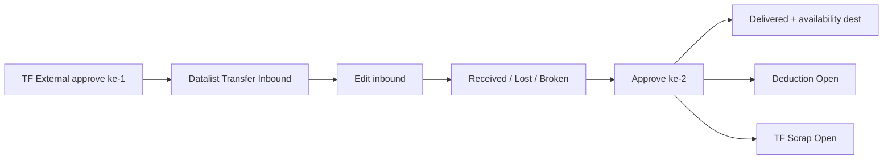
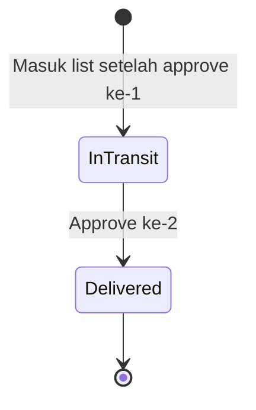
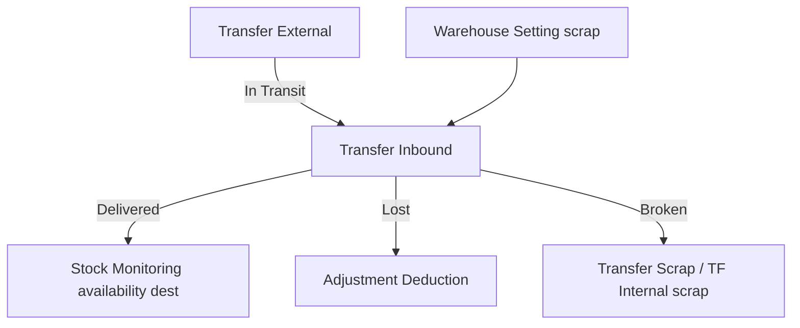

# Transfer Inbound — Source of Truth

> **Pasangan wajib** dengan [Transfer External](./supplychain-mutation-transfer-external-source-of-truth.md). Menu ini = **approval ke-2** (penerimaan) atas dokumen TF External yang sudah approve ke-1.  
> Route: [`/supplychain/transfer-inbound`](https://staging.olshoperp.com/supplychain/transfer-inbound). Share datalist/form produksi TF External dengan flag inbound. **Tidak ada Create.** Aturan FIFO, import, Colli produksi, Show Virtual, Void: **ikut SOT Transfer External** (tidak diulang kecuali yang berbeda di sini).

## 1. Ringkasan Eksekutif

Transfer Inbound menampilkan **hanya** Transfer External dengan Delivery Status **In Transit** atau **Delivered**. Operator gudang tujuan mengisi Qty Received / Lost / Broken lalu **Approve** (approval ke-2). Setelah itu dokumen utama menjadi **Delivered**, stok In Transit masuk destination, Lost memicu Stock Deduction **Open**, Broken memicu Transfer Internal scrap **Open**.



## 2. Prasyarat

| Prerequisite | Sumber | Catatan |
|--------------|--------|---------|
| Dokumen TF External sudah **Approved** + Delivery **In Transit** | Transfer External | Tidak muncul jika masih Draft/Open |
| Privilege view/approve TF External (surface inbound) | Gate | Share policy TF External |
| Setting WH Scrap di building destination | Warehouse Setting | Wajib jika isi Broken Items lebih dari 0 |
| Detail received/lost/broken lengkap sebelum approve ke-2 | Form inbound | Jumlah harus sama dengan qty transferred |

Create header, Select Product, Import, Available Products, autosave origin: **tidak ada** di menu ini.

## 3. Siklus Status

Dokumen yang diedit = **header TF External utama** (bukan dokumen hidden). Status transaksi sudah **Approved** sejak approve ke-1. Yang berubah di inbound: **Delivery Status** + qty received/lost/broken.



| Delivery | Edit received/lost/broken | Delete header | Approve ke-2 |
|----------|---------------------------|---------------|--------------|
| In Transit | Ya (jika belum Delivered / belum fully received flow) | Tidak | Ya |
| Delivered | Tidak | Tidak | Tidak |

**Tidak ada Void. Tidak ada reject approval ke-2.** Jika qty salah, koreksi **sebelum** approve ke-2.

**Action datalist inbound:** Update (buka form inbound); Approve jika 1 child hidden sudah approved dan masih menunggu penerimaan; tidak Create; Delete tidak untuk dokumen sudah Approved.

## 4. Datalist

API yang sama dengan TF External + query `transfer_inbound` terisi → filter `transit_status` in transit **atau** delivered. Link kode ke `/supplychain/transfer-inbound/edit/{id}`.

| # | Fitur | Beda vs TF External |
|---|--------|---------------------|
| Create | **Tidak ada** | Tombol Create di-hide |
| Show Virtual | TO-BE hide (sama keputusan TF Ext) | Share komponen; produksi `is_show_virtual=false` |
| Bulk Delete / Approve | Ada (checkbox) | Approve = approval ke-2 untuk row In Transit |
| Kolom | Sama termasuk **Delivery Status** | In Transit vs Delivered |

Export: opsi with/without details sama keluarga TF Ext; with-details berisi Qty Received / Lost / Broken (relevan setelah inbound diisi / delivered).

## 5. Form & Field

Header Basic Information **read-only operasional** (origin/destination/tanggal sudah lock karena sudah approve ke-1). Tidak menambah SKU baru.

### 5.1 Product Transfer Detail (inbound)

| Kolom | Aturan |
|-------|--------|
| **Qty Transfered** | Disabled. Informasi qty yang dikirim (approve ke-1) |
| **Qty Received** | Editable. Default = semua qty transferred |
| **Lost Items** | Editable. Default kosong / 0. Jika diisi lebih dari 0: setelah approve ke-2 sistem generate **Stock Deduction** status **Open**, `process_type` lost, **Trx Ref = kode dokumen TF External utama** (bukan TF hidden). Approve deduction **manual** di Adjustment Deduction |
| **Broken Items** | Editable. Default kosong / 0. Jika diisi lebih dari 0: setelah approve ke-2 generate **Transfer Internal** scrap, origin = In Transit destination, dest = **WH scrap** setting building destination. Status **Open** — **bukan** auto-approve. Info UI: *The product quantity in this field will automatically transfer to the virtual broken warehouse.* Lost: *…automatically create an adjustment out form.* |

**Group View** default; **Detail View** untuk pecahan stock ID.

**Rumus:** Qty Received + Lost Items + Broken Items **harus sama** dengan Qty Transfered (satuan transfer). Tidak boleh melebihi transferred.

Colli: **tidak** di form inbound produksi (share FE tanpa Colli).

## 6. How It Works

### 6.1 Isi penerimaan (contoh)

TF Ext TF001 kirim SKUPENSIL 1.000.

| Received | Lost | Broken | Hasil setelah approve ke-2 |
|----------|------|--------|----------------------------|
| 1.000 | 0 | 0 | Semua masuk Drop OFF SDA; Delivered |
| 900 | 100 | 0 | 900 availability SDA; Deduction Open 100, ref TF001 |
| 850 | 50 | 100 | 850 SDA; Deduction 50 Open; TF scrap 100 Open ke Broken WH |
| 1.001 | — | — | Ditolak: received tidak boleh lebih dari transferred |

### 6.2 Generate setelah approve ke-2

Urutan sistem (AS-IS):

1. Validasi jumlah received/lost/broken vs transferred (base unit).
2. Update qty transfer hidden leg ke **received** (allow zero).
3. Jika lost lebih dari 0: buat/ pakai header deduction terikat TF utama; tambah detail; **tetap Open**.
4. Jika broken lebih dari 0: wajib scrap WH ada; buat/pakai TF Internal scrap In Transit ke scrap; **tetap Open**.
5. Approve pergerakan In Transit ke destination untuk qty received.
6. Set Delivery Status dokumen utama **Delivered**.

Stock Monitoring: incoming In Transit hilang; availability destination = received. Lost tidak jadi availability. Broken menunggu approve TF scrap.

### 6.3 Yang tidak dilakukan di inbound

- Tidak merubah FIFO origin (sudah di-lock saat create TF Ext).
- Tidak insert SKU baru.
- Tidak auto-approve deduction/scrap (beda Failed Ship yang auto-approve scrap).

## 7. Validasi

| ID | Kondisi | Behavior / pesan (verbatim) |
|----|---------|------------------------------|
| V-TFINB-01 | Received lebih dari transferred | *Quantity received cannot be greater than transfer quantity* |
| V-TFINB-02 | Received + lost + broken ≠ transferred (saat set qty) | *Defect quantity, lost quantity, and received quantity must equal the transferred quantity.* |
| V-TFINB-03 | Saat approve ke-2, lost+broken+received tidak match transferred (base) | *The lost and defect item quantities don't match the recorded received quantity. Please check again.* |
| V-TFINB-04 | Broken lebih dari 0 tapi scrap WH belum di-set | Gagal resolve scrap parent (approve/save broken diblok) |
| V-TFINB-05 | Ubah qty setelah dokumen approved+delivered | *This transaction and it's properties already approved, you can't modify this data anymore.* |
| V-TFINB-06 | Approve ke-2 saat job lock | Sama TF Ext: in progress / refresh |
| V-TFINB-07 | Detail tidak lengkap warehouse | *Please select warehouse on all details* |

Pesan V-TFINB-02 vs V-TFINB-03: dua endpoint (set qty vs approve). QA uji keduanya.

Sisa validasi header/origin: tidak relevan (dokumen sudah Approved).

## 8. Relasi Menu Lain



| Menu | Relasi |
|------|--------|
| Transfer External | Sumber dokumen; approval ke-1; Trx Code yang sama |
| Adjustment Deduction | Lost; ref kode TF Ext **utama**; Open sampai user approve |
| Transfer Internal / Scrap | Broken ke WH scrap; Open |
| Stock Monitoring / Product Mutation | Incoming selesai setelah Delivered |

## 9. Gap Registry

| ID | Deskripsi | Type | Dampak | Status |
|----|-----------|------|--------|--------|
| GAP-TFINB-01 | Share FE TF External; Create di-hide. Show Virtual TO-BE hide (ikut TF Ext). | Missing Behavior (TO-BE) | Konsistensi chrome datalist | Open — hide virtual in progress |
| GAP-TFINB-02 | Colli tidak ada di inbound; BETA Colli TF Ext tidak mengalir ke form inbound. | Missing Behavior | Penerimaan colli lintas gedung tidak terdefinisi | Open — Colli bukan produksi |
| GAP-TFINB-03 | Dua pesan validasi jumlah received/lost/broken (set vs approve). | Unverified UX | Operator bisa lihat pesan berbeda | Open |
| GAP-TFINB-04 | Lost reference class di live approve service vs controller lama berbeda; **kode/URL** tetap doc TF Ext utama. | Unverified | Cari deduction by class | Lihat GAP-TFEXT-05 |
| GAP-TFINB-05 | Lost Items / Broken Items bertanda required di modal padahal default 0/kosong sah. | Contradiction UI | Requirement: [default NULL/0, optional]. Codebase UI: [asterisk required]. | Pending Decision — Yemima (behavior: 0 sah jika received = transferred) |

## 10. FAQ

**Kenapa dokumen saya tidak muncul di Transfer Inbound?** Belum approve ke-1 di Transfer External, atau masih Draft/Open.

**Boleh approve ke-2 tanpa ubah qty?** Ya — default received = transferred, lost/broken 0.

**Lost sudah generate deduction, kenapa stok belum potong final?** Deduction masih Open. Approve manual di Adjustment Deduction.

**Broken ke gudang mana?** WH scrap yang di-set di Warehouse Setting untuk struktur **destination** (contoh GD-SDA Broken), bukan origin Surabaya.

**Bisa reject penerimaan?** Tidak. Koreksi angka sebelum Approve ke-2.

## 11. Changelog

| Version | Date | Changes |
|---------|------|---------|
| 1.0 | 2026-09-01 | SOT awal approval ke-2; Lost/Broken Open; pair TF External |

## 12. Knowledge Base Hints

| Istilah | Awam |
|---------|------|
| Qty Transfered | Jumlah yang dikirim pengirim (tidak diubah penerima) |
| Qty Received | Jumlah yang benar-benar diterima baik |
| Lost Items | Hilang di jalan → nanti jadi Stock Deduction, masih perlu approve |
| Broken Items | Rusak → pindah ke gudang scrap, masih perlu approve TF scrap |
| Delivered | Penerimaan selesai |

**Troubleshooting:** Destination tidak bisa broken → cek Warehouse Setting scrap. Deduction tidak ketemu → cari **kode TF Ext utama**, bukan kode TF hidden. Incoming masih ada setelah approve → cek job lock / refresh Delivery Status.

**Skip di KB:** dokumen hidden TF002/TF003, Colli BETA, `with_picking_list`.

## 13. Technical Hints

**File map:** FE `TransferExternal/DataList.vue` + `Form.vue` dengan `meta.transferInbound`; API `GET mutation-transfer-external?transfer_inbound=`; `setBrokenMissingQuantity` / `updateQuantityReceived`; approve sequence 1 via `TransferExternalTransactionalJob` + `TransferExternalProcessApproveJob`; `TransferExternalApproveService::checkQuantityReceived` / `handleMissing` / `handleBroken`; export inbound `StockMutationTransferInboundExportAll`.

**Invariants:** List hanya `transit_status` in transit \| delivered; approve ke-2 tidak generate In Transit baru (`generate_transfer_external_in_transit=false`); deduction/scrap **Open**; ref text = kode header visible.

**Failure modes:** Scrap WH missing; qty mismatch base unit rounding; job lock; import cache TF Ext (seharusnya tidak jalan di inbound).

## 14. Referensi Struktur untuk Proses Split

```
Section 1-11 → material utama untuk requirement.md
Section 5, 6, 7, 10 → adaptasi ke knowledge-base.md dengan tone awam (lihat Section 12)
Section 13 Technical Hints → seed untuk technical.md, sudah pakai path/nama real
Frontmatter YAML di atas → copy ke 3 file utama (+ user-guide.md kalau gate review/final), sinkronkan version + last_updated
Golden reference tone & struktur: docs/qa-docs/accounting-supplier-invoice/
```
