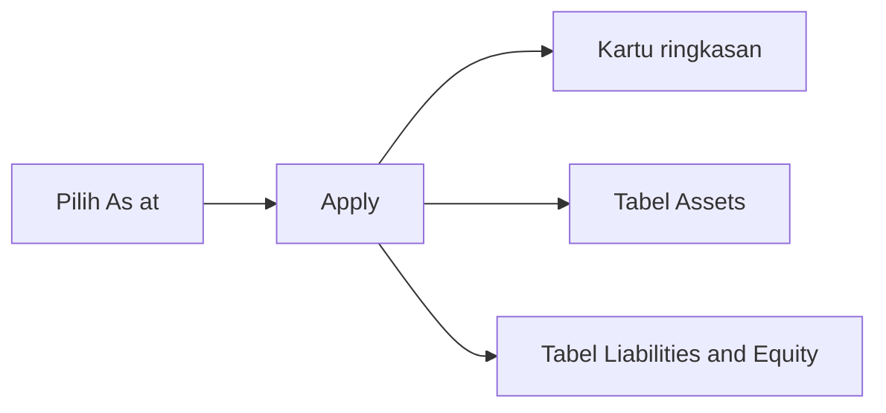
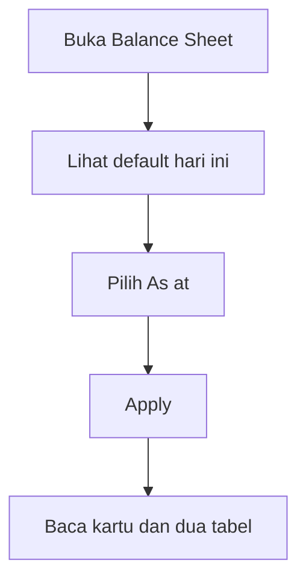

# Balance Sheet — Knowledge Base

> **Audience:** Finance / Controller · **Route:** `/accounting/balance-sheet`

---

## 1. Apa itu?

**Balance Sheet (neraca)** menampilkan posisi keuangan perusahaan **pada satu tanggal** (As at): berapa aset, utang, dan modal. Ada kartu ringkasan di atas + dua tabel berdampingan (Assets | Liabilities and Equity).

Menu ini **hanya baca** — tidak ada create/edit dan **tidak ada export**.

**Beda singkat:** [Profit & Loss](../accounting-profit-loss/) = kinerja **rentang tanggal**. Balance Sheet = posisi **satu tanggal**.

---

## 2. Glosarium

| Istilah | Arti awam |
|---------|-----------|
| **As at** | Tanggal potong neraca |
| **Ending Balance** (di layar) | Saldo akun sampai cut-off tanggal (bukan mutasi dalam range) |
| **Current Profit/Loss** | Laba/rugi berjalan yang menambah atau mengurangi Equity |
| **Parent akun** | Akun induk; angkanya jumlah anak |
| **Liabilities and Equity** | Sisi kanan neraca (utang + modal) |

---

## 3. Alur kerja standar

1. Buka menu — default angka **hari ini**.  
2. Pilih tanggal **As at**.  
3. Klik **Apply** (tanpa tanggal terisi = tidak reload).  
4. Baca kartu: Total Assets, Total Liabilities & Equity, Current Profit/Loss.  
5. Bandingkan tabel kiri (Assets) vs kanan (Liabilities and Equity).

---

## 4. Cara baca angka

- Idealnya **Total Assets ≈ Total Liabilities + Total Equity**. Sistem **tidak memblok** jika belum balance.  
- **Current Profit/Loss** positif menambah Equity; negatif mengurangi Equity.  
- Induk akun **tebal** + indent; nilai induk = akumulasi anak.  
- Transaksi journal harus **Approved** agar masuk saldo akun biasa.  
- Nuansa tanggal: transaksi **pada hari As at** biasanya **belum** masuk saldo akun biasa, tapi bisa ikut angka Current Profit/Loss — kalau kartu dan baris beda, cek poin itu dulu.

**Contoh:** As at 31 Mar → Apply. Current P/L +2 jt → Total Equity naik 2 jt dibanding modal COA saja.

---

## 5. Troubleshooting

| Gejala | Penyebab | Solusi |
|--------|----------|--------|
| Angka masih hari ini setelah ganti tanggal | Belum Apply | Isi As at → **Apply** |
| Apply tidak bereaksi | As at kosong | Isi tanggal dulu |
| Assets ≠ L+E | Journal belum Approved; mapping Current P/L; fiscal period; cut-off hari As at | Cek journal Approved, mapping company, period Open, transaksi di tanggal cut |
| Current P/L di kartu ada, di parent Equity 0 | Fiscal period closed / tidak cover tanggal | Cek Fiscal Period untuk tanggal As at |
| Tidak ada tombol Export | By design | View only — salin layar / laporan lain bila perlu unduh |

---

## 6. FAQ

**Q: Harus Apply?**  
A: Ya — ubah tanggal saja belum refresh.

**Q: Ada export?**  
A: Tidak.

**Q: Journal Draft ikut?**  
A: Tidak untuk saldo akun biasa.

**Q: Fiscal Period mempengaruhi?**  
A: Ya untuk path Current P/L di parent Equity — period harus Open dan cover tanggal As at.

---

## Related Documents

| Doc | Path |
|-----|------|
| Requirement | [requirement.md](./requirement.md) |
| Technical | [technical.md](./technical.md) |
| User Guide | [user-guide.md](./user-guide.md) |
| Profit & Loss | [../accounting-profit-loss/knowledge-base.md](../accounting-profit-loss/knowledge-base.md) |
| Fiscal Period | [../accounting-fiscal-period/knowledge-base.md](../accounting-fiscal-period/knowledge-base.md) |
