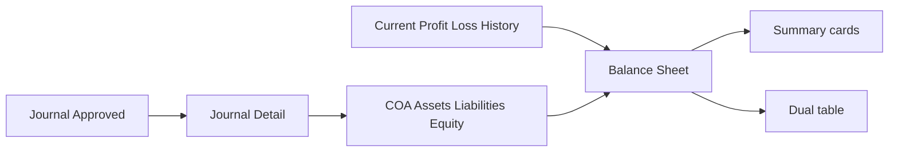

# Balance Sheet — Requirement Documentation

**Modul:** Finance & Accounting / Report  
**Audience:** PM, Finance, QA  
**UI route:** `/accounting/balance-sheet`  
**API:** `GET …/balance-sheet/report?period=` · `GET …/balance-sheet/datalist?className[]=&period=`  
**SoT:** `_meta/sot/accounting-balance-sheet-source-of-truth.md` v1.0 (12 Agustus 2026)

Sibling: [Profit & Loss](../accounting-profit-loss/) · Sumber: [Journal](../journal/) · [Chart of Account](../accounting-chart-of-account/) · [Fiscal Period](../accounting-fiscal-period/)

> AS-IS = neraca **As at** + kartu + dual table; **tanpa export**. Gap Pending Decision: cut-off, dual helper P/L, tanda abs.

---

## 0. Metadata & Changelog

| Version | Date | Author | Changes |
|---------|------|--------|---------|
| 1.0 | 2026-08-12 | QA - Yemima | Full 5-file dari SoT v1.0; Gap GAP-BS-01..08 |

---

## 1. Ringkasan Eksekutif

**Balance Sheet** = laporan **neraca** (posisi keuangan) **pada satu tanggal As at**. Kartu ringkasan (Total Assets, Total Liabilities, Total Equity, Total Liabilities & Equity, Current Profit/Loss) + **dua tabel**: Assets | Liabilities and Equity. Angka dari journal **Approved** (path COA biasa) sampai cut-off tanggal.

Persamaan yang ditarget UI: **Total Assets ≈ Total Liabilities + Total Equity**, dengan Current Profit/Loss (ending) menambah/mengurangi Equity. Menu **view-only** — **tidak ada export**, create, edit, delete.



---

## 2. Prasyarat

| Prasyarat | Sumber | Catatan |
|-----------|--------|---------|
| COA aktif class Assets, Liabilities, Equity | Chart of Account | Revenue/Expense/COGS **tidak** masuk BS |
| Hierarki parent–child | COA Tree | Parent = agregasi; indent + bold |
| Mapping Current Profit/Loss | Company accounting | Kartu + baris + penambah Equity |
| Journal Approved | Journal | Beginning balance filter Approved |
| Privilege `viewAny` | Gate `accounting/balance-sheet` | Report + datalist authorize |
| Fiscal Period Open cover As at | Fiscal Period | Path `getCurrentProfitLoss` → 0 jika period tidak cover / tidak Open |

---

## 3. Siklus Status

Menu **tidak punya status dokumen**. Angka mengikuti Journal (+ history / fiscal period untuk Current P/L).

| Status Journal | Beginning COA (A/L/E) | Ending / Current P/L (history) |
|----------------|----------------------|--------------------------------|
| **Approved** | Ya (`transaction_date` **&lt;** As at) | History ≤ As at — **tanpa** filter Approved (GAP-BS-03) |
| Draft / Open / Rejected | Tidak | Risiko ikut di history (GAP-BS-03) |

---

## 4. Datalist / layout

### 4.1 Zona UI

| Zona | Isi |
|------|-----|
| Filter | **As at** + **Apply** |
| Kartu | Total Assets · Total L&E (+ Total Liabilities / Total Equity) · Current Profit/Loss |
| Tabel kiri | **Assets** |
| Tabel kanan | **Liabilities and Equity** |

### 4.2 Kolom tabel

| Kolom | Default | Catatan |
|-------|---------|---------|
| CODE | Ya | Order numerik segmen BE |
| NAME | Ya | Indent; parent **bold** |
| ENDING BALANCE | Ya | Saldo as-of (helper beginning / ending P/L — §6) |
| COA CLASS / SEQ | Tidak | Legacy / hidden |

### 4.3 Karakteristik

- DataTables minimal (`t`); pageLength 1000; **tanpa** Search Builder / export / print / drill-down / action baris.

### 4.4 Filter

| Kontrol | Behavior |
|---------|----------|
| **As at** | Single date `yyyy-MM-dd` (tampil dd-MM-yyyy) |
| **Apply** | Hanya jika tanggal terisi → refresh kartu + kedua tabel |
| Apply tanpa tanggal | **No-op** |
| First load | Period lokal kosong; API default **hari ini** |

---

## 5. Form & Field

Hanya filter report: **As at** (`period`). API `className`: Assets → `assets`; L+E → `liabilities` + `equity`. Format `period` tidak divalidasi ketat di BE (GAP-BS-05).

---

## 6. How It Works

### 6.1 Kartu

```text
Total Assets              = Σ beginning Assets          (tanpa abs di kartu)
Total Liabilities         = |Σ beginning Liabilities|
Current Profit/Loss       = ending Current P/L          (signed)
Total Equity              = |Σ beginning Equity| + Current Profit/Loss
Total Liabilities & Equity = Total Liabilities + Total Equity
```

Current P/L minus → kurangi Equity; plus → tambah Equity. UI **tidak** hard-error jika Assets ≠ L+E.

### 6.2 Ending Balance per baris

| Baris | Rumus AS-IS |
|-------|-------------|
| COA = Current Profit/Loss | `getEndingProfitLoss(As at)` signed |
| Parent | `|getBeginningBalanceParent|`; jika Equity → **+ `getCurrentProfitLoss(As at)`** |
| Leaf biasa | `|getBeginningBalance|` |

Label UI **ENDING BALANCE**; helper COA biasa = **beginning** as-of (`DATE(transaction_date) < As at`) — GAP-BS-06 docs-only.

### 6.3 Cut-off tanggal

| Path | vs As at `D` | Efek |
|------|--------------|------|
| Beginning COA | `transaction_date` **&lt;** `D` | Transaksi **hari As at tidak** masuk saldo COA |
| Ending Profit/Loss | `transaction_date` **≤** `D` | Transaksi **hari As at ikut** Current P/L |

### 6.4 Dua helper P/L

| Dipakai | Helper | Ciri |
|---------|--------|------|
| Kartu + baris Current P/L | Ending P/L | Sum history ≤ D |
| Equity parent | Current P/L | Hanya Fiscal Period **Open** cover D; else **0** |

→ Kartu Equity vs visual parent Equity bisa beda (GAP-BS-01 / BS-02).

### 6.5 Contoh kasus

| # | Situasi | Expected |
|---|---------|----------|
| 1 | Buka menu tanpa ubah tanggal | Kartu + tabel **hari ini** |
| 2 | Pilih As at → Apply | Refresh ke tanggal itu |
| 3 | Apply tanpa As at | No-op |
| 4 | Current P/L positif | Total Equity naik |
| 5 | Current P/L negatif | Total Equity turun |
| 6 | Journal Draft &lt; As at | Tidak masuk beginning COA |
| 7 | Journal Approved tanggal = As at | Tidak masuk beginning COA; bisa masuk Ending P/L |
| 8 | Parent Assets | Ending = akumulasi child (abs parent) |
| 9 | Cari Export | Tidak ada — view only |

---

## 7. Validasi

| Kondisi | Behavior |
|---------|----------|
| Tanpa privilege | 403 report & datalist |
| Apply As at kosong | UI no-op |
| `period` API kosong | Default today |
| `className` salah | Query bisa kosong |
| `period` invalid | Tidak divalidasi eksplisit (GAP-BS-05) |
| Assets ≠ L+E | Tetap tampil |

---

## 8. Relasi Menu Lain

| Menu | Relasi |
|------|--------|
| [Journal](../journal/README.md) | Sumber saldo Approved |
| [Chart of Account](../accounting-chart-of-account/README.md) | Baris & hierarki |
| [Profit & Loss](../accounting-profit-loss/README.md) | Kinerja periode; BS = posisi as at |
| [Fiscal Period](../accounting-fiscal-period/README.md) | Path Current P/L; closing → Retained |
| Trial Balance / General Ledger | Sibling report |
| [Dev - Profit & Loss](../accounting-profit-loss-v1/README.md) | Sibling legacy P&L |

---

## 9. Acceptance Criteria

| ID | Kriteria |
|----|----------|
| BS-01 | As at + Apply refresh kartu + dual table; default today |
| BS-02 | Hanya class Assets / Liabilities / Equity |
| BS-03 | Kartu mengikuti rumus §6.1; Current P/L signed ke Equity |
| BS-04 | Cut-off & dual helper terdokumentasi (GAP-BS-01/02) |
| BS-05 | Tidak ada export (by design) |
| BS-06 | Gap registry terdokumentasi |

---

## 10. FAQ

**Q: As at?**  
A: Satu tanggal potong neraca.

**Q: Kenapa harus Apply?**  
A: Ubah tanggal saja belum reload.

**Q: Assets harus = L+E?**  
A: Idealnya ya; sistem tidak memblok jika belum balance.

**Q: Ada export?**  
A: Tidak — view only (GAP-BS-07 resolved).

**Q: Beda P&L / Trial Balance?**  
A: P&L = rentang tanggal (kinerja). BS = posisi satu tanggal. TB = lebih lebar class / mutasi.

---

## 11. Gap Registry

| ID | Deskripsi | Status |
|----|-----------|--------|
| GAP-BS-01 | Cut-off: COA beginning **&lt;** As at vs Ending P/L **≤** As at | Pending Decision — Yemima |
| GAP-BS-02 | Kartu Equity pakai Ending P/L; parent Equity pakai Current P/L (+ risiko double-count visual) | Pending Decision — Yemima |
| GAP-BS-03 | History Ending/Current P/L tanpa filter Approved | Pending Decision — Yemima |
| GAP-BS-04 | Assets kartu tanpa abs; L/E di-abs dulu | Open — document AS-IS |
| GAP-BS-05 | Tidak ada validasi format `period` BE | Open — note for Dev |
| GAP-BS-06 | Label ENDING BALANCE vs helper beginning | **Resolved** for docs |
| GAP-BS-07 | Tidak ada export | **Resolved** — out of scope |
| GAP-BS-08 | Persamaan Assets = L+E tidak di-enforce | Pending Decision — soft warning? |

---

## Related Documents

| Doc | Path |
|-----|------|
| Knowledge Base | [knowledge-base.md](./knowledge-base.md) |
| Technical | [technical.md](./technical.md) |
| User Guide | [user-guide.md](./user-guide.md) |
| SoT | [../_meta/sot/accounting-balance-sheet-source-of-truth.md](../_meta/sot/accounting-balance-sheet-source-of-truth.md) |
