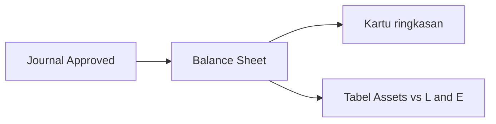

# Panduan Pengguna — Balance Sheet

**Siapa yang baca:** Finance / Controller  
**Menu:** Finance Accounting → Balance Sheet  
**Route:** `/accounting/balance-sheet`

---

## 1. Apa Itu & Kenapa Penting

**Balance Sheet (neraca)** menampilkan posisi keuangan perusahaan **pada satu tanggal**: aset di kiri, utang & modal di kanan, plus kartu ringkasan di atas. Dipakai untuk cek apakah neraca “seimbang” dan melihat dampak laba/rugi berjalan ke modal.

---

## 2. Overview Flow & Proses Bisnis

**Versi teks:**

1. Transaksi menghasilkan journal.  
2. Setelah journal **Approved**, saldo masuk neraca ([Ending Balance](#sf-lingo:SF-BS-04)).  
3. Kamu pilih tanggal **[As at](#sf-lingo:SF-BS-01)** → **Apply**.  
4. Baca [kartu](#sf-lingo:SF-BS-02) + [dua tabel](#sf-lingo:SF-BS-03).

### Status

Menu ini **tidak punya status dokumen**. Yang penting: journal sumber **Approved**, dan (untuk sebagian angka Current Profit/Loss) fiscal period yang relevan masih terbuka.

---

## 3. Sebelum Mulai

- Chart of Account Assets / Liabilities / Equity sudah lengkap.  
- Journal sampai tanggal yang ingin dilihat sudah **Approved**.  
- Kamu punya akses menu Balance Sheet.

🎬 [Interactive demo akan ditambahkan di sini]

---

## 4. Setelah Selesai

- Tidak ada approve/export di menu ini — laporan hanya dibaca.  
- Untuk kinerja **periode** (bukan satu tanggal), buka **Profit & Loss**.  
- Kalau butuh unduh Excel, menu ini memang tidak menyediakan export.

---

## 5. Yang Perlu Diperhatikan

- Kalau kamu ubah tanggal tanpa **[Apply](#sf-lingo:SF-BS-01)**, angka belum berubah.  
- Kalau **As at** kosong lalu Apply, tidak terjadi apa-apa — isi tanggal dulu.  
- Kalau Total Assets belum sama dengan Total Liabilities & Equity, sistem tetap menampilkan angka (tidak memblok).  
- Kalau [Current Profit/Loss](#sf-lingo:SF-BS-05) positif, Total Equity naik; kalau negatif, Equity turun.  
- Transaksi **pada hari As at** sering belum masuk saldo akun biasa, tapi bisa ikut angka Current Profit/Loss — beda kecil di tanggal cut wajar untuk dicek.  
- **Contoh:** As at 31 Mar, Current P/L +2 jt → Total Equity di kartu naik 2 jt dibanding modal COA saja.  
- **Tidak ada tombol Export** — by design.

---

## 6. Langkah-Langkah

1. Buka **Balance Sheet** (default: hari ini).  
2. Pilih tanggal **[As at](#sf-lingo:SF-BS-01)**.  
3. Klik **Apply**.  
4. Baca [kartu](#sf-lingo:SF-BS-02): Total Assets, Total Liabilities & Equity, Current Profit/Loss.  
5. Bandingkan [tabel **Assets** vs **Liabilities and Equity**](#sf-lingo:SF-BS-03).

🎬 [Interactive demo akan ditambahkan di sini]

---

## 7. Tips & Hal yang Sering Bikin Bingung

- **Ini bukan Profit & Loss** — P&L = rentang tanggal; BS = satu tanggal.  
- **Tidak ada export** — jangan cari tombol unduh di menu ini.  
- **Fiscal Period** bisa membuat [Current P/L](#sf-lingo:SF-BS-05) di baris parent Equity jadi 0 meski kartu masih punya nilai — cek period Open untuk tanggal As at.  
- Idealnya Assets = Liabilities + Equity; kalau belum balance, telusuri journal Approved & mapping Current P/L dulu.

---

## 8. Referensi

| Sumber | Untuk apa |
|--------|-----------|
| [Knowledge Base](./knowledge-base.md) | Troubleshooting |
| [Feature Map](./feature-map.md) | Indeks Lingo / sub-feature |
| [Requirement](./requirement.md) | Aturan & Gap |
| [Technical](./technical.md) | Developer |
| [Profit & Loss](../accounting-profit-loss/user-guide.md) | Laporan kinerja periode |
| [Journal](../journal/) | Sumber angka |
| [Fiscal Period](../accounting-fiscal-period/user-guide.md) | Period Open / close |
