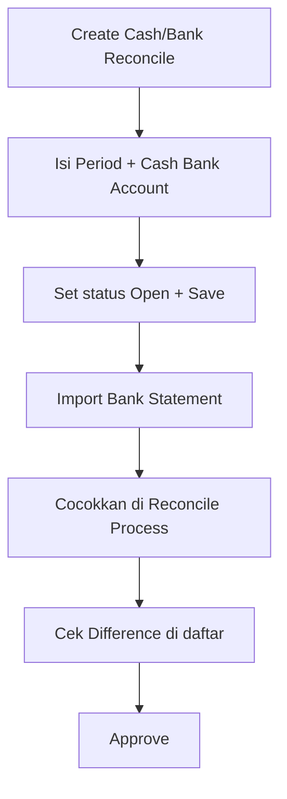

# Cash & Bank Reconcile — Knowledge Base

**Audience:** Finance / Accounting  
**Menu:** Accounting → Cash/Bank Reconcile  
**Route:** `/accounting/cash-bank-reconcile`  
**Kode transaksi:** `BR-…`

---

## 1. Apa itu Cash & Bank Reconcile?

Menu untuk **mencocokkan** mutasi di buku besar (journal kas/bank yang sudah disetujui) dengan **mutasi dari bank** (file statement). Tujuannya memastikan angka internal sama dengan angka bank.

Proses ini **tidak membuat jurnal baru**. Setelah disetujui (Approved), dokumen terkunci dan tidak bisa diubah lagi. Idealnya periode akun tersebut ikut terkunci agar tidak ada transaksi baru di tanggal yang sama — fitur kunci periode masih dalam perbaikan; tetap berhati-hati sebelum Approve.

---

## 2. Kapan dipakai?

| ✅ Pakai jika | ❌ Jangan jika |
|---------------|----------------|
| Ada bank statement siap di-import | Belum punya journal kas/bank Approved di periode itu |
| Ingin menandai baris sudah dicocokkan | Mau mengoreksi jurnal lewat menu ini (edit di Journal) |
| Siap mengunci hasil rekonsiliasi | Masih ragu isi matching (setelah Approve sulit diperbaiki) |

---

## 3. Alur kerja standar

**Keterangan langkah:**

- **Basic Information:** pilih **Period** (rentang tanggal) dan **Cash Bank Account**. Period tidak boleh tumpang tindih dengan dokumen reconcile lain untuk akun yang sama.
- **Open:** set status Open agar matching/import berjalan penuh.
- **Import:** unduh template, isi kolom tanggal + Received **atau** Spent (jangan keduanya), lalu upload. Tanggal harus dalam Period.
- **Matching:** di tab Reconcile Process, sistem menyarankan pasangan. Klik Match jika nominal sudah pas; atau buka “See other matching…” untuk pilih beberapa journal sekaligus.
- **Approve:** pastikan Difference sudah masuk akal. Setelah Approved, tidak bisa unmatch/edit.

---

## 4. Membaca daftar (datalist)

| Kolom | Arti |
|-------|------|
| **Trx Code \| Date** | Nomor `BR-` dokumen |
| **Cash/Bank** | Nama akun + nomor rekening |
| **Period** | Rentang tanggal yang direkonsiliasi |
| **Statement Balance** | Total dari file bank |
| **Internal Balance** | Total journal yang sudah dicocokkan |
| **Difference** | Statement dikurangi Internal — ideal mendekati 0 sebelum Approve |
| **Trx Status** | Draft / Open / Approved / Rejected |

Ada Create, pencarian, filter, tampilkan data terhapus, atur kolom, dan export (dengan/tanpa detail).

---

## 5. Form — tiga area utama

### Internal Transaction

Daftar journal kas/bank yang sudah Approved dalam Period. Status **Sudah dicocokkan** / **Belum dicocokkan**.

### Bank Statement

Hanya dari import. Setelah cocok, kolom kode journal terisi otomatis.

**Template import (penting):**

| Kolom | Isi |
|-------|-----|
| TransactionDate | Wajib, format `DD/MM/YYYY` |
| Received | Isi jika uang masuk; kosongkan jika Spent |
| Spent | Isi jika uang keluar; kosongkan jika Received |
| Description | Opsional |

Satu baris salah bisa membuat **seluruh import batal** — perbaiki file lalu upload ulang.

### Reconcile Process

Bank di kiri, journal di kanan, tombol Match di tengah. Sistem bisa menampilkan saran nominal mirip (toleransi sekitar 5%). Saat Match sungguhan, **total harus sama persis** — tidak boleh selisih.

Jika banyak saran: **See N other matching transactions**. Jika tidak ada saran: cari manual atau **Create** journal baru dari modal.

---

## 6. Match, Unmatch, Approve

| Aksi | Kapan | Catatan |
|------|-------|---------|
| **Match** | Open / Draft (bisa update) | Nominal harus pas; satu baris bank bisa digabung beberapa journal |
| **Unmatch** | Sebelum Approved | Kedua sisi kembali belum dicocokkan |
| **Approve** | Status Open + sudah ada data statement | Dokumen terkunci; tidak buat jurnal |
| **Reject** | Dari Open | Bisa dikembalikan ke Draft/Open untuk diperbaiki |

Pesan umum jika Match gagal: bank statement **lebih tinggi/lebih rendah** dari total journal — sesuaikan pilihan sampai nominal sama.

---

## 7. Troubleshooting

| Gejala | Penyebab | Solusi |
|--------|----------|--------|
| Match gagal terus | Total journal tidak sama persis dengan bank | Tambah/kurangi baris journal sampai nominal pas |
| Tidak ada saran Match | Nominal/tanggal jauh dari journal | Pakai “See Other” / cari manual, atau buat journal baru |
| Import gagal | Format tanggal, Received+Spent sekaligus, atau tanggal di luar Period | Ikuti template; satu kolom amount saja |
| Period ditolak saat Save | Bentrok dengan dokumen reconcile lain di akun sama | Ubah Period atau akun |
| Sudah Approve, ada mutasi bank tertinggal | Tidak ada Void | Hubungi admin/Dev; cegah dengan cek Difference dulu |
| Acc Number tampil `-` | Nomor rekening belum di master | Lengkapi Master Cash/Bank |

---

## 8. FAQ

**Q: Kenapa suggestion “hampir sama” tapi Match ditolak?**  
A: Saran boleh longgar; Match final harus sama persis.

**Q: Bisa unmatch setelah salah pilih?**  
A: Bisa sebelum Approved.

**Q: Kenapa Approve tidak buat jurnal?**  
A: Ini hanya pencocokan data, bukan transaksi baru.

**Q: Rejected berarti dokumen mati?**  
A: Tidak — biasanya masih bisa diubah ke Draft/Open lalu diperbaiki.

---

## Related Documents

| Doc | Path |
|-----|------|
| Requirement | [requirement.md](./requirement.md) |
| Technical | [technical.md](./technical.md) |
