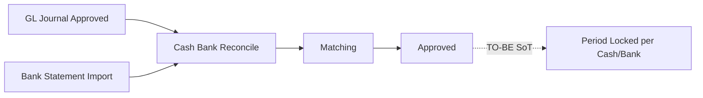
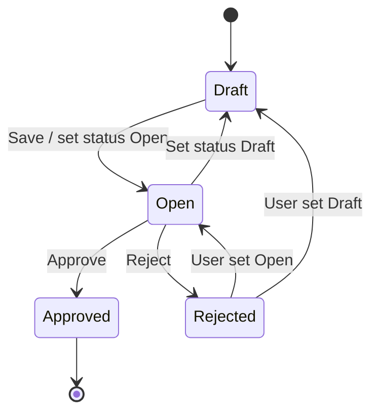
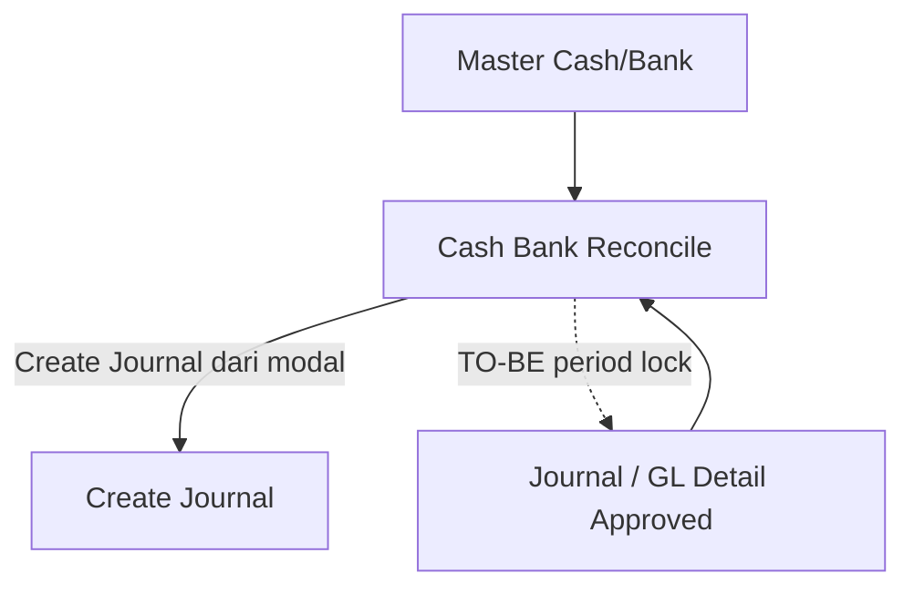

# Cash & Bank Reconcile — Requirement Documentation

**Modul:** Finance & Accounting  
**Prefix gap:** `CBR-`  
**Audience:** PM, QA, Finance  
**UI route:** `/accounting/cash-bank-reconcile`  
**Prefix kode:** `BR-`  
**SoT:** `cash_bank_reconcile_requirement.md` v1.1 (16 Jul 2026)

---

## 0. Metadata & Changelog

| Version | Date | Author | Changes |
|---------|------|--------|---------|
| 1.0 | 2026-06-19 | QA - Yemima | Placeholder pending |
| 1.2 | 2026-07-17 | QA - Yemima | Rewrite dari SoT v1.1 + AS-IS codebase: matching, import, approve; gap CBR-01..12; matrix implementasi |

---

## 1. Ringkasan Eksekutif

Cash & Bank Reconcile mencocokkan transaksi internal GL (journal detail akun kas/bank) dengan bank statement import, agar saldo buku sama dengan saldo bank. Audience: Finance/Accounting. Setelah Approved, SoT mensyaratkan **period lock** tanpa penerbitan jurnal — **period lock belum terimplementasi** (GAP-CBR-08).

| Kebutuhan bisnis | Jawaban CBR |
|------------------|------------|
| Cocokkan bank vs GL | Match exact amount (suggestion boleh ±5%) |
| Jejak rekonsiliasi | Status Reconciled / Not Reconciled di kedua sisi |
| Kunci period setelah yakin | SoT: period lock — **AS-IS: belum ada** |
| Tanpa jurnal tambahan | Approve **tidak** create journal — AS-IS sesuai |

---

## 2. Prasyarat

| Prasyarat | Sumber | Catatan |
|-----------|--------|---------|
| Master Cash/Bank aktif | Company Detail Bank | Opsi Cash Bank Account |
| Journal Approved dengan COA cash/bank | GL / Journal | Eligible: dalam Period, Not Reconciled |
| File bank statement | Import template | Kolom: TransactionDate, Received, Spent, Description |

---

## 3. Siklus Status

| Status | Editable? | Tombol / aksi AS-IS | Catatan |
|--------|-----------|---------------------|---------|
| Draft | Ya | Save, Import/Match jika `can_update` | Create default Draft |
| Open | Ya | Save, Import, Match, Unmatch, Approve, Reject | Matching aktif |
| Approved | Tidak | View / Show | Final; unmatch tidak tersedia |
| Rejected | Ya (AS-IS) | Bisa set Draft/Open lagi | GAP-CBR-01 clarified AS-IS: tidak permanen; radio UI bisa remap tampilan ke Draft |

**Approve:** single-level (`approval => 1`). **Tidak** ada early warning period-lock (GAP-CBR-12). Syarat: ada minimal 1 baris bank statement import. Cek “semua harus Reconciled” **di-comment** → partial reconcile boleh di-Approve (GAP-CBR-09).

---

## 4. Datalist

| Kolom | Visible default | Sumber | Keterangan |
|-------|-----------------|--------|------------|
| ID | Tidak | Internal | — |
| Trx Code \| Trx Date | Ya | `BR-` auto / manual | — |
| Cash/Bank Name \| Acc Number | Ya | Master bank | Acc kosong → `-` |
| Period | Ya | period_start–end | `DD-MM-YYYY - DD-MM-YYYY` |
| Statement Balance | Ya | Σ import (debit − credit) | — |
| Internal Balance | Ya | Σ detail **matched** (debit − credit) | — |
| Difference | Ya | Statement − Internal | — |
| Description | Ya | Header | max 150 |
| Trx Status | Ya | Status | — |
| Created by \| Created at | Ya | Audit / default columns | — |
| Action | Ya | — | Edit/Show/Delete sesuai status |

**Fitur:** Global Search, Advanced Filter, Create, Show Deleted, Column Show/Hide, Export with/without details, bulk delete/approve.

---

## 5. Form & Field

### 5.1 Basic Information

| Field | Wajib? | Validasi AS-IS | Catatan |
|-------|--------|----------------|---------|
| Transaction Code | Tidak (auto) | Unique per company | Prefix `BR-`; boleh manual |
| Period | Ya | start ≤ end; **tidak overlap** period CBR lain pada bank yang sama | Error: `The period is overlapping with another reconciliation.` Tidak bisa diubah setelah import |
| Cash Bank Account | Ya | Master aktif | Tidak bisa diubah setelah ada baris matched |
| Description | Tidak | max 150 | — |

### 5.2 Internal Transaction (GL)

Journal detail Approved, COA = cash/bank terpilih, tanggal dalam Period, status Reconciled/Not Reconciled.

| Kolom | Keterangan |
|-------|------------|
| GL Trx Code \| Date | Journal |
| Description | Detail |
| Debit / Credit | Posisi akun cash/bank |
| Status | Reconciled / Not Reconciled |

Sort default: tanggal journal ASC. Export: active page (bukan export-all list ini).

### 5.3 Bank Statement (import only)

| Kolom | Keterangan |
|-------|------------|
| Date / Description | Dari file |
| Debit / Credit | Received → Debit; Spent → Credit |
| GL Trx Code \| Date | Terisi setelah match |
| Status | Reconciled / Not Reconciled |

**Template** `Template-Import-Detail-Reconciliation` — kolom: TransactionDate, Received, Spent, Description (tanpa Type). Nature = kolom mana yang terisi.

| Aturan import AS-IS | Behavior |
|---------------------|----------|
| Date wajib `DD/MM/YYYY` | Reject baris + aggregate fail |
| Exactly one of Received/Spent | Reject jika keduanya kosong/terisi |
| Numeric, non-negative | Reject |
| Tanggal dalam Period | Reject di luar period |
| Satu baris gagal | **All-or-nothing** — tidak insert; cek import log (GAP-CBR-07 resolved) |

FE `public/files` saat ini hanya `.csv`; download UI mengarah `.xlsx` (GAP-CBR-11).

### 5.4 Reconcile Process

Panel Bank Statement (kiri) + Internal GL (kanan) + Match. AS-IS menampilkan Total Bank / Total Internal. **Difference strip header belum ada** (GAP-CBR-12).

---

## 6. How It Works

### 6.1 Suggestion matching (AS-IS — 6 prioritas)

Threshold **hardcoded** `abs(amount) * 0.05` (GAP-CBR-04).

| # | Kondisi | Catatan vs SoT |
|---|---------|----------------|
| 1 | Tanggal sama + amount exact + sisi sama | SoT #1 |
| 2 | Amount exact + sisi sama (tanggal beda) | SoT #2 |
| 3 | Tanggal sama + amount exact + **sisi berlawanan** | Extra vs SoT; flag tip |
| 4 | Tanggal sama + ±5% sisi sama | SoT #3 |
| 5 | Tanggal sama + ±5% sisi berlawanan | Extra |
| 6 | ±5% sisi sama, tanggal beda | SoT #4 |

Multi-kandidat: `"See {n} other matching transactions."` → modal. Tanpa kandidat: `"No matching transaction found."` + link **See Other……** (SoT: “Find or Create New” — GAP copy).

Modal: filter period/amount, multi-select bulk match, tombol **Create** → `/accounting/journal/create`.

### 6.2 Validasi Match (final)

SoT: cukup total GL = nominal bank exact.

| Mode | AS-IS rules |
|------|-------------|
| Single Match | (1) tanggal dalam period (2) **tanggal bank = tanggal GL** (3) sisi debit/credit sama (4) amount exact |
| Bulk Match | Hanya **sum** debit/credit exact — tanpa cek tanggal/sisi per baris |

Error amount:  
`Reconciliation cannot proceed. Bank statement amount {bank} is {higher|lower} than the GL amount {gl}. Fix the difference to reconcile.`

Setelah match: baris hilang dari tab process; status Reconciled; GL code terisi di bank statement.

### 6.3 Unmatch

Hanya Draft/Open. Unmatch satu sisi → sisi lain kembali Not Reconciled. Approved: aksi tidak tersedia.

### 6.4 Approve & period lock

| Aspek | SoT | AS-IS |
|-------|-----|-------|
| Jurnal pada approve | Tidak | Tidak (sesuai) |
| Period lock COA+tanggal | Wajib | **Tidak ada** — journal/transaksi lain masih bisa (GAP-CBR-08) |
| Early warning lock | Wajib | ApprovalModal generic saja (GAP-CBR-12) |
| Partial reconcile approve | `[VERIFY]` | Diizinkan (cek full match di-comment) (GAP-CBR-09) |
| Overlap period antar CBR | Ya | Ya — hanya antar dokumen CBR, bukan lock GL |

---

## 7. Validasi

| # | Kondisi | Behavior AS-IS | Message / gap |
|---|---------|----------------|---------------|
| 1 | Period overlap bank sama | Save ditolak | `The period is overlapping with another reconciliation.` |
| 2 | Code duplicate | Save ditolak | Unique validation |
| 3 | Match amount tidak exact | Ditolak | Lihat §6.2 |
| 4 | Unmatch saat Approved | Tombol tidak ada | — |
| 5 | Approve | Modal generic | Period-lock warning: GAP-CBR-12 |
| 6–10 | Import date/amount | All-or-nothing | Copy AS-IS beda dari draf SoT §7 (GAP-CBR-06) — contoh: `Row N: Both Received and Spent are empty...` |
| 11 | Partial import | Tidak — seluruh import batal | GAP-CBR-07 resolved |
| 12 | Approve tanpa import | Ditolak | `This reconsiliation doesn't have any detail data.` |
| 13 | Single match tanggal beda | Ditolak | `The Bank Statement date must match the Internal Statement transaction date.` (lebih ketat dari SoT) |

---

## 8. Relasi Menu Lain

| Menu | Peran |
|------|-------|
| Master Cash/Bank | Opsi akun |
| Journal / GL Reports | Sumber Internal Transaction; flag Reconciled |
| Create Journal | Redirect dari modal matching |

---

## 9. Gap Registry

| ID | Deskripsi | Dampak | Status |
|----|-----------|--------|--------|
| GAP-CBR-01 | Alur Rejected SoT tidak jelas | AS-IS: Rejected masih editable, bisa kembali Draft/Open | Clarified AS-IS |
| GAP-CBR-02 | Format template import | Final: TransactionDate/Received/Spent/Description | Resolved |
| GAP-CBR-03 | Tidak ada Void/recovery setelah Approved jika ada GL tambahan | Risiko operasional; diperparah karena period lock belum ada | Open |
| GAP-CBR-04 | Threshold 5% config | Hardcoded di controller | Open (AS-IS known) |
| GAP-CBR-05 | Kolom Balance di tab GL | Ditunda / out of scope meeting | Open / deferred |
| GAP-CBR-06 | Copy error import SoT vs kode | String di kode berbeda dari draf SoT §7 | Open |
| GAP-CBR-07 | All-or-nothing vs partial import | AS-IS all-or-nothing | Resolved |
| GAP-CBR-08 | **Period lock setelah Approve belum diimplementasi** | Inti SoT §6.6 tidak jalan | Open |
| GAP-CBR-09 | Approve mengizinkan partial (Not Reconciled tersisa) | Difference bisa non-zero saat Approved | Open |
| GAP-CBR-10 | Single Match wajib tanggal sama; Bulk tidak; SoT hanya exact amount | UX/aturan tidak simetris | Open |
| GAP-CBR-11 | Template download `.xlsx` vs file repo `.csv` | Risiko 404 / mismatch template | Open |
| GAP-CBR-12 | Tidak ada Difference header di Reconcile Process + tidak ada early warning period lock | UX kurang dari SoT | Open |

---

## 10. FAQ

**Q: Sudah Approve tapi masih ada transaksi bank yang belum masuk?**  
A: Tidak ada Void. Saat ini period lock juga belum mengunci GL lain (GAP-CBR-08) — tetap pastikan matching lengkap sebelum Approve (GAP-CBR-03, GAP-CBR-09).

**Q: Suggestion pakai 5% tapi Match gagal?**  
A: Toleransi hanya untuk suggestion. Match final wajib nominal exact (dan single match: tanggal + sisi sama).

**Q: Bisa unmatch?**  
A: Ya selama Draft/Open. Setelah Approved, tidak bisa.

**Q: Approve menerbitkan jurnal?**  
A: Tidak. Hanya mengubah status rekonsiliasi (dan seharusnya mengunci period — belum AS-IS).

---

## 11. Implementation Matrix (SoT vs Code)

| Item | Status |
|------|--------|
| CRUD + status Draft/Open/Approved/Rejected | Implemented |
| Datalist balances + Difference | Implemented |
| Period overlap antar CBR | Implemented |
| Import Received/Spent template | Implemented (all-or-nothing) |
| Suggestion ±5% + multi-kandidat modal | Implemented (+ opposite-side extra) |
| Exact match + error higher/lower | Implemented |
| Unmatch Draft/Open | Implemented |
| Create Journal dari modal | Implemented |
| Approve tanpa jurnal | Implemented |
| Period lock setelah Approve | **Not implemented** |
| Early warning period lock | **Not implemented** |
| Wajib full reconcile sebelum Approve | **Not implemented** (commented) |
| Threshold configurable | **Not implemented** |
| Difference strip di Reconcile Process | **Not implemented** |
| Copy “Find or Create New” | **Partial** (See Other……) |
