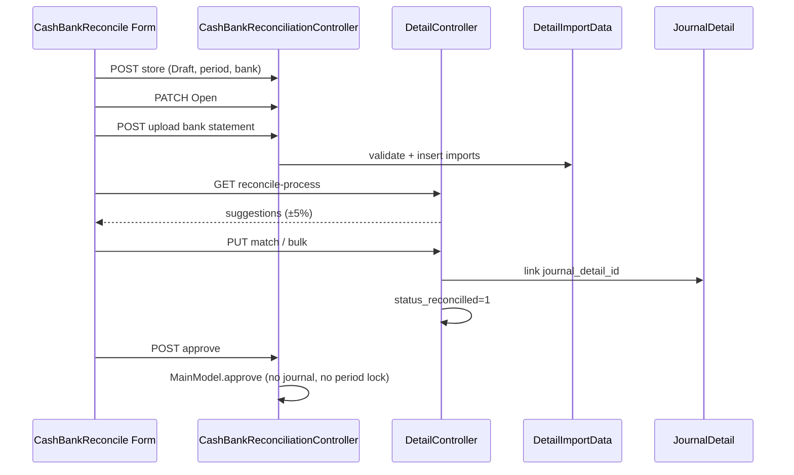

# Cash & Bank Reconcile — Technical Documentation

**API prefix:** `accounting/cash-bank-reconcile`  
**Module:** `Modules/Accounting`  
**Behavior:** [requirement.md](./requirement.md) v1.2

---

## 1. File Map

### Backend

| Layer | Path |
|-------|------|
| Routes | `Modules/Accounting/Routes/api.php` (prefix `cash-bank-reconcile`) |
| Controller header | `Modules/Accounting/Http/Controllers/CashBankReconciliationController.php` |
| Controller detail/match | `Modules/Accounting/Http/Controllers/CashBankReconciliationDetailController.php` |
| GL list reuse | `GeneralLedgerController::index(..., isCashBankReconciliation: true)` |
| Entities | `CashBankReconciliation`, `CashBankReconciliationDetail`, `CashBankReconciliationDetailImport`, `CashBankReconciliationApproval`, `CashBankReconciliationApprovalEligibility`, import logs, export file/temp |
| Import | `Modules/Accounting/Import/CashBankReconciliationDetailImportData.php` |
| Exports | `ReconcilBankStatementExport`, `ReconcilGeneralLedgerExport`, `CashBankReconciliationExportAll` |
| Job | `Jobs/CashBankReconciliationExportJob.php` |
| Policy | `Policies/CashBankReconciliationPolicy.php` |
| Menu | `AccountingMenuSeeder` — `approval => 1`, class `CashBankReconciliation` |

**Tidak ada** dedicated Service class — logic di controller.

### Frontend

| Layer | Path |
|-------|------|
| Routes | `olshoperp-frontend/src/router/index.ts` → `/accounting/cash-bank-reconcile` |
| List | `src/pages/Accounting/CashBankReconcile/DataList.vue` |
| Form shell | `Form.vue` |
| Sections | `BasicInformation.vue`, `GLTransaction.vue`, `BankStatement.vue`, `ReconcilleProcess.vue` |
| Modal | `ModalFindAndMatch.vue` |
| Approval | shared `ApprovalModal` + `ApprovalEligibility.vue`, `DatalistLogApproval.vue` |
| Template file | `public/files/Template-Import-Detail-Reconciliation.csv` (UI often links `.xlsx` — GAP-CBR-11) |

---

## 2. API Routes (utama)

| Method | Path | Action |
|--------|------|--------|
| GET/POST | `accounting/cash-bank-reconcile` | Index / Store |
| GET/PATCH/DELETE | `…/{id}` | Show / Update / Destroy |
| GET | `…/select2/CashBankAccount` | Bank options |
| GET | `…/{id}/general-ledger` | Internal Transaction |
| GET | `…/{id}/general-ledger/export-excel` | Export GL page |
| GET | `…/{id}/general-ledger-bank-statement` | Bank statement rows |
| POST | `…/{id}/general-ledger-bank-statement/upload` | Import |
| GET | `…/general-ledger-bank-statement/export-excel` | Export bank |
| DELETE | `…/general-ledger-bank-statement/{journal_detail}` | Unmatch / delete import |
| GET | `…/{id}/reconcile-process` | Suggestion list |
| GET | `…/{id}/reconcile-process/{statement_id}` | Modal candidates |
| POST | `…/reconcile-process/{statement_id}/bulk_use` | Bulk match |
| PUT | `cash-bank-reconcile-detail/{id}` | Single Match |
| PUT | `…/{id}/bulk` | Bulk Match |
| POST | `…/{id}/approve` | Approve / Reject |
| GET | `…/export-file`, `export-progress`, `export-excel` | Datalist export |

---

## 3. Database — Key Tables

### `accounting_cash_bank_reconciliations`

| Column | Notes |
|--------|-------|
| `code`, `description` | Prefix BR via `generateCode` |
| `period_start`, `period_end` | DateTime range |
| `company_detail_bank_id` | FK Master Cash/Bank |
| `transaction_status` | draft / open / approved / rejected (+ void/closed hooks di UI generic) |

Approval tables via `generateApprovalTable`.

### `accounting_cash_bank_reconciliation_detail_imports`

Bank statement rows: `date`, `debit` (Received), `credit` (Spent), `description`, `status_reconcilled`, `balance`.

### `accounting_cash_bank_reconciliation_details`

Match pairs: FK import + `journal_detail_id`, amounts, `status_reconcilled`.

### GL bridge

`JournalDetail` flagged reconciled via presence / status sync on match-unmatch (`status_reconcilled` on import + detail).

---

## 4. Matching & Import Logic

### Suggestion (`reconcileProcessBinding`)

```php
$tolerance = abs($amount) * 0.05; // hardcoded
```

Priority 1–6: exact date+amount same side → exact amount → opposite side exact → ±5% same/opposite date → ±5% any date. Flag tip: `Similar amount, different debit/credit positions.`

### Single Match (`update`)

1. Date in period  
2. Bank date == GL date (startOfDay)  
3. Same debit/credit side  
4. Exact debit/credit amounts  

### Bulk Match (`bulkUpdate`)

Sum(GL debit/credit) == bank debit/credit only.

### Import

Headers: `TransactionDate`, `Received`, `Spent`, `Description`. Any row error → ValidationException / no insert (**all-or-nothing**).

---

## 5. Flow utama



---

## 6. Invariants

| ID | Invariant |
|----|-----------|
| INV-CBR-01 | Match final: Σ GL amount = bank statement amount (exact) |
| INV-CBR-02 | Unmatch tidak tersedia jika header Approved |
| INV-CBR-03 | Period overlap ditolak untuk `company_detail_bank_id` yang sama |
| INV-CBR-04 | Approve **tidak** create journal entries |
| INV-CBR-05 | Import: tepat satu dari Received/Spent terisi per baris |
| INV-CBR-06 | (TO-BE SoT) Journal dengan COA+tanggal dalam period Approved tidak boleh tercipta — **belum enforced** (GAP-CBR-08) |

---

## 7. Validation Highlights

| Rule | Where |
|------|-------|
| Period overlap | Controller store/update |
| Unique code | Validation |
| Period locked after import | Cannot change period |
| Bank locked after match | Cannot change cash bank account |
| Exact match error | DetailController update/bulkUpdate |
| Date equality (single) | DetailController update |
| Approve needs imports | `reconciliation_detail_imports()->exists()` |
| Full reconcile before approve | **Commented out** (GAP-CBR-09) |
| `validate_fiscal_period($reconciliation->transaction_date)` | Model **tanpa** `transaction_date` — fragile / likely no-op |

---

## 8. Frontend Behaviors

| Behavior | Detail |
|----------|--------|
| Status radio | Draft/Open; Rejected sering di-remap tampilan ke Draft |
| Reconcile Process | Hanya jika `can_update`; totals bank/internal, tanpa Difference strip |
| Empty suggestion copy | `No matching transaction found.` + See Other…… |
| Modal Create | Navigate `/accounting/journal/create` |
| Approval | Shared ApprovalModal — no period-lock warning copy |
| Export datalist | With/without details via export jobs |

---

## 9. Failure Modes & Transaction Boundary

| Failure | Boundary | Notes |
|---------|----------|-------|
| Import row invalid | All-or-nothing | No partial insert; check import log |
| Match mid-failure | DB transaction on create detail | Rollback pair |
| Concurrent match same statement | `[VERIFY]` locking tipis — race possible | GAP operational |
| Approve dengan Not Reconciled tersisa | Diizinkan | GAP-CBR-09 |
| Approve “period lock” | Tidak ada | GAP-CBR-08 — journal lain tetap bisa |
| Import in progress cache | Approve blocked | `Updating process is in progress…` |

---

## 10. Data Lifecycle

| Artefak | Written | Read | Cleared |
|---------|---------|------|---------|
| Detail import rows | Import upload | Bank Statement + Reconcile Process | Delete/unmatch |
| Detail match rows | Match/bulk | Internal balance, GL status | Unmatch soft-delete |
| `status_reconcilled` | Match=1 / Unmatch=0 | GL + Bank columns | Unmatch |
| Approval log | Approve/Reject | ApprovalInfo | — |
| Period lock external | — | — | **Not implemented** |

---

## 11. Tests & QA Notes

- Overlap period same bank → error message exact.
- Import: empty both amounts, both filled, bad date, outside period → all-or-nothing.
- Suggestion: exact date, then ±5%, opposite side tip.
- Single match: reject different dates; bulk: allow different dates if sum exact (document GAP-CBR-10).
- Approve partial + verify no journal + verify journal still creatable in period (GAP-CBR-08).
- Rejected → Draft/Open editable.

---

## 12. Known Issues

| Gap | Technical note |
|-----|----------------|
| [GAP-CBR-08](./requirement.md) | No query/guard in JournalController (or others) against approved CBR periods |
| [GAP-CBR-09](./requirement.md) | Full-reconcile loop in `approve()` commented out |
| [GAP-CBR-04](./requirement.md) | `$tolerance = abs($amount) * 0.05` hardcoded |
| [GAP-CBR-10](./requirement.md) | Single vs bulk validation asymmetry |
| [GAP-CBR-11](./requirement.md) | `.xlsx` URL vs `.csv` asset |
| [GAP-CBR-06](./requirement.md) | Import messages ≠ SoT draft strings |
| [GAP-CBR-12](./requirement.md) | FE missing Difference header + lock warning |
