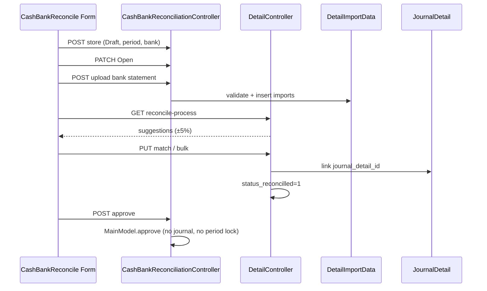

# Cash & Bank Reconcile — Technical Documentation

**API prefix:** `accounting/cash-bank-reconcile`  
**Module:** `Modules/Accounting`  
**Behavior:** [requirement.md](./requirement.md) v1.5  
**TO-BE matching:** ETM-15856 — `docs/qa-docs/_meta/sot/cbr-matching-slideover-brief.md`

---

## 1. File Map

### Backend

| Layer | Path |
|-------|------|
| Routes | `Modules/Accounting/Routes/api.php` (prefix `cash-bank-reconcile`) |
| Controller header | `Modules/Accounting/Http/Controllers/CashBankReconciliationController.php` |
| Controller detail/match | `Modules/Accounting/Http/Controllers/CashBankReconciliationDetailController.php` |
| GL list reuse | `GeneralLedgerController::index(..., isCashBankReconciliation: true)` |
| Entities | `CashBankReconciliation`, `CashBankReconciliationDetail`, `CashBankReconciliationDetailImport`, `CashBankReconciliationApproval`, `CashBankReconciliationApprovalEligibility`, import logs, export file/temp |
| Import | `Modules/Accounting/Import/CashBankReconciliationDetailImportData.php` |
| Exports | `ReconcilBankStatementExport`, `ReconcilGeneralLedgerExport`, `CashBankReconciliationExportAll` |
| Job | `Jobs/CashBankReconciliationExportJob.php` |
| Policy | `Policies/CashBankReconciliationPolicy.php` |
| Menu | `AccountingMenuSeeder` — `approval => 1`, class `CashBankReconciliation` |

**Tidak ada** dedicated Service class — logic di controller.

### Frontend

| Layer | Path | Catatan |
|-------|------|---------|
| Routes | `olshoperp-frontend/src/router/index.ts` → `/accounting/cash-bank-reconcile` | |
| List / Form | `DataList.vue`, `Form.vue` | |
| Sections | `BasicInformation.vue`, `GLTransaction.vue`, `BankStatement.vue`, `ReconcilleProcess.vue` | |
| Matching (AS-IS) | `ModalFindAndMatch.vue` | Dialog 3xl |
| Matching (TO-BE) | `SlideoverFindAndMatch.vue` (rename) + `QuickJournalForm.vue` + `QuickJournalConfirm.vue` + `AnchorPickerModal.vue` | ETM-15856 |
| Approval | shared `ApprovalModal` + `ApprovalEligibility.vue`, `DatalistLogApproval.vue` | |
| Template | `public/files/Template-Import-Detail-Reconciliation.csv` | UI often links `.xlsx` — GAP-CBR-11 |

---

## 2. API Routes (utama)

| Method | Path | Action |
|--------|------|--------|
| GET/POST | `accounting/cash-bank-reconcile` | Index / Store |
| GET/PATCH/DELETE | `…/{id}` | Show / Update / Destroy |
| GET | `…/select2/CashBankAccount` | Bank options |
| GET | `…/{id}/general-ledger` | Internal Transaction |
| GET | `…/{id}/general-ledger/export-excel` | Export GL page |
| GET | `…/{id}/general-ledger-bank-statement` | Bank statement rows |
| POST | `…/{id}/general-ledger-bank-statement/upload` | Import |
| GET | `…/general-ledger-bank-statement/export-excel` | Export bank |
| DELETE | `…/general-ledger-bank-statement/{journal_detail}` | Unmatch / delete import |
| GET | `…/{id}/reconcile-process` | Suggestion list |
| GET | `…/{id}/reconcile-process/{statement_id}` | Modal/slideover candidates (POV A) |
| POST | `…/reconcile-process/{statement_id}/bulk_use` | Bulk match |
| PUT | `cash-bank-reconcile-detail/{id}` | Single Match |
| PUT | `…/{id}/bulk` | Bulk Match |
| POST | `…/{id}/approve` | Approve / Reject |
| GET | `…/export-file`, `export-progress`, `export-excel` | Datalist export |

### TO-BE (ETM-15856 — belum ada)

| Method | Path | Action |
|--------|------|--------|
| GET | `…/{id}/reconcile-process-gl/{journalDetailId}?period=&amount=` | POV B: bank lines for 1 GL |
| GET | `…/{id}/bank-statements?status=not_reconciled&q=&amount=` | Anchor picker (bank) |
| GET | `…/{id}/gl-transactions?status=not_reconciled&q=&amount=` | Anchor picker (GL) |
| PUT | `cash-bank-reconcile-detail/{id}` | Extend: `journal_detail_id` + `id_statement[]` (POV B) |
| POST | `…/{id}/quick-journal` | Create journal ringkas; `approve` true/false; cash amount = Σ offsets di BE |

Response quick-journal wajib mengembalikan `journal_detail_id` (baris cash/bank) untuk **auto-select** di FE — Match tetap manual (D1).

---

## 3. Database — Key Tables

### `accounting_cash_bank_reconciliations`

| Column | Notes |
|--------|-------|
| `code`, `description` | Prefix BR via `generateCode` |
| `period_start`, `period_end` | DateTime range |
| `company_detail_bank_id` | FK Master Cash/Bank |
| `transaction_status` | draft / open / approved / rejected (+ void/closed hooks di UI generic) |

### `accounting_cash_bank_reconciliation_detail_imports`

Bank statement rows: `date`, `debit` (Received), `credit` (Spent), `description`, `status_reconcilled`, `balance`.

### `accounting_cash_bank_reconciliation_details`

Match pairs: FK import + `journal_detail_id`, amounts, `status_reconcilled`.

---

## 4. Matching & Import Logic

### Suggestion (`reconcileProcessBinding`)

```php
$tolerance = abs($amount) * 0.05; // hardcoded
```

Priority 1–6: exact date+amount same side → exact amount → opposite side exact → ±5% same/opposite date → ±5% any date.

### Single Match (`update`) — AS-IS

1. Date in period  
2. Bank date == GL date (startOfDay)  
3. Same debit/credit side  
4. Exact debit/credit amounts  

### Bulk Match (`bulkUpdate`) — AS-IS / multi

Sum(GL debit/credit) == bank debit/credit only. TO-BE: flag rows with date/side mismatch (requirement §6.2).

### Import

Headers: `TransactionDate`, `Received`, `Spent`, `Description`. Any row error → no insert (**all-or-nothing**). Bank lines **import-only** (D2).

### Quick journal (TO-BE)

- Exclude CBR cash/bank COA from offset select2  
- Cash/bank amount computed server-side from Σ `offsets` (D5)  
- Draft → not selectable until approved in Journal  
- Approve → return `journal_detail_id` + `selectable: true`

---

## 5. Flow utama


```mermaid
sequenceDiagram
    participant FE as CashBankReconcile Form
    participant C as CashBankReconciliationController
    participant D as DetailController
    participant Imp as DetailImportData
    participant JD as JournalDetail

    FE->>C: POST store (Draft, period, bank)
    FE->>C: PATCH Open
    FE->>C: POST upload bank statement
    C->>Imp: validate + insert imports
    FE->>D: GET reconcile-process
    D-->>FE: suggestions (±5%)
    FE->>D: PUT match / bulk
    D->>JD: link journal_detail_id
    D->>D: status_reconcilled=1
    FE->>C: POST approve
    C->>C: MainModel.approve (no journal, no period lock)
```

**TO-BE (slideover):** See Other → Slideover → optional `POST quick-journal` → auto-select → user klik Match → PUT match.

---

## 6. Invariants

| ID | Invariant |
|----|-----------|
| INV-CBR-01 | Match final: Σ amount = anchor amount (exact); no ±5% at save |
| INV-CBR-02 | Unmatch tidak tersedia jika header Approved |
| INV-CBR-03 | Period overlap ditolak untuk `company_detail_bank_id` yang sama |
| INV-CBR-04 | Approve **CBR** **tidak** create journal entries |
| INV-CBR-05 | Import: tepat satu dari Received/Spent terisi per baris |
| INV-CBR-06 | (TO-BE SoT) Journal dengan COA+tanggal dalam period Approved tidak boleh tercipta — **belum enforced** (GAP-CBR-08) |
| INV-CBR-07 | (TO-BE) Quick-journal approve → auto-select only; Match remains explicit user action (D1) |
| INV-CBR-08 | (TO-BE) Bank statement rows never created from matching UI (D2) |

---

## 7. Validation Highlights

| Rule | Where |
|------|-------|
| Period overlap | Controller store/update |
| Unique code | Validation |
| Period locked after import | Cannot change period |
| Bank locked after match | Cannot change cash bank account |
| Exact match error | DetailController update/bulkUpdate |
| Date equality (single) | DetailController update |
| Approve needs imports | `reconciliation_detail_imports()->exists()` |
| Full reconcile before approve | **Commented out** (GAP-CBR-09) |
| Quick journal date / balance / exclude COA | TO-BE `quick-journal` endpoint |

---

## 8. Frontend Behaviors

| Behavior | Detail |
|----------|--------|
| Status radio | Draft/Open; Rejected sering di-remap tampilan ke Draft |
| Reconcile Process | Hanya jika `can_update`; totals bank/internal |
| Empty suggestion | `No matching transaction found.` + See Other…… |
| Matching AS-IS | `ModalFindAndMatch` Dialog; Create → `/accounting/journal/create` |
| Matching TO-BE | Slideover; POV switch; difference bar; Match disabled if ≠ 0; Create journal modal (no ✕); anchor picker notice clears selection |
| Quick journal fields | Date, currency locked, cash/bank desc, offsets — **no** store/attachment/trx ref/rate (D3) |
| Approval CBR | Shared ApprovalModal — no period-lock warning copy |

---

## 9. Failure Modes & Transaction Boundary

| Failure | Boundary | Notes |
|---------|----------|-------|
| Import row invalid | All-or-nothing | No partial insert; check import log |
| Match mid-failure | DB transaction on create detail | Rollback pair |
| Concurrent match same statement | `[VERIFY]` locking tipis | GAP operational |
| Approve dengan Not Reconciled tersisa | Diizinkan | GAP-CBR-09 |
| Approve “period lock” | Tidak ada | GAP-CBR-08 |
| Quick-journal amount ≠ Σ offsets | Reject | BE authoritative (D5) |
| Draft journal used in Match | Blocked | Must approve first |

---

## 10. Data Lifecycle

| Artefak | Written | Read | Cleared |
|---------|---------|------|---------|
| Detail import rows | Import upload | Bank Statement + Reconcile Process | Delete/unmatch |
| Detail match rows | Match/bulk | Internal balance, GL status | Unmatch soft-delete |
| `status_reconcilled` | Match=1 / Unmatch=0 | GL + Bank columns | Unmatch |
| Quick journal (TO-BE) | `POST quick-journal` | Journal + matching list if approved | — |
| Approval log | Approve/Reject CBR | ApprovalInfo | — |
| Period lock external | — | — | **Not implemented** |

---

## 11. Tests & QA Notes

- Overlap period same bank → error message exact.
- Import: empty both amounts, both filled, bad date, outside period → all-or-nothing.
- Suggestion: exact date, then ±5%, opposite side tip.
- Single match: reject different dates; bulk: allow different dates if sum exact (GAP-CBR-10).
- Approve partial + verify no CBR journal + journal still creatable in period (GAP-CBR-08).
- **ETM-15856:** POV A/B, difference bar, Match gate = 0, Change anchor clears selection, quick journal draft warning + approve confirm, auto-select without auto-Match, no bank create, no attachment fields. Matrix QA: brief §9.

---

## 12. Known Issues

| Gap | Technical note |
|-----|----------------|
| [GAP-CBR-08](./requirement.md) | No query/guard against approved CBR periods |
| [GAP-CBR-09](./requirement.md) | Full-reconcile loop in `approve()` commented out |
| [GAP-CBR-04](./requirement.md) | `$tolerance = abs($amount) * 0.05` hardcoded |
| [GAP-CBR-10](./requirement.md) | Single vs bulk validation asymmetry |
| [GAP-CBR-11](./requirement.md) | `.xlsx` URL vs `.csv` asset |
| [GAP-CBR-06](./requirement.md) | Import messages ≠ SoT draft strings |
| [GAP-CBR-12](./requirement.md) | Tab Difference header + lock warning; slideover Difference = ETM-15856 |
| [GAP-CBR-13](./requirement.md) | Matching Slideover + Quick Journal — **Planned** ETM-15856 |
