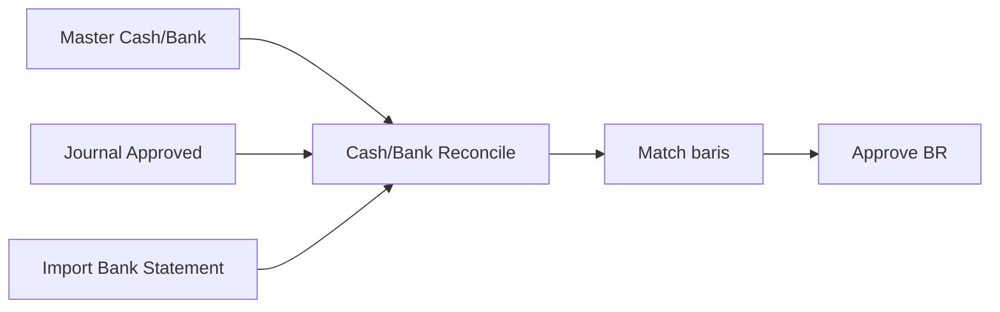
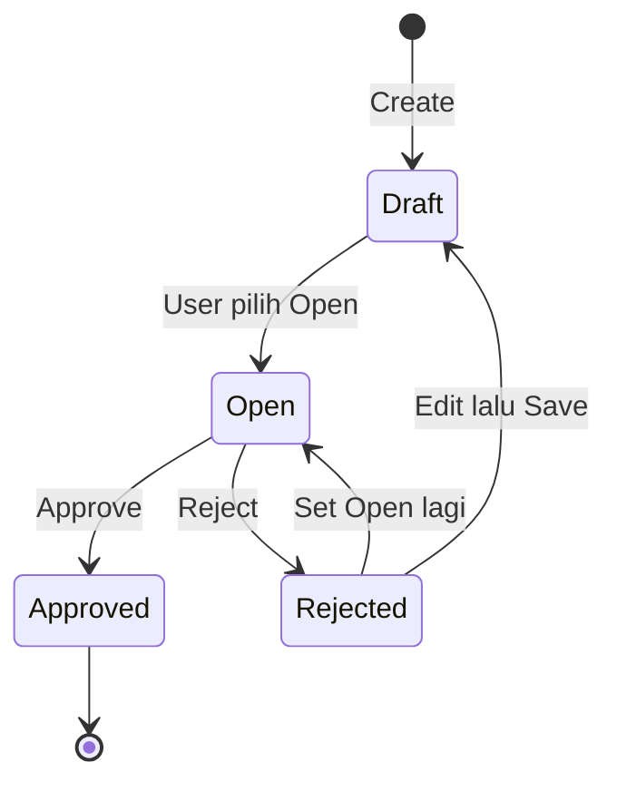

# Cash/Bank Reconcile — Panduan Pengguna

**Siapa yang baca panduan ini:** finance, accounting ops, support  
**Menu di sistem:** Accounting → Cash/Bank Reconcile  
**Kode transaksi:** dimulai dengan `BR-`

---

## 1. Apa Itu & Kenapa Penting

Cash/Bank Reconcile dipakai untuk **mencocokkan** mutasi di buku (journal kas/bank yang sudah disetujui) dengan **mutasi di statement bank** yang kamu import. Tujuannya: angka di sistem sama dengan angka bank.

Setelah dokumen reconcile di-**Approve**, hasil pencocokan terkunci. Idealnya periode akun ikut terkunci agar tidak ada transaksi baru di tanggal yang sama — kunci periode masih dalam perbaikan, jadi cek Difference dulu sebelum Approve.

---

## 2. Overview Flow & Proses Bisnis

### Rantai proses

**Versi teks (tanpa diagram):**

1. Pastikan **Master Cash/Bank** dan journal kas/bank di periode itu sudah **Approved**.
2. Buat dokumen **Cash/Bank Reconcile** (`BR-`), isi Period + akun kas/bank.
3. Set status **Open**, lalu **import** file bank statement.
4. Di tab **Reconcile Process**, cocokkan baris bank dengan journal (Match).
5. Kalau ada selisih yang belum ada journal-nya, buat journal (sekarang lewat Create di panel matching; arah perbaikan: journal ringkas di panel tanpa pindah halaman).
6. Setelah Difference masuk akal, **Approve** dokumen `BR-`.

🎬 [Interactive demo akan ditambahkan di sini]

### Siklus status transaksi

| Status | Artinya | Bisa diubah? |
|--------|---------|--------------|
| **Draft** | Baru / masih disusun | Ya (jika boleh update) |
| **Open** | Matching & import aktif | Ya |
| **Rejected** | Ditolak; bisa dikembalikan ke Draft/Open | Ya |
| **Approved** | Final; tidak unmatch/edit | Tidak |

---

## 3. Sebelum Mulai (Flow Sebelum)

Pastikan:

- Ada **Cash Bank Account** di master (nomor rekening lengkap lebih baik).
- Ada journal kas/bank **Approved** di rentang Period yang akan kamu rekonsiliasi.
- File bank statement siap diisi ke template (tanggal + Received **atau** Spent).
- Period yang dipilih **tidak bentrok** dengan dokumen reconcile lain untuk akun yang sama.

---

## 4. Setelah Selesai (Flow Sesudah)

Setelah **Approve**:

- Baris yang sudah Match tetap tercatat sebagai Reconciled.
- Dokumen `BR-` tidak bisa di-unmatch / diedit lagi.
- **Approve BR tidak membuat jurnal baru** — itu hanya mengunci hasil pencocokan.
- Langkah lanjut: pantau Difference di daftar; kalau ada mutasi bank yang terlewat setelah Approve, hubungi admin (belum ada Void).

🎬 [Interactive demo akan ditambahkan di sini]

---

## 5. Yang Perlu Diperhatikan

- Kalau Period bentrok dengan reconcile lain di akun sama, sistem **menolak Save**.
- Saat import: isi **Received atau Spent saja** (jangan kosong keduanya atau terisi keduanya); tanggal harus dalam Period; format tanggal mengikuti template. Satu baris salah bisa membuat **seluruh import batal**.
- Saran pasangan boleh “hampir sama” (sekitar 5%), tapi **Match sungguhan** wajib nominal **sama persis**.
- Match gagal karena bank lebih tinggi/lebih rendah dari total journal — sesuaikan pilihan sampai angka sama.
- Unmatch hanya sebelum dokumen **Approved**.
- Bank statement **hanya dari import** — tidak dibuat manual di panel matching.
- (Arah perbaikan UI) Setelah buat journal dari matching dan di-approve, baris journal bisa **terpilih otomatis**; tombol **Match** tetap kamu klik sendiri.

---

## 6. Langkah-Langkah (Step by Step)

1. Buka **Accounting → Cash/Bank Reconcile** → **Create**.
2. Isi **Period** dan **Cash Bank Account**, set status **Open**, **Save**.
3. Tab **Bank Statement** → unduh template → isi → **upload**.
4. Tab **Reconcile Process** → lihat saran Match; kalau cocok, klik **Match**.
5. Kalau banyak kandidat / belum ada saran: buka **See Other……** (panel matching).
6. Di panel matching:
   - Centang journal sampai total sama dengan bank (atau sebaliknya, setelah arah 2 sisi tersedia).
   - Lihat **Difference** — Match aktif hanya jika selisih **0**.
   - Kalau masih kurang: **Create journal** (isi offset untuk menutup selisih) → simpan draft atau Save & Approve journal → pastikan baris baru terpilih → klik **Match**.
7. Kembali ke daftar / form → cek **Difference** mendekati 0 → **Approve** dokumen `BR-`.

**Contoh angka:** bank Receive 3.000.000, journal terpilih 2.850.000 → selisih 150.000. Buat journal 150.000 → setelah journal approved & terpilih, selisih 0 → klik **Match**.

---

## 7. Tips & Hal yang Sering Bikin Bingung

- **Suggestion lolos tapi Match ditolak** → saran longgar; Match harus exact.
- **Tidak ada saran** → pakai See Other / filter period & amount, atau buat journal dulu.
- **Acc Number tampil `-`** → lengkapi nomor rekening di Master Cash/Bank.
- **Journal draft tidak muncul di matching** → approve dulu di menu Journal Transaction.
- **Sudah Approve, ada mutasi bank tertinggal** → tidak ada Void; cegah dengan cek Difference sebelum Approve.

---

## 8. Referensi

| Dokumen | Isi |
|---------|-----|
| [knowledge-base.md](./knowledge-base.md) | Cara pakai & troubleshooting operator |
| [requirement.md](./requirement.md) | Aturan bisnis & acceptance (termasuk TO-BE matching ETM-15856) |
| [technical.md](./technical.md) | API & file map (developer) |
| [feature-map.md](./feature-map.md) | Indeks fitur / Lingo |
