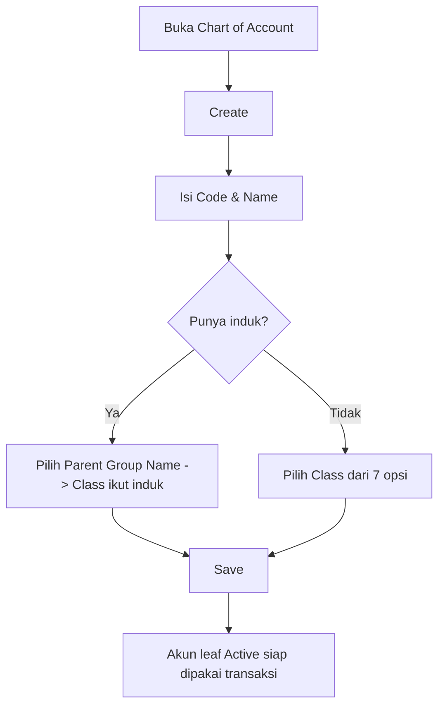

# Chart of Account (Master COA) — Knowledge Base

> **Audience:** tim **Finance / Accounting** & Support. **Route:** `/accounting/chart-of-account`

---

## 1. Apa itu Chart of Account?

**Chart of Account (COA)** — sering disebut **Master COA** — adalah daftar akun buku besar (general ledger) perusahaanmu. Hampir semua transaksi (Sales Invoice, Account Receive, Credit Note, Instant Settlement) dan jurnal manual **merujuk ke COA**. COA bersifat **per company**.

| Item | Nilai |
|------|-------|
| Menu | Finance & Accounting → **Chart of Account** |
| Kegunaan | Sumber akun Debit/Credit untuk jurnal & auto-journal |
| Sifat | Master data — tidak ada Draft/Approve, hanya Active/Inactive |

**Poin penting:** COA tersusun bertingkat (parent → child). Hanya akun **paling bawah (leaf)** yang boleh dipakai di transaksi; akun **induk (parent/group)** cuma untuk mengelompokkan.

---

## 2. Glosarium

| Istilah | Arti awam |
|---------|-----------|
| **Leaf COA** | Akun paling bawah — yang boleh dipakai langsung di transaksi |
| **Parent / Group COA** | Akun induk — hanya untuk mengelompokkan, tidak bisa dipakai transaksi |
| **View-only / Locked** | Akun sudah pernah dipakai, jadi sebagian datanya tidak bisa diubah lagi |
| **Cascade** | Perubahan otomatis ikut turun ke akun-akun anak di bawahnya |
| **Position (Activa/Passiva)** | Aturan arah saldo — sebagian akun bertambah saat di-debit, sebagian saat di-kredit |
| **COA Class** | Kelompok akun (Assets, Liabilities, Equity, dll.) |

---

## 3. Cara pakai

**Keterangan:**

- **Code** wajib & unik per company. Kalau Code lama sudah dihapus, Code itu boleh dipakai lagi.
- **Parent Group Name** opsional. Kalau diisi, **Class otomatis ikut induk** dan tidak bisa diubah.
- Kalau **tanpa induk**, kamu wajib pilih **Class** dari 7 opsi.
- Create COA **belum auto-save** — klik Create lalu Save manual.

---

## 4. Class & Position

7 COA Class beserta Position (arah saldo):

| Class | Position |
|-------|----------|
| Assets | Activa |
| Expense | Activa |
| Cost of Goods Sold | Activa |
| Liabilities | Passiva |
| Equity | Passiva |
| Revenue | Passiva |
| Other Revenue & Expenses | Passiva |

**Activa** = bertambah saat Debit. **Passiva** = bertambah saat Kredit.

---

## 5. Yang bisa / tidak bisa

### Bisa
- Buat akun baru (dengan/atau tanpa induk)
- Ubah Name & Description kapan saja
- Nonaktifkan (Inactive) akun; kalau induk di-nonaktifkan, seluruh anak ikut nonaktif
- Import banyak akun sekaligus (template Excel)
- Export data (With Details / Without Details / This Page Only)

### Tidak bisa (sistem menolak)
- Pakai Code yang sama dengan akun aktif lain
- Pilih induk yang statusnya Inactive
- Ubah **Class** akun yang sudah dipakai di transaksi/setting (termasuk lewat anaknya)
- Aktifkan anak sementara induknya masih Inactive
- Hapus akun yang masih punya anak, atau yang sudah dipakai di transaksi/setting
- Pakai akun **parent** langsung di Journal/transaksi (hanya leaf)

---

## 6. Import banyak akun

Template Excel **5 kolom** (header harus persis):

| Kolom | Header | Wajib |
|-------|--------|-------|
| A | `Code` | Ya |
| B | `Code Parent COA` | Tidak |
| C | `COA Name` | Ya |
| D | `Description` | Tidak |
| E | `COA Class ID` | Ya (angka) |

**COA Class ID (wajib angka, bukan nama):**

| Class | ID |
|-------|----|
| Assets | 1 |
| Liabilities | 2 |
| Equity | 3 |
| Revenue | 4 |
| Expense | 5 |
| Cost of Goods Sold | 6 |
| Other Revenue & Expenses | 7 |

**Aturan penting:**
- Import bersifat **semua-atau-tidak**: kalau ada 1 baris salah, seluruh file gagal (tidak ada yang masuk sebagian).
- Import hanya **membuat baru** (create-only), tidak bisa update akun yang sudah ada. Semua akun hasil import berstatus **Active**.
- Kalau memakai **Code Parent COA**, baris induk harus **berada di atas** baris anaknya (atau induk sudah Active di sistem).
- **Import History**: file bisa didownload maksimal **24 jam** sejak import.
- **View Error Logs** hanya menampilkan error dari import **paling terakhir**.

---

## 7. Troubleshooting

| Gejala | Penyebab | Solusi |
|--------|----------|--------|
| Code ditolak | Code masih dipakai akun aktif lain | Pakai Code lain, atau reuse Code milik akun yang sudah dihapus |
| Field Class terkunci | Parent Group Name sudah diisi | Normal — Class ikut induk |
| Tidak bisa pilih induk | Induk berstatus Inactive | Aktifkan dulu induknya |
| Tombol Delete hilang | Akun sudah dipakai relasi lain atau masih punya anak | Tidak bisa dihapus — ubah Name saja bila perlu |
| Tidak bisa ubah Class | Akun/anak-anaknya sudah dipakai di transaksi | Class tidak bisa diubah lagi |
| Tidak bisa aktifkan anak | Induknya masih Inactive | Aktifkan induk lebih dulu |
| Akun tidak muncul di Journal | Itu akun parent/group | Hanya leaf yang bisa dipakai |
| Import gagal total | 1+ baris salah (semua-atau-tidak) | Cek View Error Logs, perbaiki, import ulang |
| Tombol download import hilang | Sudah lewat 24 jam | File tidak lagi tersedia |

---

## 8. FAQ

**Q: Kenapa Code ditolak padahal rasanya belum ada?**
A: Kemungkinan masih dipakai akun aktif lain. Code milik akun yang sudah dihapus boleh dipakai ulang.

**Q: Kenapa Class terkunci?**
A: Karena Parent Group Name sudah diisi — Class child wajib sama dengan induk.

**Q: Kenapa Delete hilang?**
A: Akun sudah dipakai di transaksi/setting, atau masih punya anak. Sistem melindungi supaya data historis tidak rusak.

**Q: Kenapa import gagal total padahal cuma 1 baris salah?**
A: Import all-or-nothing — 1 error menggagalkan seluruh file.

**Q: Kenapa parent tidak muncul di Journal?**
A: Parent hanya untuk mengelompokkan; hanya leaf yang bisa dipakai transaksi.

---

## Related Documents

| Doc | Path |
|-----|------|
| Requirement | [requirement.md](./requirement.md) |
| Technical | [technical.md](./technical.md) |
| User Guide | [user-guide.md](./user-guide.md) |
| Purchase Invoice (konsumen COA) | [../accounting-supplier-invoice/](../accounting-supplier-invoice/) |
