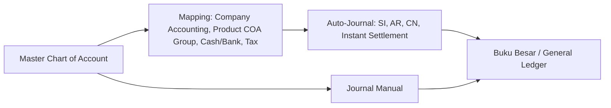
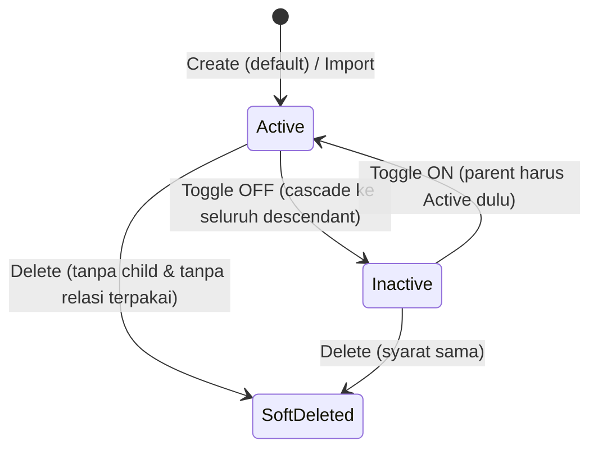
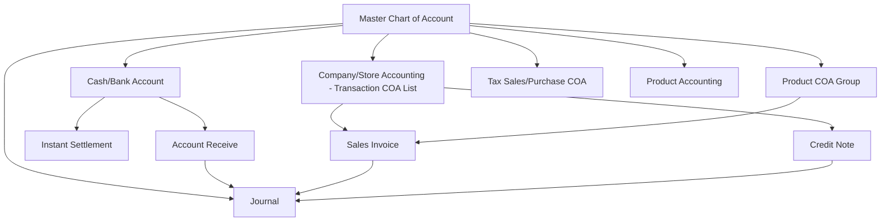

# Chart of Account (Master COA) — Requirement Documentation

**Modul:** Finance & Accounting (`Modules/Accounting`)
**UI route:** `/accounting/chart-of-account`
**API base:** `{VITE_API_URL}accounting/chart-of-account`
**Audience:** PM, QA, Finance/Accounting, Developer
**PM source:** Chart of Account (Master COA) Source of Truth v1.0 (30 Juli 2026)
**Aliases operasional:** Master COA · COA

> Requirement ini diverifikasi langsung terhadap codebase per 2026-07-30 (`ChartOfAccountController`, `ChartOfAccount`, `CoaImport`, `ChartOfAccountClassSeeder`, routes). Item yang belum sinkron antara requirement PM dan codebase ditandai di [§11 Gap Registry](#11-gap-registry).

---

## 0. Metadata & Changelog

| Version | Date | Author | Changes |
|---------|------|--------|---------|
| 1.0 | 2026-07-30 | QA - Yemima | Requirement awal dari SoT v1.0 + verifikasi codebase AS-IS: struktur tree parent-child, position rule, locked/view-only, import 5 kolom, export, cascade status/class, Gap Registry `GAP-COA-01..04` |

---

## 1. Ringkasan Eksekutif

**Chart of Account (COA)** — sering disebut **Master COA** — adalah master akun buku besar (general ledger) **per company** (`owned_by`) di modul Finance & Accounting. Setiap baris Debit/Credit di **Journal**, serta hampir seluruh **auto-journal** transaksi (Sales Invoice, Account Receive, Credit Note, Instant Settlement, dll.), harus merujuk ke **leaf COA yang Active**. Menu ini murni **master data** — tidak ada siklus Draft/Approve seperti dokumen transaksi; hanya kondisi **Active/Inactive** + soft delete.



Konsep inti: COA tersusun sebagai **tree parent-child** (disimpan terpisah di `CoaTree`). COA yang punya minimal satu child = **parent/group** (hanya untuk pengelompokan, tidak boleh dipakai transaksi); COA tanpa child = **leaf** (boleh dipakai transaksi). Class akun menentukan **Position** (Activa/Passiva) yang mengatur arah penjurnalan.

---

## 2. Penempatan Modul & Scope

| Aspek | Keputusan |
|-------|-----------|
| Modul | **Finance & Accounting** (`Modules/Accounting`) |
| Scope data | **Per company** (`owned_by`); `is_all_company = 0` (private per tenant) |
| Sifat | Master data — tanpa lifecycle dokumen (tidak ada Draft/Approve) |
| Permission | `ChartOfAccountPolicy` (viewAny/view/create/update/delete) |

---

## 3. Prasyarat

| Prasyarat | Sumber | Catatan |
|-----------|--------|---------|
| Master COA Class (7 opsi tetap) | Di-seed sistem (`ChartOfAccountClassSeeder`) | Wajib dipilih saat create COA **tanpa parent** |
| Company terdaftar | Master Company | COA bersifat per company (`owned_by`) |

**7 COA Class (nama & Position — persis dari seeder codebase):**

| ID | Class | Position | Code |
|----|-------|----------|------|
| 1 | Assets | Activa | AST |
| 2 | Liabilities | Passiva | LBL |
| 3 | Equity | Passiva | EQ |
| 4 | Revenue | Passiva | INC |
| 5 | Expense | Activa | EXP |
| 6 | Cost of Goods Sold | Activa | COGS |
| 7 | Other Revenue & Expenses | Passiva | ORE |

> **Catatan penamaan:** codebase memakai **"Cost of Goods Sold"** dan **"Other Revenue & Expenses"** (dengan `&`). SoT menulis "Cost Of Goods Sold" / "Other Revenue and Expenses" — dokumen ini mengikuti nama persis di codebase. ID 1–7 = urutan seed; template Import memakai **ID numerik** ini (lihat §7.4).

---

## 4. Siklus Status

Bukan siklus dokumen transaksi. Kondisi pada satu baris COA:



| Kondisi | Arti | Efek |
|---------|------|------|
| Active (`status=1`) | Bisa dipakai transaksi | Muncul di picker parent/child sesuai syarat |
| Inactive (`status=0`) | Tidak dipakai transaksi | Hilang dari picker; toggle Inactive pada parent **cascade** ke seluruh descendant (§7.6) |
| Soft-deleted | `deleted_at` terisi | Tidak dihitung di validasi Code unik; terlihat via Show Deleted Data |
| Parent / Group | Punya ≥1 child di tree | Tidak muncul di child picker transaksi; tak bisa dihapus selama masih punya child |
| Leaf | Tidak punya child | Boleh dipakai di Journal, Sales Invoice, Account Receive, Cash/Bank, dll. |
| View-only (locked) | Sudah punya relasi terpakai (§7.3) | Code, Parent, Class, Active terkunci; Name & Description masih editable; tombol Delete hilang |

---

## 5. Datalist

### 5.1 Kolom

| Kolom | Visible Default | Sumber | Keterangan |
|-------|-----------------|--------|------------|
| Code \| Name | Ya | Field COA (`code_name_formatted`) | Kode & nama akun |
| Parent Code \| Parent Name | Ya | Relasi tree (`coaTree.parent.coa`) | `-` jika tanpa parent |
| Class | Ya | Master COA Class | 7 class |
| Position | Ya | Diturunkan dari Class | Activa / Passiva |
| Active | Ya | Status | Yes / No |
| Created By \| Created At | Ya | Audit | — |
| Updated By \| Updated At | Ya | Audit | — |

### 5.2 Fitur

| Fitur | Detail (AS-IS) |
|-------|----------------|
| Global / column search | Filter kolom Code\|Name memakai **prefix match** (`LIKE 'keyword%'` via `likePrefix`), bukan contains. Filter parent/class/position via relasi (`whereHas`) |
| Advanced Filter (SearchBuilder) | `formattedQuery` mendukung kolom `code_name_formatted`, `parent_name_formatted` (termasuk IS NULL / IS NOT NULL), `chart_of_account_class_formatted`, `chart_of_account_class_position_formatted` |
| Show Deleted Data | Standar master — menampilkan data aktif + soft-deleted |
| Column Show/Hide | Standar master |
| Export | Batch export via `CoaExportJob` — lihat §7.5 |
| Import | Template 5 kolom + Import History + Import Log — lihat §7.4 |

### 5.3 Action Button

| Tombol | Kondisi Muncul |
|--------|----------------|
| Show / Edit | Selalu (field editable tergantung view-only §7.3) |
| Delete | Hanya jika COA **belum punya relasi terpakai** DAN **tidak punya child**. Jika tidak, tombol Delete hilang & Code terkunci |

---

## 6. Form & Field

Metode create COA **belum memakai auto-save** — user klik Create lalu Save manual.

| Field | Wajib? | Default | Sumber Opsi | Validasi (AS-IS) | Catatan |
|-------|--------|---------|-------------|------------------|---------|
| Code | Ya | — | Input manual | `required`, `max:50`, unique per `owned_by` (soft-deleted dikecualikan) | Terkunci bila view-only. **"Tidak boleh spasi"** = aturan FE; backend store belum memvalidasi spasi (GAP-COA-04) |
| Name | Ya | — | Input manual | `required`, `max:50` | Tetap editable walau view-only |
| Parent Group Name | Tidak | Kosong | `select2/parent` | Parent harus **Active**; jika tidak Active → "Parent not found" | Kalau diisi, Class ikut Class parent & terkunci. Definisi eligible parent → GAP-COA-01 |
| Class | Wajib jika Parent kosong | — | 7 opsi COA Class | `requiredIf(parent kosong)`; auto-disabled & ikut Class parent bila Parent diisi | Class child selalu = Class parent |
| Description | Tidak | Kosong | Input manual | — | Catatan bebas |
| Toggle Active | — | ON | Switch | — | Inactive → tidak dipakai transaksi; parent Inactive → cascade descendant (§7.6) |

---

## 7. How It Works

### 7.1 Struktur Parent–Child & Pewarisan Class

Hierarki parent-child disimpan di tabel tree terpisah (`CoaTree`, relasi `coaTree`), bukan atribut langsung pada baris COA. COA dengan ≥1 child = parent/group; tanpa child = leaf. **Hanya leaf** yang boleh dipilih di transaksi.

Saat user memilih **Parent Group Name**, Class COA otomatis mengikuti Class parent dan field Class dikunci — child tidak boleh punya Class berbeda dari parent-nya.

### 7.2 Position per Class (Position Rule)

```
Activa  : bertambah di Debit, berkurang di Kredit
Passiva : bertambah di Kredit, berkurang di Debit
```

| Class | Position |
|-------|----------|
| Assets · Expense · Cost of Goods Sold | Activa |
| Liabilities · Equity · Revenue · Other Revenue & Expenses | Passiva |

### 7.3 Locked State (View-Only) saat sudah punya relasi

COA menjadi **view-only** bila sudah dipakai di salah satu relasi berikut (`ChartOfAccount::relations()` + cek `show`):

- Product COA Group (`ProductCoaGroupDetail`)
- Product Accounting (`ProductAccounting`)
- Company/Store Accounting — Transaction COA List (`CompanyAccounting`)
- Purchase Tax / Sales Tax (`Tax.purchase_coa_id` / `sales_coa_id`)
- Journal Detail (`JournalDetail`)
- Cash/Bank Account (`CompanyDetailBank`)

Efek: **Code, Parent, Class, Active terkunci**; **Name & Description tetap editable**; tombol **Delete hilang**. Flag `is_view_only` dihitung real-time di `show` (bukan kolom tersimpan).

### 7.4 Import — Template & Proses

**Template — 5 kolom, header harus exact** (`checkFormat`):

| Kolom | Header (exact) | Wajib | Keterangan |
|-------|----------------|-------|------------|
| A | `Code` | Ya | Kode COA unik per company |
| B | `Code Parent COA` | Tidak | Kode parent — Active di sistem, atau muncul sebagai baris parent **di atas** child-nya di file yang sama |
| C | `COA Name` | Ya | Nama akun |
| D | `Description` | Tidak | Deskripsi bebas |
| E | `COA Class ID` | Ya | **ID numerik** Master COA Class (1–7), bukan nama |

Kolom ke-6+ yang berisi data → format ditolak (efek Google Sheets diantisipasi: kolom ekstra harus kosong).

**Validasi per baris (pesan persis codebase):**

| Kolom | Rule / Pesan |
|-------|--------------|
| Code | null → `Row N: Code is null. Please fill it first.` · >50 → `Row N: Code exceeds 50 characters.` · sudah ada → `Row N: Code {code} has already been taken.` |
| Code Parent COA | parent di file tapi di bawah child → `Row N: Parent {code} must be placed above its child.` · tidak ketemu → `Row N: Parent {code} not found.` |
| COA Name | null → `Row N: Name is null. Please fill it first.` · >50 → `Row N: {name} must not be greater than 50 characters.` |
| COA Class ID | null → `Row N: Class is null. Please fill it first.` · id tidak ada → `Row N: Class not found.` |

**Perilaku proses:**

1. Header wajib exact 5 kolom; kolom tambahan berisi data → `The file format doesn't match the system template.`
2. File tanpa baris data → `The imported file is empty. Please add at least one coa.`
3. **All-or-nothing:** semua error dikumpulkan dulu; jika ada ≥1 error → seluruh import gagal, tidak ada baris masuk sebagian (`Import failed. Please check import log for more details.`).
4. Jika lolos → tiap baris diproses batch job (`CoaImportJob`).
5. **Create-only** — tidak bisa update COA existing; semua baris sukses berstatus **Active**.
6. Parent baru di sheet yang sama diselesaikan urutannya saat proses; parent wajib di atas child.

**Import History** — kolom: Action (download file, maks **24 jam** sejak import), File Name, Imported By \| Imported At, Status (**Success / Failed**), Total Failed Row, Total Success Row.

**View Error Logs** — hanya menampilkan error dari **import terakhir** (`CoaImportLog` di-truncate tiap run; `importLog` menampilkan log ≤ 2 hari). Jika import terakhir sukses semua → log kosong.

### 7.5 Export

`exportExcel` membuat batch (`CoaExportJob`) berdasarkan data yang sedang difilter di datalist. Mode di codebase membedakan **With Details** vs **Without Details** (`MainModel::EXPORT_WITH_DETAILS` / `EXPORT_WITHOUT_DETAILS`); **This Page Only** mengikuti filter datalist. Indikasi AS-IS: mapping kolom antar mode masih cenderung sama → GAP-COA-04.

### 7.6 Toggle Active & Cascade ke Descendant

Parent tetap bisa di-toggle Inactive; saat itu **seluruh descendant** (bertingkat) ikut Inactive (`updateChildStatus` + `updateChilds`). Hal sama berlaku untuk **perubahan Class** pada parent (hanya bila parent & seluruh descendant belum punya relasi terpakai) — seluruh descendant ikut cascade ke Class baru.

Untuk **mengaktifkan kembali (toggle Active) satu child** saat parent Inactive → ditolak (`This Item's Parent Status Still Deactivated, so You Can't Activate this Item`). Pengecekan ini memakai relasi `parent_id`/`chart_of_account`, berpotensi tidak sinkron dengan struktur `CoaTree` aktif → GAP-COA-03.

---

## 8. Validasi

| # | Kondisi | Behavior | Pesan (AS-IS / EN) |
|---|---------|----------|--------------------|
| 1 | Code kosong | Ditolak | validasi `required` |
| 2 | Code sama dengan Code aktif (belum soft-delete) | Ditolak | rule `unique` |
| 3 | Code sama dengan COA yang sudah soft-deleted | Diizinkan | — |
| 4 | Name kosong | Ditolak | `required` |
| 5 | Parent diisi tapi Inactive | Ditolak | `Parent not found` |
| 6 | Parent diisi | Class ikut Class parent & terkunci | — |
| 7 | Parent kosong | Class wajib diisi manual | `requiredIf` |
| 8 | Ubah Class saat COA / descendant sudah punya relasi terpakai | Ditolak | `Cannot change the class of this Chart of Account because it is already used in [relation].` |
| 9 | Toggle Inactive pada parent | Diizinkan, cascade Inactive ke descendant | — |
| 10 | Activate child saat parent Inactive | Ditolak | `This Item's Parent Status Still Deactivated, so You Can't Activate this Item` |
| 11 | Delete COA yang masih punya child | Ditolak | `This COA Group has Child(s) Item, You Can't Directly Delete this COA Group` |
| 12 | Delete COA yang sudah punya relasi terpakai | Ditolak | `The COA data cannot be deleted because it has already been used in transactions.` |
| 13 | Delete COA tanpa child & tanpa relasi | Diizinkan (soft delete) | — |
| 14 | Import — header bukan exact 5 kolom / ada kolom ekstra berisi data | Ditolak | `The file format doesn't match the system template.` |
| 15 | Import — file kosong | Ditolak | `The imported file is empty. Please add at least one coa.` |
| 16 | Import — ada ≥1 baris error | Gagal total (all-or-nothing) | `Import failed. Please check import log for more details.` |
| 17 | Import — Code Parent di bawah child | Ditolak | `Row N: Parent {code} must be placed above its child.` |
| 18 | Import — Code Parent tidak ketemu | Ditolak | `Row N: Parent {code} not found.` |
| 19 | Import — semua lolos | Dibuat status Active | — |
| 20 | Download file Import History > 24 jam | Tombol download hilang | — |

---

## 9. Relasi Menu Lain



| Menu | Peran dalam Relasi |
|------|--------------------|
| [Journal](../journal/requirement.md) | Tiap baris debit/credit → leaf COA Active; parent COA ditolak |
| [Cash/Bank Account](../accounting-company-detail-bank/README.md) | Mapping leaf COA Cash/Bank untuk Account Receive & Instant Settlement |
| Company/Store Accounting (Transaction COA List) | Mapping COA (AR, Customer's Deposit, Sales Discount, dll.) untuk auto-journal SI/AR/CN |
| [Product COA Group](../accounting-product-coa-group/README.md) | Sumber COA per produk untuk auto-journal SI & Journal |
| Purchase Tax / Sales Tax | Mapping COA pajak jual/beli |
| Product Accounting | Konsumen leaf COA; ikut menentukan view-only |
| [Purchase Invoice](../accounting-supplier-invoice/requirement.md) | COA editable per baris Additional Cost/Discount (picker `select2/child`, leaf + Active, semua class) |

---

## 10. Acceptance Criteria

| ID | Kriteria |
|----|----------|
| COA-01 | Menu per company; hanya leaf Active yang boleh dipakai transaksi; parent ditolak di Journal |
| COA-02 | Code unique per `owned_by`; Code milik COA soft-deleted boleh dipakai ulang |
| COA-03 | Parent diisi → Class ikut parent & terkunci; parent Inactive ditolak |
| COA-04 | Position benar per class (Activa/Passiva) sesuai §7.2 |
| COA-05 | View-only saat ada relasi: Code/Parent/Class/Active terkunci, Name/Description editable, Delete hilang |
| COA-06 | Ubah Class ditolak bila COA/descendant sudah punya relasi |
| COA-07 | Toggle Inactive parent → cascade Inactive ke seluruh descendant |
| COA-08 | Delete ditolak bila masih punya child atau relasi terpakai |
| COA-09 | Import 5 kolom exact, ID class numerik, all-or-nothing, create-only, hasil Active |
| COA-10 | Import History download maks 24 jam; View Error Logs hanya import terakhir |

---

## 11. Gap Registry

| ID | Deskripsi | Dampak | Status |
|----|-----------|--------|--------|
| GAP-COA-01 | Definisi "eligible jadi parent" beda antara requirement (parent = belum punya relasi apapun di menu manapun) dan codebase (`select2Parent` hanya mengecualikan COA yang punya `journal_details`; relasi lain seperti Product COA Group/Tax **tidak** difilter) | Opsi di picker Parent Group Name bisa lebih longgar dari ekspektasi requirement | Open — `[VERIFY]` keputusan PM/dev |
| GAP-COA-02 | Validasi anti-circular parent (`isValidParent`) sudah ada tapi **tidak dipanggil** saat update parent | Risiko rantai parent-child circular tidak tercegah | Open |
| GAP-COA-03 | Pengecekan status parent saat activate child memakai relasi `parent_id`/`chart_of_account`, belum tentu sinkron dengan struktur `CoaTree` aktif | Hasil validasi activate child bisa tidak konsisten dengan tree sebenarnya | Open — `[VERIFY]` |
| GAP-COA-04 | Export mode With Details / Without Details / This Page Only — indikasi mapping kolom masih cenderung sama antar mode; "no spaces" pada Code belum divalidasi di backend store (kemungkinan FE-only) | Output export bisa tidak sesuai ekspektasi per mode; Code berspasi bisa lolos backend | Open — `[VERIFY]` |

---

## 12. FAQ

**Q: Kenapa Code COA ditolak padahal rasanya belum ada yang pakai?**
A: Code masih dipakai COA aktif lain (belum soft-delete). Jika COA lama sudah dihapus, Code boleh dipakai ulang.

**Q: Kenapa field Class terkunci di form?**
A: Karena Parent Group Name sudah diisi — Class child wajib sama dengan Class parent.

**Q: Kenapa tombol Delete hilang di beberapa baris?**
A: COA sudah dipakai relasi lain (Journal, Product COA Group, Tax, dll.) atau masih punya child. Hanya Name/Description yang bisa diubah.

**Q: Kenapa import gagal total padahal cuma 1 baris salah?**
A: Import all-or-nothing — semua baris divalidasi dulu; 1 error → seluruh file gagal.

**Q: Kenapa tombol download di Import History hilang?**
A: File hanya bisa didownload maksimal 24 jam sejak import.

**Q: Kenapa parent COA tidak muncul di Journal?**
A: Parent/group hanya untuk pengelompokan. Hanya leaf yang boleh dipakai transaksi.

---

## Related Documents

| Doc | Path |
|-----|------|
| Knowledge Base | [knowledge-base.md](./knowledge-base.md) |
| Technical | [technical.md](./technical.md) |
| User Guide | [user-guide.md](./user-guide.md) |
| Test Cases | [test-cases/README.md](./test-cases/README.md) |
| Journal | [../journal/requirement.md](../journal/requirement.md) |
| Product COA Group | [../accounting-product-coa-group/README.md](../accounting-product-coa-group/README.md) |
