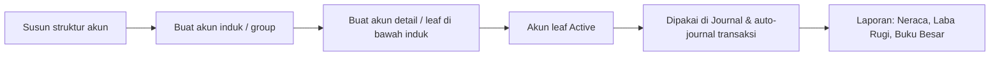

# Panduan Pengguna — Chart of Account (Master COA)

Panduan ini membantu tim Finance/Accounting menyusun dan mengelola daftar akun buku besar (Chart of Account) dari awal.

---

## 1. Apa Itu & Kenapa Penting

**Chart of Account (COA)** adalah daftar akun buku besar perusahaanmu — misalnya Kas, Bank, Piutang Usaha, Pendapatan Penjualan, Beban Gaji, dan seterusnya. Setiap transaksi keuangan (Sales Invoice, penerimaan pembayaran, Credit Note, sampai jurnal manual) selalu "diletakkan" ke salah satu akun COA.

COA penting karena menjadi **fondasi seluruh pencatatan akuntansi**. Kalau struktur COA rapi, laporan keuangan (Neraca, Laba Rugi, Buku Besar) otomatis akurat. COA bersifat per company, jadi tiap perusahaan punya daftar akunnya sendiri.

---

## 2. Overview Flow & Proses Bisnis

**Alur singkat:** susun kelompok akun (induk) lebih dulu, lalu buat akun detail (leaf) di bawahnya. Hanya akun detail yang dipakai di transaksi.

---

## 3. Sebelum Mulai (Flow Sebelum)

- Pahami **7 COA Class** yang tersedia: Assets, Liabilities, Equity, Revenue, Expense, Cost of Goods Sold, Other Revenue & Expenses.
- Siapkan **struktur akun** yang diinginkan (induk dan detailnya).
- Pastikan kamu punya **akses menu Finance & Accounting**.
- Untuk import massal: siapkan **template Excel 5 kolom** dan tahu **ID Class** (angka 1–7).

---

## 4. Setelah Selesai (Flow Sesudah)

Setelah akun (leaf) dibuat dan Active:

- Akun muncul di pilihan **Journal** dan pada mapping akun (Company Accounting, Product COA Group, Cash/Bank, Tax).
- Transaksi seperti **Sales Invoice, Account Receive, Credit Note** otomatis membuat jurnal ke akun yang sudah dipetakan.
- Begitu akun dipakai, sebagian datanya **terkunci** (Code, Parent, Class, Active) demi menjaga konsistensi laporan.

---

## 5. Yang Perlu Diperhatikan

- **Hanya akun leaf (paling bawah)** yang bisa dipakai transaksi. Akun induk hanya untuk mengelompokkan.
- **Class mengikuti induk**: kalau kamu memilih Parent Group Name, Class otomatis ikut induk dan tidak bisa diubah.
- **Code unik** per perusahaan. Code milik akun yang sudah dihapus boleh dipakai ulang.
- **Nonaktifkan induk = nonaktifkan semua anaknya** (otomatis, bertingkat). Begitu juga jika Class induk diubah.
- **Akun yang sudah dipakai tidak bisa dihapus** dan sebagian field-nya terkunci — hanya Name & Description yang bisa diubah.
- **Aktifkan induk dulu** sebelum mengaktifkan anaknya.
- Create COA **belum auto-save** — klik Create lalu Save.

---

## 6. Langkah-Langkah (Step by Step)

1. Buka **Finance & Accounting → Chart of Account**, klik **Create**.
2. Isi **Code** dan **Name** (wajib).
3. Tentukan posisi akun:
   - Untuk **akun induk/detail di bawah kelompok tertentu**: pilih **Parent Group Name** — Class akan otomatis mengikuti induk.
   - Untuk **akun tanpa induk**: pilih **Class** dari 7 opsi.
4. Isi **Description** bila perlu, pastikan **Active** menyala, lalu **Save**.
5. Ulangi untuk akun berikutnya. Buat induk lebih dulu agar bisa dipilih sebagai Parent.
6. Untuk banyak akun sekaligus, gunakan **Import**:
   - **Download Template**, isi 5 kolom (Code, Code Parent COA, COA Name, Description, COA Class ID).
   - Isi **COA Class ID** dengan angka (1=Assets, 2=Liabilities, 3=Equity, 4=Revenue, 5=Expense, 6=Cost of Goods Sold, 7=Other Revenue & Expenses).
   - Letakkan baris **induk di atas** baris anaknya.
   - Unggah file, lalu cek **Import History** dan **View Error Logs**.

🎬 [Interactive demo akan ditambahkan di sini]

---

## 7. Tips & Hal yang Sering Bikin Bingung

- **"Import gagal semua padahal cuma 1 baris salah."** Import bersifat semua-atau-tidak. Cek View Error Logs, perbaiki baris yang error, unggah ulang seluruh file.
- **"Induk tidak muncul di import."** Baris induk harus di atas baris anaknya, atau induk sudah Active di sistem.
- **"Tidak bisa ubah Class."** Akun (atau anaknya) sudah dipakai di transaksi/setting. Class terkunci demi konsistensi laporan.
- **"Akun tidak muncul di Journal."** Akun itu berstatus parent/group. Buat/pakai akun detail (leaf) di bawahnya.
- **"Tombol download di Import History hilang."** File hasil import hanya tersedia 24 jam.
- **Class ID di import adalah ANGKA**, bukan nama class.

---

## 8. Referensi

| Sumber | Untuk apa |
|--------|-----------|
| [Knowledge Base](./knowledge-base.md) | Panduan operator & troubleshooting |
| [Requirement](./requirement.md) | Aturan bisnis, validasi, Gap Registry |
| [Journal](../journal/README.md) | Pemakaian COA di jurnal |
| [Product COA Group](../accounting-product-coa-group/README.md) | Mapping COA per produk |
| [Cash/Bank Account](../accounting-company-detail-bank/README.md) | COA Cash/Bank |
