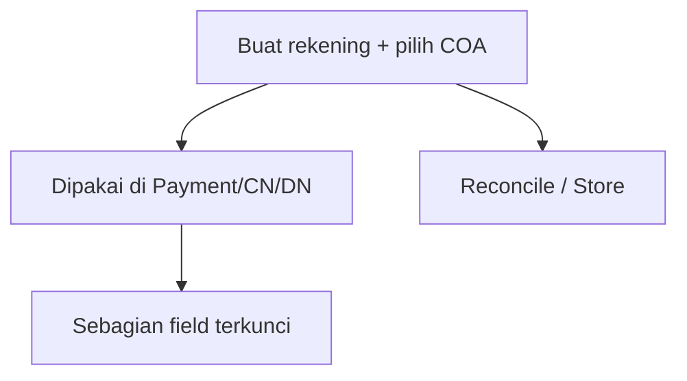

# Cash/Bank Account — Knowledge Base

> **Audience:** Finance / Accounting. **Route:** `/accounting/company-detail-bank`

---

## 1. Apa itu?

**Cash/Bank Account** = master rekening kas & bank perusahaan. Setiap rekening dihubungkan ke **satu akun buku besar (COA) aset** dan satu **currency**, lalu dipakai sebagai sumber/tujuan dana di Payment, Credit Note, Debit Note, serta di Cash Bank Reconcile dan setting Store.

---

## 2. Glosarium

| Istilah | Arti awam |
|---------|-----------|
| **COA Binding** | Akun buku besar yang terhubung ke rekening |
| **Leaf COA** | Akun paling detail (tanpa sub-akun) |
| **Default Data** | Rekening utama yang sering terpilih otomatis |
| **Locked** | Sudah dipakai transaksi — Type/Currency/COA tidak bisa diubah |
| **Fund** | Sumber atau tujuan dana di transaksi |

---

## 3. Cara pakai

1. **Create** → isi Type, Label, Currency, COA Binding (wajib).  
2. Detail bank (nama, nomor rekening, dll.) opsional.  
3. Set **Default** jika ini rekening utama (harus Active).  
4. Setelah dipakai di Payment/CN/DN: hanya boleh edit label & identitas bank — bukan Currency/COA.  
5. Tidak bisa Delete setelah dipakai → pakai **Inactive**.

---

## 4. Troubleshooting

| Gejala | Solusi |
|--------|--------|
| COA tidak bisa dipilih | Sudah dipakai rekening lain / bukan Assets leaf |
| Delete hilang | Sudah dipakai transaksi → Inactive |
| Tidak bisa ubah Currency/COA | Buat rekening baru |
| Tidak bisa set Default | Pastikan Active dulu; jangan Default+Inactive |

---

## 5. FAQ

**Q: Bank Name wajib?**  
A: Tidak. Wajib: Label, Currency, COA Binding.

**Q: Hapus rekening bebaskan COA?**  
A: Ya (soft delete) — COA bisa dipakai rekening baru.

---

## Related Documents

| Doc | Path |
|-----|------|
| Requirement | [requirement.md](./requirement.md) |
| Technical | [technical.md](./technical.md) |
| User Guide | [user-guide.md](./user-guide.md) |
