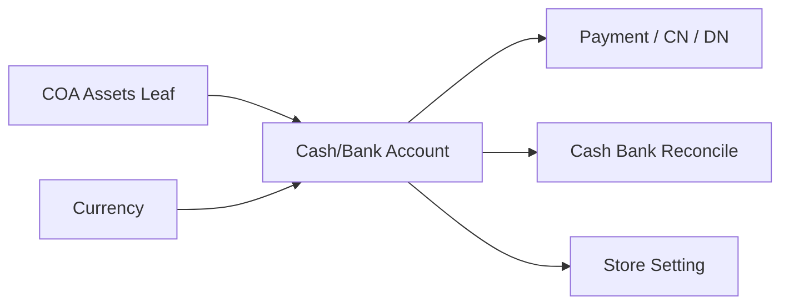
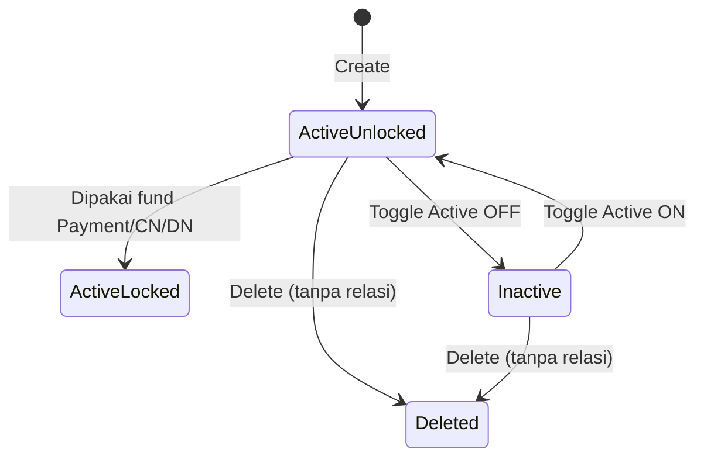

# Cash/Bank Account — Requirement Documentation

**Modul:** Finance Accounting → Master  
**UI route:** `/accounting/company-detail-bank`  
**API:** GeneralSetting `company-detail-bank` (entity `CompanyDetailBank`)  
**Audience:** PM, Finance/Accounting, QA, Developer  
**PM source:** Cash/Bank Account Source of Truth **v1.0** (5 Agustus 2026)  
**SoT menu key:** `accounting-cash-bank-account` → canonical slug **`accounting-company-detail-bank`**

> AS-IS diverifikasi 5 Agu 2026 (`CompanyDetailBankController`, FE `CashBankAccount/*`).

---

## 0. Metadata & Changelog

| Version | Date | Author | Changes |
|---------|------|--------|---------|
| 1.0 | 2026-08-05 | QA - Yemima | Full 5-file dari SoT v1.0; Gap `GAP-CBA-01..05`; lock setelah fund Payment/CN/DN |

---

## 1. Ringkasan Eksekutif

**Cash/Bank Account** adalah master rekening kas/bank yang mengikat identitas rekening ke **satu leaf COA kelas Assets** + currency. Bridge (bukan jurnal, bukan COA itu sendiri) untuk fund Payment / Credit Note / Debit Note / Account Receive/Payment, basis Cash Bank Reconcile, dan default cash bank Store.

---

## 2. Prasyarat

| Prasyarat | Sumber | Catatan |
|-----------|--------|---------|
| COA Assets leaf aktif, belum terikat bank lain | Chart of Account | Hanya leaf tanpa child |
| Currency aktif | Master Currency | Harus cocok currency dokumen konsumen |
| Company context | Token | Scope per company |

---

## 3. Siklus status

| Status | Editable? | Catatan |
|--------|-----------|---------|
| Active Unlocked | Semua field | Delete tersedia |
| Active Locked (`to_payment`) | Hanya Label, Bank Name/Branch, Holder, Acc Number, Swift, Description, Default* | Type, Currency, COA, Active **disabled di FE**; BE blok Type/Currency/COA |
| Inactive | Selama belum locked | Tidak boleh sekaligus Default |
| Deleted | — | Soft delete |

\*Default masih editable di FE saat locked (`can_update_original`).  
**Saldo aktif blok Inactive:** belum ditemukan di BE — GAP-CBA-02.

---

## 4. Datalist

Kolom: Type, Label, Bank Name, Bank Branch, Acc Holder, Acc Number, Curr, COA Code\|Name, Default, Active, Created By\|At, Action.  
Fitur: Global Search, Create, Show Deleted, Column Show/Hide, Export.  
Delete action hanya jika belum punya relasi fund.

---

## 5. Form & field

| Field | Wajib | Catatan |
|-------|-------|---------|
| Type | Ya | Cash / Bank (FE); BE **tanpa whitelist** — GAP-CBA-05 |
| Label | Ya | Max 30 |
| Bank Name / Branch | Tidak | Opsional meski Type Bank |
| Currency | Ya | Default primary (IDR) |
| COA Binding | Ya | Assets leaf, belum terikat bank aktif |
| Holder / Acc Number / Swift / Description | Tidak | |
| Default Data | Ya (toggle) | Tidak boleh + Inactive; company wajib ≥1 default; set baru unset lama |
| Active | Ya (toggle) | Inactive tidak muncul di picker transaksi |

**Audit Log:** slideover edit standar.

---

## 6. How It Works

### 6.1 COA 1:1

Satu rekening ↔ satu COA Assets leaf. Soft-delete rekening → COA bebas lagi (picker & create).

### 6.2 Default

Minimal satu default Active per company. Auto-select di konsumen (Payment, CN, DN, Store) — detail per menu. Unset default lama saat set baru — **query update berisiko** (GAP-CBA-01).

### 6.3 Lock setelah transaksi

`receive_destinations` exists → `to_payment=true`. Type/Currency/COA dikunci. Ganti currency/COA → buat rekening baru.

---

## 7. Validasi

| # | Kondisi | Pesan / behavior |
|---|---------|------------------|
| 1–3 | Currency / Label / COA required | Validasi standar |
| 4 | COA sudah dipakai bank lain | `This COA has already been taken` |
| 5 | Default + Inactive | `Cannot set as default if status is inactive` |
| 6 | Create non-default tanpa default existing | `At least one default data must remain active.` |
| 7 | Set default baru | Unset default lama (GAP-CBA-01 pada update) |
| 8 | Used + ubah Type/Currency/COA | `The {Type\|Currency\|COA Binding} field cannot be edited because it has already been used in transactions.` |
| 9 | Used + matikan Active | FE lock; BE tidak blok status secara eksplisit |
| 10 | Inactive + saldo aktif | **Belum ada di BE** — GAP-CBA-02 |
| 11 | Delete + used | `This data has been used` |
| 12 | Delete tanpa relasi | Soft delete OK |

---

## 8. Relasi menu

| Menu | Peran |
|------|-------|
| Chart of Account | Upstream COA Binding |
| Currency | Upstream |
| Payment / CN / DN / AR / AP | Fund; lock master |
| Cash Bank Reconcile | Pilih rekening; journal by COA |
| Store Binding | Default cash/bank toko |
| Payment Method / Instant Settlement / SI | Downstream |
| Product COA Group / Tax / Other Cost/Disc / Company Accounting | TO-BE exclusion COA kas/bank |
| Audit Log | Perubahan master |

---

## 9. Acceptance Criteria

| ID | Kriteria |
|----|----------|
| CBA-01 | Create wajib Currency, Label, COA; COA unik per bank aktif |
| CBA-02 | ≥1 default Active; Default+Inactive ditolak |
| CBA-03 | Setelah fund dipakai: Type/Currency/COA tidak bisa diubah; Delete diblok |
| CBA-04 | Soft-delete bebaskan COA untuk rekening baru |
| CBA-05 | Gap registry terdokumentasi |

---

## 10. FAQ

**Q: Tidak bisa ubah Type/Currency/COA?**  
A: Sudah dipakai fund Payment/CN/DN — buat rekening baru.

**Q: Delete tidak muncul?**  
A: Sudah dipakai transaksi — pakai Inactive.

**Q: Tidak bisa matikan Active?**  
A: Satu-satunya default, atau field terkunci karena sudah dipakai. Saldo aktif: belum dikonfirmasi BE.

**Q: Bank Name wajib?**  
A: Tidak — wajib hanya Currency, Label, COA Binding.

---

## 11. Gap Registry

| ID | Deskripsi | Status |
|----|-----------|--------|
| GAP-CBA-01 | Update unset default: `where(['id' => ['!=', $id]])` bukan not-equal Laravel yang benar — risiko 2 default | Open |
| GAP-CBA-02 | Validasi Inactive vs saldo aktif tidak ditemukan di BE | Open |
| GAP-CBA-03 | Unique COA check vs soft-delete / picker consistency | Open |
| GAP-CBA-04 | Lock/delete hanya dari fund Payment/CN/DN — Reconcile/Store tidak mengunci | Open |
| GAP-CBA-05 | Type tanpa whitelist BE | Open |

---

## Related Documents

| Doc | Path |
|-----|------|
| Knowledge Base | [knowledge-base.md](./knowledge-base.md) |
| Technical | [technical.md](./technical.md) |
| User Guide | [user-guide.md](./user-guide.md) |
| Chart of Account | [../accounting-chart-of-account/README.md](../accounting-chart-of-account/README.md) |
| Cash Bank Reconcile | [../accounting-cash-bank-reconcile/README.md](../accounting-cash-bank-reconcile/README.md) |
