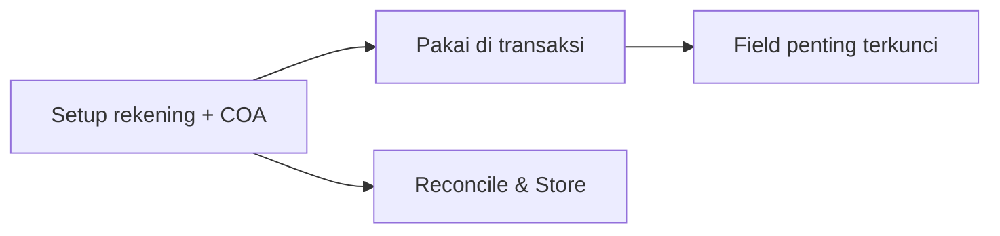

# Panduan Pengguna — Cash/Bank Account

**Siapa yang baca:** tim Finance / Accounting  
**Menu:** Finance Accounting → Master → Cash/Bank Account  
**Route:** `/accounting/company-detail-bank`

---

## 1. Apa Itu & Kenapa Penting

**Cash/Bank Account** menyimpan daftar rekening kas dan bank perusahaan. Setiap rekening terhubung ke akun buku besar dan mata uang, lalu dipakai saat pembayaran, penerimaan, rekonsiliasi, dan setting toko.

Tanpa rekening yang benar, transaksi Payment/Credit Note/Debit Note tidak punya sumber atau tujuan dana yang valid.

---

## 2. Overview Flow & Proses Bisnis

**Versi teks:**

1. Buat rekening (Cash atau Bank) dengan Label, Currency, dan COA.  
2. Set satu rekening sebagai Default.  
3. Pakai di Payment / Credit Note / Debit Note.  
4. Setelah dipakai, jangan harap bisa ganti Currency atau COA — buat rekening baru bila perlu.

### Status

| Status | Arti |
|--------|------|
| Active | Muncul di pilihan transaksi |
| Inactive | Tidak muncul di pilihan baru |
| Locked (sudah dipakai) | Type / Currency / COA tidak bisa diubah |

---

## 3. Sebelum Mulai

- COA aset (leaf) siap dan belum dipakai rekening lain.  
- Currency aktif tersedia.  
- Rencanakan rekening Default company.

🎬 [Interactive demo akan ditambahkan di sini]

---

## 4. Setelah Selesai

- Minimal satu rekening Default Active.  
- Uji create Payment dengan currency yang sama.  
- Rekening yang sudah dipakai: Delete hilang; Inactive untuk menonaktifkan.

---

## 5. Yang Perlu Diperhatikan

- Wajib: **Label**, **Currency**, **COA Binding**. Nama bank & nomor rekening opsional.  
- Satu COA hanya untuk satu rekening aktif.  
- Setelah dipakai transaksi dana: Type/Currency/COA terkunci.  
- Tidak bisa Default sekaligus Inactive.  
- Ganti currency/COA → buat rekening baru, bukan edit yang lama.

---

## 6. Langkah-Langkah

1. Buka **Cash/Bank Account** → Create.  
2. Pilih Type → isi Label, Currency, COA Binding.  
3. (Opsional) isi detail bank → set Default → Save.  
4. Uji di transaksi Payment.  

🎬 [Interactive demo akan ditambahkan di sini]

---

## 7. Tips & Hal yang Sering Bikin Bingung

- **"This COA has already been taken."** Pilih COA lain atau soft-delete rekening lama.  
- **"This data has been used."** Tidak bisa delete — Inactive saja.  
- **"Cannot set as default if status is inactive."** Aktifkan dulu.

---

## 8. Referensi

| Sumber | Untuk apa |
|--------|-----------|
| [Knowledge Base](./knowledge-base.md) | Troubleshooting |
| [Requirement](./requirement.md) | Validasi & Gap |
| [Technical](./technical.md) | Developer |
| [Chart of Account](../accounting-chart-of-account/README.md) | COA Binding |
| [Cash Bank Reconcile](../accounting-cash-bank-reconcile/README.md) | Rekonsiliasi |
