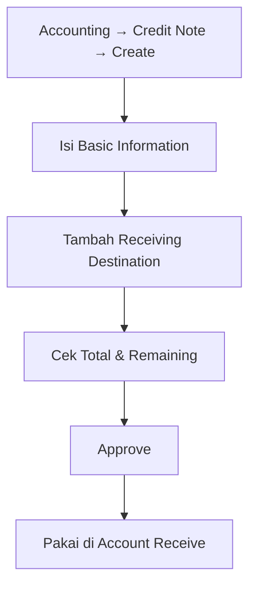

# Credit Note — Knowledge Base (Operator)

**Audience:** Finance, AR clerk, Operations support  
**Route:** `/accounting/credit-note`

---

## 1. Apa itu Credit Note?

Credit Note (CN) adalah dokumen yang mencatat **saldo kredit customer** — misalnya kelebihan bayar, kompensasi, atau nilai retur untuk invoice yang sudah pernah dibayar. Saldo itu bisa dipakai lagi saat **Account Receive** (menerima pembayaran) sebagai sumber deposit.

**Kode transaksi:** diawali `CN`.

CN bisa muncul dari:

| Jalur | Apa yang terjadi |
|-------|------------------|
| Buat manual di menu ini | Status Open → kamu approve sendiri |
| Import Excel/CSV | Status Open → kamu approve sendiri |
| Sales Return tipe **Billed** (Finance Complete) | Langsung Approved + jurnal |
| Kelebihan bayar lewat import Account Receive | Mengikuti proses AR |

---

## 2. Kapan dipakai?

| ✅ Pakai CN jika | ❌ Jangan mengandalkan CN jika |
|------------------|-------------------------------|
| Customer punya kelebihan / kredit yang harus dicatat | Return **Unbilled** (invoice belum dibayar) — itu jurnal sales/AR, bukan CN |
| Mau memakai saldo kredit di Account Receive berikutnya | Deposit COA customer/store belum diisi — approve akan gagal |
| Cash/Bank untuk mata uang CN sudah ada di master | Mau campur rekening beda mata uang dengan header CN |

---

## 3. Alur kerja standar

Happy path create manual sampai bisa dipakai di penerimaan:

**Keterangan langkah:**

- **Create:** isi tanggal, customer (General = perusahaan / Platform = store), mata uang, kurs. Kode dikosongkan saja jika ingin auto. Setelah simpan, sistem bawa kamu ke halaman edit.
- **Receiving Destination:** pilih Cash/Bank lewat modal (**Use** atau **Bulk Use**). Isi amount tiap baris. **Bulk Use** sering mulai dari amount 0 — wajib diisi manual sebelum approve.
- **Approve:** butuh minimal satu baris fund dengan amount lebih dari 0, dan akun Deposit customer sudah terisi di master.
- **Setelah approve:** saldo CN siap dipilih di Account Receive; pemakaian muncul di **Detail Related Transaction**.

Cabang auto dari retur: lihat [Sales Return Approval](../accounting-sales-return/knowledge-base.md) — Complete return **Billed** → CN terbentuk sendiri.

---

## 4. Membaca angka di list

| Kolom | Arti sederhana |
|-------|----------------|
| **Total Amount** | Jumlah semua baris Receiving Destination |
| **Paid** | Sudah dipakai di Account Receive yang **sudah di-approve** |
| **Outstanding** | Sisa = Total dikurangi Paid — inilah yang masih “tersisa” di list |
| **Trx Ref** | Dokumen asal (Sales Invoice / Account Receive) jika CN tidak dibuat manual |
| **Journal** | Muncul setelah CN di-approve |

**Sisa yang masih bisa dipakai di AR** juga memperhitungkan AR yang masih draft/open (sedang dialokasikan tapi belum final). Kalau AR menolak karena melebihi sisa, turunkan amount atau selesaikan/batalkan alokasi lama dulu.

---

## 5. Import massal

1. Download **Template Import Credit Note**.
2. Isi kolom wajib: tanggal, **kode** customer (bukan nama), GL Acc Cash/Bank, amount (minimal 1).
3. Store opsional (maksimal 5 nama, dipisah koma/titik koma).
4. Upload — kalau **satu baris saja salah**, seluruh file dibatalkan (tidak ada CN yang terbentuk).
5. CN hasil import berstatus **Open** (belum approved). Currency mengikuti mata uang utama company.

Import hanya untuk customer **General** (kode company). Customer Platform buat lewat form.

Cek **Import History** dan **View Error Log** jika gagal.

---

## 6. Status yang perlu kamu kenali

| Status | Bisa diedit? | Catatan |
|--------|--------------|---------|
| Draft / Open | Ya | Open = siap approve |
| Rejected | Ya | Bisa diperbaiki lalu approve lagi |
| Approved | Tidak | Bisa Void / Close sesuai hak akses |
| Void / Closed | Tidak | Setelah approved |

Customer, mata uang, kurs, dan tanggal transaksi **terkunci** begitu sudah ada baris Receiving Destination — hapus semua baris fund dulu jika perlu diganti.

---

## 7. Troubleshooting

| Gejala | Penyebab umum | Solusi |
|--------|---------------|--------|
| Approve gagal terus | Deposit COA customer/store kosong; atau amount fund masih 0 | Lengkapi Deposit COA di master; isi amount semua baris |
| Amount bulk = 0 | Bulk Use memang seed 0 | Edit amount manual |
| Tidak bisa ubah customer/tanggal | Sudah ada fund | Hapus semua Receiving Destination |
| Import gagal semua | Satu baris error membatalkan semua | Perbaiki Excel, upload ulang |
| Customer tidak muncul | Inactive atau COA belum lengkap | Lengkapi setting di General Company / Store |
| Tidak bisa hapus CN | Sudah Approved / Void / Closed | Hanya Draft, Open, Rejected yang boleh dihapus |
| Print tidak jalan | Tombol ada, spesifikasi/API print belum siap | Laporkan ke support/dev — perbaikan sudah dicatat |

---

## 8. FAQ

**Q: Bedanya CN manual dengan yang dari Sales Return?**  
A: Manual/import perlu kamu approve. Dari return **Billed**, sistem langsung approve + jurnal.

**Q: Unbilled return kenapa tidak ada CN?**  
A: Invoice belum dibayar — sistem menyesuaikan sales/AR, bukan membuat deposit customer.

**Q: Apa itu Remaining di footer fund?**  
A: Sisa saldo CN yang masih bisa dialokasikan (setelah yang sudah/sedang dipakai di penerimaan).

**Q: Kenapa Trx Ref kosong?**  
A: CN dibuat manual tanpa dokumen asal.

**Field yang tidak perlu diurus operator:** ID internal, Data Owner, kolom tanggal tersembunyi untuk sort backend.
