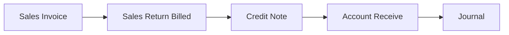
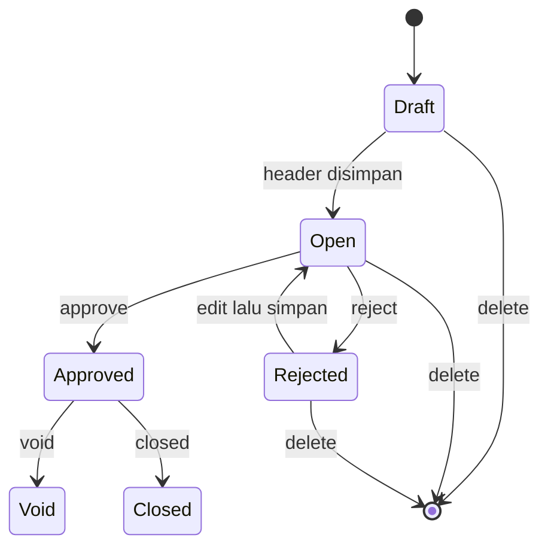
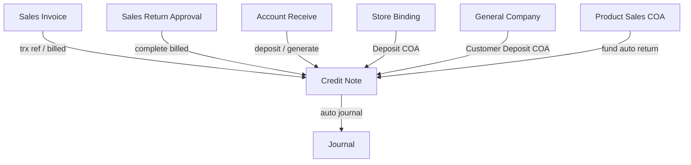

# Credit Note — Requirement Documentation

**Modul:** Finance & Accounting / Account Receivable  
**Prefix:** `CN`  
**Audience:** PM, Finance, QA  
**UI route:** `/accounting/credit-note`  
**SoT:** `accounting-credit-note-source-of-truth.md` v1.0 (17 Jul 2026)

Downstream: [Account Receive](../accounting-customer-payment/requirement.md) · Upstream billed return: [Sales Return Approval](../accounting-sales-return/requirement.md)

---

## 0. Metadata & Changelog

| Version | Date | Author | Changes |
|---------|------|--------|---------|
| 1.0 | 2026-07-17 | QA - Yemima | Draft awal dari SoT v1.0 + analisa codebase (create/import/approve, auto dari Sales Return billed, pemakaian di AR) |

---

## 1. Ringkasan Eksekutif

Credit Note (CN) mencatat **kredit / kelebihan nilai kepada customer**, lalu dipakai sebagai **deposit** saat pembayaran di Account Receive. CN adalah spesialisasi Payment (`type = Credit Note`), satu keluarga dengan Debit Note dan Customer Payment.

| Jalur terbit | Hasil status |
|--------------|--------------|
| Manual (form) | Open — perlu approve manual |
| Import Excel/CSV | Open — perlu approve manual |
| Sales Return **Billed** (Complete Finance) | Approved + jurnal otomatis |
| Overpay / adjustment import Account Receive | Mengikuti proses AR terkait |

Audience: Finance / AR.

### 1.1 Rantai proses



---

## 2. Prasyarat

| Prasyarat | Sumber | Catatan |
|-----------|--------|---------|
| Customer aktif + COA lengkap (termasuk Deposit) | General Company / Store | Tanpa Deposit COA, approve gagal |
| Cash/Bank aktif untuk currency CN | Master Cash Bank | Wajib create manual |
| Currency aktif; primary currency company ter-set | Master Currency | Tanpa primary, import gagal |
| Fiscal period aktif untuk tanggal CN | Fiscal Period | Create, edit tanggal, approve |
| Return billed: invoice sudah pernah dibayar + Sales COA produk | Sales Invoice, Product COA | Complete return gagal jika Sales COA kosong |

---

## 3. Siklus Status



| Status | Kondisi | Editable? | Tombol |
|--------|---------|-----------|--------|
| **Draft** | Header baru | Ya | Save, Delete |
| **Open** | Siap isi fund + approve | Ya (field kritikal terkunci jika sudah ada fund) | Save, Delete, Approve, Reject |
| **Approved** | Jurnal terbit | Tidak | Void, Closed (privilege); Print UI ada — lihat GAP-CN-01 |
| **Rejected** | Ditolak | Ya | Save, Delete, Approve ulang |
| **Void** / **Closed** | Setelah approved | Tidak | — |

Field kritikal terkunci setelah ada Receiving Destination: Customer, Currency, Exchange Rate, Transaction Date — clear semua fund dulu untuk ubah.

---

## 4. Datalist

### 4.1 Kolom

| Kolom | Visible | Sumber | Keterangan |
|-------|---------|--------|------------|
| Trx Code \| Trx Date | Ya | Header | Prefix `CN`; auto jika kosong |
| Customer | Ya | Company / Store | General vs Platform |
| Trx Ref | Ya | Sales Invoice atau Account Receive | Kosong jika manual |
| Curr / Rate | Ya | Header | — |
| Total Amount | Ya | Σ fund | §6.1 |
| Paid | Ya | Σ deposit di AR Approved | §6.1 |
| Outstanding | Ya | Total − Paid | §6.1 |
| Trx Status | Ya | Header | Draft, Open, Approved, Rejected, Void, Closed (GAP-CN-03) |
| Journal Code \| Date | Ya | Journal | Kosong sebelum approve |
| Created by \| at | Ya | Audit | — |
| Action | Ya | Privilege × status | Edit, Approve/Reject, Delete; Print di form — GAP-CN-01 |

### 4.2 Fitur datalist

| Fitur | Keterangan |
|-------|------------|
| Search / Advanced Filter | SearchBuilder + filter kolom ter-format (code, customer, ref, journal, amounts, status) |
| Create | Redirect create → sukses ke edit |
| Auto Save Transaction | Default values (customer/currency/rate) lalu auto-submit header |
| Show Deleted | Soft-deleted + aktif |
| Export | Dengan / tanpa detail (async job) |
| Import | Template + history + error log — §6.5, §7.1 |

### 4.3 Import History & Error Log

| Tab | Isi |
|-----|-----|
| Import History | File name, imported by/at, status, success/failed row count, action |
| View Error Log | Row number, message |

---

## 5. Form & Field

### 5.1 Basic Information

| Field | Wajib? | Default | Sumber | Validasi | Catatan |
|-------|--------|---------|--------|----------|---------|
| Transaction Code | Tidak | Auto `CN` | — | Unique (termasuk soft-delete), max 50 | Disabled setelah create |
| Transaction Date | Ya | Now | — | Fiscal aktif; FE max now, min ~6 bulan | — |
| Exchange Rate | Ya | 1 | — | Lebih dari 0 | — |
| Transaction Currency | Ya | Primary/IDR | Currency aktif | Cash/Bank aktif untuk currency | — |
| Store | Tidak | — | Store aktif | Multi-select | Reporting filter |
| Customer | Ya | — | Company customer COA lengkap / Store Deposit COA | Aktif + COA lengkap | Group General / Platform |
| Reference Doc | Tidak | — | Free text | — | Auto dari return/AR |
| Description | Tidak | — | — | Max 150 | — |
| Attachment | Tidak | — | — | Extensi standar upload | — |

### 5.2 Receiving Destination

Modal Cash/Bank: Type, Label, Bank Name \| Acc Number, Balance. **Use** / **Bulk Use** menambah baris fund.

| Kolom detail | Keterangan |
|--------------|------------|
| GL Account, Bank Account/Name, Currency, Swift | Dari master bank/COA |
| Amount | Inline edit; setelah approved read-only |
| Memo | Inline; max 150; setelah approved read-only |
| Footer Total / Remaining | Σ fund; sisa saldo CN (§6.3) |

Validasi fund: header editable; amount lebih dari 0 (kecuali seed bulk = 0 — GAP-CN-02); currency bank = currency header; COA tidak duplikat.

### 5.3 Detail Related Transaction

Read-only: Trx Date, Trx Code, Description, Amount — pemakaian CN di AR (dan sejenis) sebagai deposit.

---

## 6. How It Works

### 6.1 Total, Paid, Outstanding (datalist)

```
total_amount = SUM(Receiving Destination)
paid         = SUM(deposit CN di Account Receive Approved)
outstanding  = total_amount - paid
```

### 6.2 Grand total

Setiap tambah/ubah/hapus fund: `grand_total = SUM(amount fund)`.

### 6.3 Remaining funds

```
basis           = grand_total (atau total fund jika grand_total 0)
remaining_funds = basis - dipakai_draft_open_AR - dipakai_approved_AR
```

Saat AR memakai CN: `remaining - amount_diminta >= 0` dan `amount_diminta <= grand_total`.

### 6.4 Fund foreign currency

```
primary: amount = fund_amount
foreign: amount = fund_amount * exchange_rate; amount_foreign = fund_amount
```

### 6.5 Import

Template A–H: Trx Code (opsional), Trx Date, Customer Code, Store (opsional max 5), Description (max 150), GL Acc/COA, Amount (min 1), Memo (max 150).

- **All-or-nothing** di parse: satu error → tidak ada CN terbentuk.
- Lolos → CN status **Open**, currency primary, rate 1.
- Trx Code sama → header harus konsisten; max **100** fund/header.
- Customer import hanya **General (Company code)** — Platform lewat form manual.

### 6.6 Auto dari Sales Return Billed

Trigger: Complete Sales Return, invoice `processed_to_payment_amount` lebih dari 0.

```
credit_note_amount = harga_setelah_diskon_setelah_PPN * qty_return
```

Dikelompokkan per invoice + per Sales COA produk → CN per invoice, fund per Sales COA. Status langsung **Approved** + jurnal (`invert_journal` untuk billed platform tertentu).

### 6.7 Auto journal approve

| Sisi | COA | Nilai |
|------|-----|-------|
| Debit (default) | COA tiap fund | Amount fund |
| Kredit (default) | Customer's Deposit COA | Total debit |

Invert debit/kredit untuk CN return billed platform tertentu.

### 6.8 Pemakaian di Account Receive

1. Deposit mengacu ke CN.  
2. AR draft/open → mengurangi remaining (belum final).  
3. AR approved → pemakaian final.  
4. Muncul di Related Transaction.

---

## 7. Validasi

### 7.1 Import

| # | Kondisi | Behavior | Message (inti) |
|---|---------|----------|----------------|
| 1–3 | File / mime / batch lain jalan | Ditolak | File wajib; format; other import in process |
| 4–6 | Header / empty / no primary currency | Ditolak file | Template mismatch; empty; Primary currency not set |
| 7 | Trx Code sudah ada | Baris | already registered |
| 8 | Date invalid / future / fiscal | Baris | required / Invalid format / future / fiscal |
| 9–12 | Customer code / name / inactive / COA | Baris | required / not found / use code / inactive / Incomplete COA |
| 13–15 | Store duplikat / max 5 / invalid / COA | Baris | Duplicate / Max 5 / not registered / deleted / inactive / incomplete |
| 16–19 | Description/Memo 150; GL Acc; Amount min 1 | Baris | max 150; COA required/not found/not in Cash Bank; amount rules |
| 20–22 | Duplikat COA; inkonsisten header; lebih dari 100 detail | Baris | Duplicate COA; consistent Trx Code; limit 100 |

### 7.2 Create header

| # | Kondisi | Message |
|---|---------|---------|
| 1 | Tidak ada Cash/Bank currency | set up a cash/bank account for this currency |
| 2 | Code bentrok | already been transacted |
| 3 | Di luar fiscal | Pesan fiscal |
| 4 | Currency invalid | not found / removed |
| 5 | Rate kurang dari sama dengan 0 | greater than 0 |
| 6 | Customer kosong | The customer field is required |

### 7.3 Edit header & fund

| # | Kondisi | Message |
|---|---------|---------|
| 1 | Bukan Draft/Open | can't modify |
| 2 | Ubah field kritikal + ada fund | clear all details first |
| 3 | Cash/Bank currency | set up a cash/bank |
| 4 | Amount kurang dari sama dengan 0 (kecuali seed bulk) | greater than 0 |
| 5 | Currency bank tidak match | does not match |
| 6 | COA duplikat | Duplicate Cash/Bank |

### 7.4 Delete

Draft / Open / Rejected: boleh. Approved / Void / Closed: tidak. Fund: boleh jika header editable.

### 7.5 Approve / Reject

| # | Kondisi | Message |
|---|---------|---------|
| 1 | Sudah approved | Already Approved |
| 2 | Lock approve ~30 dtk | Approval process in progress |
| 3 | Import receive terkait jalan | Updating process in progress |
| 4 | Fiscal | Pesan fiscal |
| 5 | Tidak ada fund | no fund source/destination data |
| 6 | Amount fund kurang dari sama dengan 0 | All amount must be greater than 0 |
| 7 | Deposit COA kosong | Configure Customer's Deposit COA |

Tidak ada cek balance detail-vs-source seperti Account Receive.

---

## 8. Relasi Menu Lain



| Menu | Peran |
|------|-------|
| Sales Invoice | Trx ref; penentu billed vs unbilled |
| Sales Return Approval | Trigger auto CN + approve (billed) |
| Account Receive | Konsumen deposit CN; bisa generate CN dari overpay/import |
| Journal | Output jurnal approve |
| Store Binding / General Company | Actor + Deposit COA |
| Product Sales COA | Fund COA auto return |

---

## 9. Gap Registry

| ID | Deskripsi | Dampak | Status |
|----|-----------|--------|--------|
| GAP-CN-01 | Tombol Print ada di form FE (`print()` ke API), tetapi **tidak ada** route/controller print Credit Note (beda Debit Note / Customer Payment) | QA tidak punya spesifikasi/format printout; print kemungkinan 404 | Open |
| GAP-CN-02 | Bulk Cash/Bank seed amount 0 tanpa warning UI eksplisit | User sering gagal approve karena lupa isi amount | Open |
| GAP-CN-03 | Status Void/Closed ada di siklus Payment + FE; requirement mentah awal hanya Draft/Open/Reject/Approved | Perlu keputusan tampilan filter/kolom status final | Open |
| GAP-CN-04 | Validasi hapus CN yang sudah dipakai sebagai deposit AR belum terdokumentasi pesan/rule jelas | Risiko remaining funds tidak konsisten | Open |

---

## 10. FAQ

**Q: Approve gagal padahal sudah ada fund?**  
A: Cek Customer's Deposit COA customer/store; pastikan semua amount fund lebih dari 0 (bukan sisa seed bulk 0).

**Q: Amount bulk cash/bank = 0?**  
A: By design — edit manual sebelum approve.

**Q: Beda CN manual vs auto?**  
A: Manual/import = Open + approve. Return billed = Approved + jurnal langsung.

**Q: Customer tidak muncul?**  
A: Harus aktif + COA (termasuk Deposit) lengkap.

**Q: Paid vs Outstanding?**  
A: Paid = terpakai di AR approved; Outstanding = Total − Paid.

**Q: Tidak bisa ubah Customer/Currency?**  
A: Hapus semua Receiving Destination dulu.

**Q: Tidak bisa hapus?**  
A: Hanya Draft / Open / Rejected.

---

## 11. Changelog (layer)

| Tanggal | Versi | Perubahan |
|---------|-------|-----------|
| 17 Jul 2026 | 1.0 | Requirement awal dari SoT + verifikasi print/void/closed di codebase |
