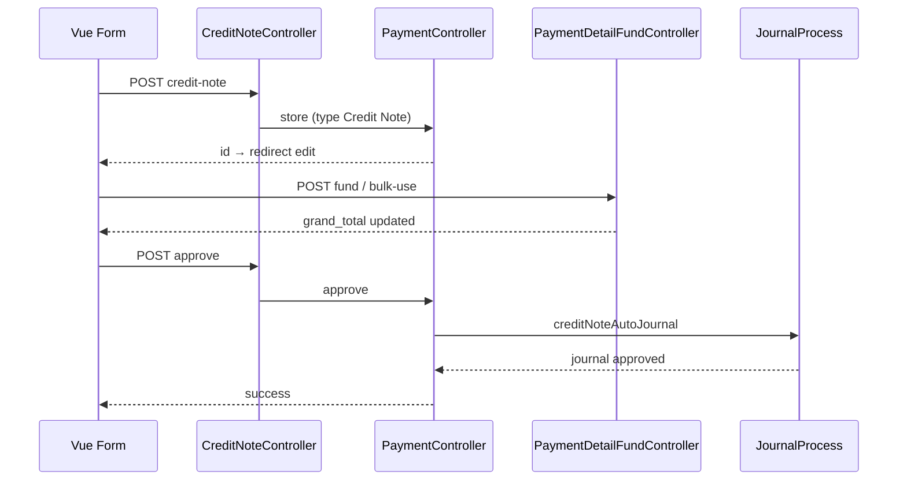
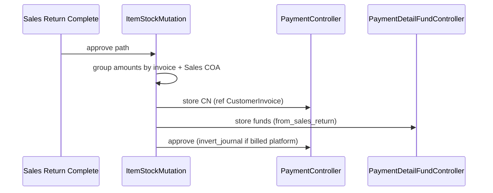

# Credit Note — Technical Documentation

**API prefix:** `accounting/credit-note`  
**Module:** `Modules/Accounting`  
**Behavior SoT:** [requirement.md](./requirement.md) v1.0

---

## 1. File Map

### Backend

| Layer | Path |
|-------|------|
| Routes | `Modules/Accounting/Routes/api.php` (group `credit-note`) |
| Controller | `Modules/Accounting/Http/Controllers/CreditNoteController.php` |
| Detail fund | `Modules/Accounting/Http/Controllers/CreditNoteDetailFundController.php` |
| Shared payment | `Modules/Accounting/Http/Controllers/PaymentController.php` (store/update/approve/show/destroy) |
| Shared fund | `Modules/Accounting/Http/Controllers/PaymentDetailFundController.php` |
| Entity | `Modules/Accounting/Entities/CreditNote.php` (extends `Payment`) |
| Scope | `Modules/Accounting/Entities/Scopes/CreditNoteScope.php` (`type = Credit Note`) |
| Detail fund entity | `Modules/Accounting/Entities/CreditNoteDetailFund.php` |
| Policy | `Modules/Accounting/Policies/CreditNotePolicy.php` |
| Import | `Modules/Accounting/Import/CreditNoteImport.php` |
| Import job | `Modules/Accounting/Jobs/CreditNoteImportJob.php` |
| Export jobs | `CreditNoteExportJob`, `CreditNoteDetailExportJob`, `CreditNoteDetailFundExportJob` |
| Template | `Modules/Accounting/Exports/CreditNoteTemplateExport.php` |
| Journal | `app/Helpers/Accounting/JournalProcess.php` → `creditNoteAutoJournal()` |
| Auto from return | `app/Helpers/SupplyChain/ItemStockMutation.php` → `generateCreditNoteFromReturn()` |
| AR import → CN | `Modules/Accounting/Jobs/ReceiveImportPerMutationJob.php` → `createCreditNote()` |
| Pricing helper | `app/Helpers/Accounting/PaymentPrice.php` (CN `grand_total` primarily from fund sum) |

### Frontend (`olshoperp-frontend`)

| Layer | Path |
|-------|------|
| Router | `src/router/index.ts` → `/accounting/credit-note*` |
| Store | `src/stores/project/CreditNote/index.ts` |
| List | `src/pages/Accounting/CreditNote/DataList.vue` |
| Form | `Form.vue`, `Header.vue`, `Destination.vue`, `RelatedTransaction.vue` |
| Approval | `ApprovalDialog.vue`, `ApprovalEligibility.vue`, `DatalistLogApproval.vue` |

---

## 2. API Routes (utama)

| Method | Path | Action |
|--------|------|--------|
| GET/POST | `accounting/credit-note` | Index / Store |
| GET/PUT/DELETE | `accounting/credit-note/{id}` | Show / Update / Destroy |
| POST | `…/{id}/approve` | Approve / Reject / Void / Closed (`approval_status`) |
| GET | `…/{id}/log/approve`, `…/approval-eligibility/{id}` | Logs / eligibility |
| GET | `…/{id}/audit` | Audit |
| CRUD | `…/{id}/credit-note-detail-fund` | Fund lines |
| POST | `…/{id}/cash-bank-account/bulk-use` | Bulk Cash/Bank |
| GET | `…/{id}/related-transactions/primevue` | Related deposits |
| GET/POST | `download-template`, `upload`, `progress`, import-log/history, export-* | Import/export |
| GET | `select2-customer`, `select2-currency`, `select2-cash-bank`, `default-values` | Lookups |

**Print:** FE memanggil `GET accounting/credit-note/{id}/print` — **route/controller CN print tidak ada** (lihat GAP-CN-01). Debit Note punya print route; CN belum.

---

## 3. Database — Key Tables

| Table / model | Role |
|---------------|------|
| `accounting_payments` | Header CN (`type = Credit Note`) |
| `accounting_payment_detail_funds` | Receiving Destination |
| `accounting_payment_detail_deposits` | Usage as deposit (`deposit_id` = CN id) + Related Transaction |
| Payment store pivots | Multi-store on CN |
| `accounting_journals` (+ details) | Auto journal on approve |
| `accounting_credit_note_export_files` | Export files |
| `accounting_credit_note_import_histories` / `accounting_import_credit_note_logs` | Import history / errors |

Key amount fields on payment: `grand_total`, `prepared_to_use_amount`, `processed_to_use_amount`.  
Invoice tracking (return path): `prepared_to_amount_credit_note`, `processed_to_amount_credit_note`, `processed_to_payment_amount`.

---

## 4. Services / Pricing / Journal

| Concern | Implementation |
|---------|----------------|
| List totals | `withSum` funds as `total_amount`; deposit_details as `total_paid_amount` (AR Approved only) |
| `remaining_funds` | Attribute on `Payment`: basis `grand_total` or `total_funds` minus prepared/processed use |
| Fund create on CN | Updates `grand_total = SUM(payment_detail_funds.amount)` |
| Approve journal | `JournalProcess::creditNoteAutoJournal($cn, $with_auth, $invert_journal)` |
| Invert | Sales Return billed platform → `invert_journal: true` |
| Deposit COA | Company: `company_coa_name("Customer's Deposit COA")`; Store: `deposit_coa_id` |

Default journal (non-invert): **Dr** fund COAs / **Cr** Deposit COA (balanced).

---

## 5. Flow utama

### 5.1 Manual create → approve

### 5.2 Sales Return billed → auto CN

---

## 6. Invariants

| ID | Assertion |
|----|-----------|
| INV-CN-01 | `type` always `Credit Note` (scope) |
| INV-CN-02 | `grand_total` equals sum of fund amounts (primary column) after fund mutations |
| INV-CN-03 | List `outstanding = total_amount - total_paid` (foreign variants when currency ≠ primary) |
| INV-CN-04 | `remaining_funds = basis - prepared_to_use_amount - processed_to_use_amount` ≥ 0 after valid AR allocate |
| INV-CN-05 | Approve requires ≥1 fund and all fund amounts (primary or foreign column) > 0 |
| INV-CN-06 | Deposit COA must resolve before journal insert |
| INV-CN-07 | Critical header fields immutable while any fund/detail/deposit/adjustment exists |
| INV-CN-08 | Journal lines balance: fund side total equals deposit COA counter-side (respecting invert) |

---

## 7. Validation Highlights

| Area | Key checks |
|------|------------|
| Store header | Fiscal; cash/bank for currency; unique code; rate > 0; actor required |
| Update header | Draft/Open only; critical lock if `hasDetails()`; cash/bank for currency |
| Fund store | Editable header; amount > 0 unless CN Cash/Bank create (bulk seed 0); currency match; no duplicate COA |
| Approve | Cache lock 30s; fiscal; funds exist; amounts > 0; Deposit COA; no AR-style source=detail balance |
| Import | Template headers exact; all-or-nothing parse; General customer by **code**; Cash/Bank COA; max 100 details/header; consistent grouped Trx Code |

Detail messages: [requirement §7](./requirement.md).

---

## 8. Frontend Behaviors

| Behavior | Where |
|----------|-------|
| Auto header save on watch (customer, date, currency) | `Header.vue` |
| Default values auto-create | `fetchDefaultValues` → `submit` |
| Bulk Cash/Bank modal | `Destination.vue` → bulk-use |
| Print tippy calls `print()` | `Form.vue` — API likely missing (GAP-CN-01) |
| Void / Closed dialogs | Privilege `can_void` / `can_closed` |
| Sidenav checks | Basic / Destination count / Related exists |

---

## 9. Failure Modes & Transaction Boundary

| Failure | Boundary |
|---------|----------|
| Approve + journal error (e.g. missing Deposit COA) | DB transaction rollback — no partial journal |
| Concurrent approve | Cache key `approval_payment:{id}` ~30s |
| Approve during receive import cache | Rejected until import finishes |
| Import parse errors | No jobs dispatched; history failed; logs written |
| Import job create exception | Per-header log; other headers may still succeed after parse passed |
| Critical header change with funds | Rejected before update |

---

## 10. Data Lifecycle (cross-document)

| Document | Flag / link | When it moves |
|----------|-------------|----------------|
| Customer Invoice | `processed_to_payment_amount` | Determines billed return → CN |
| Customer Invoice | `prepared/processed_to_amount_credit_note` | On return complete generating CN |
| Credit Note | `prepared_to_use_amount` | AR allocates CN as deposit (draft/open) |
| Credit Note | `processed_to_use_amount` | AR approved |
| Journal | `transaction_reference` → Payment | On CN approve |
| PaymentDetailDeposit | `deposit_id` → CN | Related Transaction rows |

---

## 11. Tests & QA Notes

- Prefer feature tests around `PaymentController::approve` with `CreditNote` + fund fixtures.
- Import: assert all-or-nothing and template header mismatch.
- Return path: billed vs unbilled (CN vs no CN).
- No dedicated CN print test expected until GAP-CN-01 resolved.

---

## 12. Known Issues

| GAP | Tech note |
|-----|-----------|
| GAP-CN-01 | FE `print()` → no `credit-note/{id}/print` route |
| GAP-CN-02 | `bulkCashBank` forces `balance = 0` seed for CN |
| GAP-CN-03 | Void/Closed via same approve endpoint Rule::in |
| GAP-CN-04 | Destroy path shared with Payment — document deposit-in-use guards if/when hardened |
