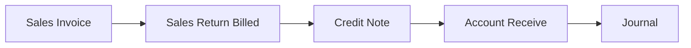
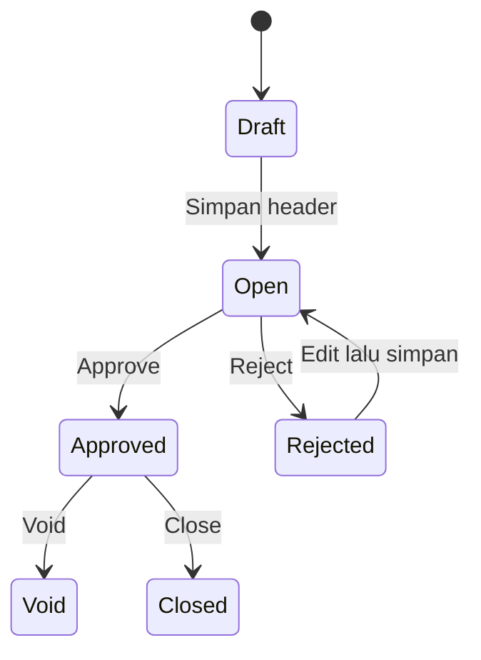

# Credit Note — Panduan Pengguna

**Siapa yang baca panduan ini:** finance, AR clerk, operations support  
**Menu di sistem:** Accounting → Credit Note  
**Kode transaksi:** dimulai dengan `CN`

---

## 1. Apa Itu & Kenapa Penting

Credit Note dipakai untuk mencatat **saldo kredit customer** — misalnya nilai retur untuk invoice yang sudah pernah dibayar, atau kelebihan bayar yang perlu disimpan sebagai deposit.

Setelah Credit Note di-approve, saldo itu bisa dipilih lagi saat **Account Receive** (menerima pembayaran) supaya tidak perlu mengembalikan uang tunai dulu, atau untuk mengurangi tagihan berikutnya.

---

## 2. Overview Flow & Proses Bisnis

### Rantai proses

**Versi teks (tanpa diagram):**

1. Customer punya **Sales Invoice** (bisa sudah dibayar sebagian/seluruhnya).
2. Ada retur yang di-complete Finance sebagai tipe **Billed** → sistem bisa membuat Credit Note otomatis.
3. Atau Finance membuat / mengimpor Credit Note manual di menu ini.
4. Credit Note yang sudah di-approve dipakai di **Account Receive**.
5. Saat approve Credit Note, sistem menerbitkan **Journal** otomatis.

🎬 [Interactive demo akan ditambahkan di sini]

### Siklus status transaksi

**Versi teks — arti tiap status:**

| Status | Artinya | Bisa diubah? |
|--------|---------|--------------|
| **Draft** | Baru dibuat | Ya |
| **Open** | Siap diisi rekening tujuan & di-approve | Ya |
| **Rejected** | Ditolak; bisa diperbaiki | Ya |
| **Approved** | Final; jurnal sudah ada | Tidak (kecuali Void/Close sesuai hak) |
| **Void** / **Closed** | Ditutup setelah approved | Tidak |

---

## 3. Sebelum Mulai (Flow Sebelum)

Pastikan ini sudah siap:

- [ ] **Customer** aktif (perusahaan atau store) dan setting akun Deposit customer sudah diisi.
- [ ] Ada **Cash/Bank** aktif untuk mata uang yang akan dipakai di Credit Note.
- [ ] **Periode fiskal** tanggal transaksi masih terbuka.
- [ ] Kalau dari retur billed: Sales Invoice terkait sudah pernah ada pembayaran, dan akun Sales produk sudah dikonfigurasi.
- [ ] Untuk import: mata uang utama company sudah ter-set; siapkan **kode** customer (bukan nama).

🎬 [Interactive demo akan ditambahkan di sini]

---

## 4. Setelah Selesai (Flow Sesudah)

Setelah Credit Note **di-approve**:

- Jurnal otomatis terbentuk (bisa dilihat dari kolom Journal di list).
- Saldo siap dipilih sebagai sumber deposit di **Account Receive**.
- Pemakaian muncul di section **Detail Related Transaction**.
- Header dan baris Receiving Destination menjadi read-only.

Kalau Credit Note dari **Sales Return Billed**, langkah approve manual sering tidak perlu — sistem sudah approve saat Complete retur.

🎬 [Interactive demo akan ditambahkan di sini]

---

## 5. Yang Perlu Diperhatikan

- Kalau kamu approve tanpa baris Receiving Destination, sistem menolak.
- Kalau amount baris masih 0 (sering setelah **Bulk Use**), isi amount dulu — baru approve.
- Kalau akun Deposit customer/store kosong, approve gagal sampai setting master dilengkapi.
- Kalau tanggal di luar periode fiskal aktif, create/edit/approve ditolak.
- Kalau sudah ada baris Receiving Destination, kamu tidak bisa langsung ganti customer, mata uang, kurs, atau tanggal — hapus semua baris fund dulu.
- Kalau mata uang rekening tidak sama dengan mata uang header, baris ditolak.
- Kalau rekening/COA yang sama dipilih dua kali di satu Credit Note, sistem menolak duplikat.
- Kalau import: satu baris error saja membuat **seluruh file** gagal — tidak ada Credit Note yang terbentuk.
- Import hanya untuk customer tipe perusahaan (kode General). Customer store buat lewat form.
- Hapus hanya boleh saat Draft, Open, atau Rejected.
- Tombol Print di layar mungkin belum berfungsi penuh — kalau gagal, laporkan ke support.

---

## 6. Langkah-Langkah (Step by Step)

### A. Buat manual

1. Buka **Accounting → Credit Note → Create**.
2. Isi tanggal, customer, mata uang, kurs. Biarkan kode kosong jika ingin otomatis.
3. Simpan — sistem membuka halaman edit.
4. Di **Receiving Destination**, pilih Cash/Bank (**Use** atau **Bulk Use**).
5. Isi **amount** tiap baris (wajib lebih dari 0 sebelum approve). Opsional isi memo.
6. Cek total di footer.
7. **Approve** (isi catatan approval jika diminta).
8. Pakai saldo di **Account Receive** bila perlu.

### B. Import massal

1. Di list, buka impor → **Download Template**.
2. Isi tanggal, kode customer, GL Acc Cash/Bank, amount (minimal 1). Store opsional (maks. 5 nama).
3. Upload file → tunggu progress.
4. Cek Import History / Error Log jika gagal.
5. Approve satu per satu Credit Note berstatus Open.

### C. Dari Sales Return Billed

1. Selesaikan alur Sales Return sampai Finance **Complete** tipe billed.
2. Cek list Credit Note — biasanya sudah Approved dengan Trx Ref ke Sales Invoice.
3. Pakai di Account Receive jika saldo masih outstanding.

🎬 [Interactive demo akan ditambahkan di sini]

---

## 7. Tips & Hal yang Sering Bikin Bingung

- **Bulk Use amount 0** itu normal — bukan bug; edit amount manual.
- **Customer tidak muncul** biasanya karena inactive atau setting akun (termasuk Deposit) belum lengkap.
- **Paid** di list = sudah dipakai di penerimaan yang sudah di-approve; **Outstanding** = sisa Total dikurangi Paid.
- **Unbilled return** tidak membuat Credit Note — bedakan dengan **Billed**.
- **Tidak bisa ubah customer** setelah ada baris fund — clear Receiving Destination dulu.
- **Import gagal semua** karena satu baris salah: perbaiki Excel lalu upload ulang seluruh file.

---

## 8. Referensi

| Butuh | Buka |
|-------|------|
| Aturan QA / acceptance | [requirement.md](./requirement.md) |
| SOP & troubleshooting operator | [knowledge-base.md](./knowledge-base.md) |
| API / file map developer | [technical.md](./technical.md) |
| Index menu | [README.md](./README.md) |
| Sales Return (auto CN) | [../accounting-sales-return/](../accounting-sales-return/) |
| Account Receive (pakai deposit) | [../accounting-customer-payment/](../accounting-customer-payment/) |
