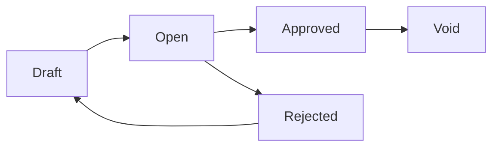

# Sales Invoice — Knowledge Base

> **DRAFT** — Dokumentasi AS-IS dari codebase (19 Juni 2026). Belum final review QA/PM.

## 1. Apa itu Sales Invoice?

**Sales Invoice** (Faktur Penjualan) mencatat tagihan kepada pelanggan atas penjualan barang/jasa. Invoice approved menjadi **piutang** di buku besar dan dapat dialokasikan di menu **Account Receive**.

**Menu:** FA → Account Receivable → Sales Invoice (`/accounting/customer-invoice`)

Nomor transaksi otomatis dengan prefix **SI** (contoh: `SI-2026-00001`).

## 2. Glosarium

| Istilah | Arti |
|---------|------|
| SI | Prefix kode Sales Invoice |
| AR / Piutang | Account Receivable — saldo yang belum dibayar pelanggan |
| Outstanding SO | Baris Sales Order yang belum/sebagian di-invoice |
| General customer | Pelanggan master (`Company` sebagai customer) — `type_customer = general` |
| Platform customer | Invoice dari toko marketplace — `type_customer = platform`, `store_id` terisi |
| Other Cost / Other Discount | Biaya atau diskon tambahan di level header invoice |
| Instant Settlement | Upload settlement yang menghasilkan invoice platform otomatis |

## 3. Yang Bisa / Tidak Bisa Dilakukan

### Bisa

- Buat invoice manual (Draft/Open) untuk customer aktif
- Tambah baris dari **outstanding Sales Order detail** (`SalesOrderDetail`)
- Tambah other cost & other discount
- Simpan lampiran (attachment)
- Submit approval multi-level (sesuai eligibility user/posisi)
- Approve → generate **journal otomatis** (tipe Sales Invoice)
- Export Excel (dengan/tanpa detail), import Excel (template)
- Print invoice
- Void / reject (sesuai status & permission)

### Tidak Bisa

- Edit header/detail setelah **Approved** (kecuali void flow)
- Ubah customer, currency, exchange rate, atau tanggal jika sudah ada baris detail
- Reject invoice **platform** (dari settlement) — sistem menolak reject
- Approve tanpa minimal 1 baris detail (kecuali flag internal `allow_empty_detail`)
- Transaksi di luar **fiscal period** aktif

## 4. Status transaksi

| Status | Arti untuk operator |
|--------|---------------------|
| Draft | Masih diedit; belum siap approval |
| Open | Siap diajukan / di-approve |
| Approved | Final — piutang tercatat, journal terbentuk |
| Rejected | Ditolak; bisa diedit lalu submit ulang |
| Void | Dibatalkan setelah approved |

## 5. Cara Pakai (How-To)

### Skenario: Invoice dari Sales Order

1. **Create** → isi customer, tanggal, currency, due date
2. Tab **Item Configuration** → pilih outstanding SO (per baris atau group)
3. Pastikan qty/price sesuai; simpan baris
4. (Opsional) Other Cost / Other Discount
5. Ubah status ke **Open** jika masih Draft
6. **Approve** — cek eligibility approver; isi keterangan jika perlu
7. Setelah approved, cek **Journal** (auto) dan lanjut **Account Receive** saat pelanggan bayar

### Skenario: Import Excel

1. Download template dari datalist
2. Upload file → pantau progress & import log
3. Review invoice yang terbentuk → approve seperti biasa

## 6. Troubleshooting

| Gejala | Penyebab umum | Solusi |
|--------|---------------|--------|
| Approve gagal: AR COA | Customer/store belum punya Account Receivable COA | Konfigurasi COA di master customer/store |
| Approve gagal: no detail | Belum ada baris item | Tambah baris dari SO atau manual |
| Tidak bisa ubah customer | Sudah ada detail | Hapus detail dulu atau buat invoice baru |
| Invalid rate | Currency utama tapi rate ≠ 1 | Set exchange rate = 1 untuk primary currency |
| Fiscal period error | Tanggal di luar periode aktif | Ubah tanggal atau buka fiscal period |
| Platform invoice tidak bisa reject | Rule bisnis platform | Hubungi admin; void/alur settlement |

## 7. FAQ

**Q: Dari mana baris invoice?**  
A: Umumnya dari **Sales Order Detail** yang masih outstanding (`prepared_to_invoice_quantity` / `processed_to_invoice_quantity`).

**Q: Kapan journal dibuat?**  
A: Saat **approve** berhasil — `JournalProcess::customerInvoiceAutoJournal`.

**Q: Apa beda general vs platform customer?**  
A: General memakai master customer; platform memakai **store** marketplace dan sering terhubung **Instant Settlement**.

**Q: Hubungan dengan pembayaran?**  
A: Invoice approved muncul di **Account Receive** sebagai outstanding invoice untuk dialokasi pembayaran.

**Q: Hubungan dengan Instant Settlement?**  
A: Upload settlement bisa **generate SI otomatis** per order. Cek selisih di panel settlement (**Difference Settlement-SI**). SI manual tetap bisa dibuat terpisah; AR manual pada SI mempengaruhi Approve settlement (Smart AR).

Detail: [Instant Settlement](../accounting-settlement-upload/requirement.md)

## Related Documents

| Doc | Path |
|-----|------|
| Requirement | [requirement.md](./requirement.md) |
| Technical | [technical.md](./technical.md) |
