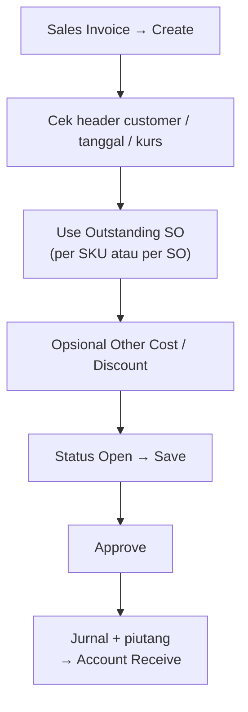

# Sales Invoice — Knowledge Base (Operator)

**Audience:** Finance AR, sales admin, support  
**Route:** Accounting → Sales Invoice (`/accounting/customer-invoice`)  
**Kode dokumen:** diawali **SI**

---

## 1. Apa itu Sales Invoice?

Sales Invoice (SI) adalah dokumen **tagihan ke pelanggan**. Dari sini sistem mencatat **piutang** dan **penjualan** (plus PPN / biaya / diskon lain jika ada).

- **Customer General:** buat SI dari Sales Order General yang sudah approved, lalu Approve.
- **Customer platform:** SI biasanya muncul otomatis dari **Instant Settlement** — biasanya hanya bisa dilihat (tidak reject/hapus seperti SI biasa).

Setelah SI **Approved**, lanjut pelunasan di **Account Receive**.

---

## 2. Kapan dipakai?

| ✅ Buat / proses SI jika | ❌ Jangan jika |
|--------------------------|----------------|
| Ada SO General approved dengan sisa belum ditagih | Mau tagih order marketplace lewat Create manual |
| AR COA customer/store & Sales COA produk sudah siap | COA belum lengkap — Approve akan gagal |
| Periode fiskal tanggal SI masih terbuka | Periode tutup |
| Import saldo awal SO General | Import order platform / SO sudah full di-invoice |

---

## 3. Alur kerja standar (General)

```mermaid
flowchart TD
    A["Sales Invoice → Create"] --> B["Cek header customer / tanggal / kurs"]
    B --> C["Use Outstanding SO\n(per SKU atau per SO)"]
    C --> D["Opsional Other Cost / Discount"]
    D --> E["Status Open → Save"]
    E --> F["Approve"]
    F --> G["Jurnal + piutang\n→ Account Receive"]
```

**Langkah teks:**

1. **Create** — sistem sering mengisi customer/kurs dari SI terakhir; tanggal = hari ini.
2. **Tambah barang** dari Outstanding SO (satu SKU penuh sisa, atau semua sisa satu SO).
3. Status **Open** + Save (jika masih Draft).
4. **Approve** — stok qty “sudah di-invoice” di SO naik; jurnal piutang + penjualan terbit.
5. Tagih bayar di **Account Receive**.

> AS-IS: Create baru biasanya masuk **Draft** dulu — pilih **Open** sebelum Approve. (Target nanti: Create langsung Open.)

---

## 4. Partial invoice — yang perlu dipahami

- Satu SO boleh punya **beberapa SI**.
- Dari tombol Use: sistem mengambil **seluruh sisa** baris SKU itu — **tidak** bisa isi “5 dari 10” di UI.
- Boleh tagih SKU-A dulu (penuh 10), SKU-B di SI berikutnya.

**Contoh:** SO-001: SKU-A 10 pcs, SKU-B 10 pcs → SI-1 Use SKU-A saja → qty 10. SKU-B tetap outstanding.

---

## 5. Status singkat

| Status | Arti | Bisa edit? |
|--------|------|------------|
| Draft | Belum siap approve | Ya |
| Open | Siap Approve / Reject | Ya |
| Approved | Terkunci; sudah ada jurnal & piutang | Tidak (lihat saja) |
| Rejected | Ditolak — setelah Save edit biasanya jadi **Draft** lagi | Ya |

**Platform:** tidak bisa Reject / Delete dari UI normal.

---

## 6. Import Excel (saldo awal)

Template **3 kolom:** Transaction Date · Order Number · Platform Order ID.

- Isi **salah satu** Order Number **atau** Platform Order ID (jangan keduanya kosong / keduanya terisi).
- Hanya **SO General/internal**. Platform ditolak.
- Hasil import: SI status **Open** — **belum** Approve, jurnal belum dari proses import.
- Satu baris rusak → **seluruh** import gagal.

---

## 7. Tombol & aksi

| Tombol | Fungsi |
|--------|--------|
| Create | SI baru (auto-save dari last saved) |
| Approve | Post jurnal + kunci dokumen (hanya Open) |
| Reject | Tolak Open (bukan platform) |
| Delete | Hapus draft/open/rejected non-platform |
| Import / Export | Excel + log |
| Print | Semua status |

---

## 8. Troubleshooting

| Gejala | Cek / tindakan |
|--------|----------------|
| Tidak bisa Approve dari Draft | Ubah status ke **Open** dulu |
| Outstanding kosong | SO belum approved, atau sisa sudah full prepared/processed |
| Approve gagal COA | AR Company/Store + Sales COA produk + Tax sales |
| SI platform tidak bisa hapus/reject | Normal — dari platform |
| Import gagal semua | Satu baris invalid menggagalkan batch; cek log |
| Rejected jadi Draft setelah Save | Normal — set Open lagi lalu Approve |

---

## 9. FAQ

**Q: Beda SI manual vs Instant Settlement?**  
A: Manual = SO General. Platform = dari settlement; sering auto-approved & terbatas edit.

**Q: Wajib Other Cost?**  
A: Tidak.

**Q: Kapan jurnal muncul?**  
A: Saat SI **Approve** (bukan saat import berhenti di Open).

**Q: Customer Create dari mana?**  
A: Company General as customer + AR COA + SO outstanding — bukan store platform.

---

## Kamus singkat

| Istilah | Awam |
|---------|------|
| Prepared to invoice | Qty sudah masuk SI belum approved |
| Processed to invoice | Qty sudah di SI approved |
| Net Sales | Total tagihan (setelah VAT & other cost/disc) |
| Instant Settlement | Upload settle marketplace yang otomatis bikin SI |

---

## Related Documents

| Doc | Path |
|-----|------|
| Requirement | [requirement.md](./requirement.md) |
| Technical | [technical.md](./technical.md) |
| User Guide | [user-guide.md](./user-guide.md) |
| Account Receive | [../accounting-customer-payment/knowledge-base.md](../accounting-customer-payment/knowledge-base.md) |
| Credit Note | [../accounting-credit-note/knowledge-base.md](../accounting-credit-note/knowledge-base.md) |
