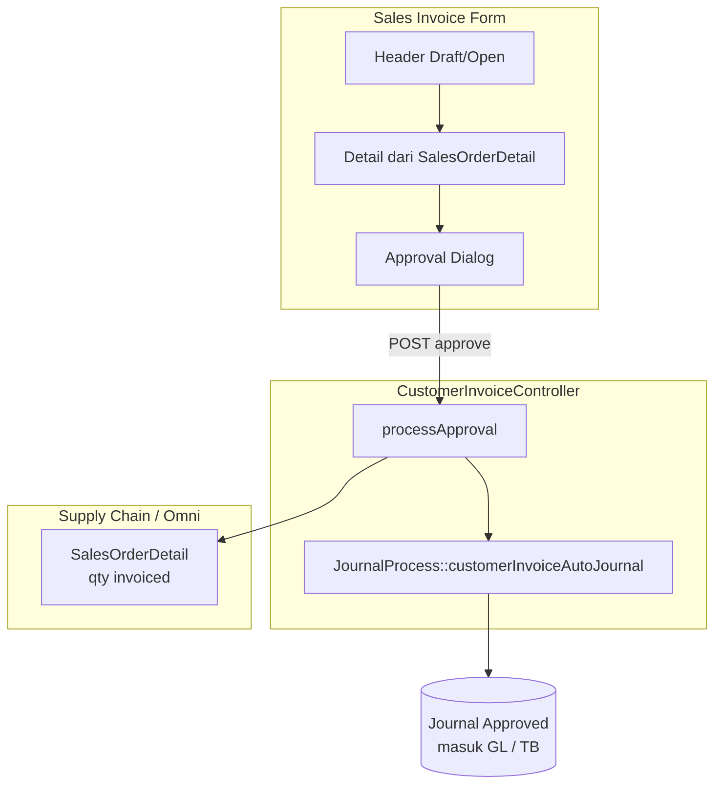
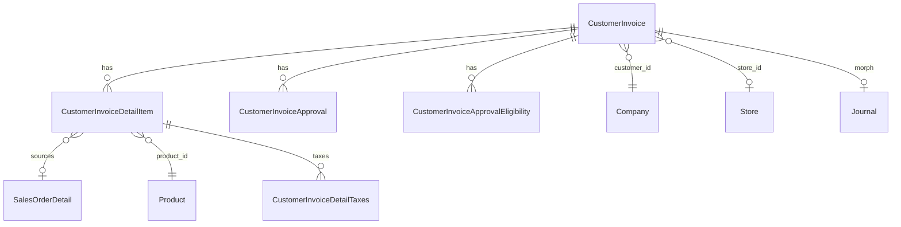

# Sales Invoice — Requirement Documentation (AS-IS)

> **DRAFT** — Dokumentasi AS-IS dari codebase (19 Juni 2026). Belum final review QA/PM.

**Modul:** Accounting  
**Menu UI:** FA → Account Receivable → Sales Invoice (`/accounting/customer-invoice`)  
**Audience:** PM, QA, Support, Developer

---

## 0. Metadata & Changelog

| Version | Date | Author | Changes |
|---------|------|--------|---------|
| 1.0 | 2026-06-19 | QA - Yemima | Initial draft AS-IS dari kode |
| 1.1 | 2026-06-23 | QA - Yemima | Cross-reference Relasi Instant Settlement (Fase 1) |

---

## 1. Ringkasan Eksekutif

Sales Invoice mencatat tagihan penjualan ke pelanggan (general atau platform/store). Header disimpan di `accounting_customer_invoices` dengan kode **SI**. Baris item terhubung ke `SalesOrderDetail` dan/atau produk. Approval multi-level; saat **Approved** sistem mem-posting piutang & revenue via **journal otomatis** (`JournalProcess::customerInvoiceAutoJournal`).

---

## 2. Acceptance Criteria (AS-IS)

| ID | Kriteria | Validasi | Fitur |
|----|----------|----------|-------|
| A-01 | User dengan permission menu dapat melihat datalist invoice company aktif | Policy `viewAny` | Index |
| A-02 | Create invoice menghasilkan kode SI otomatis jika code kosong | `code_identifier = SI` | Store |
| A-03 | Minimal 1 baris detail sebelum approve | `customer_invoice_detail_items count >= 1` | Approve |
| A-04 | Approve sukses mengubah status & qty invoiced di SO detail | `processed_to_invoice_quantity` ↑ | Approve |
| A-05 | Approve sukses generate/update journal Sales Invoice | `JournalProcess::customerInvoiceAutoJournal` | Approve |
| A-06 | Multi-level approval mengikuti eligibility matrix | `CustomerInvoiceApprovalEligibility` | Approval |
| A-07 | Invoice approved tidak bisa di-edit header/detail | `transaction_status = approved` | Update guard |
| A-08 | Fiscal period aktif untuk tanggal transaksi | `validate_fiscal_period` | Store/Update/Approve |
| A-09 | Export & import Excel tersedia dari datalist | Job + import endpoints | Export/Import |
| A-10 | Platform invoice tidak bisa di-reject manual | `isPlatformInvoice` + `AS_REJECTED` | Approve |

---

## 3. Validasi & Rules

| ID | Rule | Trigger | Pesan error (contoh) |
|----|------|---------|----------------------|
| V-01 | `transaction_date` required, date | Store/Update | Validation error |
| V-02 | `customer_id` required, customer aktif | Store/Update | Customer not found / inactive |
| V-03 | `currency_id` exists, tidak deleted | Store/Update | Currency not found |
| V-04 | Primary currency → `exchange_rate` harus 1 | Store/Update | Invalid rate |
| V-05 | `code` unik per company jika diisi manual | Store | Code already transacted |
| V-06 | `description` max 150 | Store/Update | Validation |
| V-07 | Tidak ubah customer jika sudah ada detail | Update | Customer not changed because already has detail |
| V-08 | Tidak ubah currency/rate jika sudah ada detail | Update | Transaction currency & exchange rate can't be changed... |
| V-09 | Tidak ubah transaction_date / due_date jika ada detail | Update | Transaction date can't be changed... |
| V-10 | Approve: AR COA terkonfigurasi | Approve → journal | Please Configure Company/Store Account Receivable COA |
| V-11 | Approve: fiscal period | Approve | Fiscal period response |
| V-12 | Reject platform invoice | Approve reject | This invoice data cannot be rejected because it is from the platform |

---

## 4. Fitur & Behavior

| ID | Fitur | Trigger | Expected result |
|----|-------|---------|-----------------|
| F-01 | CRUD header | Create/Edit form | Draft/Open invoice |
| F-02 | Item dari outstanding SO | Item Configuration modal | `CustomerInvoiceDetailItem` + link `sales_order_detail_id` |
| F-03 | Bulk/group SO lines | `store_group`, `bulkCreteSalesOrderGroup` | Multiple details |
| F-04 | Other cost / discount | Tab terpisah | Subtotal/grand total ter-update |
| F-05 | Approval workflow | `ApprovalDialog` | Log di `accounting_customer_invoice_approvals` |
| F-06 | Approval eligibility | `ApprovalEligibility` datalist | User/position yang boleh approve |
| F-07 | Auto journal | Approve approved | Journal header + details; type Sales Invoice |
| F-08 | Settlement link | Platform flow | Kolom Instant Settlement di datalist |
| F-09 | Print | Print action | PDF/HTML invoice |
| F-10 | Audit trail | Audit endpoint | Perubahan field |

### 4.1 Alur bisnis approve

### 4.2 Relasi entitas

---

## 5. Status transaksi

| Status | `can_update` | `can_approve` | `can_void` |
|--------|--------------|---------------|------------|
| draft | Ya | Tidak | Tidak |
| open | Ya | Ya (jika eligible) | Tidak |
| approved | Tidak | Tidak | Ya (jika eligible) |
| rejected | Ya | Flow ulang | Tidak |
| void | Tidak | Tidak | Tidak |

---

## 6. Permission & Dependencies

| Dependency | Wajib untuk |
|------------|-------------|
| Master Customer (Company) aktif | Create invoice general |
| Store + AR COA | Invoice platform / approve |
| Sales Order dengan outstanding qty | Baris dari SO |
| Fiscal Period open | Semua write & approve |
| COA Revenue / VAT mapping | Journal posting benar |
| Menu permission via `CustomerInvoicePolicy` | Semua aksi |

---

## 7. QA Test Notes

- Buat invoice Draft → tambah 1 SO line → Open → approve → cek journal & GL
- Coba ubah customer setelah ada detail → expect error V-07
- Coba approve tanpa detail → expect error
- Coba reject platform invoice → expect V-12
- Import template → approve batch sample
- Cross-check `prepared_to_invoice_quantity` / `processed_to_invoice_quantity` di SO detail
- Payment allocation di Account Receive setelah approved

---

## 8. Known Gaps / Open Questions

- Rule `approvals()->count() > 1` pada update — interpretasi bisnis untuk QA
- Legacy Blade views masih ada di `Modules/Accounting/Resources/views/pages/customer-invoice/` — FE canonical Vue

## Relasi Instant Settlement

**Dampak ke menu ini:** Instant Settlement **generate Sales Invoice platform** otomatis per order lolos validasi. Panel **ResultPanel** settlement menampilkan **Settlement Total**, **Difference Settlement-SI**, dan daftar SI. Invoice hasil settlement mengikuti mapping COA/biaya dari Settlement Mapping + store COA.

**Prasyarat dari menu ini agar settlement lolos:** SO outstanding qty siap invoice; order Shipped WH 3PL; Product COA Group lengkap untuk jurnal. Platform invoice manual yang sudah ada untuk order yang sama dapat bentrok dengan generate settlement — hindari dobel invoice untuk qty yang sama.

**Independensi:** SI manual di menu ini **independen** dari settlement. AR manual pada SI **memblokir Delete** settlement (Smart AR skip invoice tersebut saat Approve). Reject settlement **tidak** menghapus SI. Delete settlement menghapus SI + jurnal SI hasil generate jika allowed.

**Detail alur bulk:** [Instant Settlement](../accounting-settlement-upload/requirement.md) — § total penghasilan, all-or-nothing, Smart AR.

Diagram integrasi: [Instant Settlement §10](../accounting-settlement-upload/requirement.md#10-relasi-menu--integrasi).

---

## Related Documents

| Doc | Path |
|-----|------|
| Knowledge Base | [knowledge-base.md](./knowledge-base.md) |
| Technical | [technical.md](./technical.md) |
| Journal | [../journal/requirement.md](../journal/requirement.md) |
| Master Other Cost | [../omni-other-cost/requirement.md](../omni-other-cost/requirement.md) |
