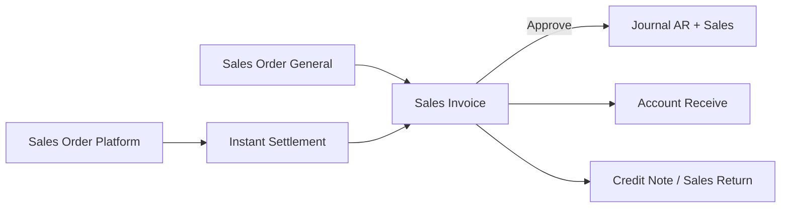
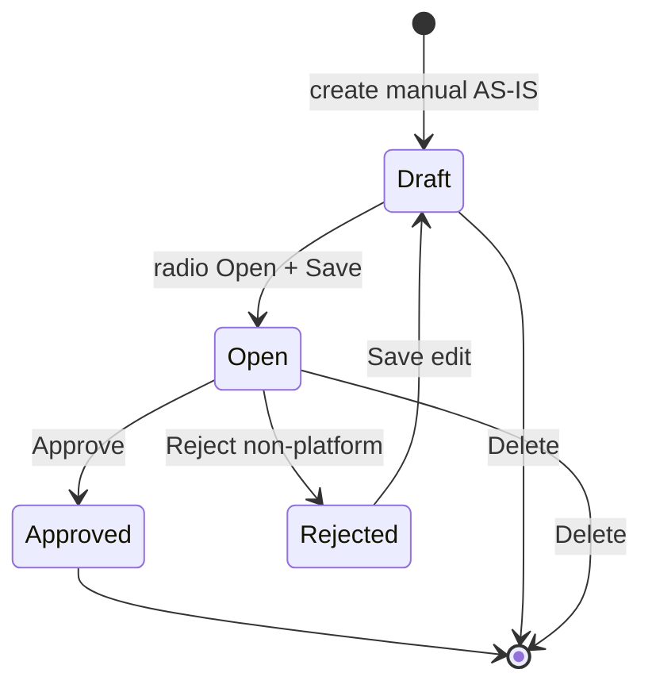

# Sales Invoice — Requirement Documentation

**Modul:** Accounting / Account Receivable  
**Prefix:** `SI`  
**Audience:** PM, Finance, QA  
**UI route:** `/accounting/customer-invoice`  
**SoT:** `_meta/sot/accounting-customer-invoice-source-of-truth.md` v1.0 (24 Agu 2026)  
**Jira import:** [ETM-14976](https://erpintegration.atlassian.net/browse/ETM-14976)

Downstream: [Account Receive](../accounting-customer-payment/requirement.md) · [Credit Note](../accounting-credit-note/requirement.md)

---

## 0. Metadata & Changelog

| Version | Date | Author | Changes |
|---------|------|--------|---------|
| 1.0 | 2026-06-19 | QA - Yemima | Draft AS-IS codebase |
| 1.1 | 2026-06-23 | QA - Yemima | Cross-ref Instant Settlement |
| 2.0 | 2026-08-24 | QA - Yemima | Full rewrite dari SoT v1.0: status cycle, outstanding partial per SKU, import Open-only, journal on Approve, GAP-SI-01..05 |

---

## 1. Ringkasan Eksekutif

**Sales Invoice (SI)** menagih pelanggan dari **Sales Order General/Internal** (manual) atau dari **Instant Settlement** (platform, biasanya auto-approved & show-only). Setelah **Approved**: qty SO yang sudah di-invoice naik, **journal** AR + Sales (+ VAT / other cost / other discount) terbit (auto-approved), SI masuk outstanding **Account Receive**.

| Kebutuhan bisnis | Jawaban SI |
|------------------|------------|
| Tagih SO General | Manual create + Use outstanding SO |
| Tagih order platform | SI dari Instant Settlement — bukan create manual |
| Partial antar SI | Per **SKU/line** (full remaining line); qty line tidak diedit partial di UI with-SO |
| Piutang + penjualan | Approve → journal Dr AR / Cr Sales + VAT + Other Cost; Dr Other Discount |
| Saldo awal | Import → status **Open** saja; journal saat **Approve** manual |

### 1.1 Rantai proses

```mermaid
flowchart LR
  SOG[Sales Order General] --> SI[Sales Invoice]
  SOP[Sales Order Platform] --> IS[Instant Settlement]
  IS --> SI
  SI -->|Approve| JRN[Journal AR + Sales]
  SI --> AR[Account Receive]
  SI --> CN[Credit Note / Sales Return]
```

---

## 2. Prasyarat

| Prerequisite | Sumber | Catatan |
|--------------|--------|---------|
| Privilege SI (view/create/update/delete/approval) | Gate | Policy `CustomerInvoice` · `accounting/customer-invoice` |
| Fiscal period **active** untuk Transaction Date | Fiscal Period | Blok store / update date / approve / auto-save |
| Primary currency company ter-set | Currency / Company | Rate = **1** jika currency = primary |
| Customer General: recognize as customer, AR COA, SO General **Approved/Processed** outstanding | Company + SO | Create manual |
| Store AR COA | Store | SI platform dari Instant Settlement |
| Product COA Group **Sales** + Sales VAT Settings | Product / Tax | Wajib agar journal approve sukses |
| Other Cost / Other Discount **active** | Omni master | Opsional di header |
| Import: SO General saja, Approved/Processed, belum di-invoice (non-void) | ETM-14976 | Platform ditolak |

---

## 3. Siklus Status

| Status | Arti | Editable? | Action (privilege-aware) |
|--------|------|-----------|--------------------------|
| **draft** | Header tersimpan; belum siap approve | Ya | Edit, Delete, Print |
| **open** | Siap approve | Ya | Edit, Delete, Print, Approve, Reject |
| **approved** | Terkunci; journal formed; outstanding AR | Tidak (show) | Show, Print |
| **rejected** | Ditolak; **Save edit** → **draft** (FE) | Ya | Edit, Delete, Print |
| void / closed / processed / complete | Badge datalist | Khusus | Platform / settlement lifecycle |

```mermaid
stateDiagram-v2
    [*] --> Draft: create manual AS-IS
    Draft --> Open: radio Open + Save
    Open --> Approved: Approve
    Open --> Rejected: Reject non-platform
    Rejected --> Draft: Save edit
    Approved --> [*]
    Draft --> [*]: Delete
    Open --> [*]: Delete
```

**Platform SI:** reject & delete diblokir (*cannot be rejected/deleted because it is from the platform*).

**GAP-SI-01:** Requirement TO-BE create → **Open**. AS-IS create (FE tidak kirim status) → BE default **draft**.

---

## 4. Datalist

**Route:** `/accounting/customer-invoice` · Create: `/accounting/customer-invoice/create`

### 4.1 Kolom (default visible)

| Kolom UI | Default | Catatan |
|----------|---------|---------|
| Trx. Code / Trx.Date | true | Link edit |
| CUSTOMER | true | Company atau store |
| Your Ref. | true | `customer_reference_document` |
| TRX. REF. | true | SO / settlement |
| Instant Settlement | **false** | Jika dari settlement |
| PLATFORM ORDER | true | Platform order ID |
| CURR. / EXCHANGE | true | |
| Total Product | true | After discount **incl. VAT** |
| TOTAL OTHER COST / DISCOUNT | true | |
| TOTAL | **false** | Grand before VAT |
| Net Sales | true | Grand after VAT |
| TRX. STATUS | true | Badge |
| Description | **false** | |
| Created by / at | true | |
| Action | true | §4.3 |

### 4.2 Toolbar

Global Search · Advanced Filter (SearchBuilder) · **Create** (auto-save dari last saved) · Show deleted · Column show/hide · Export without/with detail (async) · **Import** template 3 kolom (§6.5).

### 4.3 Action per baris

| Action | Muncul jika |
|--------|-------------|
| Edit | Belum approved (draft/open/rejected) |
| Show | Approved (atau view-only platform) |
| Delete | Belum approved **dan** bukan platform |
| Print | Semua status |
| Approve / Reject | Status **open** + privilege; Reject diblokir platform |

---

## 5. Form & Field

### 5.1 Basic Information

| Field | Required | Default / behavior |
|-------|----------|--------------------|
| Transaction Code | Auto | Prefix **SI**; manual max 50 unik |
| Transaction Date | Ya | **NOW**; validasi fiscal |
| Due Date | Tidak | = Trx Date jika kosong; **tanpa** validasi fiscal |
| Currency | Ya | Primary (IDR); dari last saved |
| Exchange Rate | Ya | **1**; disabled jika primary; primary harus 1 |
| Customer | Ya (manual) | General + AR COA + SO outstanding; platform show-only dari store |
| AR COA | Disabled | Company AR atau Store AR |
| Your Ref / Term / Description | Tidak | Max Term 2000; Description 150 |
| Transaction Status | Draft/Open | **AS-IS create = draft** (GAP-SI-01) |
| Attachment | Tidak | Validasi ekstensi |

Setelah ada **detail**, terkunci: Customer, Currency, Rate, Trx Date, Due Date (clear detail dulu untuk ubah).

### 5.2 Detail (Item Configuration)

| Elemen | Behavior |
|--------|----------|
| Select Product | SKU dari SO detail Approved/Processed outstanding |
| Outstanding SO | Filter by SO number internal (**bukan** platform order code) |
| Bundle | Tampil **header bundle** saja |
| Partial invoice | **Per SKU/line:** multi SI per SO; Use = **seluruh remaining qty** line. UI with-SO: qty **disabled** |
| Invoice Progress | Prepared = di SI draft/open lain; Processed = di SI **approved** |

**Outstanding Detail view:** SO Code/Date · SKU/Name · SO Qty · Unit · Unit Price (as-is SO) · Discount · VAT · Total · Invoice Progress.  
**Group view:** per SO masih ada SKU outstanding; create-group menambah semua outstanding line SO.

### 5.3 Additional Cost / Discount

| | Other Cost | Other Discount |
|--|------------|----------------|
| Master | Other Cost active | Other Discount active |
| COA di table | Dari master; **editable** | Sama |
| Masuk Net Sales | Ya | Ya |
| Masuk basis PPN produk | **Tidak** | **Tidak** |

### 5.4 Totals

| Label | Arti |
|-------|------|
| Total Products | Unit price before VAT × qty |
| Disc Products | Diskon per item |
| Total VAT | VAT detail |
| Total Other Cost / Discount | Sum header |
| **Net Sales** | Products − Disc + VAT + Other Cost − Other Discount |

---

## 6. How It Works

### 6.1 Auto-save create

Create → default customer/currency/rate dari SI terakhir → Trx Date = NOW → submit. Gagal jika belum ada last saved / fiscal invalid → isi manual. Sukses → `/edit/{id}`.

### 6.2 Manual General — happy path

1. Header tersimpan (**draft** AS-IS).  
2. Use Outstanding SO (detail/group) → `prepared_to_invoice` naik.  
3. Opsional Other Cost/Discount.  
4. Set **Open** + Save.  
5. **Approve** → fiscal OK, ≥1 detail, qty prepared cukup, AR/Sales/Tax COA.  
6. `processed_to_invoice` ↑; `prepared` ↓; journal auto **Approved**.  
7. Bayar di **Account Receive**.

### 6.3 Journal on Approve

| Sisi | COA | Amount |
|------|-----|--------|
| Debit | **AR** — Company (general) / Store (platform) | Net = sum kredit − other discount |
| Credit | **Sales** Product COA Group per SKU | Before VAT (local) |
| Credit | **VAT/PPN** Tax sales | VAT |
| Credit | Other Cost COA | Other cost |
| Debit | Other Discount COA | Other discount |

Description: *Auto-Journal from {SI code}* + SO / platform / customer. `autoApprove = true` → journal langsung approved.

### 6.4 Platform / Instant Settlement

SI dibuat sistem; sering auto-approved. Create manual **tidak** untuk order platform. Reject/Delete diblokir. Kolom Instant Settlement default hidden.

### 6.5 Import (saldo awal) — ETM-14976

**Template 3 kolom:** Transaction Date · Order Number · Platform Order ID

| Rule | Behavior |
|------|----------|
| File | FE **.XLSX**; BE xlsx/xls/csv |
| Header mismatch | *The file format doesn't match the system template.* |
| Date | DD-MM-YYYY (juga numeric Excel / yyyy-mm-dd) |
| Order Number **atau** Platform Order ID | Wajib **salah satu**; keduanya kosong/terisi → error |
| Duplikat dalam file | Ditolak |
| SO owned company, Approved/Processed | Else error |
| Hanya **Sales Order General** | Platform: *Only internal orders are allowed* |
| Belum di-invoice (non-void) | *already been invoiced* |
| Trx date ≥ SO date | Else error |
| 1 row = 1 SI | Semua outstanding line SO di-Use |
| Status setelah import | **OPEN** — **tidak** auto-approve |
| Journal dari import | **Intent:** belum terbit; terbit saat **Approve** SI (GAP-SI-02 residual kode) |
| Partial success | **Tidak** — 1 baris invalid → failed all |
| Limit | ~5.000 baris |

### 6.6 Contoh kasus (dari user / SoT)

| # | Situasi | Expected |
|---|---------|----------|
| 1 | SO: SKU-A 10, SKU-B 10; SI-1 Use hanya SKU-A | Qty SI = 10 (tidak bisa 5); SKU-B outstanding SI-2 |
| 2 | Unit price UI 10.000 VAT included | UI tetap 10.000; before VAT di BE untuk journal |
| 3 | Rejected → buka form | Radio **draft**; Save → draft; set Open lagi sebelum Approve |
| 4 | Import 1 SO General valid | SI **Open**; journal setelah Approve manual |
| 5 | Import SO platform | Ditolak — hanya internal/general |

---

## 7. Validasi (pesan inti)

| Kondisi | Behavior / pesan |
|---------|------------------|
| Fiscal period invalid | Blok write/approve |
| Customer inactive | *The selected customer is inactive…* |
| Currency missing | *Currency not found* / *removed from the master currency* |
| Primary rate ≠ 1 | *Invalid rate* |
| Code duplikat | *The code has already been transacted in another form.* |
| Ubah customer/currency/date setelah ada detail | *…already has detail data* |
| Approve tanpa detail | ERR_NO_DETAIL_MSG |
| Qty prepared kurang | *Cannot approve invoice. SKU … has insufficient invoicable quantity.* |
| AR COA belum set | *Please Configure Company/Store "Account Receivable COA"…* |
| Sales COA produk kosong | *Please Configure "Sales COA" for this Product: {sku}* |
| Tax sales COA kosong | *Please Configure "Sales COA" for Tax Sales Order* |
| Reject/Delete platform | *…from the platform* |
| Import header salah | Template mismatch |
| Import SO platform | *Only internal orders are allowed* |

---

## 8. Relasi Menu

| Menu | Relasi |
|------|--------|
| Sales General / All SO | Sumber order & outstanding qty |
| Instant Settlement | Generate SI platform |
| Account Receive | Alokasi bayar ke SI approved |
| Credit Note / Sales Return | Koreksi / retur pasca SI |
| AR Report / SO Invoicing / Settlement Status | Progress & laporan |
| Journal / GL / P&L / BS | Konsumen journal SI |
| Fiscal / Currency / Product COA / Tax / Other Cost-Discount | Master |

---

## 9. Gap Registry

| ID | Deskripsi | Type | Status |
|----|-----------|------|--------|
| GAP-SI-01 | TO-BE create default **Open**; AS-IS **draft** | Contradiction | **Pending** |
| GAP-SI-02 | Intent: import → Open, journal belum terbit sampai Approve. Kode masih `customerInvoiceAutoJournal(..., false)` (journal Open?) | Clarify residual | **Intent locked**; confirm residual |
| GAP-SI-03 | BE allow csv/xls; FE terutama xlsx | Minor | Open |
| GAP-SI-04 | Docs QA sync setelah SOT acc | Missing Doc | Open → addressed by v2.0 split |
| GAP-SI-05 | Error currency path menyebut “purchase order” | Bug candidate | Open |

---

## 10. Acceptance Criteria (QA smoke)

1. Create manual General → header draft (AS-IS); set Open → Approve → journal approved + AR outstanding.  
2. Use 1 of 2 SKU full remaining → partial SO; line qty tidak editable partial.  
3. Approve tanpa detail / COA kurang → error pesan §7.  
4. Platform SI → tidak Reject/Delete.  
5. Import SO General → SI Open; Approve → journal.  
6. Import SO platform → ditolak.  
7. Fiscal closed → create/approve gagal.  
8. Rejected → Save → draft; Open + Approve ulang.

---

## 11. FAQ

**Q: Kenapa tidak bisa Approve dari Draft?**  
A: Approval butuh status minimal **Open**.

**Q: Boleh invoice sebagian qty satu SKU?**  
A: Dari Outstanding Use — **tidak**; qty line = full remaining. Partial antar SI = pilih SKU/line berbeda.

**Q: Platform order bisa di-import?**  
A: Tidak. Hanya Sales Order General/internal.

**Q: Setelah Approve, journal sudah approved?**  
A: Ya (approve normal). Import: SI Open dulu; journal setelah Approve SI (intent).

**Q: Customer manual dari mana?**  
A: General Company as customer + AR COA + SO general outstanding — bukan store platform.

---

## Related Documents

| Doc | Path |
|-----|------|
| Knowledge Base | [knowledge-base.md](./knowledge-base.md) |
| Technical | [technical.md](./technical.md) |
| User Guide | [user-guide.md](./user-guide.md) |
| SoT | [../_meta/sot/accounting-customer-invoice-source-of-truth.md](../_meta/sot/accounting-customer-invoice-source-of-truth.md) |
| Account Receive | [../accounting-customer-payment/requirement.md](../accounting-customer-payment/requirement.md) |
| Credit Note | [../accounting-credit-note/requirement.md](../accounting-credit-note/requirement.md) |
