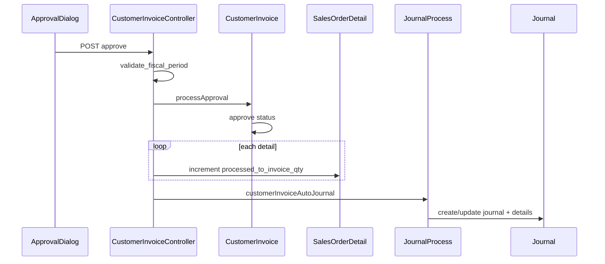

# Sales Invoice — Technical Documentation

> **DRAFT** — Dokumentasi AS-IS dari codebase (19 Juni 2026). Belum final review QA/PM.

## 1. Architecture Overview

Full CRUD transaction module dengan approval workflow dan auto-journal. Header `CustomerInvoice` (SI); lines `CustomerInvoiceDetailItem` link ke `SalesOrderDetail`. Approve → `ApprovalHandlerTrait` + `JournalProcess::customerInvoiceAutoJournal`.

```mermaid
flowchart TB
    subgraph FE["Vue SPA"]
        DL[DataList.vue]
        FM[Form.vue]
        AD[ApprovalDialog.vue]
    end

    subgraph BE["Laravel Accounting"]
        CIC[CustomerInvoiceController]
        CID[CustomerInvoiceDetailItemController]
        JP[JournalProcess]
    end

    subgraph Data[("MySQL")]
        CI[accounting_customer_invoices]
        CIDI[accounting_customer_invoice_detail_items]
        J[accounting_journals]
    end

    DL --> CIC
    FM --> CIC
    FM --> CID
    AD -->|"POST approve"| CIC
    CIC --> CI
    CID --> CIDI
    CIC --> JP
    JP --> J
```

## 2. Frontend File Map

**Root:** `olshoperp-frontend/src/pages/Accounting/AccountReceivable/CustomerInvoice/`

| File | Role | Key API |
|------|------|---------|
| `DataList.vue` | Index, export, import | `GET/POST accounting/customer-invoice` |
| `Form.vue` | Create/edit shell | `POST/PUT accounting/customer-invoice/{id}` |
| `HeaderBasicInformation.vue` | Header fields | show, select2 customer/currency |
| `DatalistDetail.vue` | Line items PrimeVue | `customer-invoice-detail` resource |
| `OutstandingSalesOrderDetail.vue` | Pick SO lines | `outstanding-sales-order` |
| `OutstandingSalesOrderGroup.vue` | Group SO | `outstanding-group-sales-order` |
| `OtherCost.vue` / `OtherCostForm.vue` | Other cost | `customer-invoice-other-cost` |
| `OtherDiscount.vue` / `OtherDiscountForm.vue` | Other discount | `customer-invoice-other-discount` |
| `ApprovalDialog.vue` | Approve/reject/void | `POST .../approve` |
| `ApprovalEligibility.vue` | Eligibility grid | `approval-eligibility/{id}` |
| `DatalistLogApproval.vue` | Approval log | `log/approve` |

**Routes** (`src/router/index.ts`):

| Path | Name |
|------|------|
| `/accounting/customer-invoice` | `accounting_customer-invoice_index` |
| `/accounting/customer-invoice/create` | create |
| `/accounting/customer-invoice/edit/:id` | edit |

## 3. Backend File Map

| File | Role |
|------|------|
| `Modules/Accounting/Http/Controllers/CustomerInvoiceController.php` | CRUD, approve, export, import, print |
| `Modules/Accounting/Http/Controllers/CustomerInvoiceDetailItemController.php` | Lines, SO outstanding, bulk |
| `Modules/Accounting/Http/Controllers/CustomerInvoiceOtherCostController.php` | Other cost |
| `Modules/Accounting/Http/Controllers/CustomerInvoiceOtherDiscountController.php` | Other discount |
| `Modules/Accounting/Entities/CustomerInvoice.php` | Model, `code_identifier = SI` |
| `Modules/Accounting/Entities/CustomerInvoiceDetailItem.php` | Line, `sales_order_detail_id` |
| `Modules/Accounting/Entities/CustomerInvoiceApproval.php` | Approval log |
| `Modules/Accounting/Entities/CustomerInvoiceApprovalEligibility.php` | Multi-level matrix |
| `Modules/Accounting/Policies/CustomerInvoicePolicy.php` | Extends `MainPolicy` |
| `app/Helpers/Accounting/JournalProcess.php` | `customerInvoiceAutoJournal` |
| `app/Helpers/Accounting/CustomerInvoicePrice.php` | Price/total helpers |
| `Modules/Accounting/Jobs/CustomerInvoiceExportJob.php` | Async export |
| `Modules/Accounting/Import/CustomerInvoiceImport.php` | Excel import |

## 4. API Routes (utama)

| Method | Path | Action |
|--------|------|--------|
| GET | `/api/accounting/customer-invoice` | index (datalist) |
| POST | `/api/accounting/customer-invoice` | store |
| GET | `/api/accounting/customer-invoice/{id}` | show |
| PUT | `/api/accounting/customer-invoice/{id}` | update |
| DELETE | `/api/accounting/customer-invoice/{id}` | destroy |
| POST | `/api/accounting/customer-invoice/{id}/approve` | approve |
| GET | `/api/accounting/customer-invoice/approval-eligibility/{id}` | eligibility |
| GET | `/api/accounting/customer-invoice/{id}/log/approve` | approval log |
| GET | `/api/accounting/customer-invoice-detail/{ci}/outstanding-sales-order` | SO lines |
| POST | `/api/accounting/customer-invoice-detail/{ci}/create-group` | bulk lines |
| GET | `/api/accounting/customer-invoice/export-excel` | trigger export |
| POST | `/api/accounting/customer-invoice/upload` | import |

**Auth:** `auth:sanctum`, `auth_verified`; company via `getToken()->company_id`.

## 5. Database Schema

| Table | Purpose |
|-------|---------|
| `accounting_customer_invoices` | Header SI |
| `accounting_customer_invoice_detail_items` | Lines, FK `sales_order_detail_id` |
| `accounting_customer_invoice_detail_taxes` | VAT per line |
| `accounting_customer_invoice_approvals` | Approval history |
| `accounting_customer_invoice_approval_eligibilities` | Approver matrix |
| `accounting_customer_invoice_other_costs` | Header other cost |
| `accounting_customer_invoice_other_discounts` | Header other discount |

**Code generation:** `$code_identifier = 'SI'`, `$code_with_random_bits = true` on model.

## 6. Jobs / Observers / Events

| Component | Role |
|-----------|------|
| `CustomerInvoiceExportJob` | Chunked Excel export |
| `CustomerInvoiceImportJob` | Async import processing |
| `AuditHandlerTrait` | Audit on controller |

## 7. Approve → Journal (sequence)



## 8. Related db-schema docs

- `docs/db-schema/accounting/accounting_customer_invoice_detail_items.md`
- `docs/db-schema/accounting/accounting_customer_invoice_detail_others.md`
