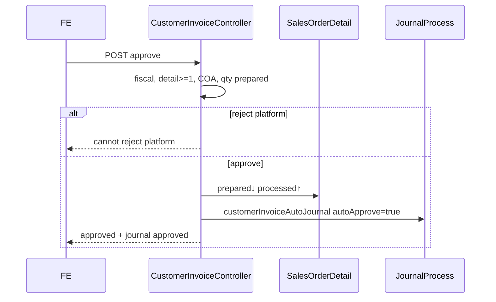

# Sales Invoice — Technical Documentation

**API prefix:** `accounting/customer-invoice`  
**Module:** `Modules/Accounting`  
**Behavior SoT:** [requirement.md](./requirement.md) v2.0  
**Source SoT:** [../_meta/sot/accounting-customer-invoice-source-of-truth.md](../_meta/sot/accounting-customer-invoice-source-of-truth.md) v1.0

---

## 1. File Map

### Backend

| Layer | Path |
|-------|------|
| Controller | `Modules/Accounting/Http/Controllers/CustomerInvoiceController.php` |
| Detail items | `Modules/Accounting/Http/Controllers/CustomerInvoiceDetailItemController.php` |
| Entity header | `Modules/Accounting/Entities/CustomerInvoice.php` |
| Detail / tax / other | `CustomerInvoiceDetailItem`, taxes, other cost/discount entities |
| Journal | `app/Helpers/Accounting/JournalProcess.php` → `customerInvoiceAutoJournal` |
| Import | `Modules/Accounting/Imports/CustomerInvoiceImport.php` · `Jobs/CustomerInvoiceImportJob.php` |
| Export | `Modules/Accounting/Jobs/CustomerInvoiceExportJob.php` |
| Policy | `CustomerInvoicePolicy` |
| Routes | `Modules/Accounting/Routes/api.php` — `customer-invoice*` · outstanding detail routes |

### Frontend

| Layer | Path |
|-------|------|
| Pages | `olshoperp-frontend/src/pages/Accounting/AccountReceivable/CustomerInvoice/**` |
| Pinia | `src/stores/project/SalesInvoices/` |
| Route UI | `/accounting/customer-invoice` |

---

## 2. API (utama)

| Method | Path | Action |
|--------|------|--------|
| CRUD | `accounting/customer-invoice` | Index/store/show/update/destroy |
| POST | `…/{id}/approve` | Approve / reject |
| GET/POST | detail / outstanding / group Use | Lines dari SO |
| POST | import upload + progress/log | Import saldo awal |
| GET | export | Header / with detail (job) |
| GET | print | PDF |

---

## 3. Data model (konsep)

| Table / area | Notes |
|--------------|-------|
| `accounting_customer_invoices` | Header; prefix **SI**; status draft/open/approved/rejected (+ badge void/closed/…) |
| Detail items | FK `sales_order_detail_id`; qty = remaining on Use |
| SO detail counters | `prepared_to_invoice_quantity` / `processed_to_invoice_quantity` |
| AR COA | `store_id` → Store AR; else Company AR |
| Soft delete | Show deleted di datalist |

---

## 4. Approve flow

```mermaid
sequenceDiagram
    participant FE
    participant CTL as CustomerInvoiceController
    participant SO as SalesOrderDetail
    participant JP as JournalProcess

    FE->>CTL: POST approve
    CTL->>CTL: fiscal, detail>=1, COA, qty prepared
    alt reject platform
        CTL-->>FE: cannot reject platform
    else approve
        CTL->>SO: prepared↓ processed↑
        CTL->>JP: customerInvoiceAutoJournal autoApprove=true
        CTL-->>FE: approved + journal approved
    end
```

**Import path:** job creates SI **open**; intent journal **not** final to GL until SI Approve. Residual: job may still call `customerInvoiceAutoJournal($si, false, 'Opening Balance')` — see GAP-SI-02.

---

## 5. Invariants

| ID | Invariant |
|----|-----------|
| INV-SI-01 | 1 Use from outstanding SO line = **full remaining** invoicable qty |
| INV-SI-02 | Platform SI: no reject / no delete |
| INV-SI-03 | Approve: bump processed qty + post journal (auto-approved on normal approve) |
| INV-SI-04 | AR COA from store if `store_id`, else customer company |
| INV-SI-05 | Manual create only General customer + General SO outstanding |
| INV-SI-06 | Import: General SO only; result status **open**; all-or-nothing rows |
| INV-SI-07 | Header customer/currency/dates locked after detail exists |
| INV-SI-08 | Primary currency → exchange rate must be 1 |
| INV-SI-09 | Other cost/discount outside product VAT base |
| INV-SI-10 | Void × SI lifecycle details deferred outside this doc if not in SoT |

---

## 6. Journal mapping (approve)

| Side | COA | Amount |
|------|-----|--------|
| Dr | AR (company/store) | Net = credits − other discount |
| Cr | Sales (product COA group) | Before VAT local |
| Cr | Tax sales COA | VAT |
| Cr | Other cost COA | Other cost |
| Dr | Other discount COA | Other discount |

---

## 7. Failure modes

| Mode | Expected |
|------|----------|
| Fiscal closed | Block store/update date/approve |
| Missing AR / Sales / Tax COA | Approve error with configure message |
| Insufficient prepared qty | Cannot approve — SKU message |
| Platform reject/delete | Hard block message |
| Import 1 bad row | Entire import failed + log |
| Update after approved | Blocked |
| Change customer/currency/date with details | Blocked until details cleared |

---

## 8. Import rules (code-facing)

| Rule | Behavior |
|------|----------|
| Template | Transaction Date · Order Number · Platform Order ID |
| XOR keys | Exactly one of Order Number / Platform Order ID |
| SO type | General only |
| Status out | **open** |
| Journal | Intent: on SI approve; verify GAP-SI-02 residual Open journal call |

---

## 9. Frontend behaviors

| Behavior | Note |
|----------|------|
| Auto-save create | Last saved customer/currency/rate |
| Status radio | Draft/Open; rejected → FE forces draft on edit save |
| Qty with-SO | Disabled — full remaining on Use |
| Platform form | Customer/store show-only; no reject/delete |
| Column Instant Settlement | Default hidden |

---

## 10. Tests & QA notes

1. Create → draft (AS-IS) → Open → Approve → journal approved + SO processed↑  
2. Use one of two SKUs → partial SO; qty not partially editable  
3. Approve missing COA / no detail → error  
4. Platform SI reject/delete blocked  
5. Import General → open; Approve → journal  
6. Import platform → rejected  
7. GAP-SI-01: document TO-BE Open on create vs AS-IS draft  

---

## 11. Known gaps

| ID | Issue |
|----|-------|
| GAP-SI-01 | Create default Open (TO-BE) vs draft (AS-IS) |
| GAP-SI-02 | Import journal call residual vs “no journal until Approve” |
| GAP-SI-03 | FE xlsx vs BE csv/xls |
| GAP-SI-05 | Currency error text may say “purchase order” |

Full registry: [requirement §9](./requirement.md).

---

## Related Documents

| Doc | Path |
|-----|------|
| Requirement | [requirement.md](./requirement.md) |
| Knowledge Base | [knowledge-base.md](./knowledge-base.md) |
| User Guide | [user-guide.md](./user-guide.md) |
| Account Receive | [../accounting-customer-payment/technical.md](../accounting-customer-payment/technical.md) |
| Credit Note | [../accounting-credit-note/technical.md](../accounting-credit-note/technical.md) |
| Journal helper | `app/Helpers/Accounting/JournalProcess.php` |
